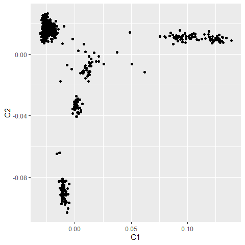
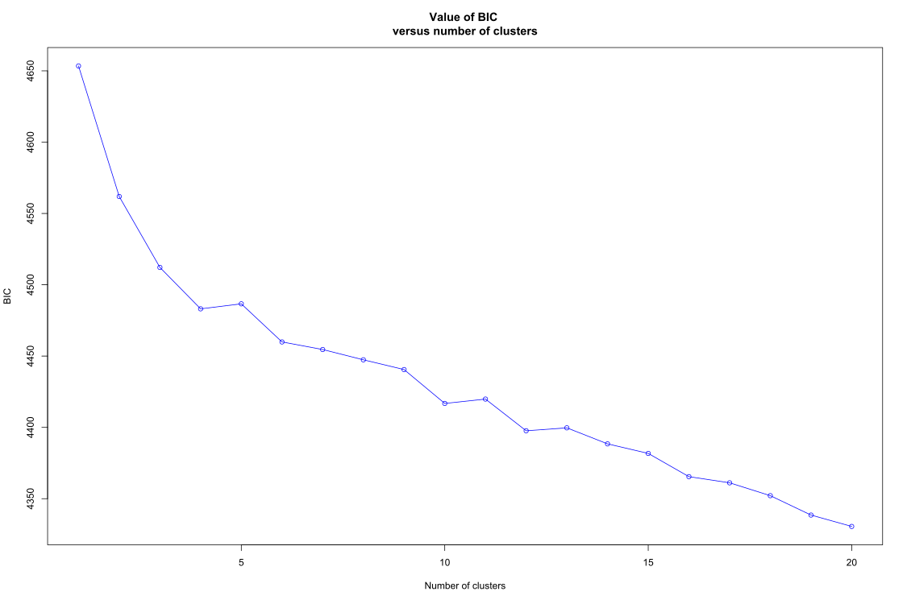
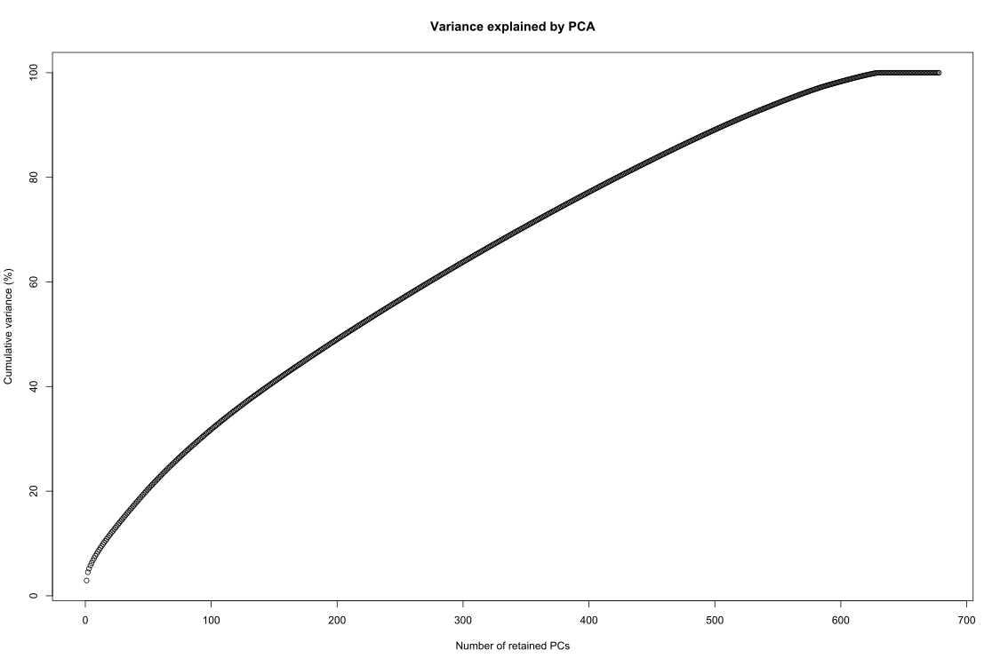
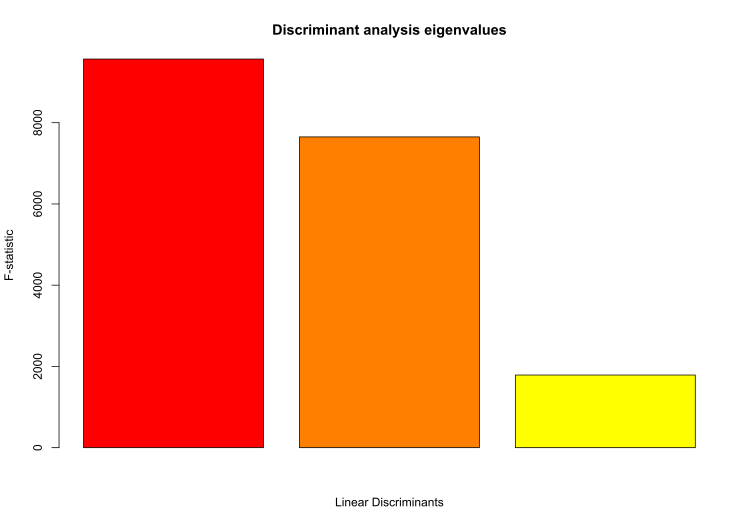
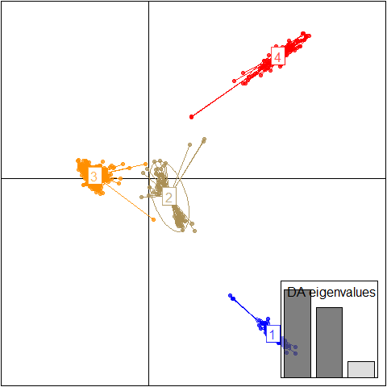
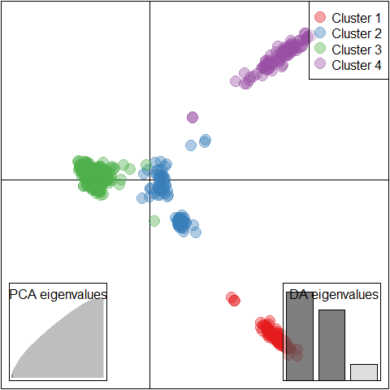
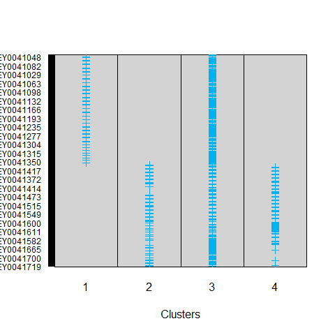
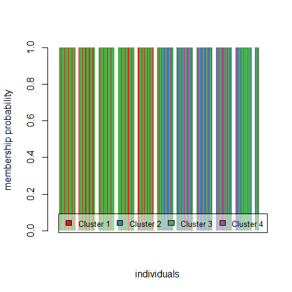

A Nguluma SNP Chipseq Data Analysis with PLINK
================
Bernice Waweru
Wed 23, Jun 2021

-   [Objective](#objective)
-   [Objective and information on
    data](#objective-and-information-on-data)
-   [Analysis with
    *`Plink, version 1.9 and 2.00-alpha`*](#analysis-with-plink-version-19-and-200-alpha)
    -   [Summary Statistics](#summary-statistics)
        -   [Allele frequencies](#allele-frequencies)
        -   [Missing rates for individuals and the
            SNPs](#missing-rates-for-individuals-and-the-snps)
        -   [Checking for Hardy-Weinberg equilibrium
            stats](#checking-for-hardy-weinberg-equilibrium-stats)
        -   [Filtering the data](#filtering-the-data)
    -   [Checking for map positions](#checking-for-map-positions)
    -   [Prunning for Linkage
        Disequilibrium,](#prunning-for-linkage-disequilibrium)
        -   [Linkage disequilibrium based SNP
            pruning](#linkage-disequilibrium-based-snp-pruning)
    -   [Population Stratification](#population-stratification)
    -   [Analysis in R](#analysis-in-r)
        -   [Analysis of data with
            *Adegenet*](#analysis-of-data-with-adegenet)
            -   [Using `find.clusters`](#using-findclusters)
            -   [Describing clusters using
                **DAPC**](#describing-clusters-using-dapc)
            -   [Checking the stabilty of group
                memberships](#checking-the-stabilty-of-group-memberships)
    -   [Session Info](#session-info)

## Objective

Look at data generated from the goat genome SNP Chip from Illumina
through labogena using the goatiggc\_cons\_65k\_v2 infinium SNPChip.
53,347 SNPS typed on 679 individual goat samples.

# Objective and information on data

To analyze goat diversity with data generated through goat genome
SNP-Chip from Illumina through labogena. The goatiggc\_cons\_65k
SNP-Chip includes 53,347 SNPS typed on the samples.

# Analysis with *`Plink, version 1.9 and 2.00-alpha`*

##### define path variables

`file='/home/bngina/Fellows/goat_diversity/athumani/AfterQC_jun_15'`

\#===== dir to store the output files generated during analysis ======

`out='/home/bngina/Fellows/goat_diversity/athumani/athu_plink_out'`

We begin by using plink/1.9 to check that the files are intact and to
convert to binary file.

This will check the number of SNPS and samples, and also generate a bed
file for the data, hence we work from within the directory we want to
store our output files

Load plink/1.9 to look at the details of the files and to convert the
file to a more compressed binary format.

    module load plink/1.9

    plink --file ${file} --out athu_bed --allow-extra-chr --chr-set 29

Load plink/2 to continue working with the binary data.

    module unload plink/1.9 

    module load plink/2.00-alpha

## Summary Statistics

**NOTE:** In Plink/2, SNPs reffered to as variants.

#### Allele frequencies

We use the flag `--freq`

    plink2 --bfile athu_bed \
     --allow-extra-chr \
     --chr-set 29 \
     --freq \
     --out allele_freq

The above generates a file with the frequencies and observed counts of
the SNPs typed in the population with the below headers. Below we see
the top 10 `sort -nr -k 5,5 allele_freq.afreq | head` and least 10
`sort -nr -k 5,5 allele_freq.afreq | tail`.

    #CHROM         ID                     REF     ALT   ALT_FREQS   OBS_CT
    [bngina@hpc athu_plink_out]$ less -S allele_freq.afreq | sort -k 5,5 | head -n 10
    0       snp48005-scaffold6780-30646     G       A       0.0500736       2716
    10      snp23479-scaffold2367-536549    A       G       0.0500736       2716
    10      snp24661-scaffold251-1295876    A       G       0.0500736       2716
    11      snp17810-scaffold185-123982     G       A       0.0500736       2716
    11      snp24289-scaffold247-4352365    G       A       0.0500736       2716
    13      snp7721-scaffold1278-1301636    G       A       0.0500736       2716
    14      snp23112-scaffold2304-60283     A       G       0.0500736       2716
    14      snp4095-scaffold1129-1038833    G       A       0.0500736       2716
    15      snp1740-scaffold1048-1979346    G       A       0.0500736       2716
    15      snp31944-scaffold358-251554     G       A       0.0500736       2716

    bngina@hpc athu_plink_out]$ less -S allele_freq.afreq | sort -k 5,5 | tail -n 10
    5       snp10949-scaffold1393-68965     A       G       0.5     2716
    5       snp2332-scaffold107-1815693     G       A       0.5     2716
    5       snp52271-scaffold775-609737     A       G       0.5     2712
    6       snp18690-scaffold189-404920     G       A       0.5     2716
    6       snp9856-scaffold1352-538669     G       A       0.5     2716
    8       snp47198-scaffold66-1961151     G       A       0.5     2716
    9       snp40825-scaffold524-1243232    A       G       0.5     2716
    9       snp5436-scaffold1191-101268     A       G       0.5     2716
    9       snp59053-scaffold969-1127878    G       A       0.5     2716

We observe that the data set has an allele freqeuncy ranging from *0.05*
to *0.5*, it has already been filtered for minimum allele frequency of
**0.05**.

#### Missing rates for individuals and the SNPs

    plink2 --bfile athu_bed \
     --allow-extra-chr \
     --chr-set 29 \
     --missing \
     --out missing

Generates two files with missing information for the samples and
variants/SNPs.

Sorting the file based on column 3, the count of missing data points, to
check the highest and lowest numbers

    sort -nr -k 3,3 missing.smiss | head -n 10

    #FID    IID                         MISSING_CT  OBS_CT  F_MISS

    1020    WG9308440-DNA_E12_EY0041548     1226    47932   0.0255779
    1171    WG9308442-DNA_C01_EY0041650     942     47932   0.0196528
    812     WG9308438-DNA_C02_EY0041298     750     47932   0.0156472
    1129    WG9308441-DNA_G01_EY0041558     695     47932   0.0144997
    1109    WG9308441-DNA_E05_EY0041588     620     47932   0.012935
    707     WG9308437-DNA_A11_EY0041272     575     47932   0.0119962
    803     WG9308438-DNA_B02_EY0041297     358     47932   0.00746891
    656     WG9308436-DNA_E08_EY0041156     299     47932   0.006238
    936     WG9308439-DNA_F12_EY0041453     274     47932   0.00571643
    657     WG9308436-DNA_E09_EY0041164     265     47932   0.00552867

We see sample 1020 has 1,226 (2.6%) missing data points out of 47,932
data points (SNPs).

    sort -nr -k 3,3 missing.smiss | tail -n 10

    #FID    IID                         MISSING_CT  OBS_CT  F_MISS
    1200    WG9308442-DNA_F03_EY0041669     7       47932   0.00014604
    1182    WG9308442-DNA_D03_EY0041667     6       47932   0.000125177
    1179    WG9308442-DNA_C09_EY0041714     6       47932   0.000125177
    1059    WG9308441-DNA_A03_EY0041568     6       47932   0.000125177
    1040    WG9308440-DNA_G08_EY0041518     6       47932   0.000125177
    981     WG9308440-DNA_B09_EY0041521     5       47932   0.000104314
    845     WG9308438-DNA_F08_EY0041349     5       47932   0.000104314
    770     WG9308437-DNA_G02_EY0041206     5       47932   0.000104314
    1008    WG9308440-DNA_D12_EY0041547     4       47932   8.34516e-05

Sample 1008 has the least number of missing data points, only 4 out of
47,932 data points (SNPs).

For the SNPs typed on the individuals,

Sorting the file based on column 3, count of individuals/samples not
typed for the SNP

    sort -nr -k 3,3 missing.vmiss | head

    #CHROM                      ID      MISSING_CT  OBS_CT  F_MISS
    8       snp7781-scaffold128-719960      33      679     0.0486009
    8       snp28070-scaffold300-3064714    33      679     0.0486009
    8       snp27999-scaffold300-200        33      679     0.0486009
    5       snp21663-scaffold212-767669     33      679     0.0486009
    4       snp49402-scaffold704-985754     33      679     0.0486009
    2       snp29119-scaffold312-7374782    33      679     0.0486009
    27      snp44478-scaffold604-2161898    33      679     0.0486009
    1       snp25525-scaffold263-802610     33      679     0.0486009
    19      snp32180-scaffold364-1655420    33      679     0.0486009
    16      snp27831-scaffold299-806142     33      679     0.0486009

We observe that the data has also been filtered for genotyping/call
rate.

The opposite, where the SNP was typed on all the individuals/SNPs;


    #CHROM                      ID      MISSING_CT  OBS_CT  F_MISS
    0       snp11205-scaffold1400-547534    0       679     0
    0       snp10923-scaffold1391-79003     0       679     0
    0       snp10922-scaffold1391-50229     0       679     0
    0       snp10921-scaffold1391-147       0       679     0
    0       snp10743-scaffold13815-5509     0       679     0
    0       snp10742-scaffold1381-10460     0       679     0
    0       snp10418-scaffold13729-10228    0       679     0
    0       snp10417-scaffold1372-782844    0       679     0
    0       snp10416-scaffold1372-741571    0       679     0
    0       snp10415-scaffold1372-688806    0       679     0

#### Checking for Hardy-Weinberg equilibrium stats

    plink2 --bfile athu_bed \
     --allow-extra-chr \
     --chr-set 29 \
     --hardy \
     --out hardy

Generates a file with the `.hardy` extension. The headers in the file
are explained at the plink manual
[here](https://www.cog-genomics.org/plink/2.0/formats#hardy). Looking at
the first ten lines of this file;

    less -S hardy.hardy | sort -nr -k 10,10 | tail -n 10

    #CHROM  ID                              A1      AX  HOM_A1_CT HET_A1_CT TWO_AX_CT   O(HET_A1)       E(HET_A1)       P
    20      snp37285-scaffold454-1673348    A       G       584     82      13      0.120766        0.146408        0.000101255
    29      snp52995-scaffold796-841371     A       G       369     234     76      0.344624        0.406897        0.000100598
    4       snp24911-scaffold255-97806      A       G       566     97      16      0.142857        0.171938        0.000100591
    2       snp7544-scaffold127-7013640     G       A       566     97      16      0.142857        0.171938        0.000100591
    15      snp4858-scaffold1162-505165     A       G       336     251     92      0.369661        0.435433        0.000100574
    20      snp58529-scaffold952-1312027    A       C       295     268     116     0.394698        0.465251        0.000100489
    8       snp48131-scaffold681-609581     A       G       209     282     176     0.422789        0.498776        0.000100268
    0       snp1582-scaffold1044-859138     A       G       233     285     161     0.419735        0.494378        0.000100236
    18      snp46606-scaffold647-126603     G       A       491     154     32      0.227474        0.270164        0.000100014

The data has also been sorted for the missing for hardy-weinberg
equilibrium.

#### Filtering the data

After looking at the summary statistics, we can generate a new file with
some filters to exclude, individuals with high values of missing data
points and SNPs/variants not typed in most of the samples. These filters
as below are described
[here](https://zzz.bwh.harvard.edu/plink/thresh.shtml)

    Feature                           As summary statistic      As inclusion criteria
    Missingness per individual          --missing                 --mind N
    Missingness per marker              --missing                 --geno N
    Allele frequency                      --freq                    --maf N
    Hardy-Weinberg equilibrium          --hardy                 --hwe N
    Mendel error rates                  --mendel                  --me N M

We focus on *mind*, *geno*, *maf*.

    plink2 --file ${file} \
     --mind 0.25 \ #any individual with more than 25% missing data will be excluded
     --geno 0.05 \ #any marker with less than 95% genotyping rate will be excluded
     --maf 0.01 \ #any marker with more than 1% minimum allele frequency will be excluded
     --make-bed \
     --out athu_bed_fltrd 

The filtered file is generated, we can have a look a the plink log to
see what the result is;

    Start time: Mon Jun 21 17:46:17 2021
    128876 MiB RAM detected; reserving 64438 MiB for main workspace.
    Allocated 3627 MiB successfully, after larger attempt(s) failed.
    Using up to 4 compute threads.
    679 samples (0 females, 0 males, 679 ambiguous; 679 founders) loaded from
    athu_bed.fam.
    47932 variants loaded from athu_bed.bim.
    Note: No phenotype data present.
    Calculating sample missingness rates... done.
    0 samples removed due to missing genotype data (--mind).
    679 samples (0 females, 0 males, 679 ambiguous; 679 founders) remaining after
    main filters.
    Calculating allele frequencies... done.
    --geno: 0 variants removed due to missing genotype data.
    0 variants removed due to allele frequency threshold(s)
    (--maf/--max-maf/--mac/--max-mac).
    47932 variants remaining after main filters.
    Writing athu_bed_fltrd.fam ... done.
    Writing athu_bed_fltrd.bim ... done.
    Writing athu_bed_fltrd.bed ... done.
    End time: Mon Jun 21 17:46:18 2021

The data set had already been filtered, hence we remain with the same
data set after the filtering step. Great!

## Checking for map positions

Looking at the map file, we see that the data has chromosome and map
positions! Great


    awk '{ if( $1 >= 1) print $1 }' AfterQC_jun_15.map | sort -nr | uniq -c
        896 29
        895 28
        877 27
        982 26
        804 25
       1235 24
        988 23
       1136 22
       1347 21
       1407 20
       1224 19
       1226 18
       1385 17
       1513 16
       1507 15
       1756 14
       1591 13
       1631 12
       2027 11
       1954 10
       1803 9
       2212 8
       2077 7
       2300 6
       2094 5
       2263 4
       2235 3
       2644 2
       3065 1

Total of 47,074 SNPs have been placed on 29 chromosomes.

## Prunning for Linkage Disequilibrium,

*Interesting functions to look at LD with Plink*

`plink --file mydata --r2` \# calculate pairwise LD, for each SNP the
correlation between two variables,

By default, several filters on imposed on which pairwise calculations
are calculated and reported.

> To only analyse SNPs that are not more than 10 SNPs apart, for
> example, use the option (default is 10 SNPs) `--ld-window 10`

> To specify a kb window in addition (default 1Mb) `--ld-window-kb 1000`

> And to report only values above a particular value (this only applies
> when the –r2 and not the –r command is used) (default is 0.2)
> `--ld-window-r2 0.2`

The default for `--ld-window-r2` is set at *0.2* to reduce the size of
output files when many comparisons are made: to get all pairs reported,
set `--ld-window-r2` to *0*.

Obtaining a matrix of LD values;

Alternatively, it is possible to add the `--matrix` option, which
creates a matrix of LD values rather than a list: in this case, all SNP
pairs are calculated and reported, even for SNPs on different
chromosomes.

Note To force all SNP-by-SNP cross-chromosome comparisons with the
standard output format (e.g. without –matrix) add the flag
`--inter-chr`instead. This can be combined with `--ld-window-r2`, for
example to list all inter-chromosomal SNPs pairs with very high
R-squared values. Warning: this command could take an excessively long
time to run if applied to large datasets with many SNPs.

### Linkage disequilibrium based SNP pruning

Sometimes it is useful to generate a pruned subset of SNPs that are in
approximate linkage equilibrium with each other. This can be achieved
via two commands: `--indep` which prunes based on the variance inflation
factor (VIF), which recursively removes SNPs within a sliding window;
second,`--indep-pairwise` which is similar, except it is based only on
pairwise *genotypic correlation*.

The second procedure is performed:

`plink --file data --indep-pairwise 50 5 0.5`

The third parameter represents the *r^2* threshold. Note: this
represents the pairwise SNP-SNP metric now, not the multiple correlation
coefficient; also note, this is based on the genotypic correlation,
i.e. it does not involve phasing.

To give a concrete example: the command above that specifies *50 5 0.5*
would;

1.  consider a window of 50 SNPs,
2.  calculate LD between each pair of SNPs in the window,
3.  remove one of a pair of SNPs if the LD is greater than 0.5,
4.  shift the window 5 SNPs forward and repeat the procedure.

To make a new, pruned file, then use something like;

`plink --file data --extract plink.prune.in --make-bed --out pruneddata`

We will use the second procedure, considering the genoptypic correlation

    plink2 --bfile athu_bed_fltrd \
     --indep-pairwise 50 5 0.5 \ # removes one in a pair of SNPs if the LD is greater than 0.5
     --allow-extra-chr \
     --chr-set 29 \
     --out athu_bed_fltrd_prnd \
     --threads 5

The log file give information as below;

    Start time: Mon Jun 21 18:07:59 2021
    128876 MiB RAM detected; reserving 64438 MiB for main workspace.
    Allocated 3627 MiB successfully, after larger attempt(s) failed.
    Using up to 4 compute threads.
    679 samples (0 females, 0 males, 679 ambiguous; 679 founders) loaded from
    athu_bed_fltrd.fam.
    47932 variants loaded from athu_bed_fltrd.bim.
    Note: No phenotype data present.
    Calculating allele frequencies... done.
    --indep-pairwise: Ignoring 858 chromosome 0 variants.
    --indep-pairwise (3 compute threads): 2243/47074 variants removed.
    Variant lists written to athu_bed_fltrd_prnd.prune.in and
    athu_bed_fltrd_prnd.prune.out .
    End time: Mon Jun 21 18:07:59 2021

**2,243** snps removed,the snps without chromosome assignment were
ignored. We use the `--extract` to generate a binary file with the snps
without LD;

    plink2 --bfile athu_bed_fltrd  \
     --extract athu_bed_fltrd_prnd.prune.in \
     --allow-extra-chr \
     --chr-set 29 \
     --out athu_bed_fltrd_prnd \
     --make-bed \
     --threads 5

The log file give information as below;

    Start time: Mon Jun 21 18:12:56 2021
    128876 MiB RAM detected; reserving 64438 MiB for main workspace.
    Allocated 3627 MiB successfully, after larger attempt(s) failed.
    Using up to 4 compute threads.
    679 samples (0 females, 0 males, 679 ambiguous; 679 founders) loaded from
    athu_bed_fltrd.fam.
    47932 variants loaded from athu_bed_fltrd.bim.
    Note: No phenotype data present.
    --extract: 44831 variants remaining.
    44831 variants remaining after main filters.
    Writing athu_bed_fltrd_prnd.fam ... done.
    Writing athu_bed_fltrd_prnd.bim ... done.
    Writing athu_bed_fltrd_prnd.bed ... done.
    End time: Mon Jun 21 18:12:56 2021

## Population Stratification

Now move on to perform clustering, to see whether we have any apparent
populations within the data set.

Various constraints can be added the commands to cluster the data;

1.  `--K 5` \# To request that the clustering process stops at a certain
    fixed number of clusters, i.e 5
2.  `--ppc 0.05` \# a simple significance test for whether two
    individuals belong to the same random-mating population. To only
    merge clusters that do not contain individuals differing at a
    certain p-value: i.e any pair of individuals who have a significance
    value of less than 0.05 for the test of whether or not the two
    individuals belong to the same population based on the available SNP
    data are not merged.
3.  `--mc 2` \# To set the maximum cluster size to a certain value,
    (this way you can see pairwise comparison p values, but you will
    have too many clusters, i.e Ks)

Lets cluster the individuals and have a matrix we can plot in R by
adding the `--mds-plot`

*To note:* Obviously, `--mds-cluster` will not give sensible results if
there are too few clusters, or if the clusters are too big.

     plink --bfile athu_bed_fltrd_prnd \
     --cluster \
     --mds-plot 5 \
     --allow-extra-chr \
     --chr-set 29 \
     --out athu_bed_fltrd_prnd_mds_5 \
     --threads 4

We will use the `athu_bed_fltrd_prnd_mds_5.mds` in R to plot the
dimensions.

Additionally, we convert the pruned dataset to `.raw`for reading into R
for further population stratification analysis with various R packages.

    plink  --bfile athu_bed_fltrd_prnd \
      --chr-set 29 \
      --recode A \
      
    # ===== we also need the map file so we convert to ordinary format to get it

    plink --bfile athu_bed_fltrd_prnd --chr-set 29 --allow-extra-chr --recode --out athu_bed_fltrd_prnd

## Analysis in R

``` r
# ===== loading the data from plink on the clustering,
# ===== we simply converted the data into a txt file
mds_5_athu <- read.csv("C:/Users/BWaweru/OneDrive - CGIAR/Documents/Fellows/Goat_diversity_project_fellow/Patrick_Baenyi/RWD/2021_Work_Repo/A-Nguluma/data-raw/athu_bed_fltrd_prnd_mds_5.csv", header = T)
# ===== checking that the column names are in-order, with 5 dimensions as we specified in the clustering
names(mds_5_athu)
```

    ## [1] "ï..FID" "IID"    "SOL"    "C1"     "C2"     "C3"     "C4"     "C5"

``` r
colnames(mds_5_athu) <- c("FID", "IID", "SOL", "C1", "C2", "C3", "C4", "C5")
# ===== we use ggplot to get a simple scatter plot
require(ggplot2)

# ===== plot the first and second dimensions

mds_plot <- ggplot(mds_5_athu, aes(x=C1, y=C2)) + geom_point()

print(mds_plot)
```

<!-- -->

Initial plot shows we might have a few clusters, up to 6 maybe.

When we add phenotype data to the plot to add more aesthetics to the
plot, i.e color, and sample names.

### Analysis of data with [*Adegenet*](https://cran.r-project.org/web/packages/adegenet/adegenet.pdf)

We install the packages *adegenet* and *pegas* that we will require to
look into population structure. We will make use of the data that we
saved from the plink pipeline.

``` r
#install.packages("adegenet", lib = "C:/R/R-4.0.3/library/")

#install.packages("pegas", lib = "C:/R/R-4.0.3/library/")

require(adegenet)
require(pegas)
setwd("C:/Users/BWaweru/OneDrive - CGIAR/Documents/Fellows/Goat_diversity_project_fellow/Patrick_Baenyi/RWD/2021_Work_Repo/A-Nguluma/")

# ===== load the data and save it as an RData object
#read.PLINK("data-raw/plink.raw", map.file = "data-raw/bin_patrick_2021_prnd_NB.map")
```

Internally most `adegenet` functions will call the tool parallel to try
and maximize the number of cores available for its use to run the jobs
in parallel i.e multi-thread.

    Error in mclapply(levels(fac.block), function(lev) x[, which(fac.block ==  : 
      'mc.cores' > 1 is not supported on Windows

Add the arguments `parallel=FALSE` to avoid getting the above error.
Found this solution
[here](https://github.com/thibautjombart/adegenet/issues/126).

``` r
read.PLINK("data-raw/athu_bed_fltrd_prnd.raw", map.file = "data-raw/athu_bed_fltrd_prnd.map", parallel = FALSE) -> athu_dat
```

    ## 
    ##  Reading PLINK raw format into a genlight object... 
    ## 
    ## 
    ##  Reading loci information... 
    ## 
    ##  Reading and converting genotypes... 
    ## .
    ##  Building final object... 
    ## 
    ## ...done.

``` r
# ===== save data for easy loading next time

#save(athu_dat, file = "results/athu_data.RData") # much lighter, only 6.6 Mb, original data is 59.4 Mb + 1.8 Mb
```

Check that the loaded data is correctly;

``` r
# ==== summary
athu_dat
```

    ##  /// GENLIGHT OBJECT /////////
    ## 
    ##  // 679 genotypes,  44,831 binary SNPs, size: 12.5 Mb
    ##  26104 (0.09 %) missing data
    ## 
    ##  // Basic content
    ##    @gen: list of 679 SNPbin
    ##    @ploidy: ploidy of each individual  (range: 2-2)
    ## 
    ##  // Optional content
    ##    @ind.names:  679 individual labels
    ##    @loc.names:  44831 locus labels
    ##    @chromosome: factor storing chromosomes of the SNPs
    ##    @position: integer storing positions of the SNPs
    ##    @pop: population of each individual (group size range: 1-1)
    ##    @other: a list containing: sex  phenotype  pat  mat

``` r
# ==== individual names

indNames(athu_dat)[1:10]
```

    ##  [1] "WG9308435-DNA_A01_EY0041000" "WG9308435-DNA_A02_EY0041008"
    ##  [3] "WG9308435-DNA_A03_EY0041016" "WG9308435-DNA_A04_EY0041024"
    ##  [5] "WG9308435-DNA_A05_EY0041032" "WG9308435-DNA_A06_EY0041040"
    ##  [7] "WG9308435-DNA_A07_EY0041048" "WG9308435-DNA_A08_EY0041056"
    ##  [9] "WG9308435-DNA_A09_EY0041064" "WG9308435-DNA_A10_EY0041072"

``` r
# ===== loci names

locNames(athu_dat)[1:10]
```

    ##  [1] "1_18960_AF-PAKI_A"              "snp14079-scaffold1560-51801_A" 
    ##  [3] "snp14080-scaffold1560-100946_A" "snp14082-scaffold1560-185575_A"
    ##  [5] "snp14083-scaffold1560-228319_C" "snp14084-scaffold1560-297224_A"
    ##  [7] "snp14085-scaffold1560-330454_A" "snp14086-scaffold1560-378997_G"
    ##  [9] "snp14087-scaffold1560-412202_A" "snp14090-scaffold1560-516844_G"

#### Using `find.clusters`

This function first transforms the data using PCA, asking the user to
specify the number of retained PCs interactively unless the argument
`n.pca` is provided.

We use `find.clusters` to identify potential clusters within our
dataset, although as of now the true clusters are unknown. We evaluate
*k= 20* clusters, a theoretical value, with `max.n.clust = 20`

``` r
grp <- find.clusters(athu_dat, max.n.clust = 20) 
# ==== above command takes quite a while and is interactive

# ===== because this take long and requires interactively selecting the number of pcs and clusters to keep, we save the grp objects as an RData file

# ===== we can then load when we need to use it downstream

save(grp, file = "results/grp.RData")
```

The function displays a graph of cumulated variance explained by the
eigenvalues of the PCA.


We selected to keep 50 PCs and 4 clusters.

It also displays a graph of BIC values for increasing values of k, i,e
the clusters, where selected to keep 4 clusters, as that is where there
seems to be a clear elbow,



Additionally, the output stored in `grp` is a list with lots of
information

``` r
load("results/grp.RData")
names(grp)
```

    ## [1] "Kstat" "stat"  "grp"   "size"

Assigned groups are stored under `grp$grp`, as per the 4 clusters we
chose to keep

``` r
grp$grp[1:10]
```

    ## WG9308435-DNA_A01_EY0041000 WG9308435-DNA_A02_EY0041008 
    ##                           3                           3 
    ## WG9308435-DNA_A03_EY0041016 WG9308435-DNA_A04_EY0041024 
    ##                           3                           3 
    ## WG9308435-DNA_A05_EY0041032 WG9308435-DNA_A06_EY0041040 
    ##                           3                           1 
    ## WG9308435-DNA_A07_EY0041048 WG9308435-DNA_A08_EY0041056 
    ##                           1                           1 
    ## WG9308435-DNA_A09_EY0041064 WG9308435-DNA_A10_EY0041072 
    ##                           3                           3 
    ## Levels: 1 2 3 4

#### Describing clusters using **DAPC**

[`DAPC`](https://bmcgenomdata.biomedcentral.com/articles/10.1186/1471-2156-11-94)
was pioneered by Jombart and colleagues (Jombart et al., 2010) and can
be used to infer the number of clusters of genetically related
individuals. In this multivariate statistical approach variance in the
sample is partitioned into a between-group and within- group component,
in an effort to maximize discrimination between groups. In DAPC, data is
first transformed using a principal components analysis (PCA) and
subsequently clusters are identified using discriminant analysis (DA).

In *adegenet*, it is implemented with the function `dapc`. We run it on
our data using the inferred groups stores un `grp$grp`

``` r
# ==== load the grp object
dapc1_athu <- dapc(athu_dat, grp$grp)
```

The method displays the same graph of cumulated variance as in
`find.cluster`. However, unlike k-means, DAPC can benefit from not using
too many PCs. The bottom-line is therefore retaining a few PCs without
sacrificing too much information. We see very little information gained
by adding PC’s after around 30, hence we retain 30.



The method also displays a barplot of eigen-values for the discriminant
analysis asking for number of discriminant function to keep, we keep 3.



The object dapc1\_pat contains a lot of information:

``` r
# ===== we also save the object so we can call into memomry whenever we need to use it

#save(dapc1_athu, file = "./results/dapc1_athu.RData")

load("results/dapc1_athu.RData")

dapc1_athu
```

Essentially, the slots `ind.coord` and `grp.coord` contain the
coordinates of then individuals and of the groups used in scatter plots.
Basic scatter plots can be obtained using the function `scatterplot`:

``` r
load("results/dapc1_athu.RData")

scatter(dapc1_athu)
```

<!-- -->

``` r
# ===== a bit customization for a more readable plot
require(RColorBrewer)
myCol <-  brewer.pal(4, "Set1") # choose some colors

scatter(dapc1_athu, scree.da=TRUE,scree.pca = TRUE, bg="white", pch=20, cell=0, cstar=0, col=myCol, solid=.4, cex=3,clab=0, leg=TRUE, txt.leg=paste("Cluster",1:4))
```

<!-- -->

It appears that we have 4 main clusters quite well defined.

We can explore this a bit further with caution. In the manual it states
*caution should be taken when interpreting group memberships of a DAPC
based on too many PCs, as there are risks of over-fitting the
discriminant functions*

We kept 5 PCs and 3 discriminant functions.

Let’s look at a summary of the dapc object

``` r
summary(dapc1_athu)
```

    ## $n.dim
    ## [1] 3
    ## 
    ## $n.pop
    ## [1] 4
    ## 
    ## $assign.prop
    ## [1] 1
    ## 
    ## $assign.per.pop
    ## 1 2 3 4 
    ## 1 1 1 1 
    ## 
    ## $prior.grp.size
    ## 
    ##   1   2   3   4 
    ##  72  83 430  94 
    ## 
    ## $post.grp.size
    ## 
    ##   1   2   3   4 
    ##  72  83 430  94

Average assignment proportion, `assign.prop`, is quite 1 for all
groups,very confirmative.

``` r
dapc1_athu$posterior -> assgn_values

kableExtra::kable(head(assgn_values, n=10), caption = "Proportions of successful assignment of individuals")
```

<table>
<caption>
Proportions of successful assignment of individuals
</caption>
<thead>
<tr>
<th style="text-align:left;">
</th>
<th style="text-align:right;">
1
</th>
<th style="text-align:right;">
2
</th>
<th style="text-align:right;">
3
</th>
<th style="text-align:right;">
4
</th>
</tr>
</thead>
<tbody>
<tr>
<td style="text-align:left;">
WG9308435-DNA\_A01\_EY0041000
</td>
<td style="text-align:right;">
0
</td>
<td style="text-align:right;">
0
</td>
<td style="text-align:right;">
1
</td>
<td style="text-align:right;">
0
</td>
</tr>
<tr>
<td style="text-align:left;">
WG9308435-DNA\_A02\_EY0041008
</td>
<td style="text-align:right;">
0
</td>
<td style="text-align:right;">
0
</td>
<td style="text-align:right;">
1
</td>
<td style="text-align:right;">
0
</td>
</tr>
<tr>
<td style="text-align:left;">
WG9308435-DNA\_A03\_EY0041016
</td>
<td style="text-align:right;">
0
</td>
<td style="text-align:right;">
0
</td>
<td style="text-align:right;">
1
</td>
<td style="text-align:right;">
0
</td>
</tr>
<tr>
<td style="text-align:left;">
WG9308435-DNA\_A04\_EY0041024
</td>
<td style="text-align:right;">
0
</td>
<td style="text-align:right;">
0
</td>
<td style="text-align:right;">
1
</td>
<td style="text-align:right;">
0
</td>
</tr>
<tr>
<td style="text-align:left;">
WG9308435-DNA\_A05\_EY0041032
</td>
<td style="text-align:right;">
0
</td>
<td style="text-align:right;">
0
</td>
<td style="text-align:right;">
1
</td>
<td style="text-align:right;">
0
</td>
</tr>
<tr>
<td style="text-align:left;">
WG9308435-DNA\_A06\_EY0041040
</td>
<td style="text-align:right;">
1
</td>
<td style="text-align:right;">
0
</td>
<td style="text-align:right;">
0
</td>
<td style="text-align:right;">
0
</td>
</tr>
<tr>
<td style="text-align:left;">
WG9308435-DNA\_A07\_EY0041048
</td>
<td style="text-align:right;">
1
</td>
<td style="text-align:right;">
0
</td>
<td style="text-align:right;">
0
</td>
<td style="text-align:right;">
0
</td>
</tr>
<tr>
<td style="text-align:left;">
WG9308435-DNA\_A08\_EY0041056
</td>
<td style="text-align:right;">
1
</td>
<td style="text-align:right;">
0
</td>
<td style="text-align:right;">
0
</td>
<td style="text-align:right;">
0
</td>
</tr>
<tr>
<td style="text-align:left;">
WG9308435-DNA\_A09\_EY0041064
</td>
<td style="text-align:right;">
0
</td>
<td style="text-align:right;">
0
</td>
<td style="text-align:right;">
1
</td>
<td style="text-align:right;">
0
</td>
</tr>
<tr>
<td style="text-align:left;">
WG9308435-DNA\_A10\_EY0041072
</td>
<td style="text-align:right;">
0
</td>
<td style="text-align:right;">
0
</td>
<td style="text-align:right;">
1
</td>
<td style="text-align:right;">
0
</td>
</tr>
</tbody>
</table>

The prior group assignments (from find.clusters) and the post group
assignments (from dapc) do not differ at all.

The slot `assign.per.pop` indicates the proportions of successful
reassignment (based on the discriminant functions) of individuals to
their original clusters. Large values indicate clear-cut clusters, while
low values suggest admixed groups.

This information can also be visualized using `assignplot`

``` r
assignplot(dapc1_athu)
```

<!-- -->

Heat colors represent membership probabilities (red=1, white=0); blue
crosses represent the prior cluster provided to DAPC. Here DAPC
classification is consistent with the original clusters (blue crosses
are on red rectangles).

This information can also be plotted in the more common STRUCTURE-like
way using `compoplot`

``` r
require(RColorBrewer)
require(adegenet)
myCol <-  brewer.pal(4, "Set1") # choose some colors
compoplot(dapc1_athu, posi="bottomright", txt.leg=paste("Cluster", 1:4), lab="", xlab="individuals", col=myCol)
```

<!-- -->

Now we plot using ggplot

#### Checking the stabilty of group memberships

We need to check if our assignments to the groups is correct. As said
before it is important to be careful of the number of PCs and
discriminant functions we keep in the initial analysis. Once we have the
phenotype data, we can correlate the data.

## Session Info

Details of packages used with the work flow

``` r
devtools::session_info()
```

    ## - Session info ---------------------------------------------------------------
    ##  setting  value                       
    ##  version  R version 4.0.3 (2020-10-10)
    ##  os       Windows 10 x64              
    ##  system   x86_64, mingw32             
    ##  ui       RTerm                       
    ##  language (EN)                        
    ##  collate  English_United States.1252  
    ##  ctype    English_United States.1252  
    ##  tz       Africa/Nairobi              
    ##  date     2021-06-23                  
    ## 
    ## - Packages -------------------------------------------------------------------
    ##  package      * version date       lib source        
    ##  ade4         * 1.7-16  2020-10-28 [2] CRAN (R 4.0.3)
    ##  adegenet     * 2.1.3   2020-05-10 [2] CRAN (R 4.0.4)
    ##  ape          * 5.5     2021-04-25 [2] CRAN (R 4.0.5)
    ##  assertthat     0.2.1   2019-03-21 [2] CRAN (R 4.0.3)
    ##  boot           1.3-28  2021-05-03 [2] CRAN (R 4.0.5)
    ##  cachem         1.0.5   2021-05-15 [2] CRAN (R 4.0.5)
    ##  callr          3.7.0   2021-04-20 [2] CRAN (R 4.0.5)
    ##  class          7.3-19  2021-05-03 [2] CRAN (R 4.0.5)
    ##  classInt       0.4-3   2020-04-07 [2] CRAN (R 4.0.4)
    ##  cli            2.5.0   2021-04-26 [2] CRAN (R 4.0.5)
    ##  cluster        2.1.2   2021-04-17 [2] CRAN (R 4.0.5)
    ##  coda           0.19-4  2020-09-30 [2] CRAN (R 4.0.4)
    ##  codetools      0.2-18  2020-11-04 [2] CRAN (R 4.0.3)
    ##  colorspace     2.0-1   2021-05-04 [2] CRAN (R 4.0.5)
    ##  crayon         1.4.1   2021-02-08 [2] CRAN (R 4.0.5)
    ##  DBI            1.1.1   2021-01-15 [2] CRAN (R 4.0.3)
    ##  deldir         0.2-10  2021-02-16 [2] CRAN (R 4.0.4)
    ##  desc           1.3.0   2021-03-05 [2] CRAN (R 4.0.5)
    ##  devtools       2.4.2   2021-06-07 [2] CRAN (R 4.0.3)
    ##  digest         0.6.27  2020-10-24 [1] CRAN (R 4.0.3)
    ##  dplyr          1.0.6   2021-05-05 [2] CRAN (R 4.0.5)
    ##  e1071          1.7-7   2021-05-23 [2] CRAN (R 4.0.5)
    ##  ellipsis       0.3.2   2021-04-29 [2] CRAN (R 4.0.5)
    ##  evaluate       0.14    2019-05-28 [2] CRAN (R 4.0.3)
    ##  expm           0.999-6 2021-01-13 [2] CRAN (R 4.0.4)
    ##  fansi          0.5.0   2021-05-25 [2] CRAN (R 4.0.5)
    ##  farver         2.1.0   2021-02-28 [2] CRAN (R 4.0.5)
    ##  fastmap        1.1.0   2021-01-25 [2] CRAN (R 4.0.5)
    ##  fs             1.5.0   2020-07-31 [2] CRAN (R 4.0.3)
    ##  gdata          2.18.0  2017-06-06 [2] CRAN (R 4.0.3)
    ##  generics       0.1.0   2020-10-31 [2] CRAN (R 4.0.3)
    ##  ggplot2      * 3.3.4   2021-06-16 [2] CRAN (R 4.0.3)
    ##  glue           1.4.2   2020-08-27 [2] CRAN (R 4.0.3)
    ##  gmodels        2.18.1  2018-06-25 [2] CRAN (R 4.0.4)
    ##  gtable         0.3.0   2019-03-25 [2] CRAN (R 4.0.3)
    ##  gtools         3.9.2   2021-06-06 [2] CRAN (R 4.0.5)
    ##  highr          0.9     2021-04-16 [2] CRAN (R 4.0.5)
    ##  hms            1.1.0   2021-05-17 [2] CRAN (R 4.0.5)
    ##  htmltools      0.5.1.1 2021-01-22 [2] CRAN (R 4.0.5)
    ##  httpuv         1.6.1   2021-05-07 [2] CRAN (R 4.0.5)
    ##  httr           1.4.2   2020-07-20 [2] CRAN (R 4.0.3)
    ##  igraph         1.2.6   2020-10-06 [2] CRAN (R 4.0.3)
    ##  kableExtra     1.3.4   2021-02-20 [2] CRAN (R 4.0.5)
    ##  KernSmooth     2.23-20 2021-05-03 [2] CRAN (R 4.0.5)
    ##  knitr          1.33    2021-04-24 [2] CRAN (R 4.0.5)
    ##  labeling       0.4.2   2020-10-20 [2] CRAN (R 4.0.3)
    ##  later          1.2.0   2021-04-23 [2] CRAN (R 4.0.5)
    ##  lattice        0.20-44 2021-05-02 [2] CRAN (R 4.0.5)
    ##  LearnBayes     2.15.1  2018-03-18 [2] CRAN (R 4.0.3)
    ##  lifecycle      1.0.0   2021-02-15 [2] CRAN (R 4.0.5)
    ##  magrittr       2.0.1   2020-11-17 [2] CRAN (R 4.0.3)
    ##  MASS           7.3-54  2021-05-03 [2] CRAN (R 4.0.5)
    ##  Matrix         1.3-4   2021-06-01 [2] CRAN (R 4.0.5)
    ##  memoise        2.0.0   2021-01-26 [2] CRAN (R 4.0.5)
    ##  mgcv           1.8-36  2021-06-01 [2] CRAN (R 4.0.5)
    ##  mime           0.10    2021-02-13 [2] CRAN (R 4.0.4)
    ##  munsell        0.5.0   2018-06-12 [2] CRAN (R 4.0.3)
    ##  nlme           3.1-152 2021-02-04 [2] CRAN (R 4.0.5)
    ##  pegas        * 1.0-1   2021-05-17 [2] CRAN (R 4.0.5)
    ##  permute        0.9-5   2019-03-12 [2] CRAN (R 4.0.3)
    ##  pillar         1.6.1   2021-05-16 [2] CRAN (R 4.0.5)
    ##  pkgbuild       1.2.0   2020-12-15 [2] CRAN (R 4.0.3)
    ##  pkgconfig      2.0.3   2019-09-22 [2] CRAN (R 4.0.3)
    ##  pkgload        1.2.1   2021-04-06 [2] CRAN (R 4.0.5)
    ##  plyr           1.8.6   2020-03-03 [2] CRAN (R 4.0.3)
    ##  prettyunits    1.1.1   2020-01-24 [2] CRAN (R 4.0.3)
    ##  processx       3.5.2   2021-04-30 [2] CRAN (R 4.0.5)
    ##  progress       1.2.2   2019-05-16 [2] CRAN (R 4.0.3)
    ##  promises       1.2.0.1 2021-02-11 [2] CRAN (R 4.0.5)
    ##  proxy          0.4-26  2021-06-07 [2] CRAN (R 4.0.5)
    ##  ps             1.6.0   2021-02-28 [2] CRAN (R 4.0.5)
    ##  purrr          0.3.4   2020-04-17 [2] CRAN (R 4.0.3)
    ##  R6             2.5.0   2020-10-28 [2] CRAN (R 4.0.3)
    ##  raster         3.4-10  2021-05-03 [2] CRAN (R 4.0.5)
    ##  RColorBrewer * 1.1-2   2014-12-07 [2] CRAN (R 4.0.3)
    ##  Rcpp           1.0.6   2021-01-15 [2] CRAN (R 4.0.3)
    ##  remotes        2.4.0   2021-06-02 [2] CRAN (R 4.0.5)
    ##  reshape2       1.4.4   2020-04-09 [2] CRAN (R 4.0.3)
    ##  rlang          0.4.11  2021-04-30 [2] CRAN (R 4.0.5)
    ##  rmarkdown      2.9     2021-06-15 [2] CRAN (R 4.0.3)
    ##  rprojroot      2.0.2   2020-11-15 [2] CRAN (R 4.0.3)
    ##  rstudioapi     0.13    2020-11-12 [2] CRAN (R 4.0.3)
    ##  rvest          1.0.0   2021-03-09 [2] CRAN (R 4.0.5)
    ##  scales         1.1.1   2020-05-11 [2] CRAN (R 4.0.3)
    ##  seqinr         4.2-8   2021-06-09 [2] CRAN (R 4.0.5)
    ##  sessioninfo    1.1.1   2018-11-05 [2] CRAN (R 4.0.3)
    ##  sf             1.0-0   2021-06-09 [2] CRAN (R 4.0.5)
    ##  shiny          1.6.0   2021-01-25 [2] CRAN (R 4.0.5)
    ##  sp             1.4-5   2021-01-10 [2] CRAN (R 4.0.3)
    ##  spData         0.3.8   2020-07-03 [2] CRAN (R 4.0.4)
    ##  spdep          1.1-8   2021-05-23 [2] CRAN (R 4.0.5)
    ##  stringi        1.6.2   2021-05-17 [2] CRAN (R 4.0.3)
    ##  stringr        1.4.0   2019-02-10 [2] CRAN (R 4.0.3)
    ##  svglite        2.0.0   2021-02-20 [2] CRAN (R 4.0.5)
    ##  systemfonts    1.0.2   2021-05-11 [2] CRAN (R 4.0.5)
    ##  testthat       3.0.2   2021-02-14 [2] CRAN (R 4.0.5)
    ##  tibble         3.1.2   2021-05-16 [2] CRAN (R 4.0.5)
    ##  tidyselect     1.1.1   2021-04-30 [2] CRAN (R 4.0.5)
    ##  units          0.7-2   2021-06-08 [2] CRAN (R 4.0.5)
    ##  usethis        2.0.1   2021-02-10 [2] CRAN (R 4.0.5)
    ##  utf8           1.2.1   2021-03-12 [2] CRAN (R 4.0.5)
    ##  vctrs          0.3.8   2021-04-29 [2] CRAN (R 4.0.5)
    ##  vegan          2.5-7   2020-11-28 [2] CRAN (R 4.0.3)
    ##  viridisLite    0.4.0   2021-04-13 [2] CRAN (R 4.0.5)
    ##  webshot        0.5.2   2019-11-22 [2] CRAN (R 4.0.3)
    ##  withr          2.4.2   2021-04-18 [2] CRAN (R 4.0.5)
    ##  xfun           0.24    2021-06-15 [2] CRAN (R 4.0.3)
    ##  xml2           1.3.2   2020-04-23 [2] CRAN (R 4.0.3)
    ##  xtable         1.8-4   2019-04-21 [2] CRAN (R 4.0.3)
    ##  yaml           2.2.1   2020-02-01 [2] CRAN (R 4.0.3)
    ## 
    ## [1] C:/Users/BWaweru/OneDrive - CGIAR/Documents/R/win-library/4.0
    ## [2] C:/R/R-4.0.3/library
