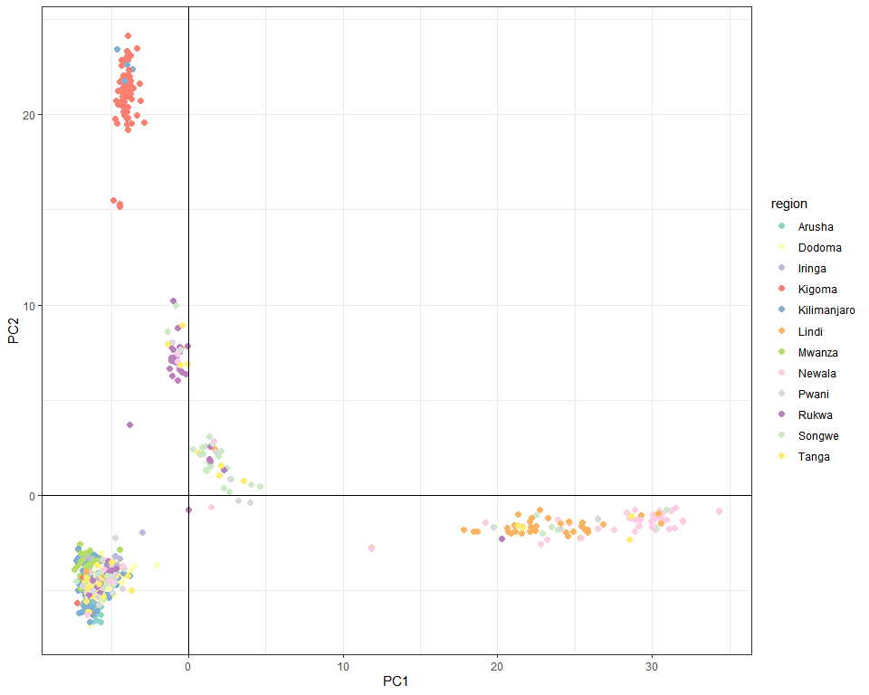

Associating inferred pop structure with phenotype data
================
Bernice Waweru
Wed 04, Aug 2021

-   [Adding relevant phenotype data to the genotype
    data](#adding-relevant-phenotype-data-to-the-genotype-data)
    -   [Principal components analysis](#principal-components-analysis)
-   [Session Information](#session-information)

## Adding relevant phenotype data to the genotype data

We have worked so far with the data without any metadata or phenotype
data. We have quite some comprehensive phenotype data available, so lets
read it into r and add it to the `genlight` object.

``` r
knitr::opts_chunk$set(warning = FALSE, message = FALSE)
setwd("C:/Users/BWaweru/OneDrive - CGIAR/Documents/Fellows/Goat_diversity_project_fellow/Patrick_Baenyi/RWD/2021_Work_Repo/A-Nguluma/")

library(ggplot2)
library(RColorBrewer)

# load the genlight data object

load("results/athu_data-ld2.RData")
athu_dat_ld2
```

    ##  /// GENLIGHT OBJECT /////////
    ## 
    ##  // 679 genotypes,  40,094 binary SNPs, size: 11.3 Mb
    ##  23516 (0.09 %) missing data
    ## 
    ##  // Basic content
    ##    @gen: list of 679 SNPbin
    ##    @ploidy: ploidy of each individual  (range: 2-2)
    ## 
    ##  // Optional content
    ##    @ind.names:  679 individual labels
    ##    @loc.names:  40094 locus labels
    ##    @chromosome: factor storing chromosomes of the SNPs
    ##    @position: integer storing positions of the SNPs
    ##    @pop: population of each individual (group size range: 1-1)
    ##    @other: a list containing: sex  phenotype  pat  mat

We see `@pop` does not have any information.

``` r
athu_pheno <- read.csv("data-raw/athu_phen_dat.csv", header = T)
str(athu_pheno)
```

    ## 'data.frame':    645 obs. of  16 variables:
    ##  $ ï..POP : chr  "Pare" "Pare" "Pare" "Pare" ...
    ##  $ GID    : chr  "EY0041000" "EY0041001" "EY0041002" "EY0041003" ...
    ##  $ PID    : chr  "P1" "P2" "P3" "P4" ...
    ##  $ Region : chr  "Kilimanjaro" "Kilimanjaro" "Kilimanjaro" "Kilimanjaro" ...
    ##  $ APPR   : chr  "Best " "Average " "Poorest" "Best " ...
    ##  $ BWT    : num  30 28 29 35 30 23 37 35 32 28 ...
    ##  $ BL     : int  58 58 62 64 60 58 63 58 60 56 ...
    ##  $ CG     : int  73 72 74 70 74 70 60 78 75 74 ...
    ##  $ HW     : int  67 68 62 72 60 63 62 60 66 61 ...
    ##  $ HR     : int  69 70 64 74 62 64 65 65 69 64 ...
    ##  $ BCS    : num  3 3 3 3 3.5 3 4 4 3 2.5 ...
    ##  $ COLOTYP: chr  "Brown" "White_Brown" "White" "White_Brown" ...
    ##  $ TWIN   : int  1 0 0 1 1 0 0 0 0 2 ...
    ##  $ NOTWINS: int  2 0 0 2 2 0 0 0 0 2 ...
    ##  $ BON    : int  5 4 5 5 5 3 4 2 3 6 ...
    ##  $ WEAN   : int  4 4 5 3 5 3 4 2 3 6 ...

``` r
names(athu_pheno)
```

    ##  [1] "ï..POP"  "GID"     "PID"     "Region"  "APPR"    "BWT"     "BL"     
    ##  [8] "CG"      "HW"      "HR"      "BCS"     "COLOTYP" "TWIN"    "NOTWINS"
    ## [15] "BON"     "WEAN"

Correct the column names

Let’s make the sample ID’s to be the row names for the phenotype data

``` r
rownames(athu_pheno) <- athu_pheno$GID

indNames(athu_dat_ld2)[1:10]
```

    ##  [1] "WG9308435-DNA_A01_EY0041000" "WG9308435-DNA_A02_EY0041008"
    ##  [3] "WG9308435-DNA_A03_EY0041016" "WG9308435-DNA_A04_EY0041024"
    ##  [5] "WG9308435-DNA_A05_EY0041032" "WG9308435-DNA_A06_EY0041040"
    ##  [7] "WG9308435-DNA_A07_EY0041048" "WG9308435-DNA_A08_EY0041056"
    ##  [9] "WG9308435-DNA_A09_EY0041064" "WG9308435-DNA_A10_EY0041072"

We need to have the individual names in the genotype file matching those
in the phenotype file. We can strip the well information from the
genotype information so that we remain with ID’s like those in the pheno
data.

We use the `str_split` function from `stringr` package to split the
names in the genotype file, we use the `_` to split the names and return
the last values which are the names that resemble those in the genotype
file. We then replace the individual names in the genotype file with
those we have extracted.

``` r
require(stringr)

str_split_fixed(indNames(athu_dat_ld2), "_", 3)[,3] -> ind_names_geno_athu

indNames(athu_dat_ld2) <- ind_names_geno_athu

#lets check that it worked

indNames(athu_dat_ld2)[1:10] # great that worked, now we can compare them with the phenotype file
```

    ##  [1] "EY0041000" "EY0041008" "EY0041016" "EY0041024" "EY0041032" "EY0041040"
    ##  [7] "EY0041048" "EY0041056" "EY0041064" "EY0041072"

Now let make sure that all the individuals in the genlight object match
those we have in the pheno data.

``` r
indiv_to_keep <- intersect(indNames(athu_dat_ld2), rownames(athu_pheno)) 

length(indiv_to_keep) ##there are 612 individuals that match and we need to keep in both the genlight object and the phenotype data, 
```

    ## [1] 612

The *indiv\_to\_keep* object has only 612 individual names that match,
67 are not in the dataframe with phenotype data. Both the phenotype
object and the phenotype data need to have matching individual names.

We correct the phenotype data;

``` r
pheno_dat <- athu_pheno[rownames(athu_pheno) %in% indiv_to_keep,]

nrow(pheno_dat) # now we have 612 rowns of phenotype data
```

    ## [1] 612

Next the genotype data. In-order to remove the individuals that are
missing in the `genlight` object, we use the package `dartR`. We first
install it and also its dependencies.

``` r
install.packages("dartR", lib = "C:/R/R-4.0.3/library/")

BiocManager::install("SNPRelate", lib = "C:/R/R-4.0.3/library/")

gl.install.vanilla.dartR()
```

Let’s get the list of individuals that are not present in the phenotype
file

``` r
dif_ind <- setdiff(indNames(athu_dat_ld2), rownames(pheno_dat)) # 67 names
```

Now use the vector missing individuals to subset the genlight object.

``` r
require(dartR)

athu_dat_ld2_612 <- gl.drop.ind(athu_dat_ld2, ind.list = dif_ind, mono.rm = TRUE, recalc = FALSE)
```

    ## Starting gl.drop.ind 
    ##   Processing a SNP dataset
    ##   Deleting individuals EY0041025 EY0041090 EY0041084 EY0041093 EY0041087 EY0041176 EY0041177 EY0041146 EY0041178 EY0041186 EY0041179 EY0041180 EY0041189 EY0041183 EY0041272 EY0041280 EY0041274 EY0041203 EY0041211 EY0041283 EY0041277 EY0041286 EY0041352 EY0041337 EY0041346 EY0041340 EY0041349 EY0041343 EY0041528 EY0041609 EY0041637 EY0041638 EY0041646 EY0041639 EY0041647 EY0041648 EY0041656 EY0041664 EY0041672 EY0041712 EY0041649 EY0041657 EY0041665 EY0041650 EY0041658 EY0041666 EY0041674 EY0041682 EY0041659 EY0041667 EY0041691 EY0041707 EY0041652 EY0041660 EY0041668 EY0041676 EY0041708 EY0041653 EY0041661 EY0041709 EY0041654 EY0041662 EY0041710 EY0041718 EY0041655 EY0041663 EY0041711 
    ##   Deleting monomorphic loc
    ##   Locus metrics not recalculated
    ## Completed: gl.drop.ind

``` r
athu_dat_ld2_612
```

    ##  /// GENLIGHT OBJECT /////////
    ## 
    ##  // 612 genotypes,  40,094 binary SNPs, size: 12.4 Mb
    ##  20776 (0.08 %) missing data
    ## 
    ##  // Basic content
    ##    @gen: list of 612 SNPbin
    ##    @ploidy: ploidy of each individual  (range: 2-2)
    ## 
    ##  // Optional content
    ##    @ind.names:  612 individual labels
    ##    @loc.names:  40094 locus labels
    ##    @chromosome: factor storing chromosomes of the SNPs
    ##    @position: integer storing positions of the SNPs
    ##    @pop: population of each individual (group size range: 1-1)
    ##    @other: a list containing: sex  phenotype  pat  mat  loc.metrics.flags  history  loc.metrics  verbose

``` r
# save this also for easy loading next time

#save(athu_dat_ld2_612, file = "results/athu_dat_ld2_612.RData")
```

The new `genlight` object now has **612** individuals, and no
monomorphic loci were removed hence we remain with **40,094** SNPs. Now
we can move on to generate the PCA’s. First we add the phenotype data of
the populations to the data

``` r
pop(athu_dat_ld2_612) <- pheno_dat$POP

athu_dat_ld2_612 # now @pop has some information
```

    ##  /// GENLIGHT OBJECT /////////
    ## 
    ##  // 612 genotypes,  40,094 binary SNPs, size: 12.4 Mb
    ##  20776 (0.08 %) missing data
    ## 
    ##  // Basic content
    ##    @gen: list of 612 SNPbin
    ##    @ploidy: ploidy of each individual  (range: 2-2)
    ## 
    ##  // Optional content
    ##    @ind.names:  612 individual labels
    ##    @loc.names:  40094 locus labels
    ##    @chromosome: factor storing chromosomes of the SNPs
    ##    @position: integer storing positions of the SNPs
    ##    @pop: population of each individual (group size range: 8-73)
    ##    @other: a list containing: sex  phenotype  pat  mat  loc.metrics.flags  history  loc.metrics  verbose

``` r
#save the genlight object with population information

#save(athu_dat_ld2_612, file = "results/athu_dat_ld2_612.RData")
```

We save the data objects with the final phenotype and correct genotype
for easy loading next time.

``` r
save(athu_dat_ld2_612, file = "results/athu_dat_ld2_612.RData")
write.csv(pheno_dat, file = "results/athu_pheno_612_indiv.csv", quote = FALSE)
```

### [Principal components analysis](http://grunwaldlab.github.io/Population_Genetics_in_R/gbs_analysis.html)

A principal components analysis (PCA) converts the observed SNP data
into a set of values of linearly uncorrelated variables called principal
components that summarize the variation between samples. We can perform
a PCA on our `genlight` object by using the `glPCA` function from the
`adegenet` package.

``` r
athu_pca <- glPca(athu_dat_ld2_612, nf = 5) # nf indicates the number of principal component we want to keep

#takes quite a while to run, let save it an an R data object

save(athu_pca, file = "results/athu_pca.RData")
```

Let’s plot the eigen values to see which one explain the greatest
variation.

``` r
load("results/athu_pca.RData")

barplot(100*athu_pca$eig/sum(athu_pca$eig), col = heat.colors(50), main="PCA Eigenvalues")
title(ylab="Percent of variance\nexplained", line = 2)
title(xlab="Eigenvalues", line = 1)
```

<!-- -->

Looks like the first pc has the greatest variance, so we can keep 3 to
allow us to plot the pca scatter plot.

We use ggplot2 to plot the pca scatter plot. First we convert the data
with pca scores into a data frame, then add various trait data, to color
the population.

``` r
athu_pca_scores <- as.data.frame(athu_pca$scores)

#we check that the pca score data frame has the same row names and in the same order as those in the phenotype data frame

all(rownames(athu_pca_scores) == rownames(pheno_dat)) #its FASLE, lets rearrange
```

    ## [1] FALSE

``` r
pheno_dat <- pheno_dat[rownames(athu_pca_scores),]

all(rownames(athu_pca_scores) == rownames(pheno_dat)) # now good to go
```

    ## [1] TRUE

``` r
# we add the various phenotype variable we would like to color by

athu_pca_scores$pop <- pheno_dat$POP
athu_pca_scores$region <- pheno_dat$Region

unique(pheno_dat$BCS)
```

    ## [1]  3.0  3.5  4.0  2.5 64.0  2.0  4.5  5.0

Now we use ggplot2 to plot anad color points by assigned populations.

``` r
set.seed(9)


#cols for POP

nPop(athu_dat_ld2_612) # 12 populations
```

    ## [1] 12

``` r
cols <- brewer.pal(n = nPop(athu_dat_ld2_612), name = "Paired")

p <- ggplot(athu_pca_scores, aes(x=PC1, y=PC2, colour=pop)) 
p <- p + geom_point(size=2)
#p <- p + stat_ellipse(level = 0.95, size = 1)
p <- p + scale_color_manual(values = cols) 
p <- p + geom_hline(yintercept = 0) 
p <- p + geom_vline(xintercept = 0) 
p <- p + theme_bw()

p
```

<!-- -->

From the plot it looks like we have a probable 5 or 6 populations. They
definitively do not cluster by the assigned `POP` phenotype in the data.

Lets try to do it with one more trait. We do it with region.

``` r
#cols for region

unique(pheno_dat$Region) # 12 regions
```

    ##  [1] "Kilimanjaro" "Arusha"      "Kigoma"      "Dodoma"      "Mwanza"     
    ##  [6] "Rukwa"       "Songwe"      "Tanga"       "Pwani"       "Newala"     
    ## [11] "Lindi"       "Iringa"

``` r
cols <- brewer.pal(n = length(unique(pheno_dat$Region)), name = "Set3")

p <- ggplot(athu_pca_scores, aes(x=PC1, y=PC2, colour=region)) 
p <- p + geom_point(size=2)
#p <- p + stat_ellipse(level = 0.95, size = 1)
p <- p + scale_color_manual(values = cols) 
p <- p + geom_hline(yintercept = 0) 
p <- p + geom_vline(xintercept = 0) 
p <- p + theme_bw()

p
```

<!-- -->

Still too many regions to correctly cluster the data according to the
inferred populations.

## Session Information

Details of packages used with the work flow

``` r
devtools::session_info()
```

    ## - Session info ---------------------------------------------------------------
    ##  setting  value                       
    ##  version  R version 4.0.3 (2020-10-10)
    ##  os       Windows 10 x64              
    ##  system   x86_64, mingw32             
    ##  ui       RTerm                       
    ##  language (EN)                        
    ##  collate  English_United States.1252  
    ##  ctype    English_United States.1252  
    ##  tz       Africa/Nairobi              
    ##  date     2021-08-04                  
    ## 
    ## - Packages -------------------------------------------------------------------
    ##  package      * version   date       lib source        
    ##  ade4         * 1.7-16    2020-10-28 [2] CRAN (R 4.0.3)
    ##  adegenet     * 2.1.3     2020-05-10 [2] CRAN (R 4.0.4)
    ##  ape            5.5       2021-04-25 [2] CRAN (R 4.0.5)
    ##  assertthat     0.2.1     2019-03-21 [2] CRAN (R 4.0.3)
    ##  boot           1.3-28    2021-05-03 [2] CRAN (R 4.0.5)
    ##  cachem         1.0.5     2021-05-15 [2] CRAN (R 4.0.5)
    ##  calibrate      1.7.7     2020-06-19 [2] CRAN (R 4.0.5)
    ##  callr          3.7.0     2021-04-20 [2] CRAN (R 4.0.5)
    ##  class          7.3-19    2021-05-03 [2] CRAN (R 4.0.5)
    ##  classInt       0.4-3     2020-04-07 [2] CRAN (R 4.0.4)
    ##  cli            3.0.0     2021-06-30 [2] CRAN (R 4.0.5)
    ##  cluster        2.1.2     2021-04-17 [2] CRAN (R 4.0.5)
    ##  coda           0.19-4    2020-09-30 [2] CRAN (R 4.0.4)
    ##  codetools      0.2-18    2020-11-04 [2] CRAN (R 4.0.3)
    ##  colorspace     2.0-1     2021-05-04 [2] CRAN (R 4.0.5)
    ##  combinat       0.0-8     2012-10-29 [2] CRAN (R 4.0.3)
    ##  crayon         1.4.1     2021-02-08 [2] CRAN (R 4.0.5)
    ##  dartR        * 1.9.9.1   2021-05-28 [2] CRAN (R 4.0.5)
    ##  data.table     1.14.0    2021-02-21 [2] CRAN (R 4.0.5)
    ##  DBI            1.1.1     2021-01-15 [2] CRAN (R 4.0.3)
    ##  deldir         0.2-10    2021-02-16 [2] CRAN (R 4.0.4)
    ##  DEoptimR       1.0-9     2021-05-24 [2] CRAN (R 4.0.5)
    ##  desc           1.3.0     2021-03-05 [2] CRAN (R 4.0.5)
    ##  devtools       2.4.2     2021-06-07 [2] CRAN (R 4.0.3)
    ##  digest         0.6.27    2020-10-24 [1] CRAN (R 4.0.3)
    ##  dismo          1.3-3     2020-11-17 [2] CRAN (R 4.0.5)
    ##  doParallel     1.0.16    2020-10-16 [2] CRAN (R 4.0.5)
    ##  dplyr          1.0.6     2021-05-05 [2] CRAN (R 4.0.5)
    ##  e1071          1.7-7     2021-05-23 [2] CRAN (R 4.0.5)
    ##  ellipsis       0.3.2     2021-04-29 [2] CRAN (R 4.0.5)
    ##  evaluate       0.14      2019-05-28 [2] CRAN (R 4.0.3)
    ##  expm           0.999-6   2021-01-13 [2] CRAN (R 4.0.4)
    ##  fansi          0.5.0     2021-05-25 [2] CRAN (R 4.0.5)
    ##  farver         2.1.0     2021-02-28 [2] CRAN (R 4.0.5)
    ##  fastmap        1.1.0     2021-01-25 [2] CRAN (R 4.0.5)
    ##  foreach        1.5.1     2020-10-15 [2] CRAN (R 4.0.3)
    ##  fs             1.5.0     2020-07-31 [2] CRAN (R 4.0.3)
    ##  gap            1.2.3-1   2021-04-21 [2] CRAN (R 4.0.5)
    ##  gdata          2.18.0    2017-06-06 [2] CRAN (R 4.0.3)
    ##  gdistance      1.3-6     2020-06-29 [2] CRAN (R 4.0.5)
    ##  gdsfmt         1.26.1    2020-12-22 [2] Bioconductor  
    ##  generics       0.1.0     2020-10-31 [2] CRAN (R 4.0.3)
    ##  genetics       1.3.8.1.3 2021-03-01 [2] CRAN (R 4.0.5)
    ##  GGally         2.1.2     2021-06-21 [2] CRAN (R 4.0.5)
    ##  ggplot2      * 3.3.5     2021-06-25 [2] CRAN (R 4.0.5)
    ##  glue           1.4.2     2020-08-27 [2] CRAN (R 4.0.3)
    ##  gmodels        2.18.1    2018-06-25 [2] CRAN (R 4.0.4)
    ##  gridExtra      2.3       2017-09-09 [2] CRAN (R 4.0.3)
    ##  gtable         0.3.0     2019-03-25 [2] CRAN (R 4.0.3)
    ##  gtools         3.9.2     2021-06-06 [2] CRAN (R 4.0.5)
    ##  hierfstat      0.5-7     2020-07-20 [2] CRAN (R 4.0.5)
    ##  highr          0.9       2021-04-16 [2] CRAN (R 4.0.5)
    ##  hms            1.1.0     2021-05-17 [2] CRAN (R 4.0.5)
    ##  htmltools      0.5.1.1   2021-01-22 [2] CRAN (R 4.0.5)
    ##  httpuv         1.6.1     2021-05-07 [2] CRAN (R 4.0.5)
    ##  igraph         1.2.6     2020-10-06 [2] CRAN (R 4.0.3)
    ##  iterators      1.0.13    2020-10-15 [2] CRAN (R 4.0.3)
    ##  KernSmooth     2.23-20   2021-05-03 [2] CRAN (R 4.0.5)
    ##  knitr          1.33      2021-04-24 [2] CRAN (R 4.0.5)
    ##  labeling       0.4.2     2020-10-20 [2] CRAN (R 4.0.3)
    ##  later          1.2.0     2021-04-23 [2] CRAN (R 4.0.5)
    ##  lattice        0.20-44   2021-05-02 [2] CRAN (R 4.0.5)
    ##  LearnBayes     2.15.1    2018-03-18 [2] CRAN (R 4.0.3)
    ##  lifecycle      1.0.0     2021-02-15 [2] CRAN (R 4.0.5)
    ##  magrittr       2.0.1     2020-11-17 [2] CRAN (R 4.0.3)
    ##  MASS           7.3-54    2021-05-03 [2] CRAN (R 4.0.5)
    ##  Matrix         1.3-4     2021-06-01 [2] CRAN (R 4.0.5)
    ##  memoise        2.0.0     2021-01-26 [2] CRAN (R 4.0.5)
    ##  mgcv           1.8-36    2021-06-01 [2] CRAN (R 4.0.5)
    ##  mime           0.10      2021-02-13 [2] CRAN (R 4.0.4)
    ##  mmod           1.3.3     2017-04-06 [2] CRAN (R 4.0.5)
    ##  munsell        0.5.0     2018-06-12 [2] CRAN (R 4.0.3)
    ##  mvtnorm        1.1-2     2021-06-07 [2] CRAN (R 4.0.5)
    ##  nlme           3.1-152   2021-02-04 [2] CRAN (R 4.0.5)
    ##  pegas          1.0-1     2021-05-17 [2] CRAN (R 4.0.5)
    ##  permute        0.9-5     2019-03-12 [2] CRAN (R 4.0.3)
    ##  pillar         1.6.1     2021-05-16 [2] CRAN (R 4.0.5)
    ##  pkgbuild       1.2.0     2020-12-15 [2] CRAN (R 4.0.3)
    ##  pkgconfig      2.0.3     2019-09-22 [2] CRAN (R 4.0.3)
    ##  pkgload        1.2.1     2021-04-06 [2] CRAN (R 4.0.5)
    ##  plyr           1.8.6     2020-03-03 [2] CRAN (R 4.0.3)
    ##  png            0.1-7     2013-12-03 [2] CRAN (R 4.0.3)
    ##  PopGenReport   3.0.4     2019-02-04 [2] CRAN (R 4.0.5)
    ##  prettyunits    1.1.1     2020-01-24 [2] CRAN (R 4.0.3)
    ##  processx       3.5.2     2021-04-30 [2] CRAN (R 4.0.5)
    ##  progress       1.2.2     2019-05-16 [2] CRAN (R 4.0.3)
    ##  promises       1.2.0.1   2021-02-11 [2] CRAN (R 4.0.5)
    ##  proxy          0.4-26    2021-06-07 [2] CRAN (R 4.0.5)
    ##  ps             1.6.0     2021-02-28 [2] CRAN (R 4.0.5)
    ##  purrr          0.3.4     2020-04-17 [2] CRAN (R 4.0.3)
    ##  R.methodsS3    1.8.1     2020-08-26 [2] CRAN (R 4.0.3)
    ##  R.oo           1.24.0    2020-08-26 [2] CRAN (R 4.0.3)
    ##  R.utils        2.10.1    2020-08-26 [2] CRAN (R 4.0.3)
    ##  R6             2.5.0     2020-10-28 [2] CRAN (R 4.0.3)
    ##  raster         3.4-10    2021-05-03 [2] CRAN (R 4.0.5)
    ##  RColorBrewer * 1.1-2     2014-12-07 [2] CRAN (R 4.0.3)
    ##  Rcpp           1.0.6     2021-01-15 [2] CRAN (R 4.0.3)
    ##  remotes        2.4.0     2021-06-02 [2] CRAN (R 4.0.5)
    ##  reshape        0.8.8     2018-10-23 [2] CRAN (R 4.0.3)
    ##  reshape2       1.4.4     2020-04-09 [2] CRAN (R 4.0.3)
    ##  rgdal          1.5-23    2021-02-03 [2] CRAN (R 4.0.5)
    ##  RgoogleMaps    1.4.5.3   2020-02-12 [2] CRAN (R 4.0.5)
    ##  rlang          0.4.11    2021-04-30 [2] CRAN (R 4.0.5)
    ##  rmarkdown      2.9       2021-06-15 [2] CRAN (R 4.0.3)
    ##  robustbase     0.93-8    2021-06-02 [2] CRAN (R 4.0.5)
    ##  rprojroot      2.0.2     2020-11-15 [2] CRAN (R 4.0.3)
    ##  scales         1.1.1     2020-05-11 [2] CRAN (R 4.0.3)
    ##  seqinr         4.2-8     2021-06-09 [2] CRAN (R 4.0.5)
    ##  sessioninfo    1.1.1     2018-11-05 [2] CRAN (R 4.0.3)
    ##  sf             1.0-0     2021-06-09 [2] CRAN (R 4.0.5)
    ##  shiny          1.6.0     2021-01-25 [2] CRAN (R 4.0.5)
    ##  SNPRelate      1.24.0    2020-10-28 [2] Bioconductor  
    ##  sp             1.4-5     2021-01-10 [2] CRAN (R 4.0.3)
    ##  spData         0.3.10    2021-06-18 [2] CRAN (R 4.0.5)
    ##  spdep          1.1-8     2021-05-23 [2] CRAN (R 4.0.5)
    ##  StAMPP         1.6.2     2021-04-26 [2] CRAN (R 4.0.5)
    ##  stringi        1.6.2     2021-05-17 [2] CRAN (R 4.0.3)
    ##  stringr      * 1.4.0     2019-02-10 [2] CRAN (R 4.0.3)
    ##  testthat       3.0.2     2021-02-14 [2] CRAN (R 4.0.5)
    ##  tibble         3.1.2     2021-05-16 [2] CRAN (R 4.0.5)
    ##  tidyr          1.1.3     2021-03-03 [2] CRAN (R 4.0.5)
    ##  tidyselect     1.1.1     2021-04-30 [2] CRAN (R 4.0.5)
    ##  units          0.7-2     2021-06-08 [2] CRAN (R 4.0.5)
    ##  usethis        2.0.1     2021-02-10 [2] CRAN (R 4.0.5)
    ##  utf8           1.2.1     2021-03-12 [2] CRAN (R 4.0.5)
    ##  vctrs          0.3.8     2021-04-29 [2] CRAN (R 4.0.5)
    ##  vegan          2.5-7     2020-11-28 [2] CRAN (R 4.0.3)
    ##  withr          2.4.2     2021-04-18 [2] CRAN (R 4.0.5)
    ##  xfun           0.24      2021-06-15 [2] CRAN (R 4.0.3)
    ##  xtable         1.8-4     2019-04-21 [2] CRAN (R 4.0.3)
    ##  yaml           2.2.1     2020-02-01 [2] CRAN (R 4.0.3)
    ## 
    ## [1] C:/Users/BWaweru/OneDrive - CGIAR/Documents/R/win-library/4.0
    ## [2] C:/R/R-4.0.3/library
