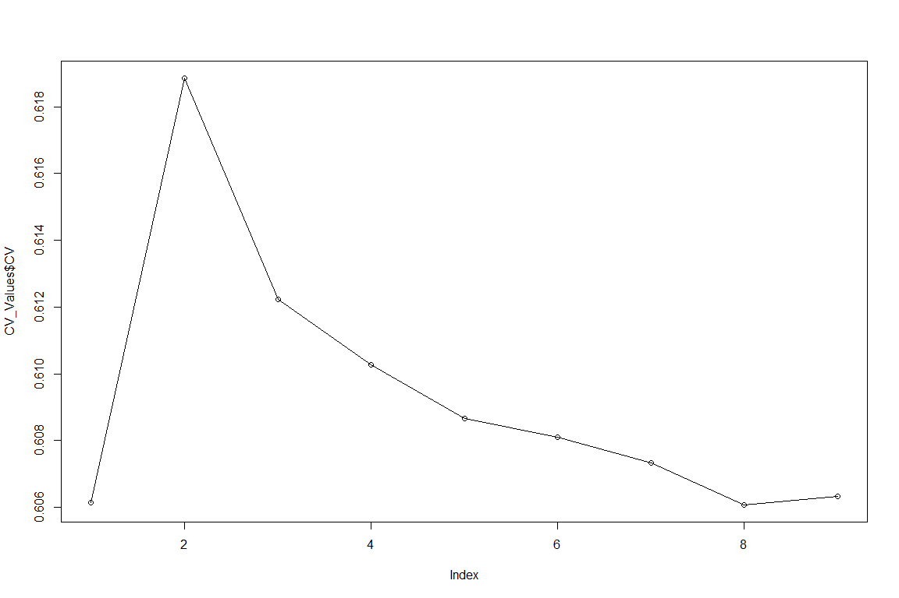

Population Structure with ADMIXTURE and R
================
Bernice Waweru
Thu 01, Jul 2021

-   [Admixture](#admixture)
    -   [Plot the graph of **Cross-Validation error**(cv)
        values](#plot-the-graph-of-cross-validation-errorcv-values)
    -   [Plot a *Structure* like
        diagram](#plot-a-structure-like-diagram)

# Admixture

[ADMIXTURE](https://vcru.wisc.edu/simonlab/bioinformatics/programs/admixture/admixture-manual.pdf)
is a program for estimating ancestry in a model-based manner from large
autosomal SNP genotype datasets, where the individuals are unrelated We
use the command line tool `admixture` to test for various values of K
i.e number of underlying populations. We test for K values from 2 to 10.
The default input data format for admixture is `.bed` files generated
from plink. We use data that has already been filtered for missing data
points, minimum allele frequency and pruned for linkage disequilibrium.
The data is in bed format.

We run the analysis in a batch script with 15 threads to perform it
faster. The script is structured as below. Within the script, we save
the log file for each K that is tested, so we can be able to extract the
`CV`, i.e the error value. We will need this later to plot in-order to
know which is the best K value to work with.

    #!/bin/bash
    #SBATCH -p batch
    #SBATCH -n 15
    #SBATCH -e /home/bngina/Fellows/goat_diversity/athumani/batch_logs/admixture_athu.%N.%J.err
    #SBATCH -o /home/bngina/Fellows/goat_diversity/athumani/batch_logs/admixture_athu.%N.%J.out
    #SBATCH -J athumani_admixture


    #======== Objective =================================================
    # To run admixture with several values pf K to determine the best k value,
    # i.e optimal number of populations within the data set

    # ===== load tools ==================================================

    module load admixture/1.3.0


    # ==== the input data ===============================================
    # we use data filtered using Plink and coverted to binary format i.e '.bed' files
    bed=/home/bngina/Fellows/goat_diversity/athumani/athu_plink_out/athu_bed_fltrd_prnd.bed

    # output folder of the log files
    mkdir -p /home/bngina/Fellows/goat_diversity/athumani/admixture_out
    out=/home/bngina/Fellows/goat_diversity/athumani/admixture_out
    # we need to launch the script from the director will al the binary plink files do that its able to read all of them correctly

    cd /home/bngina/Fellows/goat_diversity/athumani/athu_plink_out
    # we use a for loop to test K values from 2 to 10

    for k in $(echo {2..10..1});
     do echo ${k};
     admixture -j15 --cv ${bed} ${k} > ${out}/log_${k}.txt;
    done

## Plot the graph of **Cross-Validation error**(cv) values

Once its complete, we grep the values of the CV’s and use those to plot
a line grahp in R

    [bngina@hpc admixture_out]$ grep 'CV error' log_*
    log_10.txt:CV error (K=10): 0.60614
    log_2.txt:CV error (K=2): 0.61885
    log_3.txt:CV error (K=3): 0.61223
    log_4.txt:CV error (K=4): 0.61027
    log_5.txt:CV error (K=5): 0.60867
    log_6.txt:CV error (K=6): 0.60811
    log_7.txt:CV error (K=7): 0.60733
    log_8.txt:CV error (K=8): 0.60608
    log_9.txt:CV error (K=9): 0.60634

We use commands `awk` and `tr` to set just what we need from the above
data.

    awk '{print $3,$4}' cv_values.txt | tr '(' ' ' | tr ')' ' ' | tr ':' ' ' > cv_values.txt

    [bngina@hpc admixture_out]$ cat cv_values.txt
     K=10   0.60614
     K=2   0.61885
     K=3   0.61223
     K=4   0.61027
     K=5   0.60867
     K=6   0.60811
     K=7   0.60733
     K=8   0.60608
     K=9   0.60634

Now we have the cv’s in a table as we want. Now we can plot the data in
R.

``` r
read.table("data-raw/cv_values.txt", header = F) -> CV_Values
str(CV_Values)
```

    ## 'data.frame':    9 obs. of  2 variables:
    ##  $ V1: chr  "K=10" "K=2" "K=3" "K=4" ...
    ##  $ V2: num  0.606 0.619 0.612 0.61 0.609 ...

``` r
colnames(CV_Values) <- c("K_value", "CV")
CV_Values
```

    ##   K_value      CV
    ## 1    K=10 0.60614
    ## 2     K=2 0.61885
    ## 3     K=3 0.61223
    ## 4     K=4 0.61027
    ## 5     K=5 0.60867
    ## 6     K=6 0.60811
    ## 7     K=7 0.60733
    ## 8     K=8 0.60608
    ## 9     K=9 0.60634

``` r
# reorder the K values correctly

CV_Values$K_value <- as.factor(CV_Values$K_value)

levels(CV_Values$K_value)
```

    ## [1] "K=10" "K=2"  "K=3"  "K=4"  "K=5"  "K=6"  "K=7"  "K=8"  "K=9"

``` r
#re-order based on acending values of the cv
#CV_Values$K_value <- reorder(CV_Values$K_value, CV_Values$CV, order = T)

CV_Values$K_value <- factor(CV_Values$K_value, levels = c("K=2","K=3","K=4","K=5","K=6","K=7","K=8","K=9","K=10"))

plot(CV_Values$CV, type = "o")

# in ggplot
require(ggplot2)
```

    ## Loading required package: ggplot2

<div class="figure" style="text-align: center">


<p class="caption">
Graph of CV values!
</p>

</div>

``` r
#par(mar = c(4, 4, .1, .1))

cv_plot <- 
  ggplot(CV_Values, aes(x=K_value, y=CV)) + 
  geom_point(aes(size = CV), colour = "blue")+
  xlab("Value of K") + ylab("CV error") 

print(cv_plot)
```

<div class="figure" style="text-align: center">


<p class="caption">
Graph of CV values!
</p>

</div>

From the above plot we see that the least CV error is when we have a
possible 8 underlying populations, and closely followed by 10
populations.We go with the 8 populations.

We extract the `Q` values or population probability values from the
admixture. This dataset has no individual names hence we append the
individual names from the `.fam` file to it with some bash functions.

First extract the individual names and save them into a file.

     awk '{ print $2}' athu_bed_fltrd_prnd.fam > athu_ind_names
     

Combine the individual names and the Q values

     paste athu_ind_names athu_bed_fltrd_prnd.8.Q | less -S > admixture_Q_8_with_names.txt

Check that we have 679 lines corresponding to the number of individuals
in the data set.

     wc -l admixture_Q_8_with_names.txt
    679 admixture_Q_8_with_names.txt

## Plot a *Structure* like diagram

Read in the data into R and set the first column as the rownames

``` r
read.table("data-raw/admixture_Q_8_with_names.txt", header = F, row.names = 1) -> q_8_dat
str(q_8_dat)
```

    ## 'data.frame':    679 obs. of  8 variables:
    ##  $ V2: num  0.00601 0.00352 0.02192 0.01234 0.018 ...
    ##  $ V3: num  0.678 0.629 0.658 0.713 0.397 ...
    ##  $ V4: num  0.0125 0.0247 0.0183 0.0281 0.0147 ...
    ##  $ V5: num  0.00191 0.03767 0.00001 0.02692 0.00001 ...
    ##  $ V6: num  0.0673 0.027 0.059 0.0515 0.0226 ...
    ##  $ V7: num  0.22 0.26 0.242 0.159 0.483 ...
    ##  $ V8: num  0.0062 0.0033 0.00001 0.00001 0.04904 ...
    ##  $ V9: num  0.00778 0.01429 0.00001 0.00844 0.01534 ...

``` r
# set the column names to be the the number of columns

C <- ncol(q_8_dat)
R <- nrow(q_8_dat)

colnames(q_8_dat) <- c(paste("Q",1:C, sep = ""))

# assign sub-population name and initialization  the dataframes
for (j in 1:C){
assign(paste("pop",j,sep=""),data.frame())
}
  

# extract individuals for each sub-population according to the max Q 
for (i in 1:R){
D<-q_8_dat[i,]
M<-max(q_8_dat[i,])
idx<-which(D==M)
    for(k in 1:C){
        if(idx==k){
            assign(paste("pop",k,sep=""),rbind(get(paste("pop",k,sep="")),D))   
        }
    }
}


# put each sub-population in descending order
for(m in 1:C) {
NameQ<-paste("Q",m,sep="")
assign( paste("pop",m,sep=""), get(paste("pop",m,sep=""))[order(-get(paste("pop",m,sep=""))[[NameQ]]),] ) 
}

# assign a name for combined data and initialization
pop_all<-data.frame()

# combine all sub-population
for (num in 1:C){
pop_all<-rbind(pop_all,get(paste("pop",num,sep="")))
}
```

Our data is ready, now we can plot

``` r
barplot(t(as.matrix(pop_all)),width=2,col=rainbow(C),xlab="", ylab="Population Probability", border=NA,axes = FALSE, axisnames = F,las=2,cex.names=0.6, main = "Structure like plot of Athumani Goat data at K value of 8")

barplot(t(as.matrix(pop_all)),col=rainbow(C),xlab="", ylab="", border=NA, axes = FALSE, axisnames = F)

#svg(filename = "results/K-8-structure-plot.svg", width = 15, height = 10)
#barplot(t(as.matrix(pop_all)),width=2,col=rainbow(C),xlab="", ylab="", border=NA,axes = FALSE, axisnames = TRUE,las=2,cex.names=0.6)
#dev.off()
```


