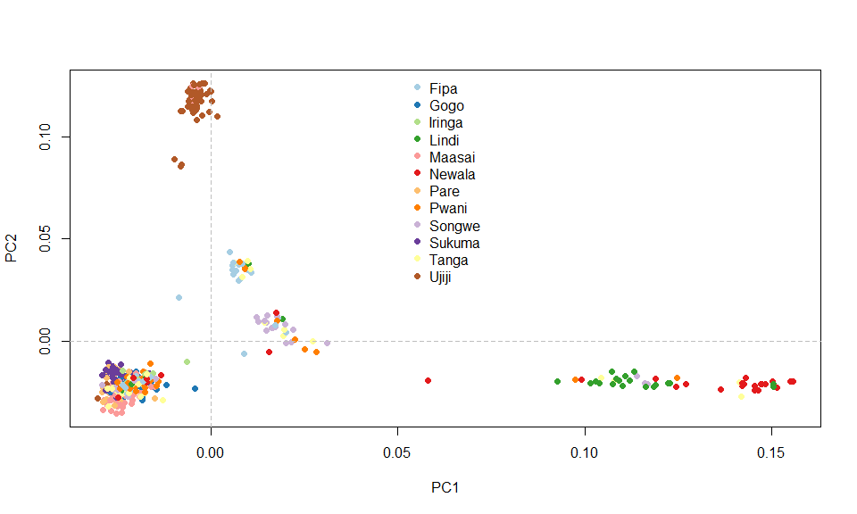

Filtering for possible relatedness among samples
================
Bernice Waweru
Tue 17, Aug 2021

-   [**Objective:** Test for relatedness between samples and filter them
    out from the
    dataset](#objective-test-for-relatedness-between-samples-and-filter-them-out-from-the-dataset)
    -   [Covert `genglight` data to `gds` data
        object](#covert-genglight-data-to-gds-data-object)
    -   [Filter for IBD](#filter-for-ibd)
    -   [Plot PCA with SNPRelate PCA function
        `snpgdsPCA`](#plot-pca-with-snprelate-pca-function-snpgdspca)
    -   [Re-Run the `find.clusters` and `DAPC` from package
        `**adegenet**` with the IBD pruned data
        set.](#re-run-the-findclusters-and-dapc-from-package-adegenet-with-the-ibd-pruned-data-set)
    -   [Re-run admixture with the IBD pruned
        dataset](#re-run-admixture-with-the-ibd-pruned-dataset)
        -   [Plot the graph of **Cross-Validation error**(cv)
            values](#plot-the-graph-of-cross-validation-errorcv-values)
    -   [Plot a *Structure* like
        diagram](#plot-a-structure-like-diagram)

# **Objective:** Test for relatedness between samples and filter them out from the dataset

Population-based cohort studies are often limited to unrelated
individuals. Importantly, in regional cohort studies of complex
diseases/traits, individuals from the same family can be recruited
unintentionally. A common measure of relatedness (or duplication)
between pairs of samples is based on identity by descent (IBD). An IBD
kinship coefficient of greater than 0.10 may suggest relatedness,
duplicates, or sample mixture.Typically, the individual of a related
pair with lower genotype call rate is removed [Reed et al.,
2015](https://onlinelibrary.wiley.com/doi/full/10.1002/sim.6605),
[Anderson et al., 2010](https://www.nature.com/articles/nprot.2010.116).

We test for relatedness among samples using kinship coefficient based in
identity by descent (IBD). These functions are not LD aware, hence it is
important to have pruned your data for LD before running the computation
to determine IBD.

We test for relatedness using the function **`snpgdsIBDMoM`** from the
**`SNPRelate`** package. The inpoutdata for this package needs to be a
gds object. We convert our `genlight` object to gs function then proceed
to IBD.

#### Covert `genglight` data to `gds` data object

``` r
require(SNPRelate)
require(plyr)
require(dartR)
require(RColorBrewer)

# load the data

load("results/athu_dat_ld2_612.RData")

#gl2gds(athu_dat_ld2_612, outfile = "athu_612_ld_02_gds.gds", outpath = "results/")

#lets load into our session for use

genofile <- snpgdsOpen("results/athu_612_ld_02_gds.gds", allow.duplicate = T)

#lets also have the ID's of the SNPs and the individuals stores in a variable

geno_ind_ids <- indNames(athu_dat_ld2_612)
geno_snp_ids <- locNames(athu_dat_ld2_612)
```

#### Filter for IBD

``` r
ibd <- snpgdsIBDMoM(genofile, kinship = T,
sample.id = geno_ind_ids,
snp.id = geno_snp_ids,
num.thread = 1)
```

    ## IBD analysis (PLINK method of moment) on genotypes:
    ## Excluding 13,398 SNPs (non-autosomes or non-selection)
    ## Excluding 0 SNP (monomorphic: TRUE, MAF: NaN, missing rate: NaN)
    ##     # of samples: 612
    ##     # of SNPs: 26,696
    ##     using 1 thread
    ## PLINK IBD:    the sum of all selected genotypes (0,1,2) = 9974001
    ## Tue Aug 17 12:37:48 2021    (internal increment: 52864)
    ## [..................................................]  0%, ETC: ---        [==================================================] 100%, completed, 1s
    ## Tue Aug 17 12:37:50 2021    Done.

``` r
kin <- .1
ibdcoef <- snpgdsIBDSelection(ibd)
ibdcoef <- ibdcoef[ibdcoef$kinship >= kin,]

# Filter samples out
related.samples <- NULL

while (nrow(ibdcoef) > 0) {
# count the number of occurrences of each and take the top one
sample.counts <- arrange(count(c(ibdcoef$ID1, ibdcoef$ID2)), -freq)
rm.sample <- sample.counts[1, 'x']
cat("Removing sample", as.character(rm.sample), 'too closely related to', sample.counts[1, 'freq'],'other samples.\n')

# remove from ibdcoef and add to list
ibdcoef <- ibdcoef[ibdcoef$ID1 != rm.sample & ibdcoef$ID2 != rm.sample,]
related.samples <- c(as.character(rm.sample), related.samples)
}
```

    ## Removing sample EY0041269 too closely related to 6 other samples.
    ## Removing sample EY0041447 too closely related to 6 other samples.
    ## Removing sample EY0041288 too closely related to 5 other samples.
    ## Removing sample EY0041464 too closely related to 5 other samples.
    ## Removing sample EY0041148 too closely related to 4 other samples.
    ## Removing sample EY0041289 too closely related to 4 other samples.
    ## Removing sample EY0041480 too closely related to 4 other samples.
    ## Removing sample EY0041547 too closely related to 4 other samples.
    ## Removing sample EY0041581 too closely related to 4 other samples.
    ## Removing sample EY0041604 too closely related to 4 other samples.
    ## Removing sample EY0041681 too closely related to 4 other samples.
    ## Removing sample EY0041046 too closely related to 3 other samples.
    ## Removing sample EY0041066 too closely related to 3 other samples.
    ## Removing sample EY0041232 too closely related to 3 other samples.
    ## Removing sample EY0041290 too closely related to 3 other samples.
    ## Removing sample EY0041325 too closely related to 3 other samples.
    ## Removing sample EY0041433 too closely related to 3 other samples.
    ## Removing sample EY0041454 too closely related to 3 other samples.
    ## Removing sample EY0041538 too closely related to 3 other samples.
    ## Removing sample EY0041548 too closely related to 3 other samples.
    ## Removing sample EY0041579 too closely related to 3 other samples.
    ## Removing sample EY0041592 too closely related to 3 other samples.
    ## Removing sample EY0041605 too closely related to 3 other samples.
    ## Removing sample EY0041610 too closely related to 3 other samples.
    ## Removing sample EY0041689 too closely related to 3 other samples.
    ## Removing sample EY0041051 too closely related to 2 other samples.
    ## Removing sample EY0041092 too closely related to 2 other samples.
    ## Removing sample EY0041138 too closely related to 2 other samples.
    ## Removing sample EY0041182 too closely related to 2 other samples.
    ## Removing sample EY0041222 too closely related to 2 other samples.
    ## Removing sample EY0041291 too closely related to 2 other samples.
    ## Removing sample EY0041331 too closely related to 2 other samples.
    ## Removing sample EY0041423 too closely related to 2 other samples.
    ## Removing sample EY0041428 too closely related to 2 other samples.
    ## Removing sample EY0041434 too closely related to 2 other samples.
    ## Removing sample EY0041440 too closely related to 2 other samples.
    ## Removing sample EY0041463 too closely related to 2 other samples.
    ## Removing sample EY0041466 too closely related to 2 other samples.
    ## Removing sample EY0041471 too closely related to 2 other samples.
    ## Removing sample EY0041474 too closely related to 2 other samples.
    ## Removing sample EY0041477 too closely related to 2 other samples.
    ## Removing sample EY0041484 too closely related to 2 other samples.
    ## Removing sample EY0041496 too closely related to 2 other samples.
    ## Removing sample EY0041506 too closely related to 2 other samples.
    ## Removing sample EY0041524 too closely related to 2 other samples.
    ## Removing sample EY0041549 too closely related to 2 other samples.
    ## Removing sample EY0041588 too closely related to 2 other samples.
    ## Removing sample EY0041614 too closely related to 2 other samples.
    ## Removing sample EY0041684 too closely related to 2 other samples.
    ## Removing sample EY0041010 too closely related to 1 other samples.
    ## Removing sample EY0041026 too closely related to 1 other samples.
    ## Removing sample EY0041039 too closely related to 1 other samples.
    ## Removing sample EY0041040 too closely related to 1 other samples.
    ## Removing sample EY0041052 too closely related to 1 other samples.
    ## Removing sample EY0041053 too closely related to 1 other samples.
    ## Removing sample EY0041055 too closely related to 1 other samples.
    ## Removing sample EY0041070 too closely related to 1 other samples.
    ## Removing sample EY0041078 too closely related to 1 other samples.
    ## Removing sample EY0041094 too closely related to 1 other samples.
    ## Removing sample EY0041097 too closely related to 1 other samples.
    ## Removing sample EY0041110 too closely related to 1 other samples.
    ## Removing sample EY0041132 too closely related to 1 other samples.
    ## Removing sample EY0041139 too closely related to 1 other samples.
    ## Removing sample EY0041141 too closely related to 1 other samples.
    ## Removing sample EY0041184 too closely related to 1 other samples.
    ## Removing sample EY0041195 too closely related to 1 other samples.
    ## Removing sample EY0041197 too closely related to 1 other samples.
    ## Removing sample EY0041213 too closely related to 1 other samples.
    ## Removing sample EY0041226 too closely related to 1 other samples.
    ## Removing sample EY0041228 too closely related to 1 other samples.
    ## Removing sample EY0041251 too closely related to 1 other samples.
    ## Removing sample EY0041296 too closely related to 1 other samples.
    ## Removing sample EY0041307 too closely related to 1 other samples.
    ## Removing sample EY0041313 too closely related to 1 other samples.
    ## Removing sample EY0041327 too closely related to 1 other samples.
    ## Removing sample EY0041334 too closely related to 1 other samples.
    ## Removing sample EY0041338 too closely related to 1 other samples.
    ## Removing sample EY0041347 too closely related to 1 other samples.
    ## Removing sample EY0041361 too closely related to 1 other samples.
    ## Removing sample EY0041368 too closely related to 1 other samples.
    ## Removing sample EY0041371 too closely related to 1 other samples.
    ## Removing sample EY0041374 too closely related to 1 other samples.
    ## Removing sample EY0041385 too closely related to 1 other samples.
    ## Removing sample EY0041389 too closely related to 1 other samples.
    ## Removing sample EY0041391 too closely related to 1 other samples.
    ## Removing sample EY0041397 too closely related to 1 other samples.
    ## Removing sample EY0041401 too closely related to 1 other samples.
    ## Removing sample EY0041406 too closely related to 1 other samples.
    ## Removing sample EY0041410 too closely related to 1 other samples.
    ## Removing sample EY0041416 too closely related to 1 other samples.
    ## Removing sample EY0041424 too closely related to 1 other samples.
    ## Removing sample EY0041429 too closely related to 1 other samples.
    ## Removing sample EY0041435 too closely related to 1 other samples.
    ## Removing sample EY0041437 too closely related to 1 other samples.
    ## Removing sample EY0041441 too closely related to 1 other samples.
    ## Removing sample EY0041442 too closely related to 1 other samples.
    ## Removing sample EY0041450 too closely related to 1 other samples.
    ## Removing sample EY0041452 too closely related to 1 other samples.
    ## Removing sample EY0041459 too closely related to 1 other samples.
    ## Removing sample EY0041465 too closely related to 1 other samples.
    ## Removing sample EY0041467 too closely related to 1 other samples.
    ## Removing sample EY0041472 too closely related to 1 other samples.
    ## Removing sample EY0041475 too closely related to 1 other samples.
    ## Removing sample EY0041476 too closely related to 1 other samples.
    ## Removing sample EY0041485 too closely related to 1 other samples.
    ## Removing sample EY0041487 too closely related to 1 other samples.
    ## Removing sample EY0041488 too closely related to 1 other samples.
    ## Removing sample EY0041489 too closely related to 1 other samples.
    ## Removing sample EY0041490 too closely related to 1 other samples.
    ## Removing sample EY0041491 too closely related to 1 other samples.
    ## Removing sample EY0041492 too closely related to 1 other samples.
    ## Removing sample EY0041493 too closely related to 1 other samples.
    ## Removing sample EY0041497 too closely related to 1 other samples.
    ## Removing sample EY0041498 too closely related to 1 other samples.
    ## Removing sample EY0041499 too closely related to 1 other samples.
    ## Removing sample EY0041504 too closely related to 1 other samples.
    ## Removing sample EY0041507 too closely related to 1 other samples.
    ## Removing sample EY0041510 too closely related to 1 other samples.
    ## Removing sample EY0041511 too closely related to 1 other samples.
    ## Removing sample EY0041512 too closely related to 1 other samples.
    ## Removing sample EY0041525 too closely related to 1 other samples.
    ## Removing sample EY0041530 too closely related to 1 other samples.
    ## Removing sample EY0041532 too closely related to 1 other samples.
    ## Removing sample EY0041537 too closely related to 1 other samples.
    ## Removing sample EY0041539 too closely related to 1 other samples.
    ## Removing sample EY0041540 too closely related to 1 other samples.
    ## Removing sample EY0041545 too closely related to 1 other samples.
    ## Removing sample EY0041563 too closely related to 1 other samples.
    ## Removing sample EY0041571 too closely related to 1 other samples.
    ## Removing sample EY0041572 too closely related to 1 other samples.
    ## Removing sample EY0041584 too closely related to 1 other samples.
    ## Removing sample EY0041594 too closely related to 1 other samples.
    ## Removing sample EY0041596 too closely related to 1 other samples.
    ## Removing sample EY0041601 too closely related to 1 other samples.
    ## Removing sample EY0041611 too closely related to 1 other samples.
    ## Removing sample EY0041612 too closely related to 1 other samples.
    ## Removing sample EY0041622 too closely related to 1 other samples.
    ## Removing sample EY0041669 too closely related to 1 other samples.
    ## Removing sample EY0041671 too closely related to 1 other samples.
    ## Removing sample EY0041680 too closely related to 1 other samples.
    ## Removing sample EY0041685 too closely related to 1 other samples.
    ## Removing sample EY0041686 too closely related to 1 other samples.
    ## Removing sample EY0041687 too closely related to 1 other samples.
    ## Removing sample EY0041690 too closely related to 1 other samples.

``` r
# check how many samples have been dropped

length(related.samples) # 144 samples
```

    ## [1] 144

We use `dartR` to drop the related samples from the genlight object.

``` r
athu_dat_ld2_612_ibd_prund <- gl.drop.ind(athu_dat_ld2_612, ind.list = related.samples, mono.rm = TRUE, recalc = FALSE)
```

    ## Starting gl.drop.ind 
    ##   Processing a SNP dataset
    ##   Deleting individuals EY0041690 EY0041687 EY0041686 EY0041685 EY0041680 EY0041671 EY0041669 EY0041622 EY0041612 EY0041611 EY0041601 EY0041596 EY0041594 EY0041584 EY0041572 EY0041571 EY0041563 EY0041545 EY0041540 EY0041539 EY0041537 EY0041532 EY0041530 EY0041525 EY0041512 EY0041511 EY0041510 EY0041507 EY0041504 EY0041499 EY0041498 EY0041497 EY0041493 EY0041492 EY0041491 EY0041490 EY0041489 EY0041488 EY0041487 EY0041485 EY0041476 EY0041475 EY0041472 EY0041467 EY0041465 EY0041459 EY0041452 EY0041450 EY0041442 EY0041441 EY0041437 EY0041435 EY0041429 EY0041424 EY0041416 EY0041410 EY0041406 EY0041401 EY0041397 EY0041391 EY0041389 EY0041385 EY0041374 EY0041371 EY0041368 EY0041361 EY0041347 EY0041338 EY0041334 EY0041327 EY0041313 EY0041307 EY0041296 EY0041251 EY0041228 EY0041226 EY0041213 EY0041197 EY0041195 EY0041184 EY0041141 EY0041139 EY0041132 EY0041110 EY0041097 EY0041094 EY0041078 EY0041070 EY0041055 EY0041053 EY0041052 EY0041040 EY0041039 EY0041026 EY0041010 EY0041684 EY0041614 EY0041588 EY0041549 EY0041524 EY0041506 EY0041496 EY0041484 EY0041477 EY0041474 EY0041471 EY0041466 EY0041463 EY0041440 EY0041434 EY0041428 EY0041423 EY0041331 EY0041291 EY0041222 EY0041182 EY0041138 EY0041092 EY0041051 EY0041689 EY0041610 EY0041605 EY0041592 EY0041579 EY0041548 EY0041538 EY0041454 EY0041433 EY0041325 EY0041290 EY0041232 EY0041066 EY0041046 EY0041681 EY0041604 EY0041581 EY0041547 EY0041480 EY0041289 EY0041148 EY0041464 EY0041288 EY0041447 EY0041269 
    ##   Deleting monomorphic loc
    ##   Locus metrics not recalculated
    ## Completed: gl.drop.ind

``` r
athu_dat_ld2_612_ibd_prund # now we have 468 individuals.
```

    ##  /// GENLIGHT OBJECT /////////
    ## 
    ##  // 468 genotypes,  40,094 binary SNPs, size: 10.8 Mb
    ##  15723 (0.08 %) missing data
    ## 
    ##  // Basic content
    ##    @gen: list of 468 SNPbin
    ##    @ploidy: ploidy of each individual  (range: 2-2)
    ## 
    ##  // Optional content
    ##    @ind.names:  468 individual labels
    ##    @loc.names:  40094 locus labels
    ##    @chromosome: factor storing chromosomes of the SNPs
    ##    @position: integer storing positions of the SNPs
    ##    @pop: population of each individual (group size range: 7-63)
    ##    @other: a list containing: sex  phenotype  pat  mat  loc.metrics.flags  history  loc.metrics  verbose

``` r
save(athu_dat_ld2_612_ibd_prund, file = "results/athu_612_ld_02_ibd_prnd_genlight.RData")

indNames(athu_dat_ld2_612_ibd_prund)[1:10]
```

    ##  [1] "EY0041000" "EY0041008" "EY0041016" "EY0041024" "EY0041032" "EY0041048"
    ##  [7] "EY0041056" "EY0041064" "EY0041072" "EY0041080"

``` r
write.csv(indNames(athu_dat_ld2_612_ibd_prund), file = "results/athu_ibd_prnd_ind_names.csv")
```

## Plot PCA with SNPRelate PCA function `snpgdsPCA`

``` r
#first we convert the new genlight object to ggs data object
#gl2gds(athu_dat_ld2_612_ibd_prund, outfile = "athu_612_ld_02_ibd_prndgds.gds", outpath = "results/")

#lets load into our session for use

genofile <- snpgdsOpen("results/athu_612_ld_02_ibd_prndgds.gds", allow.duplicate = T)
geno_ind_ids <- indNames(athu_dat_ld2_612_ibd_prund)
geno_snp_ids <- locNames(athu_dat_ld2_612_ibd_prund)


# calculate the pca
pca1 <- snpgdsPCA(genofile, sample.id = geno_ind_ids, snp.id = geno_snp_ids, autosome.only = T, num.thread = 1)
```

    ## Principal Component Analysis (PCA) on genotypes:
    ## Excluding 13,398 SNPs (non-autosomes or non-selection)
    ## Excluding 0 SNP (monomorphic: TRUE, MAF: NaN, missing rate: NaN)
    ##     # of samples: 468
    ##     # of SNPs: 26,696
    ##     using 1 thread
    ##     # of principal components: 32
    ## PCA:    the sum of all selected genotypes (0,1,2) = 7642713
    ## CPU capabilities: Double-Precision SSE2
    ## Tue Aug 17 12:37:57 2021    (internal increment: 2160)
    ## [..................................................]  0%, ETC: ---        [==================================================] 100%, completed, 3s
    ## Tue Aug 17 12:38:00 2021    Begin (eigenvalues and eigenvectors)
    ## Tue Aug 17 12:38:00 2021    Done.

``` r
pca_all_SNPs <- snpgdsPCA(genofile, sample.id = geno_ind_ids, snp.id = geno_snp_ids, autosome.only = F, num.thread = 1)
```

    ## Principal Component Analysis (PCA) on genotypes:
    ## Excluding 0 SNP (monomorphic: TRUE, MAF: NaN, missing rate: NaN)
    ##     # of samples: 468
    ##     # of SNPs: 40,094
    ##     using 1 thread
    ##     # of principal components: 32
    ## PCA:    the sum of all selected genotypes (0,1,2) = 11504021
    ## CPU capabilities: Double-Precision SSE2
    ## Tue Aug 17 12:38:00 2021    (internal increment: 2160)
    ## [..................................................]  0%, ETC: ---        [==================================================] 100%, completed, 3s
    ## Tue Aug 17 12:38:03 2021    Begin (eigenvalues and eigenvectors)
    ## Tue Aug 17 12:38:03 2021    Done.

``` r
# we create a dataframe to store pca results that we can use with ggplot to view results
## with 26k SNPs
pca_dat1 <- data.frame(ind_ids = pca1$sample.id, PC1 = pca1$eigenvect[,1], PC2 = pca1$eigenvect[,2], stringsAsFactors = F)

plot(pca_dat1$PC2, pca_dat1$PC1, xlab="eigenvector 2", ylab="eigenvector 1")
```

<!-- -->

``` r
## with all the snps
pca_dat2 <- data.frame(ind_ids = pca_all_SNPs$sample.id, PC1 = pca_all_SNPs$eigenvect[,1], PC2 = pca_all_SNPs$eigenvect[,2], stringsAsFactors = F)

plot(pca_dat2$PC1, pca_dat2$PC2, xlab="eigenvector 1", ylab="eigenvector 2")
```

<!-- -->

In its calculation, the PCA function excludes autosomal SNPs, i.e SNPs
that have not been assigned to chromosome positions. TO tun this
behavior off we use `autosome.only` to `FASLE` so that it used
information from the SNPs in its calculation. Regardless, plotting the
PCA shows no difference at all with the clustering of samples.

Let’s add some color to the plot.

``` r
load(file = "results/pheno_dat_athu_248_ind.RData")

pheno_dat_IBD_prnd <- pheno_dat[rownames(pheno_dat) %in% geno_ind_ids,]

# check that rownames in pheno data and in pca dataframe are in same order

all(rownames(pheno_dat_IBD_prnd) == pca_dat2$ind_ids) # TRUE
```

    ## [1] TRUE

``` r
pca_dat2$pop <- pheno_dat_IBD_prnd$POP

brewer.pal(12,"Paired") -> cols

pcaCol <- rep(rgb(0,0,0,.3), length(pca_dat2$sample.id))
pcaCol[pheno_dat_IBD_prnd$POP == "Fipa"] <- cols[1]
pcaCol[pheno_dat_IBD_prnd$POP == "Gogo"] <- cols[2]
pcaCol[pheno_dat_IBD_prnd$POP == "Iringa"] <- cols[3]
pcaCol[pheno_dat_IBD_prnd$POP == "Lindi"] <- cols[4]
pcaCol[pheno_dat_IBD_prnd$POP ==  "Maasai"] <- cols[5]
pcaCol[pheno_dat_IBD_prnd$POP == "Newala"] <- cols[6]
pcaCol[pheno_dat_IBD_prnd$POP == "Pare"] <- cols[7]
pcaCol[pheno_dat_IBD_prnd$POP == "Pwani" ] <- cols[8]
pcaCol[pheno_dat_IBD_prnd$POP == "Songwe"] <- cols[9]
pcaCol[pheno_dat_IBD_prnd$POP == "Sukuma"] <- cols[10]
pcaCol[pheno_dat_IBD_prnd$POP == "Tanga"] <- cols[11]
pcaCol[pheno_dat_IBD_prnd$POP == "Ujiji"] <- cols[12]

#plot

plot(pca_dat2$PC1, pca_dat2$PC2, xlab = "PC1", ylab = "PC2", col = pcaCol, pch = 16)
abline(h = 0, v = 0, lty = 2, col = "grey")
legend("top", legend = c("Fipa", "Gogo", "Iringa","Lindi","Maasai", "Newala","Pare","Pwani","Songwe","Sukuma","Tanga","Ujiji" ), col = cols, pch = 16, bty = "n")
```

<!-- -->

The PCA plot with the related individuals removed is not very different
from the previous PCA plots, but we seem to have slightly better defined
clusters with the Ujiji, Lindi and Newala populations. The three
individuals from Ujiji clustering by themselves could be outliers as
well as the other two one from Fipa and one from Newala.

## Re-Run the `find.clusters` and `DAPC` from package `**adegenet**` with the IBD pruned data set.

``` r
grp <- find.clusters(athu_dat_ld2_612_ibd_prund, max.n.clust = 15) 
save(grp, file = "results/grp_athu_IBD_pcs_20.RData")
# used groups with DAPC

dapc1_athu_IBD <- dapc(athu_dat_ld2_612_ibd_prund, grp$grp)
save(dapc1_athu_IBD, file = "results/dapc1_athu_IBD_pc_20_8_pop.RData")
# ==== above command takes quite a while and is interactive

# ===== because this take long and requires interactively selecting the number of pcs and clusters to keep, we save the grp objects as an RData file

# ===== we can then load when we need to use it downstream
```

``` r

```

<!-- -->

``` r

```

<!-- -->

``` r

```

<!-- -->

Once we re-run the find.clusters, we chose to keep 10 PCs and 8 clusters
as seen by the bend in the BIC plot. After that with the `dapc` we chose
to keep 8 discriminant functions that explained the data well in the
scatter plot below.

We can then use the above generated dat to plot a scatter plot of
inferred number of underlying populations

``` r
load("results/dapc1_athu_IBD_pc_20_8_pop.RData")

scatter(dapc1_athu_IBD)
```


``` r
# ===== a bit customization for a more readable plot
require(RColorBrewer)
myCol <-  brewer.pal(12, "Paired") # choose some colors

scatter(dapc1_athu_IBD, scree.da=TRUE,scree.pca = TRUE, bg="white", pch=20, cell=0, cstar=0, col=myCol, solid=.4, cex=3,clab=0, leg=TRUE, txt.leg=paste("Cluster",1:8))
```


After filtering for relatedness, the adegenet algorithm using
`find.clusters` and `dapc` reveal a probable 8 populations seen to be 5
clusters in the scatter plot.

The clustering algorithms based on PCA plots mostly reveal **5 to 6**
populations, and the admixture and `find.clusters` reveal **8**
populations. In conclusion, the data set has between 5 to 8 populations.
Filtering the relatedness values is a good filter to consider while
using adegenet functions.

## Re-run admixture with the IBD pruned dataset

#### Plot the graph of **Cross-Validation error**(cv) values

We grep the values of the CV’s and use those to plot a line graph in R

    [bngina@hpc admixture_out]$ grep 'CV error' log_*
    log_10.txt:CV error (K=10): 0.62267
    log_1.txt:CV error (K=1): 0.63261
    log_2.txt:CV error (K=2): 0.62295
    log_3.txt:CV error (K=3): 0.61622
    log_4.txt:CV error (K=4): 0.61533
    log_5.txt:CV error (K=5): 0.61535
    log_6.txt:CV error (K=6): 0.61606
    log_7.txt:CV error (K=7): 0.61700
    log_8.txt:CV error (K=8): 0.61837
    log_9.txt:CV error (K=9): 0.61994

We use commands `awk` and `tr` to set just what we need from the above
data.

    awk '{print $3,$4}' cv_values.txt | tr '(' ' ' | tr ')' ' ' | tr ':' ' ' > cv_values.txt

    [bngina@hpc admixture_out]$ cat cv_values.txt
    K=10   0.62267
    K=1   0.63261
    K=2   0.62295
    K=3   0.61622
    K=4   0.61533
    K=5   0.61535
    K=6   0.61606
    K=7   0.61700
    K=8   0.61837
    K=9   0.61994

Now we have the cv’s in a table as we want. Now we can plot the data in
R.

``` r
read.table("results/cv_values_rev.txt", header = F) -> CV_Values
str(CV_Values)
```

    ## 'data.frame':    10 obs. of  2 variables:
    ##  $ V1: chr  "Cluster_10" "Cluster_1" "Cluster_2" "Cluster_3" ...
    ##  $ V2: num  0.623 0.633 0.623 0.616 0.615 ...

``` r
# rename columns

colnames(CV_Values) <- c("Cluster", "cv_error")
```

``` r
# reorder the K values correctly

CV_Values$Cluster <- as.factor(CV_Values$Cluster)

levels(CV_Values$K_value)
```

    ## NULL

``` r
#re-order based on ascending values of the cv
#CV_Values$Cluster <- reorder(CV_Values$Cluster, CV_Values$cv_error, order = T)

CV_Values$Cluster <- factor(CV_Values$Cluster, levels = c("Cluster_1","Cluster_2","Cluster_3","Cluster_4","Cluster_5","Cluster_6","Cluster_7","Cluster_8","Cluster_9", "Cluster_10"))

#plot(CV_Values$cv_error)

# in ggplot
require(ggplot2)
```

``` r
#par(mar = c(4, 4, .1, .1))

cv_plot <- 
  ggplot(CV_Values, aes(x=Cluster, y=cv_error)) + 
  geom_point(aes(size=cv_error), colour = "blue")+
  xlab("Value of K") + ylab("CV error") 

print(cv_plot)
```


From the above plot we see that the least CV error is when we have a
possible 4/5 underlying populations. We extract the `Q` values or
population probability values from the admixture. This dataset has no
individual names hence we append the individual names from the `.fam`
file to it with some bash functions.

## Plot a *Structure* like diagram

Read in the data into R and set the first column as the row names

``` r
read.table("results/admixture_Q_5_ibd_with_names.txt", header = F, row.names = 1) -> q_5_ibd_dat
str(q_5_ibd_dat)
```

    ## 'data.frame':    468 obs. of  5 variables:
    ##  $ V2: num  0.0705 0.0266 0.0378 0.0483 0.0158 ...
    ##  $ V3: num  0.00242 0.03818 0.00001 0.03227 0.00867 ...
    ##  $ V4: num  0.1009 0.143 0.1201 0.0529 0.4915 ...
    ##  $ V5: num  0.00937 0.00001 0.01353 0.02231 0.00615 ...
    ##  $ V6: num  0.817 0.792 0.829 0.844 0.478 ...

``` r
# set the column names to be the the number of columns

C <- ncol(q_5_ibd_dat)
R <- nrow(q_5_ibd_dat)

colnames(q_5_ibd_dat) <- c(paste("Q",1:C, sep = ""))

# assign sub-population name and initialization  the dataframes
for (j in 1:C){
assign(paste("pop",j,sep=""),data.frame())
}
  

# extract individuals for each sub-population according to the max Q 
for (i in 1:R){
D<-q_5_ibd_dat[i,]
M<-max(q_5_ibd_dat[i,])
idx<-which(D==M)
    for(k in 1:C){
        if(idx==k){
            assign(paste("pop",k,sep=""),rbind(get(paste("pop",k,sep="")),D))   
        }
    }
}


# put each sub-population in descending order
for(m in 1:C) {
NameQ<-paste("Q",m,sep="")
assign( paste("pop",m,sep=""), get(paste("pop",m,sep=""))[order(-get(paste("pop",m,sep=""))[[NameQ]]),] ) 
}

# assign a name for combined data and initialization
pop_all<-data.frame()

# combine all sub-population
for (num in 1:C){
pop_all<-rbind(pop_all,get(paste("pop",num,sep="")))
}
```

Our data is ready, now we can plot

``` r
barplot(t(as.matrix(pop_all)),width=2,col=rainbow(C),xlab="", ylab="Population Probability", border=NA,axes = FALSE, axisnames = F,las=2,cex.names=0.6, main = "Structure like plot of Athumani Goat data at K value of 5 with data filtered for relatedness")

barplot(t(as.matrix(pop_all)),col=rainbow(C),xlab="", ylab="", border=NA, axes = FALSE, axisnames = F)

svg(filename = "results/K-5-ibd_structure-plot.svg", width = 15, height = 10)
barplot(t(as.matrix(pop_all)),width=2,col=rainbow(C),xlab="", ylab="Population Probability", border=NA,axes = FALSE, axisnames = F,las=2,cex.names=0.6, main = "Structure like plot of Athumani Goat data at K value of 5 with data filtered for relatedness")
dev.off()
```

``` r

```


