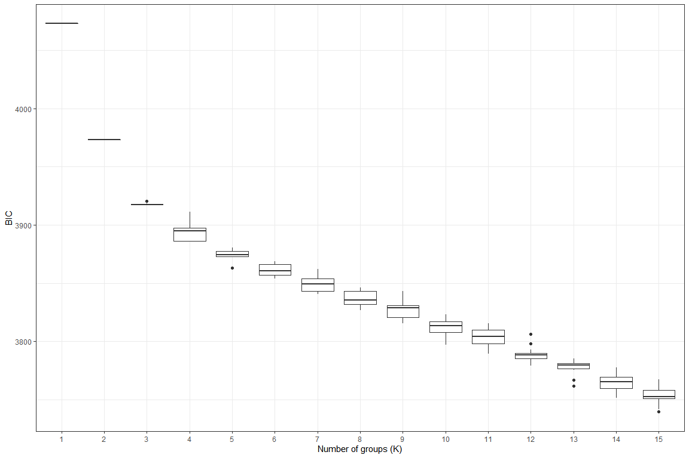
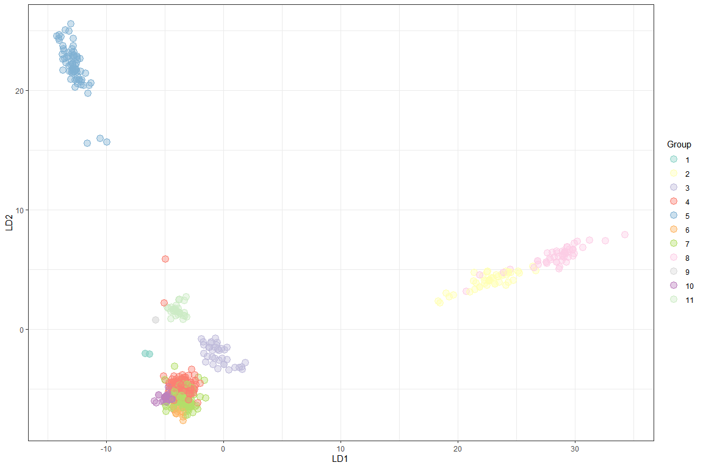
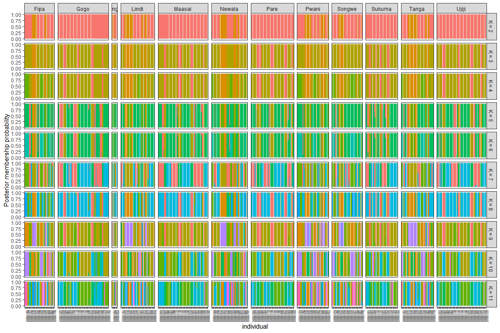

Clustering analysis to test various K values
================
Bernice Waweru
Wed 04, Aug 2021

-   [Objective](#objective)

## Objective

We can test various values of `K` to check value correctly reflects the
number of underlying populations in our data set. We will use the
`genlight` object to test for this and generate a plot to present our
results. The data has 248 individuals and 44,093 SNPs

``` r
setwd("C:/Users/BWaweru/OneDrive - CGIAR/Documents/Fellows/Goat_diversity_project_fellow/Patrick_Baenyi/RWD/2021_Work_Repo/A-Nguluma/")

# load the genlight data object

load("results/athu_dat_ld2_612.RData")
athu_dat_ld2_612
```

    ##  /// GENLIGHT OBJECT /////////
    ## 
    ##  // 612 genotypes,  40,094 binary SNPs, size: 12.4 Mb
    ##  20776 (0.08 %) missing data
    ## 
    ##  // Basic content
    ##    @gen: list of 612 SNPbin
    ##    @ploidy: ploidy of each individual  (range: 2-2)
    ## 
    ##  // Optional content
    ##    @ind.names:  612 individual labels
    ##    @loc.names:  40094 locus labels
    ##    @chromosome: factor storing chromosomes of the SNPs
    ##    @position: integer storing positions of the SNPs
    ##    @pop: population of each individual (group size range: 8-73)
    ##    @other: a list containing: sex  phenotype  pat  mat  loc.metrics.flags  history  loc.metrics  verbose

Check that the loaded data is correctly;

``` r
# ==== summary
athu_dat_ld2_612
```

    ##  /// GENLIGHT OBJECT /////////
    ## 
    ##  // 612 genotypes,  40,094 binary SNPs, size: 12.4 Mb
    ##  20776 (0.08 %) missing data
    ## 
    ##  // Basic content
    ##    @gen: list of 612 SNPbin
    ##    @ploidy: ploidy of each individual  (range: 2-2)
    ## 
    ##  // Optional content
    ##    @ind.names:  612 individual labels
    ##    @loc.names:  40094 locus labels
    ##    @chromosome: factor storing chromosomes of the SNPs
    ##    @position: integer storing positions of the SNPs
    ##    @pop: population of each individual (group size range: 8-73)
    ##    @other: a list containing: sex  phenotype  pat  mat  loc.metrics.flags  history  loc.metrics  verbose

``` r
# ==== individual names

indNames(athu_dat_ld2_612)[1:10]
```

    ##  [1] "EY0041000" "EY0041008" "EY0041016" "EY0041024" "EY0041032" "EY0041040"
    ##  [7] "EY0041048" "EY0041056" "EY0041064" "EY0041072"

``` r
# ===== loci names

locNames(athu_dat_ld2_612)[1:10]
```

    ##  [1] "1_18960_AF-PAKI_A"              "snp14079-scaffold1560-51801_A" 
    ##  [3] "snp14080-scaffold1560-100946_A" "snp14082-scaffold1560-185575_A"
    ##  [5] "snp14083-scaffold1560-228319_C" "snp14084-scaffold1560-297224_A"
    ##  [7] "snp14085-scaffold1560-330454_A" "snp14086-scaffold1560-378997_G"
    ##  [9] "snp14087-scaffold1560-412202_A" "snp14090-scaffold1560-516844_G"

We can test for K values with `find.clusters`. We test for values from 1
to 10.

``` r
library(adegenet)

maxK <- 15 # set number of K to test

myMat <- matrix(nrow=15, ncol=maxK) #initialze an empty matric to store the output

colnames(myMat) <- 1:ncol(myMat) # set col names

# use a loop to test for 1 to 10 K values

for(i in 1:nrow(myMat)){
  grp <- find.clusters(athu_dat_ld2_612, n.pca = 40, choose.n.clust = FALSE,  max.n.clust = maxK)
  myMat[i,] <- grp$Kstat
}

save(myMat, file = "results/athu_myMat.RData")
```

Visualize our results;

``` r
load("results/athu_myMat.RData")

library(ggplot2)
```

    ## Warning: package 'ggplot2' was built under R version 4.0.5

``` r
library(reshape2)


my_df <- melt(myMat)

colnames(my_df)[1:3] <- c("Group", "K", "BIC")

my_df$K <- as.factor(my_df$K)

head(my_df)
```

    ##   Group K      BIC
    ## 1     1 1 4072.953
    ## 2     2 1 4072.953
    ## 3     3 1 4072.953
    ## 4     4 1 4072.953
    ## 5     5 1 4072.953
    ## 6     6 1 4072.953

``` r
p1 <- ggplot(my_df, aes(x = K, y = BIC))
p1 <- p1 + geom_boxplot()
p1 <- p1 + theme_bw()
p1 <- p1 + xlab("Number of groups (K)")
p1
```

<div class="figure" style="text-align: center">


<p class="caption">
Graph of BIC Values against K values
</p>

</div>

Now we also run the `dapc` function with clusters 2 to 11.

``` r
my_k <- 2:11

grp_l <- vector(mode = "list", length = length(my_k))
dapc_l <- vector(mode = "list", length = length(my_k))

for(i in 1:length(dapc_l)){
  set.seed(9)
  grp_l[[i]] <- find.clusters(athu_dat_ld2_612, n.pca = 40, n.clust = my_k[i])
  dapc_l[[i]] <- dapc(athu_dat_ld2_612, pop = grp_l[[i]]$grp, n.pca = 40, n.da = my_k[i])
#  dapc_l[[i]] <- dapc(gl_rubi, pop = grp_l[[i]]$grp, n.pca = 3, n.da = 2)
}

save(grp_l, file = "results/athu_grp_1.RData")
save(dapc_l, file = "results/athu_dapc_1.RData")
```

Now we can use the data to plot. First we do a scatter plot

``` r
load("results/athu_grp_1.RData")
load("results/athu_dapc_1.RData")

my_df <- as.data.frame(dapc_l[[ length(dapc_l) ]]$ind.coord)

my_df$Group <- dapc_l[[ length(dapc_l) ]]$grp

head(my_df)
```

    ##                  LD1       LD2      LD3        LD4        LD5         LD6
    ## EY0041000  -3.322485 -6.482195 1.382602 -0.1121745  2.2493906  0.05592119
    ## EY0041008  -4.189519 -5.422782 2.698755 -0.1235408  2.1480120 -0.94034439
    ## EY0041016  -3.141777 -6.553953 1.085775  0.6074188  1.7373468  0.37994633
    ## EY0041024  -3.667965 -5.045851 2.458044  0.7210991 -1.4287449  0.36360154
    ## EY0041032  -2.766231 -6.253345 2.884669 -0.4310976  2.4761977 -1.34388846
    ## EY0041040 -12.461720 22.873472 2.995758 -0.5405166  0.5418712  0.79340114
    ##                  LD7        LD8        LD9       LD10 Group
    ## EY0041000 -1.0994137 -0.7521618  0.2573728  0.6349200     7
    ## EY0041008 -1.8643414 -0.4052625 -0.1921042  0.3572232     7
    ## EY0041016 -2.5808991 -2.0760424 -0.4451044  0.5370599     7
    ## EY0041024 -0.7580197  0.7169452  0.4366399 -0.9695300     4
    ## EY0041032 -2.1066331 -0.1629885 -1.4999234  3.6513111     7
    ## EY0041040 -0.9229395 -0.4791402 -0.5754689 -0.5755763     5

``` r
my_pal <- RColorBrewer::brewer.pal(n=11, name = "Set3")

p2 <- ggplot(my_df, aes(x = LD1, y = LD2, color = Group, fill = Group))
p2 <- p2 + geom_point(size = 4, shape = 21)
p2 <- p2 + theme_bw()
p2 <- p2 + scale_color_manual(values=c(my_pal))
p2 <- p2 + scale_fill_manual(values=c(paste(my_pal, "66", sep = "")))
p2
```

<div class="figure" style="text-align: center">


<p class="caption">
Scatter plot for K value assignment
</p>

</div>

Looks like just as in the PCA, we have a probable 5 populations. We also
have a few outliers that should probably be removed as they do not
cluster well with any of the potential groups.

The other way we can visualize the data is to use bar plots of the
posterior probabilities. First we get the data into a long format and
add the population information that we can use to facet.

``` r
my_k <- 2:11

athu_dat_ld2_612
```

    ##  /// GENLIGHT OBJECT /////////
    ## 
    ##  // 612 genotypes,  40,094 binary SNPs, size: 12.4 Mb
    ##  20776 (0.08 %) missing data
    ## 
    ##  // Basic content
    ##    @gen: list of 612 SNPbin
    ##    @ploidy: ploidy of each individual  (range: 2-2)
    ## 
    ##  // Optional content
    ##    @ind.names:  612 individual labels
    ##    @loc.names:  40094 locus labels
    ##    @chromosome: factor storing chromosomes of the SNPs
    ##    @position: integer storing positions of the SNPs
    ##    @pop: population of each individual (group size range: 8-73)
    ##    @other: a list containing: sex  phenotype  pat  mat  loc.metrics.flags  history  loc.metrics  verbose

``` r
unique(pop(athu_dat_ld2_612))
```

    ##  [1] Pare   Maasai Ujiji  Gogo   Sukuma Fipa   Songwe Tanga  Pwani  Newala
    ## [11] Lindi  Iringa
    ## 12 Levels: Fipa Gogo Iringa Lindi Maasai Newala Pare Pwani Songwe ... Ujiji

``` r
tmp <- as.data.frame(dapc_l[[1]]$posterior)
tmp$K <- my_k[1]
tmp$individual <- rownames(tmp)
tmp <- melt(tmp, id = c("individual", "K"))
names(tmp)[3:4] <- c("Group", "Posterior")
tmp$region <- athu_dat_ld2_612@pop
my_df <- tmp

for(i in 2:length(dapc_l)){
  tmp <- as.data.frame(dapc_l[[i]]$posterior)
  tmp$K <- my_k[i]
  tmp$individual <- rownames(tmp)
  tmp <- melt(tmp, id = c("individual", "K"))
  names(tmp)[3:4] <- c("Group", "Posterior")
  tmp$region <- athu_dat_ld2_612@pop

  my_df <- rbind(my_df, tmp)
}
```

Now we build the plot;

``` r
grp.labs <- paste("K =", my_k)
names(grp.labs) <- my_k

p3 <- ggplot(my_df, aes(x = individual, y = Posterior, fill = Group))
p3 <- p3 + geom_bar(stat = "identity")
p3 <- p3 + facet_grid(K ~ region, scales = "free_x", space = "free", 
                      labeller = labeller(K = grp.labs))
p3 <- p3 + theme_bw()
p3 <- p3 + ylab("Posterior membership probability")
p3 <- p3 + theme(legend.position='none')
p3 <- p3 + scale_color_brewer(palette="Paired")
#p3 <- p3 + scale_fill_manual(values=c(my_pal))
p3 <- p3 + theme(axis.text.x = element_text(angle = 90, hjust = 1, size = 4))
p3
```

<div class="figure" style="text-align: center">


<p class="caption">
Faceted compoplot of possible underlying populations
</p>

</div>
