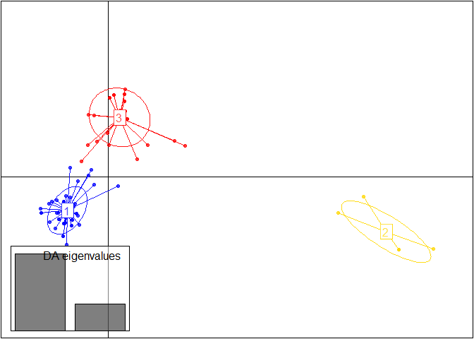
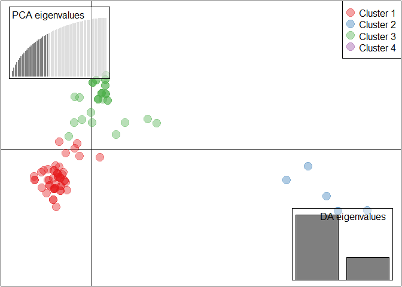
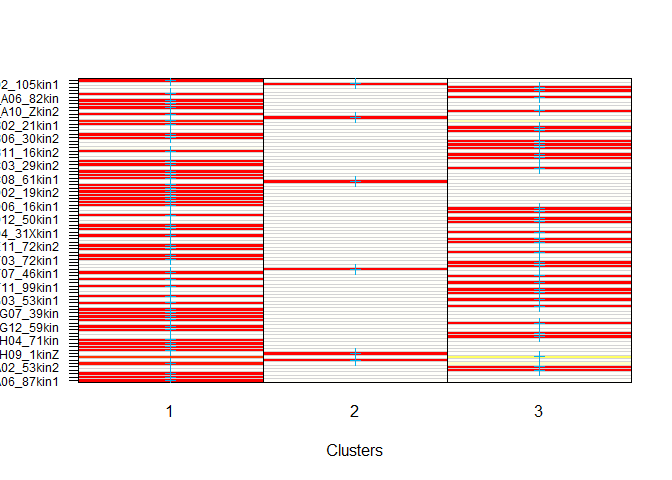
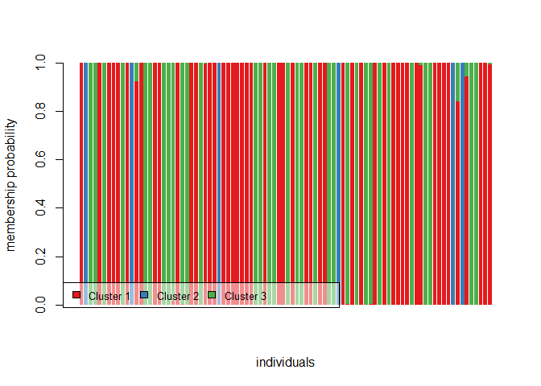
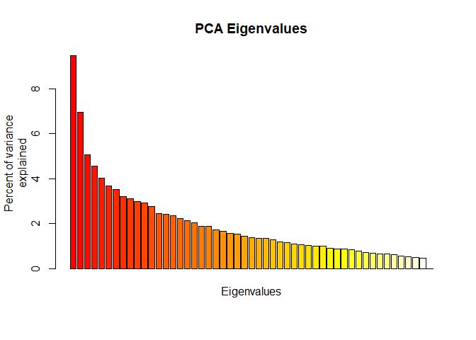
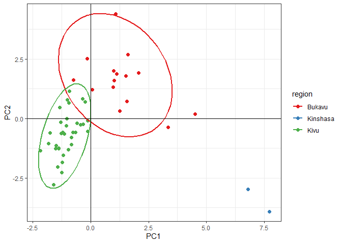
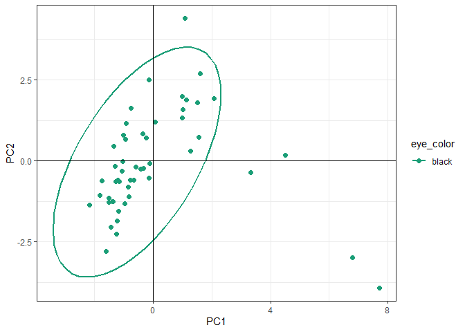
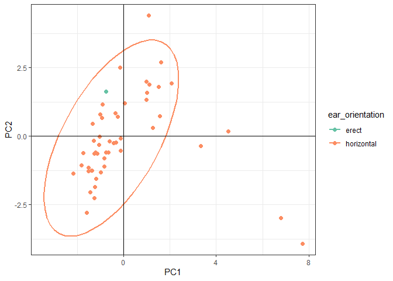

Arusha advanced R exmaples; Working with SNP data
================
Bernice Waweru
6/9/2021

Upload the data,

``` r
setwd("C:/Users/BWaweru/OneDrive - CGIAR/Documents/BecA-ILRI/Arusha_training_June_2021/Training_material/Day_3_Wednesday/")


require(adegenet)
```

    ## Loading required package: adegenet

    ## Warning: package 'adegenet' was built under R version 4.0.4

    ## Loading required package: ade4

    ## Registered S3 method overwritten by 'spdep':
    ##   method   from
    ##   plot.mst ape

    ## 
    ##    /// adegenet 2.1.3 is loaded ////////////
    ## 
    ##    > overview: '?adegenet'
    ##    > tutorials/doc/questions: 'adegenetWeb()' 
    ##    > bug reports/feature requests: adegenetIssues()

``` r
require(pegas)
```

    ## Loading required package: pegas

    ## Warning: package 'pegas' was built under R version 4.0.5

    ## Loading required package: ape

    ## Registered S3 method overwritten by 'pegas':
    ##   method      from
    ##   print.amova ade4

    ## 
    ## Attaching package: 'pegas'

    ## The following object is masked from 'package:ape':
    ## 
    ##     mst

    ## The following object is masked from 'package:ade4':
    ## 
    ##     amova

``` r
# ===== load the data and save it as an RData object

read.PLINK("data-raw/example_geno_dat.raw", map.file = "data-raw/bin_patrick_2021_prnd_NB.map", parallel = FALSE) -> dat
```

    ## 
    ##  Reading PLINK raw format into a genlight object... 
    ## 
    ## 
    ##  Reading loci information... 
    ## 
    ##  Reading and converting genotypes... 
    ## .
    ##  Building final object... 
    ## 
    ## ...done.

Check that the loaded data is okay

``` r
# ==== summary

dat
```

    ##  /// GENLIGHT OBJECT /////////
    ## 
    ##  // 90 genotypes,  556 binary SNPs, size: 223.7 Kb
    ##  10 (0.02 %) missing data
    ## 
    ##  // Basic content
    ##    @gen: list of 90 SNPbin
    ##    @ploidy: ploidy of each individual  (range: 2-2)
    ## 
    ##  // Optional content
    ##    @ind.names:  90 individual labels
    ##    @loc.names:  556 locus labels
    ##    @chromosome: factor storing chromosomes of the SNPs
    ##    @position: integer storing positions of the SNPs
    ##    @pop: population of each individual (group size range: 1-1)
    ##    @other: a list containing: sex  phenotype  pat  mat

``` r
# ==== individual names

indNames(dat)[1:10]
```

    ##  [1] "WG6694108-DNA_A01_110kin"  "WG6694108-DNA_A02_105kin1"
    ##  [3] "WG6694108-DNA_A03_55kin"   "WG6694108-DNA_A04_50kin"  
    ##  [5] "WG6694108-DNA_A05_104kin"  "WG6694108-DNA_A06_82kin"  
    ##  [7] "WG6694108-DNA_A07_75kin1"  "WG6694108-DNA_A08_110kin1"
    ##  [9] "WG6694108-DNA_A09_77kin"   "WG6694108-DNA_A10_Zkin2"

``` r
# ===== loci names

locNames(dat)[1:10]
```

    ##  [1] "snp14099-scaffold1560-920888_G"  "snp14100-scaffold1560-986550_G" 
    ##  [3] "snp14101-scaffold1560-1032913_A" "snp2819-scaffold1082-727669_A"  
    ##  [5] "snp2817-scaffold1082-658683_A"   "snp2816-scaffold1082-615033_G"  
    ##  [7] "snp2815-scaffold1082-557554_A"   "snp2812-scaffold1082-438570_A"  
    ##  [9] "snp2810-scaffold1082-348665_G"   "snp2809-scaffold1082-312463_A"

#### Using `find.clusters`

This function first transforms the data using PCA, asking the user to
specify the number of retained PCs interactively unless the argument
`n.pca` is provided.

We use `find.clusters` to identify potential clusters within our
dataset, although as of now the true clusters are unknown. We evaluate
*k= 40* clusters, a theoretical value, with `max.n.clust = 4`

``` r
 grp <- find.clusters(dat, max.n.clust = 5) 

# ==== above command takes quite a while and  when you have a 

# ===== because this take long and requires interactively selecting the number of pcs and clusters to keep when you have large data sets

# ===== we can then load when we need to use it downstream

save(grp, file = "results/grp.RData")
```

``` r
load("results/grp.RData")
names(grp)
```

Assigned groups are stored under `grp$grp`, as per the 4 clusters we
chose to keep

``` r
load("results/grp.RData")
names(grp)
```

    ## [1] "Kstat" "stat"  "grp"   "size"

``` r
grp$grp[1:10]
```

    ##  WG6694108-DNA_A01_110kin WG6694108-DNA_A02_105kin1   WG6694108-DNA_A03_55kin 
    ##                         1                         2                         3 
    ##   WG6694108-DNA_A04_50kin  WG6694108-DNA_A05_104kin   WG6694108-DNA_A06_82kin 
    ##                         3                         1                         3 
    ##  WG6694108-DNA_A07_75kin1 WG6694108-DNA_A08_110kin1   WG6694108-DNA_A09_77kin 
    ##                         1                         1                         1 
    ##   WG6694108-DNA_A10_Zkin2 
    ##                         3 
    ## Levels: 1 2 3

#### Describing clusters using **DAPC**

[`DAPC`](https://bmcgenomdata.biomedcentral.com/articles/10.1186/1471-2156-11-94)
was pioneered by Jombart and colleagues (Jombart et al., 2010) and can
be used to infer the number of clusters of genetically related
individuals. In this multivariate statistical approach variance in the
sample is partitioned into a between-group and within- group component,
in an effort to maximize discrimination between groups. In DAPC, data is
first transformed using a principal components analysis (PCA) and
subsequently clusters are identified using discriminant analysis (DA).

In *adegenet*, it is implemented with the function `dapc`. We run it on
our data using the inferred groups stores un `grp$grp`

``` r
# ==== load the grp object
dapc1 <- dapc(dat, grp$grp)
```

The method displays the same graph of cumulated variance as in
`find.cluster`. However, unlike k-means, DAPC can benefit from not using
too many PCs. The bottom-line is therefore retaining a few PCs without
sacrificing too much information. We see very little information gained
by adding PC’s after around 30, hence we retain 25.


The method also displays a barplot of eigen-values for the discriminant
analysis asking for number of discriminant function to keep, we keep all
4.


The object dapc1 contains a lot of information:

``` r
# ===== we  can also save the object so we can call into memory whenever we need to use it

save(dapc1, file = "./results/dapc1.RData")

load("results/dapc1.RData")

dapc1
```

Essentially, the slots `ind.coord` and `grp.coord` contain the
coordinates of then individuals and of the groups used in scatter plots.
Basic scatter plots can be obtained using the function `scatterplot`:

``` r
load("results/dapc1.RData")

scatter(dapc1, posi.da = "bottomleft")
```

<!-- -->

``` r
# ===== a bit customization for a more readable plot
require(RColorBrewer)
myCol <-  brewer.pal(5, "Set1") # choose some colors

scatter(dapc1, scree.da=TRUE,scree.pca = TRUE, posi.pca = "topleft", bg="white", pch=20, cell=0, cstar=0, col=myCol, solid=.4, cex=3,clab=0, leg=TRUE, txt.leg=paste("Cluster",1:4))
```

<!-- -->

It appears that we have 3 main clusters.

We can explore this a bit further with caution. In the manual it states
*caution should be taken when interpreting group memberships of a DAPC
based on too many PCs, as there are risks of over-fitting the
discriminant functions*

We kept 30 PCs and 3 discriminant functions.

Let’s look at a summary of the dapc1 object

``` r
summary(dapc1)
```

    ## $n.dim
    ## [1] 2
    ## 
    ## $n.pop
    ## [1] 3
    ## 
    ## $assign.prop
    ## [1] 0.9888889
    ## 
    ## $assign.per.pop
    ##         1         2         3 
    ## 1.0000000 1.0000000 0.9705882 
    ## 
    ## $prior.grp.size
    ## 
    ##  1  2  3 
    ## 50  6 34 
    ## 
    ## $post.grp.size
    ## 
    ##  1  2  3 
    ## 51  6 33

Average assignment proportion, `assign.prop`, is quite high, 0.996.
Looking closely at the assignment values;

``` r
round(dapc1$posterior,3) -> assgn_values

as.data.frame(assgn_values)
```

    ##                                 1 2     3
    ## WG6694108-DNA_A01_110kin    1.000 0 0.000
    ## WG6694108-DNA_A02_105kin1   0.000 1 0.000
    ## WG6694108-DNA_A03_55kin     0.000 0 1.000
    ## WG6694108-DNA_A04_50kin     0.000 0 1.000
    ## WG6694108-DNA_A05_104kin    1.000 0 0.000
    ## WG6694108-DNA_A06_82kin     0.000 0 1.000
    ## WG6694108-DNA_A07_75kin1    1.000 0 0.000
    ## WG6694108-DNA_A08_110kin1   1.000 0 0.000
    ## WG6694108-DNA_A09_77kin     1.000 0 0.000
    ## WG6694108-DNA_A10_Zkin2     0.000 0 1.000
    ## WG6694108-DNA_A11_51kin2    1.000 0 0.000
    ## WG6694108-DNA_A12_83kin1    0.000 1 0.000
    ## WG6694108-DNA_B01_21kinX1   0.924 0 0.076
    ## WG6694108-DNA_B02_21kin1    1.000 0 0.000
    ## WG6694108-DNA_B03_78kin1    0.000 0 1.000
    ## WG6694108-DNA_B04_101kin1   0.000 0 1.000
    ## WG6694108-DNA_B05_75kinX1   1.000 0 0.000
    ## WG6694108-DNA_B06_30kin2    1.000 0 0.000
    ## WG6694108-DNA_B07_80kin2    0.000 0 1.000
    ## WG6694108-DNA_B08_31kin2    0.000 0 1.000
    ## WG6694108-DNA_B09_12kin2    0.016 0 0.984
    ## WG6694108-DNA_B11_16kin2    1.000 0 0.000
    ## WG6694108-DNA_B12_4kin1     0.000 0 1.000
    ## WG6694108-DNA_C01_XYkin1    0.000 0 1.000
    ## WG6694108-DNA_C02_36kin2    1.000 0 0.000
    ## WG6694108-DNA_C03_29kin2    1.000 0 0.000
    ## WG6694108-DNA_C04_52kin1    0.000 0 1.000
    ## WG6694108-DNA_C05_58kin     0.998 0 0.002
    ## WG6694108-DNA_C06_9kin2     1.000 0 0.000
    ## WG6694108-DNA_C08_61kin1    1.000 0 0.000
    ## WG6694108-DNA_C10_33kin1    0.000 1 0.000
    ## WG6694108-DNA_C12_63kin1    1.000 0 0.000
    ## WG6694108-DNA_D01_104kin2   1.000 0 0.000
    ## WG6694108-DNA_D02_19kin2    1.000 0 0.000
    ## WG6694108-DNA_D03_13kin25-1 1.000 0 0.000
    ## WG6694108-DNA_D04_41kin1    1.000 0 0.000
    ## WG6694108-DNA_D05_30kinX1   1.000 0 0.000
    ## WG6694108-DNA_D06_16kin1    1.000 0 0.000
    ## WG6694108-DNA_D07_ZkinX1    0.000 0 1.000
    ## WG6694108-DNA_D08_50kinZ    0.000 0 1.000
    ## WG6694108-DNA_D09_75kin     1.000 0 0.000
    ## WG6694108-DNA_D12_50kin1    0.000 0 1.000
    ## WG6694108-DNA_E01_81kin     0.000 0 1.000
    ## WG6694108-DNA_E02_28kin_dil 1.000 0 0.000
    ## WG6694108-DNA_E03_110kin2   1.000 0 0.000
    ## WG6694108-DNA_E04_31Xkin1   0.000 0 1.000
    ## WG6694108-DNA_E06_25kin1    1.000 0 0.000
    ## WG6694108-DNA_E07_Z-Xkin1   0.000 0 1.000
    ## WG6694108-DNA_E10_31kinX1   0.000 0 1.000
    ## WG6694108-DNA_E11_72kin2    1.000 0 0.000
    ## WG6694108-DNA_E12_37kin1    1.000 0 0.000
    ## WG6694108-DNA_F01_25kin1x   0.000 0 1.000
    ## WG6694108-DNA_F02_13kin26-1 1.000 0 0.000
    ## WG6694108-DNA_F03_72kin1    1.000 0 0.000
    ## WG6694108-DNA_F04_82kin1    0.000 0 1.000
    ## WG6694108-DNA_F05_102kin    0.000 0 1.000
    ## WG6694108-DNA_F06_1kin      0.000 1 0.000
    ## WG6694108-DNA_F07_46kin1    1.000 0 0.000
    ## WG6694108-DNA_F08_96kin1    0.001 0 0.999
    ## WG6694108-DNA_F09_21kinP    1.000 0 0.000
    ## WG6694108-DNA_F10_81kin1    0.000 0 1.000
    ## WG6694108-DNA_F11_99kin1    1.000 0 0.000
    ## WG6694108-DNA_F12_30kin1Z   0.000 0 1.000
    ## WG6694108-DNA_G01_57kin     0.001 0 0.999
    ## WG6694108-DNA_G02_51kin1    1.000 0 0.000
    ## WG6694108-DNA_G03_53kin1    0.000 0 1.000
    ## WG6694108-DNA_G04_43kin1a   1.000 0 0.000
    ## WG6694108-DNA_G05_100kin1A  0.000 0 1.000
    ## WG6694108-DNA_G06_18kin     1.000 0 0.000
    ## WG6694108-DNA_G07_39kin     1.000 0 0.000
    ## WG6694108-DNA_G08_98kin     1.000 0 0.000
    ## WG6694108-DNA_G09_106kin    1.000 0 0.000
    ## WG6694108-DNA_G11_100kin    0.000 0 1.000
    ## WG6694108-DNA_G12_59kin     1.000 0 0.000
    ## WG6694108-DNA_H01_49kinB    0.990 0 0.010
    ## WG6694108-DNA_H02_30kinZ    0.000 0 1.000
    ## WG6694108-DNA_H03_30kin     0.000 0 1.000
    ## WG6694108-DNA_H04_71kin     1.000 0 0.000
    ## WG6694108-DNA_H05_67kin     1.000 0 0.000
    ## WG6694108-DNA_H07_70kin     1.000 0 0.000
    ## WG6694108-DNA_H08_62kin     1.000 0 0.000
    ## WG6694108-DNA_H09_1kinZ     0.000 1 0.000
    ## WG6694108-DNA_H10_15kinZ    0.840 0 0.160
    ## WG6694108-DNA_H11_3kin      0.000 1 0.000
    ## WG6694108-DNA_H12_47kin     0.946 0 0.054
    ## WG6694109-DNA_A02_53kin2    0.000 0 1.000
    ## WG6694109-DNA_A03_103kin    0.000 0 1.000
    ## WG6694109-DNA_A04_48kin1    1.000 0 0.000
    ## WG6694109-DNA_A05_29kin1    1.000 0 0.000
    ## WG6694109-DNA_A06_87kin1    0.995 0 0.005

The prior group assignments (from find.clusters) and the post group
assignments (from dapc) don’t differ at all.

The slot `assign.per.pop` indicates the proportions of successful
reassignment (based on the discriminant functions) of individuals to
their original clusters. Large values indicate clear-cut clusters, while
low values suggest admixed groups.

This information can also be visualized using `assignplot`

``` r
assignplot(dapc1)
```

<!-- -->

Heat colors represent membership probabilities (red=1, white=0); blue
crosses represent the prior cluster provided to DAPC. Here DAPC
classification is consistent with the original clusters (blue crosses
are on red rectangles).

This information can also be plotted in the more common STRUCTURE-like
way using `compoplot`

``` r
require(RColorBrewer)

myCol <-  brewer.pal(3, "Set1") # choose some colors
compoplot(dapc1, posi="bottomleft", txt.leg=paste("Cluster", 1:3), lab="", xlab="individuals", col=myCol)
```

<!-- -->

## Adding relevant phenotype data to the genotype data

We have worked so far with the data without any metadata or phenotype
data. We have quite some comprehensive phenotype data available, so lets
read it into r and add it to the `genlight` object.

We see `@pop` does not have any information.

``` r
dat
```

    ##  /// GENLIGHT OBJECT /////////
    ## 
    ##  // 90 genotypes,  556 binary SNPs, size: 223.7 Kb
    ##  10 (0.02 %) missing data
    ## 
    ##  // Basic content
    ##    @gen: list of 90 SNPbin
    ##    @ploidy: ploidy of each individual  (range: 2-2)
    ## 
    ##  // Optional content
    ##    @ind.names:  90 individual labels
    ##    @loc.names:  556 locus labels
    ##    @chromosome: factor storing chromosomes of the SNPs
    ##    @position: integer storing positions of the SNPs
    ##    @pop: population of each individual (group size range: 1-1)
    ##    @other: a list containing: sex  phenotype  pat  mat

``` r
pheno <- read.csv("data-raw/pheno_dat.csv", header = T)
str(pheno)
```

    ## 'data.frame':    88 obs. of  22 variables:
    ##  $ sample                 : chr  "WG6694108-DNA_A01_110kin" "WG6694108-DNA_A02_105kin1" "WG6694108-DNA_A03_55kin" "WG6694108-DNA_A04_50kin" ...
    ##  $ region                 : chr  "Kivu" "Bukavu" "Bukavu" "Kivu" ...
    ##  $ eye_color              : chr  "black" "black" "black" "black" ...
    ##  $ beard                  : chr  "no" "no" "no" "no" ...
    ##  $ pampilles              : chr  "no" "no" "no" "no" ...
    ##  $ ear_orientation        : chr  "horizontal" "horizontal" "horizontal" "horizontal" ...
    ##  $ hair_shape             : chr  "plain" "plain" "plain" "patchy" ...
    ##  $ hair_light             : chr  "no" "yes" "no" "yes" ...
    ##  $ body_weight_kgs        : num  24 30 34 32 31 24 25 32 30 34.6 ...
    ##  $ number_of_kidding      : int  2 3 3 2 3 2 2 3 3 4 ...
    ##  $ double_kidding         : int  1 3 2 2 2 1 1 3 3 2 ...
    ##  $ triplet_kiding         : int  0 0 0 0 1 0 0 0 0 1 ...
    ##  $ number_of_wearned_kids : int  1 4 3 2 4 1 1 3 4 5 ...
    ##  $ actual_kidding         : int  2 2 2 2 3 2 2 2 2 3 ...
    ##  $ number_of_female_kids  : int  1 2 1 2 1 2 1 2 1 2 ...
    ##  $ number_of_male_kids    : int  1 0 1 0 2 0 1 0 1 1 ...
    ##  $ previous_kidding       : int  1 2 2 2 2 1 1 2 2 2 ...
    ##  $ number_of_female_kids.1: int  1 2 2 2 2 0 1 0 0 2 ...
    ##  $ number_of_male_kids.1  : int  0 0 0 0 0 1 0 2 2 0 ...
    ##  $ first_kidding          : int  0 2 1 0 2 0 0 2 2 2 ...
    ##  $ number_of_female_kids.2: int  0 2 0 0 1 0 0 1 2 2 ...
    ##  $ number_of_male_kids.2  : int  0 0 1 0 1 0 0 1 0 0 ...

``` r
levels(as.factor(pheno$region))
```

    ## [1] "Bukavu"   "Kinshasa" "Kivu"

``` r
names(pheno)[1:10] # the column(trait) names are not correctly
```

    ##  [1] "sample"            "region"            "eye_color"        
    ##  [4] "beard"             "pampilles"         "ear_orientation"  
    ##  [7] "hair_shape"        "hair_light"        "body_weight_kgs"  
    ## [10] "number_of_kidding"

Add the correct variable names if you need to

Let’s make the sample ID’s (individual names) to be the row names for
the phenotype data

``` r
rownames(pheno) <- pheno$sample
```

Now let make sure that all the individuals in the genlight object match
those we have in the pheno data.

``` r
indiv_to_keep <- intersect(indNames(dat), rownames(pheno)) #there are 248 individuals that match and we need to keep in both the genlight object and the phenotype data,

indiv_to_keep
```

    ##  [1] "WG6694108-DNA_A01_110kin"    "WG6694108-DNA_A02_105kin1"  
    ##  [3] "WG6694108-DNA_A03_55kin"     "WG6694108-DNA_A04_50kin"    
    ##  [5] "WG6694108-DNA_A05_104kin"    "WG6694108-DNA_A06_82kin"    
    ##  [7] "WG6694108-DNA_A07_75kin1"    "WG6694108-DNA_A08_110kin1"  
    ##  [9] "WG6694108-DNA_A09_77kin"     "WG6694108-DNA_A10_Zkin2"    
    ## [11] "WG6694108-DNA_A11_51kin2"    "WG6694108-DNA_A12_83kin1"   
    ## [13] "WG6694108-DNA_B01_21kinX1"   "WG6694108-DNA_B02_21kin1"   
    ## [15] "WG6694108-DNA_B03_78kin1"    "WG6694108-DNA_B04_101kin1"  
    ## [17] "WG6694108-DNA_B05_75kinX1"   "WG6694108-DNA_B06_30kin2"   
    ## [19] "WG6694108-DNA_B07_80kin2"    "WG6694108-DNA_B08_31kin2"   
    ## [21] "WG6694108-DNA_B09_12kin2"    "WG6694108-DNA_B11_16kin2"   
    ## [23] "WG6694108-DNA_B12_4kin1"     "WG6694108-DNA_C01_XYkin1"   
    ## [25] "WG6694108-DNA_C02_36kin2"    "WG6694108-DNA_C03_29kin2"   
    ## [27] "WG6694108-DNA_C04_52kin1"    "WG6694108-DNA_C05_58kin"    
    ## [29] "WG6694108-DNA_C06_9kin2"     "WG6694108-DNA_C08_61kin1"   
    ## [31] "WG6694108-DNA_C10_33kin1"    "WG6694108-DNA_C12_63kin1"   
    ## [33] "WG6694108-DNA_D01_104kin2"   "WG6694108-DNA_D02_19kin2"   
    ## [35] "WG6694108-DNA_D04_41kin1"    "WG6694108-DNA_D05_30kinX1"  
    ## [37] "WG6694108-DNA_D06_16kin1"    "WG6694108-DNA_D07_ZkinX1"   
    ## [39] "WG6694108-DNA_D08_50kinZ"    "WG6694108-DNA_D09_75kin"    
    ## [41] "WG6694108-DNA_D12_50kin1"    "WG6694108-DNA_E01_81kin"    
    ## [43] "WG6694108-DNA_E02_28kin_dil" "WG6694108-DNA_E03_110kin2"  
    ## [45] "WG6694108-DNA_E04_31Xkin1"   "WG6694108-DNA_E06_25kin1"   
    ## [47] "WG6694108-DNA_E07_Z-Xkin1"   "WG6694108-DNA_E10_31kinX1"  
    ## [49] "WG6694108-DNA_E11_72kin2"    "WG6694108-DNA_E12_37kin1"   
    ## [51] "WG6694108-DNA_F01_25kin1x"   "WG6694108-DNA_F03_72kin1"   
    ## [53] "WG6694108-DNA_F04_82kin1"    "WG6694108-DNA_F05_102kin"   
    ## [55] "WG6694108-DNA_F06_1kin"      "WG6694108-DNA_F07_46kin1"   
    ## [57] "WG6694108-DNA_F08_96kin1"    "WG6694108-DNA_F09_21kinP"   
    ## [59] "WG6694108-DNA_F10_81kin1"    "WG6694108-DNA_F11_99kin1"   
    ## [61] "WG6694108-DNA_F12_30kin1Z"   "WG6694108-DNA_G01_57kin"    
    ## [63] "WG6694108-DNA_G02_51kin1"    "WG6694108-DNA_G03_53kin1"   
    ## [65] "WG6694108-DNA_G04_43kin1a"   "WG6694108-DNA_G05_100kin1A" 
    ## [67] "WG6694108-DNA_G06_18kin"     "WG6694108-DNA_G07_39kin"    
    ## [69] "WG6694108-DNA_G08_98kin"     "WG6694108-DNA_G09_106kin"   
    ## [71] "WG6694108-DNA_G11_100kin"    "WG6694108-DNA_G12_59kin"    
    ## [73] "WG6694108-DNA_H01_49kinB"    "WG6694108-DNA_H02_30kinZ"   
    ## [75] "WG6694108-DNA_H03_30kin"     "WG6694108-DNA_H04_71kin"    
    ## [77] "WG6694108-DNA_H05_67kin"     "WG6694108-DNA_H07_70kin"    
    ## [79] "WG6694108-DNA_H08_62kin"     "WG6694108-DNA_H09_1kinZ"    
    ## [81] "WG6694108-DNA_H10_15kinZ"    "WG6694108-DNA_H11_3kin"     
    ## [83] "WG6694108-DNA_H12_47kin"     "WG6694109-DNA_A02_53kin2"   
    ## [85] "WG6694109-DNA_A03_103kin"    "WG6694109-DNA_A04_48kin1"   
    ## [87] "WG6694109-DNA_A05_29kin1"    "WG6694109-DNA_A06_87kin1"

``` r
length(indiv_to_keep) # indivduals in the genotype data and also the phenotype data
```

    ## [1] 88

The *indiv\_to\_keep* object has only individual names that match, 2 are
not in the dataframe with phenotype data. Both the phenotype object and
the phenotype data need to have matching individual names.

We correct the phenotype data;

``` r
pheno_dat <- pheno[rownames(pheno) %in% indiv_to_keep,]

str(pheno_dat)
```

    ## 'data.frame':    88 obs. of  22 variables:
    ##  $ sample                 : chr  "WG6694108-DNA_A01_110kin" "WG6694108-DNA_A02_105kin1" "WG6694108-DNA_A03_55kin" "WG6694108-DNA_A04_50kin" ...
    ##  $ region                 : chr  "Kivu" "Bukavu" "Bukavu" "Kivu" ...
    ##  $ eye_color              : chr  "black" "black" "black" "black" ...
    ##  $ beard                  : chr  "no" "no" "no" "no" ...
    ##  $ pampilles              : chr  "no" "no" "no" "no" ...
    ##  $ ear_orientation        : chr  "horizontal" "horizontal" "horizontal" "horizontal" ...
    ##  $ hair_shape             : chr  "plain" "plain" "plain" "patchy" ...
    ##  $ hair_light             : chr  "no" "yes" "no" "yes" ...
    ##  $ body_weight_kgs        : num  24 30 34 32 31 24 25 32 30 34.6 ...
    ##  $ number_of_kidding      : int  2 3 3 2 3 2 2 3 3 4 ...
    ##  $ double_kidding         : int  1 3 2 2 2 1 1 3 3 2 ...
    ##  $ triplet_kiding         : int  0 0 0 0 1 0 0 0 0 1 ...
    ##  $ number_of_wearned_kids : int  1 4 3 2 4 1 1 3 4 5 ...
    ##  $ actual_kidding         : int  2 2 2 2 3 2 2 2 2 3 ...
    ##  $ number_of_female_kids  : int  1 2 1 2 1 2 1 2 1 2 ...
    ##  $ number_of_male_kids    : int  1 0 1 0 2 0 1 0 1 1 ...
    ##  $ previous_kidding       : int  1 2 2 2 2 1 1 2 2 2 ...
    ##  $ number_of_female_kids.1: int  1 2 2 2 2 0 1 0 0 2 ...
    ##  $ number_of_male_kids.1  : int  0 0 0 0 0 1 0 2 2 0 ...
    ##  $ first_kidding          : int  0 2 1 0 2 0 0 2 2 2 ...
    ##  $ number_of_female_kids.2: int  0 2 0 0 1 0 0 1 2 2 ...
    ##  $ number_of_male_kids.2  : int  0 0 1 0 1 0 0 1 0 0 ...

Next the genotype data. In-order to remove the individuals that are
missing in the `genlight` object, we use the package `dartR`. We first
install it and also its dependencies.

``` r
install.packages("dartR", lib = "C:/R/R-4.0.3/library/")

BiocManager::install("SNPRelate", lib = "C:/R/R-4.0.3/library/")

gl.install.vanilla.dartR()
```

Let’s get the list of individuals that are not present in the phenotype
file

``` r
dif_ind <- setdiff(indNames(dat), pheno_dat$sample)

dif_ind
```

    ## [1] "WG6694108-DNA_D03_13kin25-1" "WG6694108-DNA_F02_13kin26-1"

Now use the vector with missing individuals to subset the genlight
object.

``` r
require(dartR)
dat_rev <- gl.drop.ind(dat, ind.list = dif_ind, mono.rm = TRUE, recalc = FALSE)
```

    ## Starting gl.drop.ind 
    ##   Processing a SNP dataset
    ##   Deleting individuals WG6694108-DNA_D03_13kin25-1 WG6694108-DNA_F02_13kin26-1 
    ##   Deleting monomorphic loc
    ##   Locus metrics not recalculated
    ## Completed: gl.drop.ind

``` r
dat_rev
```

    ##  /// GENLIGHT OBJECT /////////
    ## 
    ##  // 88 genotypes,  535 binary SNPs, size: 251.1 Kb
    ##  9 (0.02 %) missing data
    ## 
    ##  // Basic content
    ##    @gen: list of 88 SNPbin
    ##    @ploidy: ploidy of each individual  (range: 2-2)
    ## 
    ##  // Optional content
    ##    @ind.names:  88 individual labels
    ##    @loc.names:  535 locus labels
    ##    @chromosome: factor storing chromosomes of the SNPs
    ##    @position: integer storing positions of the SNPs
    ##    @pop: population of each individual (group size range: 1-1)
    ##    @other: a list containing: sex  phenotype  pat  mat  history  loc.metrics.flags  loc.metrics  verbose

The new `genlight` object now has **78** individuals, and *21*
monomorphic loci were removed hence we remain with **531** SNPs. Now we
can move on to generate the PCA’s. First we add the phenotype dat of the
regions to the data

``` r
pop(dat_rev) <- pheno_dat$region

dat_rev # now @pop has some information
```

    ##  /// GENLIGHT OBJECT /////////
    ## 
    ##  // 88 genotypes,  535 binary SNPs, size: 245.8 Kb
    ##  9 (0.02 %) missing data
    ## 
    ##  // Basic content
    ##    @gen: list of 88 SNPbin
    ##    @ploidy: ploidy of each individual  (range: 2-2)
    ## 
    ##  // Optional content
    ##    @ind.names:  88 individual labels
    ##    @loc.names:  535 locus labels
    ##    @chromosome: factor storing chromosomes of the SNPs
    ##    @position: integer storing positions of the SNPs
    ##    @pop: population of each individual (group size range: 3-56)
    ##    @other: a list containing: sex  phenotype  pat  mat  history  loc.metrics.flags  loc.metrics  verbose

### [Principal components analysis](http://grunwaldlab.github.io/Population_Genetics_in_R/gbs_analysis.html)

A principal components analysis (PCA) converts the observed SNP data
into a set of values of linearly uncorrelated variables called principal
components that summarize the variation between samples. We can perform
a PCA on our `genlight` object by using the `glPCA` function from the
`adegenet` package.

``` r
dat_pca <- glPca(dat_rev, nf = 5) # nf indicates the number of principal component we want to keep

#takes quite a while to run with lots of data, let save it an an R data object

save(dat_pca, file = "results/dat_pca.RData")
```

Let’s plot the eigen values to see which one explain the greatest
variation.

``` r
load("results/dat_pca.RData")

barplot(100*dat_pca$eig/sum(dat_pca$eig), col = heat.colors(50), main="PCA Eigenvalues")
title(ylab="Percent of variance\nexplained", line = 2)
title(xlab="Eigenvalues", line = 1)
```

<!-- -->

Looks like the first 2 pc’s show the greatest variance, so we can keep 3
to allow us to plot the pca scatter plot.

We use ggplot2 t plot the pca scatter plot. First we convert the data
with pca score into a data frame, then add various trait data, to color
the population.

``` r
dat_pca_scores <- as.data.frame(dat_pca$scores)

#we check that the pca score data frame has the same row names and in the same order as those in the phenotype data frame

all(rownames(dat_pca_scores) == rownames(pheno_dat)) #its FASLE, lets rearrange
```

    ## [1] FALSE

``` r
pheno_dat <- pheno_dat[rownames(dat_pca_scores),]

all(rownames(dat_pca_scores) == rownames(pheno_dat)) # now good to go
```

    ## [1] TRUE

``` r
# we add the various phenotype variable we would like to color by

dat_pca_scores$region <- pheno_dat$region
dat_pca_scores$eye_color <- pheno_dat$eye_color
dat_pca_scores$ear_orientation <- pheno_dat$ear_orientation
```

Now we use ggplot2 to plot

``` r
require(ggplot2)
require(RColorBrewer)

set.seed(9)

#cols for region
cols <- brewer.pal(n = nPop(dat_rev), name = "Set1")

p <- ggplot(dat_pca_scores, aes(x=PC1, y=PC2, colour=region)) 
p <- p + geom_point(size=2)
p <- p + stat_ellipse(level = 0.95, size = 1)
p <- p + scale_color_manual(values = cols) 
p <- p + geom_hline(yintercept = 0) 
p <- p + geom_vline(xintercept = 0) 
p <- p + theme_bw()

p
```

<!-- -->

Bukavu and Kivu is probably the best clustered, and Kinshasa has too few
individuals to form a cluster with an ellipse around it. Lets try using
another trait.

``` r
#cols for eye color
cols <- brewer.pal(n = length(unique(pheno_dat$eye_color)), name = "Dark2")

p <- ggplot(dat_pca_scores, aes(x=PC1, y=PC2, colour=eye_color)) 
p <- p + geom_point(size=2)
p <- p + stat_ellipse(level = 0.95, size = 1)
p <- p + scale_color_manual(values = cols) 
p <- p + geom_hline(yintercept = 0) 
p <- p + geom_vline(xintercept = 0) 
p <- p + theme_bw()

p
```

<!-- -->

Eye color explains no variation within the data set. Next we can try ear
orientation

``` r
#cols for ear orientation
cols <- brewer.pal(n = length(unique(pheno_dat$ear_orientation)), name = "Set2")

p <- ggplot(dat_pca_scores, aes(x=PC1, y=PC2, colour=ear_orientation)) 
p <- p + geom_point(size=2)
p <- p + stat_ellipse(level = 0.95, size = 1)
p <- p + scale_color_manual(values = cols) 
p <- p + geom_hline(yintercept = 0) 
p <- p + geom_vline(xintercept = 0) 
p <- p + theme_bw()

p
```

<!-- -->

Ear orientation also explains no variation.
