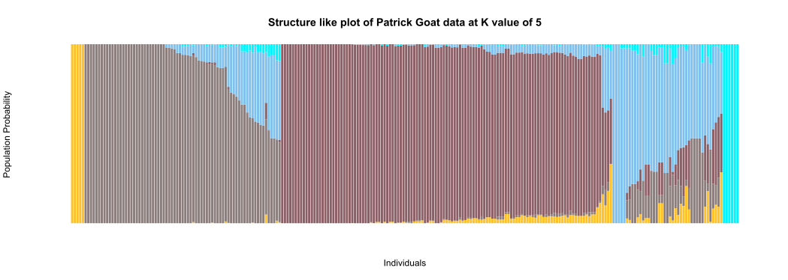
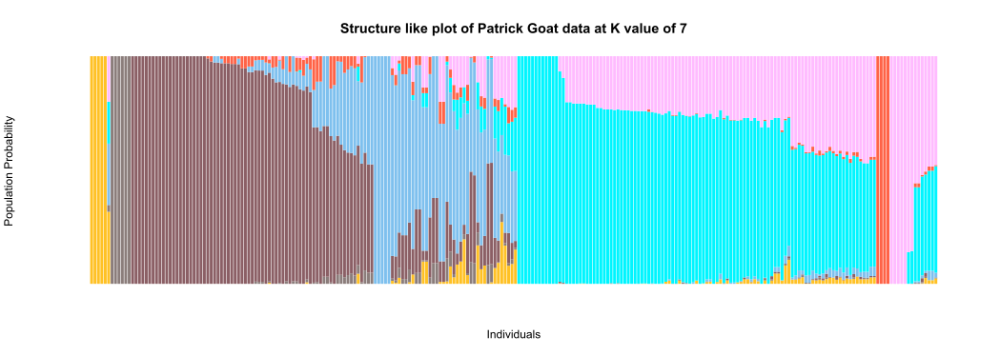

```{r, echo=FALSE}
setwd("C:/Users/BWaweru/OneDrive - CGIAR/Documents/Fellows/Goat_diversity_project_fellow/Patrick_Baenyi/RWD/2021_Work_Repo/P-Baenyi/")
```


# Admixture


[ADMIXTURE](https://vcru.wisc.edu/simonlab/bioinformatics/programs/admixture/admixture-manual.pdf) is a program for estimating ancestry in a model-based manner from large autosomal SNP genotype datasets, where the individuals are unrelated.

### Running Admixture in the cluster

We use the command line tool `admixture` to test for various values of K i.e number of underlying populations. We test for K values from 1 to 10. 
The default input data format for admixture is `.bed` files generated from plink. We use data that has already been filtered for missing data points, minimum allele frequency and pruned for linkage disequilibrium. The data is in bed format.

Further, we need to remove markers that are not assigned to chromosome, as admixture only accepts chromosome as integer numbers.We also trimmed the dataset to the final 248 individuals we have been working on in other analysis.

We run the analysis in a batch script with 15 threads to perform it faster. The script is structured as below. Within the script, we save the log file for each K that is tested, so we can be able to extract the `CV`, i.e the error value. We will need this later to plot in-order to know which is the best K value to work with.

```
#!/bin/bash
#SBATCH -p batch
#SBATCH -n 15
#SBATCH -e /home/bngina/Fellows/goat_diversity/batch_logds/admixture_pat.%N.%J.err
#SBATCH -o /home/bngina/Fellows/goat_diversity/batch_logds/admixture_pat.%N.%J.out
#SBATCH -J patrick_admixture


#======== Objective =================================================
# To run admixture with several values pf K to determine the best k value,
# i.e optimal number of populations within the data set

# ===== load tools ==================================================

module load admixture/1.3.0
module load plink/2.00-alpha

## ===== re-did the below with samples to filter for duplicate ids, hence remain with a final of 248 smaples that were used for admixture analysis


plink2 --bfile Caprin_60K_bed_fltrd_upd_chr_map \
 --keep /home/bngina/Fellows/goat_diversity/final_indiv_to_keep_248.txt \
 --out bin_patrick_248_oct_2021 \
 --chr-set 29 \
 --make-bed \
 --threads 4


# slecet only markers on numbered chromosomes, 1-29

plink2 --bfile bin_patrick_248_oct_2021 \
 --chr-set 29 \
 --allow-extra-chr \
 --chr 1-29 \
 --out bin_patrick_248_oct_2021_no_null_chr \
 --make-bed \
 --threads 4


## ===== Admixture ===========
## ===========================

# for patrick
bed=/home/bngina/Fellows/goat_diversity/plink_out_march_2021/bin_patrick_248_oct_2021_no_null_chr.bed

# output folder of the log files
mkdir -p /home/bngina/Fellows/goat_diversity/patrick_admixture_out
out=/home/bngina/Fellows/goat_diversity/patrick_admixture_out

# we need to launch the script from the director will al the binary plink files do that its able to read all of them correctly

cd /home/bngina/Fellows/goat_diversity/plink_out_march_2021/
# we use a for loop to test K values from 1 to 10

for k in $(echo {1..10..1});
 do echo ${k};
 admixture -j15 --cv ${bed} ${k} > ${out}/log_${k}.txt;
done

```

#### Plot the graph of **Cross-Validation error**(cv) values

We grep the values of the CV's and use those to plot a line graph in R


```
[bngina@hpc admixture_out]$ grep 'CV error' log_*

log_10.txt:CV error (K=10): 0.49776
log_1.txt:CV error (K=1): 0.65292
log_2.txt:CV error (K=2): 0.53520
log_3.txt:CV error (K=3): 0.52401
log_4.txt:CV error (K=4): 0.52146
log_5.txt:CV error (K=5): 0.51439
log_6.txt:CV error (K=6): 0.51926
log_7.txt:CV error (K=7): 0.50685
log_8.txt:CV error (K=8): 0.50962
log_9.txt:CV error (K=9): 0.49490

[bngina@hpc patrick_admixture_out]$ grep 'CV error' log_* > cv_errors.txt

```

We use commands `awk` and `tr` to set just what we need from the above data.

```
awk '{print $3,$4}' cv_errors.txt | tr '(' ' ' | tr ')' ' ' | tr ':' ' ' > cv_values.txt

[bngina@hpc admixture_out]$ cat cv_values.txt

 K=10   0.49776
 K=1   0.65292
 K=2   0.53520
 K=3   0.52401
 K=4   0.52146
 K=5   0.51439
 K=6   0.51926
 K=7   0.50685
 K=8   0.50962
 K=9   0.49490


```

### Evaluating Admixture Results with R


```{r cv-fig-3, fig.align='center', fig.cap='Graph of Cross-validation error values with K values from 1 to 10', fig.height=8, fig.width=12, out.width='100%'}

read.table("data-raw/cv_values.txt", header = F) -> CV_Values
str(CV_Values)
colnames(CV_Values) <- c("K_value", "CV")
CV_Values

#re-order the K from 1 to 10

as.factor(CV_Values$K_value) -> CV_Values$K_value

CV_Values$K_value <- factor(CV_Values$K_value, levels = c("K=1","K=2","K=3","K=4","K=5","K=6","K=7","K=8","K=9","K=10"))

# generate a column with cluster numbers for it to work properly with ggplot

CV_Values$cluster <- c("Cluster_10", "Cluster_1", "Cluster_2", "Cluster_3",  "Cluster_4",  "Cluster_5",  "Cluster_6",  "Cluster_7",  "Cluster_8",  "Cluster_9")

# make it a factor

as.factor(CV_Values$cluster) -> CV_Values$cluster

#re-order the cluster column

CV_Values$cluster <- factor(CV_Values$cluster, levels = c("Cluster_1", "Cluster_2",  "Cluster_3",  "Cluster_4",  "Cluster_5",  "Cluster_6",  "Cluster_7",  "Cluster_8",  "Cluster_9", "Cluster_10"))

levels(CV_Values$cluster)

#plot(CV_Values$CV, type = "o")

# in ggplot
require(ggplot2)

#try to do a line plot

cv_plot <-
  ggplot(data = CV_Values, aes(x=cluster, y=CV, group=1))+
  geom_line(linetype="dashed")+
  geom_point()+
  xlab("Value of K") + ylab("CV error")+
  theme_gray()+
  ggtitle("Graph of Cross-validation error values for K values from 1 to 10")
print(cv_plot)

```

Looks like the bend is at K=5 , hence 5 populations with possible 7 sub-populations with the second bend at K=7

We get the A values for K=5 and K=7 use to plot structure like graphs.

#### Plotting Structure diagram

```{r, prep_admix_data_-Q9, message=FALSE, warning=FALSE}

read.table("data-raw/Q_values_K5_with_names.txt", header = F, row.names = 1) -> q_5_dat
str(q_5_dat)

# set the column names to be the the number of columns

C <- ncol(q_5_dat)
R <- nrow(q_5_dat)

colnames(q_5_dat) <- c(paste("Q",1:C, sep = ""))

# assign sub-population name and initialization  the dataframes
for (j in 1:C){
assign(paste("pop",j,sep=""),data.frame())
}
  

# extract individuals for each sub-population according to the max Q 
for (i in 1:R){
D<-q_5_dat[i,]
M<-max(q_5_dat[i,])
idx<-which(D==M)
	for(k in 1:C){
		if(idx==k){
			assign(paste("pop",k,sep=""),rbind(get(paste("pop",k,sep="")),D))	
		}
	}
}


# put each sub-population in descending order
for(m in 1:C) {
NameQ<-paste("Q",m,sep="")
assign( paste("pop",m,sep=""), get(paste("pop",m,sep=""))[order(-get(paste("pop",m,sep=""))[[NameQ]]),] ) 
}

# assign a name for combined data and initialization
pop_all<-data.frame()

# combine all sub-population
for (num in 1:C){
pop_all<-rbind(pop_all,get(paste("pop",num,sep="")))
}

```

Plot;

```{r, eval=FALSE, structure-fig-2, fig.cap='Structure like plot of Patrick Goat data at K value of 5', out.width='100%', fig.height=6, fig.width=10, out.width='100%', fig.align='center'}

color = grDevices::colors()[grep('gr(a|e)y', grDevices::colors(), invert = T)] 
  
my_cols <- sample(color, 7)

barplot(t(as.matrix(pop_all)),
        width=2,col=patrick_cols,xlab="Individuals", ylab="Population Probability",
        border=NA, axes = FALSE, axisnames = F,
        las=2,cex.names=0.6, 
        main = "Structure like plot of Patrick Goat data at K value of 5")

#barplot(t(as.matrix(pop_all)),col=rainbow(C),xlab="", ylab="", border=NA, axes = FALSE, axisnames = F)

#svg(filename = "results/K-8-structure-plot.svg", width = 15, height = 10)
#barplot(t(as.matrix(pop_all)),width=2,col=rainbow(C),xlab="", ylab="", border=NA,axes = FALSE, axisnames = TRUE,las=2,cex.names=0.6)
#dev.off()
```

Repeat for Q value 7;

```{r, prep_admix_data_Q7, message=FALSE, warning=FALSE}

read.table("data-raw/Q_values_K7_with_names.txt", header = F, row.names = 1) -> q_7_dat
str(q_7_dat)

# set the column names to be the the number of columns

C <- ncol(q_7_dat)
R <- nrow(q_7_dat)

colnames(q_7_dat) <- c(paste("Q",1:C, sep = ""))

# assign sub-population name and initialization  the dataframes
for (j in 1:C){
assign(paste("pop",j,sep=""),data.frame())
}
  

# extract individuals for each sub-population according to the max Q 
for (i in 1:R){
D<-q_7_dat[i,]
M<-max(q_7_dat[i,])
idx<-which(D==M)
	for(k in 1:C){
		if(idx==k){
			assign(paste("pop",k,sep=""),rbind(get(paste("pop",k,sep="")),D))	
		}
	}
}


# put each sub-population in descending order
for(m in 1:C) {
NameQ<-paste("Q",m,sep="")
assign( paste("pop",m,sep=""), get(paste("pop",m,sep=""))[order(-get(paste("pop",m,sep=""))[[NameQ]]),] ) 
}

# assign a name for combined data and initialization
pop_all<-data.frame()

# combine all sub-population
for (num in 1:C){
pop_all<-rbind(pop_all,get(paste("pop",num,sep="")))
}

```
Our data is ready, now we can plot the structure like diagrams;

```{r, eval=FALSE, structure-fig-3, fig.cap='Structure like plot of Patrick Goat data at K value of 7', out.width='100%', fig.height=6, fig.width=10, out.width='100%', fig.align='center'}

require(RColorBrewer)

#set the colors to use

#color = grDevices::colors()[grep('gr(a|e)y', grDevices::colors(), invert = T)] 
  
#my_cols <- sample(color, 7)
  
barplot(t(as.matrix(pop_all)),
        width=2,col=patrick_cols,xlab="Individuals", ylab="Population Probability",
        border=NA, axes = FALSE, axisnames = F,
        las=2,cex.names=0.6, 
        main = "Structure like plot of Patrick Goat data at K value of 7")

#barplot(t(as.matrix(pop_all)),col=rainbow(C),xlab="", ylab="", border=NA, axes = FALSE, axisnames = F)

#svg(filename = "results/K-8-structure-plot.svg", width = 15, height = 10)
#barplot(t(as.matrix(pop_all)),width=2,col=rainbow(C),xlab="", ylab="", border=NA,axes = FALSE, axisnames = TRUE,las=2,cex.names=0.6)
#dev.off()
```





We save the colors we have used here so we can keep using them throughout for plotting

```{r, patrick-colors}
patrick_cols <- c("goldenrod1","mistyrose4","lightpink4","skyblue2","turquoise1", "tomato1","plum1")

#save the population information for individuals

#write.csv(pop_all, file = "results/pop_infor_K7_admixture.csv")
```


# Custom PCA plots

Request is to generate custom PCA plots to depict the morpho-biometric trait specifically body weight, and also reproductive traits particularly double kidding.
We use previously generated pca scores and the phenotype data.


```{r, prepare-data, warning=FALSE}

load("results/pat_pca.RData")
pheno_pat <- read.csv("results/pat_pheno_248_indiv.csv", row.names = 1, header = T)

pat_pca_scores <- as.data.frame(pat_pca$scores)

#we check that the pca score data frame has the same row names and in the same order as those in the phenotype data frame

all(rownames(pat_pca_scores) == rownames(pheno_pat)) #its FASLE, lets rearrange


pheno_dat <- pheno_pat[rownames(pat_pca_scores),]

all(rownames(pat_pca_scores) == rownames(pheno_pat)) # now good to go


# we add the various phenotype variable we would like to color by
# load the phenotype data

#pheno_pat <- read.csv("results/pat_pheno_248_indiv.csv", row.names = 1, header = T)
pat_pca_scores$region <- pheno_pat$region

pat_pca_scores$double_kidding <- pheno_pat$double_kidding
pat_pca_scores$double_kidding <- as.factor(pat_pca_scores$double_kidding)

pat_pca_scores$body_weight <- pheno_pat$body_weight_grps
pat_pca_scores$body_weight <- as.factor(pat_pca_scores$body_weight)

```


### Reproductive trait; **double-kidding**

```{r, double-kidding, fig.height=6, fig.width=10}
require(ggplot2)
require(RColorBrewer)

set.seed(9)

safe_colorblind_palette <- c("#88CCEE", "#CC6677", "#DDCC77", "#117733", "#332288", "#AA4499", 
                             "#44AA99", "#999933", "#882255", "#661100", "#6699CC", "#888888")

p <- ggplot(pat_pca_scores, aes(x=PC1, y=PC2, colour=double_kidding)) 
p <- p + geom_point(aes(shape=region))
#p <- p + stat_ellipse(level = 0.95, size = 1)
p <- p + scale_color_manual(values = safe_colorblind_palette) 
p <- p + geom_hline(yintercept = 0) 
p <- p + geom_vline(xintercept = 0) 
p <- p + theme_bw()+
  theme(plot.title = element_text(hjust = 0.5))
p <- p + ggtitle("PCA of Patrick Goat Diversity data, \nRegions depicted by different shapes and double kidding depicted by color")


p
```


### Morpho-biometric trait; **body-weight in kgs**

```{r, body-weight, fig.height=6, fig.width=10}

set.seed(9)

patrick_cols <- c("goldenrod1","lightpink4","skyblue2","turquoise1", "tomato1","plum1")

p <- ggplot(pat_pca_scores, aes(x=PC1, y=PC2, colour=body_weight)) 
p <- p + geom_point(aes(shape=region))
#p <- p + stat_ellipse(level = 0.95, size = 1)
p <- p + scale_color_manual(values = patrick_cols) 
p <- p + geom_hline(yintercept = 0) 
p <- p + geom_vline(xintercept = 0) 
p <- p + theme_bw()+
  theme(plot.title = element_text(hjust = 0.5))
p <- p + ggtitle("PCA of Patrick Goat Diversity data, \nRegions depicted by different shapes and body weight ranges depicted by color")


p
```


# Population Differentiation using various F Statistics

We use the package [StaMPP](https://pubmed.ncbi.nlm.nih.gov/23738873/), *a statistical tool for the calculation of genetic differentiation and structure in population at/with various ploidy levels*. It works on `genlight` objects directly hence np need for further manipulation of the data once its already prepared in the correct format.


```{r, fst-analysis, warning=FALSE, message=FALSE, eval=FALSE}

#install.packages("StAMPP", lib = "C:/R/R-4.0.3/library/")


remove.packages("StAMPP", lib = "C:/R/R-4.0.3/library/")

require(StAMPP)

pwfst <- StAMPP::stamppFst(pat_dat_rev[1:50], nboots=1, percent=95, nclusters=1)
round(pwfst, 3)

# now for the whole population

pwfst_a <- StAMPP::stamppFst(pat_dat_rev[1:nInd(pat_dat_rev)], nboots=1, percent=95, nclusters=1)

# gives an error, i think because of the one sample that does not have a pop assigned.
# We drop it then re-do the analysis

require(dplyr)
require(magrittr)
require(dartR)

pheno_pat[217,] %>% select(sample)

pat_dat_rev_247 <- gl.drop.ind(pat_dat_rev, ind.list = "WG6694110-DNA_F01_34m1", mono.rm = TRUE, recalc = FALSE)

# and noW redoing the fst

pwfst_247 <- StAMPP::stamppFst(pat_dat_rev_247, nboots=1, percent=95, nclusters=4)

round(pwfst_247, 3)


# a bit more manipulation for the data inout to be correct
# solution from the page (https://www.biostars.org/p/309019/)

### convert genlight object to a matrix in stampp format 
x2 <- as.matrix(pat_dat_rev_247) #convert genlight object to matrix 
sample <- row.names(x2) #sample names 

pop.names <- pop(pat_dat_rev_247) #extract ploidy info from genlight object (however this is not available when imported via a vcf file) 
#pop.names <- #provide a vector here of the same length of the number of samples, with a corresponding population name/id
#pop.names <- c(")
#e.g. c("popA", "popA", "popB", "popB", "popB", "popC", "popC") 

ploidy <- ploidy(pat_dat_rev_247) #extract ploidy info from genlight object 
x2 = x2 * (1/ploidy) #convert allele counts to frequency 
x2[is.na(x2)] = NaN 
format <- vector(length = length(sample))
#format id for the genotype data
format[1:length(format)] = "freq"  

x.stampp <- as.data.frame(cbind(sample, pop.names, ploidy, format, x2)) #convert to basic r data.frame suitable to stamppConvert 

geno <- StAMPP::stamppConvert(x.stampp, "r") 
geno <- StAMPP::stamppConvert(pat_dat_rev_247, "genlight") 

#you should now be able to run all the stampp commands with 'geno' as the input object 
# e.g. fst <- stamppFst(geno)

# it appear we can actually do the fst directly with dartR

fst_247 <- gl.fst.pop(pat_dat_rev_247, nboots=1, percent=95, nclusters=4)
```

Let's instead try to convert the 'genlight' object to 'genind' object and use `poppr` to do the Fst analysis. 

```{r, Fst, message=FALSE, warning=FALSE}
require(poppr)
require(dartR)
library("adegenet")
library("pegas")
library("mmod")
library("poppr")

load("results/pat_genlight_with_pop.RData")

pat_dat_rev_247 <- gl.drop.ind(pat_dat_rev, ind.list = "WG6694110-DNA_F01_34m1", mono.rm = TRUE, recalc = FALSE)

gl2gi(pat_dat_rev_247) -> pat_dat_247_genind

pat_dat_247_genind # that worked, now we do the population differentiation


#mmod::diff_stats(pat_dat_247_genind) -> overall_Fst # this function calculates overall Nei's Gst, Hedrick's Gst and  of the dataset


#Phi_st_Meirmans(pat_dat_247_genind) -> analog_overall_Fst # this function calculates overall PhiST, the Fst analog for DNA sequence data

#it takes quite a while to run so we sva it as an Rdata object
#pairwise_Gst_Nei(pat_dat_247_genind, linearized = FALSE) -> Neis_pairwise_Fst # Calculates pairwise Gst. If linearized = TRUE, it calculates 1/(1- Gst) 

#save(Neis_pairwise_Fst, file = "results/neis_pairwise_fst.Rdata")
load("results/neis_pairwise_fst.Rdata")
Neis_pairwise_Fst


#pairwise_Gst_Hedrick(pat_dat_247_genind, linearized = FALSE) -> hedrick_pairwise_Fst # Calculates pairwise Gst. If linearized = TRUE, it calculates 1/(1- Gs

#install.packages("hierfstat", lib = "C:/R/R-4.0.3/library/")
```

