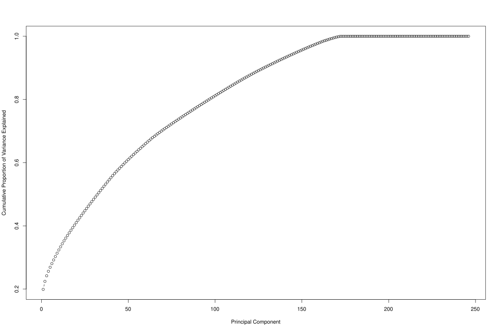

Impute Markers with rrBLUP, GWAS with GWASpoly
================
Bernice Waweru
September 08, 2021

-   [Objective](#objective)
-   [Genome wide Association Scan with GWASpoly
    Package](#genome-wide-association-scan-with-gwaspoly-package)
-   [Session Information](#session-information)

# Objective

Here we want to impute missing marker calls from our genotype data.
After that we will use that data to scan for markers significantly
associated with traits under study.

To use the genotype data, we need the SNPs in rows and individuals in
columns. Our current data is the opposite. So we first read it into R
and transpose it to the correct format. We change the extension of the
`plink.raw` file to a `.txt`. We also replace the `spaces` used as
delimeters with a `tab` `(sed 's/ /\t/g' plink.raw > tab.txt)` then read
it into R with the `read.table` function. This takes quite a while, so
after its read we save it into an `.RData` object if we ever have to
load it into R again.

``` r
#read.table("data-raw/pat_plink_raw.txt", header = T) -> plink_raw_dat

#save(plink_raw_dat, file = "results/pat_plink_raw_dat.RData")

load("results/pat_plink_raw_dat.RData")

head(plink_raw_dat)[1:10]
```

    ##   FID                       IID PAT MAT SEX PHENOTYPE
    ## 1   1  WG6694108-DNA_A01_110kin   0   0   0        -9
    ## 2   2 WG6694108-DNA_A02_105kin1   0   0   0        -9
    ## 3   3   WG6694108-DNA_A03_55kin   0   0   0        -9
    ## 4   4   WG6694108-DNA_A04_50kin   0   0   0        -9
    ## 5   5  WG6694108-DNA_A05_104kin   0   0   0        -9
    ## 6   6   WG6694108-DNA_A06_82kin   0   0   0        -9
    ##   snp14099.scaffold1560.920888_G snp14100.scaffold1560.986550_G
    ## 1                              0                              0
    ## 2                              0                              0
    ## 3                              0                              0
    ## 4                              0                              0
    ## 5                              0                              0
    ## 6                              0                              0
    ##   snp14101.scaffold1560.1032913_A snp2819.scaffold1082.727669_A
    ## 1                               1                             1
    ## 2                               1                             1
    ## 3                               1                             0
    ## 4                               1                             1
    ## 5                               0                             0
    ## 6                               0                             0

``` r
head(names(plink_raw_dat), n=10)
```

    ##  [1] "FID"                             "IID"                            
    ##  [3] "PAT"                             "MAT"                            
    ##  [5] "SEX"                             "PHENOTYPE"                      
    ##  [7] "snp14099.scaffold1560.920888_G"  "snp14100.scaffold1560.986550_G" 
    ##  [9] "snp14101.scaffold1560.1032913_A" "snp2819.scaffold1082.727669_A"

``` r
# first, we have columns with NA values, lets remove those.

plink_raw_dat1 <- plink_raw_dat[,c(2,7:ncol(plink_raw_dat))]

head(names(plink_raw_dat1)) #okay that looks good, now we transpose
```

    ## [1] "IID"                             "snp14099.scaffold1560.920888_G" 
    ## [3] "snp14100.scaffold1560.986550_G"  "snp14101.scaffold1560.1032913_A"
    ## [5] "snp2819.scaffold1082.727669_A"   "snp2817.scaffold1082.658683_A"

``` r
hap_pat <- base::t(plink_raw_dat1)

dim(hap_pat)
```

    ## [1] 44100   259

``` r
#get the individual names to be the column names

colnames(hap_pat) <- hap_pat[1,]

hap_pat <- as.data.frame(hap_pat[-1,]) #remove that first row names IID

require(magrittr)

#head(hap_pat, n=10)[1:10,1:10] #looks good, but the snp names which are the row names have alleles in them, we need the snp names to match for the geno and map file

stringr::str_split(as.character(rownames(hap_pat)), "_") %>% as.data.frame() -> snp_names #split the snp names based on the "_" character

 #its now saved as a data frame with two rows, the first has the snp names we need

as.character(snp_names[1, ]) -> snp_names #get just the first row with the snp anmes we need

hap_pat$snp <- snp_names # add a column to the hap data that has the correct snp names

# names(hap_pat)

hap_pat <- hap_pat[,c(260,1:259)] #rearrange to have the snp names as the first column
```

Next we need to make sure that the snps in our hap format are the same
in the map file with the chromosome and position information. We load
that into R and make sure

``` r
read.table("data-raw/bin_patrick_2021_prnd_NB.map", header = F) -> map_pat

dim(map_pat) #get the dimensions of data
```

    ## [1] 44099     4

``` r
head(map_pat, n=10) #sneek peak of the data
```

    ##    V1                            V2 V3     V4
    ## 1   1  snp14099-scaffold1560-920888  0  47271
    ## 2   1  snp14100-scaffold1560-986550  0 113316
    ## 3   1 snp14101-scaffold1560-1032913  0 159328
    ## 4   1   snp2819-scaffold1082-727669  0 212193
    ## 5   1   snp2817-scaffold1082-658683  0 281100
    ## 6   1   snp2816-scaffold1082-615033  0 324817
    ## 7   1   snp2815-scaffold1082-557554  0 382409
    ## 8   1   snp2812-scaffold1082-438570  0 496137
    ## 9   1   snp2810-scaffold1082-348665  0 586692
    ## 10  1   snp2809-scaffold1082-312463  0 623097

``` r
map_pat$V3 <- NULL #remove the third column that codes for NO information at all
colnames(map_pat) <- c("chrom", "snp", "pos")
map_pat <- map_pat[,c(2,1,3)] #rearrange to have snp as first column
head(map_pat, n=10)
```

    ##                              snp chrom    pos
    ## 1   snp14099-scaffold1560-920888     1  47271
    ## 2   snp14100-scaffold1560-986550     1 113316
    ## 3  snp14101-scaffold1560-1032913     1 159328
    ## 4    snp2819-scaffold1082-727669     1 212193
    ## 5    snp2817-scaffold1082-658683     1 281100
    ## 6    snp2816-scaffold1082-615033     1 324817
    ## 7    snp2815-scaffold1082-557554     1 382409
    ## 8    snp2812-scaffold1082-438570     1 496137
    ## 9    snp2810-scaffold1082-348665     1 586692
    ## 10   snp2809-scaffold1082-312463     1 623097

Now lets match it to the genotype data we have;

``` r
#match(hap_pat$snp, map_pat$snp) 
#doesn't work because in the hap file the snp names the hyphens(-) were replaced by dots. lets see if we can change the ones in the map file to match.

require(stringr)

map_pat$snp <- (str_replace_all(map_pat$snp, "-","."))
head(map_pat, n=10) #okay all hyphens replaced with a ., lets try match again
```

    ##                              snp chrom    pos
    ## 1   snp14099.scaffold1560.920888     1  47271
    ## 2   snp14100.scaffold1560.986550     1 113316
    ## 3  snp14101.scaffold1560.1032913     1 159328
    ## 4    snp2819.scaffold1082.727669     1 212193
    ## 5    snp2817.scaffold1082.658683     1 281100
    ## 6    snp2816.scaffold1082.615033     1 324817
    ## 7    snp2815.scaffold1082.557554     1 382409
    ## 8    snp2812.scaffold1082.438570     1 496137
    ## 9    snp2810.scaffold1082.348665     1 586692
    ## 10   snp2809.scaffold1082.312463     1 623097

``` r
map_pat <- map_pat[map_pat$snp %in% hap_pat$snp,] #make sure all snps in the map are in the hap files

all(map_pat$snp == hap_pat$snp) #this is true, they are all there and in the same order.
```

    ## [1] TRUE

``` r
dim(hap_pat)
```

    ## [1] 44099   260

Now we need to choose individuals that have phenotype data and only keep
those.

``` r
read.csv("data-raw/patrick_pheno_final.csv", header = T) -> pheno
str(pheno) 
```

    ## 'data.frame':    258 obs. of  22 variables:
    ##  $ ï..sample              : chr  "WG6694108-DNA_A04_50kin" "WG6694108-DNA_A07_75kin1" "WG6694108-DNA_A11_51kin2" "WG6694108-DNA_B08_31kin2" ...
    ##  $ region                 : chr  "Kinshasa" "Kinshasa" "Kinshasa" "Kinshasa" ...
    ##  $ eye_color              : chr  "black" "black" "black" "black" ...
    ##  $ beard                  : chr  "no" "yes" "yes" "no" ...
    ##  $ pampilles              : chr  "no" "no" "no" "yes" ...
    ##  $ ear_orientation        : chr  "horizontal" "horizontal" "horizontal" "horizontal" ...
    ##  $ hair_shape             : chr  "patchy" "patchy" "patchy" "patchy" ...
    ##  $ hair_light             : chr  "yes" "no" "no" "no" ...
    ##  $ body_weight_kgs        : num  32 25 25.5 27 23.5 27 27.5 33 31 36 ...
    ##  $ number_of_kidding      : int  2 2 1 1 3 1 1 3 1 4 ...
    ##  $ double_kidding         : int  2 1 0 0 2 0 1 1 0 2 ...
    ##  $ triplet_kiding         : int  0 0 0 0 1 0 0 0 0 0 ...
    ##  $ number_of_wearned_kids : int  2 1 0 0 3 0 0 3 0 3 ...
    ##  $ actual_kidding         : int  2 2 1 1 2 1 2 1 1 2 ...
    ##  $ number_of_female_kids  : int  2 1 0 0 0 0 2 1 1 1 ...
    ##  $ number_of_male_kids    : int  0 1 1 1 2 1 0 0 0 1 ...
    ##  $ previous_kidding       : int  2 1 0 0 1 0 0 2 0 2 ...
    ##  $ number_of_female_kids.1: int  2 1 0 0 1 0 0 2 0 2 ...
    ##  $ number_of_male_kids.1  : int  0 0 0 0 0 0 0 0 0 0 ...
    ##  $ first_kidding          : int  0 0 0 0 2 0 0 1 0 1 ...
    ##  $ number_of_female_kids.2: int  0 0 0 0 1 0 0 1 0 1 ...
    ##  $ number_of_male_kids.2  : int  0 0 0 0 1 0 0 0 0 0 ...

``` r
# lets fix the column names

colnames(pheno) <- c("sample","region","eye_color","beard","pampilles","ear_orientation","hair_shape","hair_light","body_weight_kgs","number_of_kidding","double_kidding", "triplet_kiding","number_of_wearned_kids","actual_kidding","number_of_female_kids","number_of_male_kids","previous_kidding","number_of_female_kids.1","number_of_male_kids.1","first_kidding","number_of_female_kids.2","number_of_male_kids.2")
str(pheno)
```

    ## 'data.frame':    258 obs. of  22 variables:
    ##  $ sample                 : chr  "WG6694108-DNA_A04_50kin" "WG6694108-DNA_A07_75kin1" "WG6694108-DNA_A11_51kin2" "WG6694108-DNA_B08_31kin2" ...
    ##  $ region                 : chr  "Kinshasa" "Kinshasa" "Kinshasa" "Kinshasa" ...
    ##  $ eye_color              : chr  "black" "black" "black" "black" ...
    ##  $ beard                  : chr  "no" "yes" "yes" "no" ...
    ##  $ pampilles              : chr  "no" "no" "no" "yes" ...
    ##  $ ear_orientation        : chr  "horizontal" "horizontal" "horizontal" "horizontal" ...
    ##  $ hair_shape             : chr  "patchy" "patchy" "patchy" "patchy" ...
    ##  $ hair_light             : chr  "yes" "no" "no" "no" ...
    ##  $ body_weight_kgs        : num  32 25 25.5 27 23.5 27 27.5 33 31 36 ...
    ##  $ number_of_kidding      : int  2 2 1 1 3 1 1 3 1 4 ...
    ##  $ double_kidding         : int  2 1 0 0 2 0 1 1 0 2 ...
    ##  $ triplet_kiding         : int  0 0 0 0 1 0 0 0 0 0 ...
    ##  $ number_of_wearned_kids : int  2 1 0 0 3 0 0 3 0 3 ...
    ##  $ actual_kidding         : int  2 2 1 1 2 1 2 1 1 2 ...
    ##  $ number_of_female_kids  : int  2 1 0 0 0 0 2 1 1 1 ...
    ##  $ number_of_male_kids    : int  0 1 1 1 2 1 0 0 0 1 ...
    ##  $ previous_kidding       : int  2 1 0 0 1 0 0 2 0 2 ...
    ##  $ number_of_female_kids.1: int  2 1 0 0 1 0 0 2 0 2 ...
    ##  $ number_of_male_kids.1  : int  0 0 0 0 0 0 0 0 0 0 ...
    ##  $ first_kidding          : int  0 0 0 0 2 0 0 1 0 1 ...
    ##  $ number_of_female_kids.2: int  0 0 0 0 1 0 0 1 0 1 ...
    ##  $ number_of_male_kids.2  : int  0 0 0 0 1 0 0 0 0 0 ...

``` r
#get the phenotypes with genotypes

pheno <- pheno[pheno$sample %in% colnames(hap_pat[,2:ncol(hap_pat)]), ] # has 253 individuals, i rem we had duplicates, lets remove them

pheno <- pheno[!duplicated(pheno$sample),] # great now have 248 individuals

# now we set the row names of the phenotype data frame to be the sample IDs

rownames(pheno) <- pheno$sample # set smaple names as the row names

#now we match the individuals in the hap to those in the pheno

#get genotypes that have phenotypes
individuals <- intersect(colnames(hap_pat[,2:ncol(hap_pat)]), pheno$sample) #get individuals to select
snps <- "snp" #get columns of information
hap <- hap_pat[,c(snps, individuals)] #remove individuals from hap that do not have phenotype data
rownames(hap) <- hap$snp
dim(hap)
```

    ## [1] 44099   249

``` r
#save the files

#save(hap, file = "results/pat_hap_GWAS.RData")
#save(phen, file = "results/pat_pheno_GWAS.RData")
#save(map_pat, file = "results/pat_map_GWAS.RData")
#load("results/pat_hap_GWAS.RData")
#load("results/pat_map_GWAS.RData")
```

Great now we have the same number of individuals in the genotype and
phenotype file. We have saved them so that we can easily load them for
use next time.

``` r
#set row names for the map file to be the snp names

rownames(map_pat) <- map_pat$snp

# marker calls need to go into the matrix as numerics not characters, lets fix that with a for loop

pat_mat <- t(hap[,2:ncol(hap)])

#convert to data frame to allow manipulation
as.data.frame(pat_mat)-> pat_mat

#str(pat_mat)

# there are 44,099 column of markers, we loop over all converting each to a numeric vector and reassigning it back to the data frame
ncol(pat_mat)
```

    ## [1] 44099

``` r
tail(names(pat_mat))
```

    ## [1] "snp22874.scaffold228.4136556" "snp13705.scaffold153.920524" 
    ## [3] "snp13704.scaffold153.858710"  "snp13703.scaffold153.815599" 
    ## [5] "snp13702.scaffold153.752162"  "snp13701.scaffold153.718540"

``` r
for (i in 1:44099) {
 as.numeric(pat_mat[,i]) -> pat_mat[,i]
  
}

#check that all columns are now numeric
#str(pat_mat)

#convert to matrix to be used for the relationship matrix calculation
#check dimensions should be 248 X 248 (number of individuals)

geno <- t(map_pat)
markers <- geno[,c(1, 3, 4, 18:ncol(geno))] #get markers for GWAS.  Markers enter this formula as rows and individuals as columns
```

We also need to combine the dataframe with marker and chromosome
information with the genotype calls information. Both have row names set
to the snp names, so we can combine the data frames based on the column
names

``` r
rownames(hap_pat) <- hap_pat$snp

merge(hap, map_pat, by = 0) -> markers_gwas_pat


#colnames(markers_gwas_pat)

#rearrange

markers_gwas_pat <- markers_gwas_pat[,c(2,252,253,3:250)]

rownames(markers_gwas_pat) <- markers_gwas_pat$snp.x


#colnames(markers_gwas_pat)

colnames(markers_gwas_pat)[1] <- "snp" # change snp column names from snp.x to snp

# covert marker calls to numeric calls

ncol(markers_gwas_pat)
```

    ## [1] 251

``` r
for (i in 4:251) {
 as.numeric(markers_gwas_pat[,i]) -> markers_gwas_pat[,i]

}

#str(markers_gwas_pat) # now okay
```

Now we impute the calls for the missing markers using the mean for each
marker per individuals, i.e mean of the marker call across the rows.
That is why snps enter the marker matrix used here as rows and the
individuals as columns.

``` r
install.packages("factoextra", lib= "C:/R/R-4.0.3/library/")
install.packages("rstatix", lib= "C:/R/R-4.0.3/library/")
require(ggsignif)
require(factoextra)
#Population Structure

#first must impute missing data (use mean imputation)
imputed_markers_pat <- A.mat(markers_gwas_pat[, 4:ncol(markers_gwas_pat)], impute.method = 'mean', min.MAF = 0.05, return.imputed = TRUE )$imputed
```

With above we get the below error

> Error: cannot allocate vector of size 82.8 Mb ===== this is the error
> we get,

Hence we impute this on the cluster to get the matrix of imputed
markers. After which we run the below scripts with the imputed markers,
and process the final output.

``` r
geno_pca <- prcomp(t(imputed_markers), scale. = TRUE) #enter markers in PCA as rows of individuals, columns of markers
fviz_eig(geno_pca) #scree plot with factoextra

##Evaluate number of PC to choose look at variance explained by each PC

std_dev <- geno_pca$sdev #extract standard deviation of each pC

#compute variance
pr_var <- std_dev^2 #compute variance std*std
prop_varex <- pr_var/sum(pr_var) #proportion of variance explained

plot(cumsum(prop_varex), xlab = "Principal Component",
              ylab = "Cumulative Proportion of Variance Explained",
              type = "b")

plot(cumsum(prop_varex[1:10]), xlab = "Principal Component",
              ylab = "Cumulative Proportion of Variance Explained",
              type = "b")

screeplot(geno_pca, npcs = 100, type = 'line') #screeplot of all PC

#Factors often choose by percent of variance explained, top X factors.  Somewhat arbitrary, but it looks like the top 3 should be a good starting point
```

From above evaluation, below are the plots generated.

``` r

```


``` r

```


After the marker imputation, two individuals were dropped from the
matrix. We cleaned the data to remove the individuals without genotype
data. We also removed the two individuals from the phenotype data.

``` r
#check markers and phenotypes are in order
all(colnames(imputed_markers_pat) == rownames(gmat)) # not equal one is longer lets check

dim(gmat)

dim(imputed_markers_pat) #has only 246 individuals looks like two individuals dint make it to have markers imputed.

#first we subset from gmat the correct rows

gmat_246<- gmat[rownames(gmat) %in% colnames(imputed_markers_pat), ]

dim(gmat_246)

#then check the columns of individuals not present and remove them

setdiff(colnames(gmat), colnames(imputed_markers_pat))
colnames(gmat_246)

gmat_f<- gmat_246[,-c(200,222)]
dim(gmat_f)

# now we check again
all(colnames(imputed_markers_pat[,c(4:249)]) == rownames(gmat_f))
all(rownames(imputed_markers_pat) == colnames(gmat_f))

all(rownames(gmat_f) == phen$sample) #need to order phenotype file

# again we have to remove the genotypes w dropped also from the phenotype data
phen_f <- phen[phen$sample %in% colnames(imputed_markers_pat[,c(4:249)]),]

phen_f <- phen_f[match(rownames(gmat_f), phen_f$sample), ]

all(colnames(imputed_markers_pat[,c(4:249)]) == phen_f$sample) #now they match


#add map info to imputed_markers
imputed_markers_pat <- cbind(map_pat, imputed_markers_pat)
```

Running GWAS with `rrBLUP` kept giving us errors. Fortunately, the
developers have developed an updated package specifically for genome
wide association studies named `GWASpoly`

# Genome wide Association Scan with [GWASpoly Package](https://github.com/jendelman/GWASpoly)

The `GWASpoly` package is a successor of the `rrBLUP` package and
innately calls `rrBLUP` to run its functions. It is has great functions
for running genome wide scan of significant markers and test for
significant thresholds for false discovery rates, plotting qq plots and
manhattan plots.

We prepared the genotype data with the package `rrBLUP` and used the
`A.mat` function to impute missing markers. Then opened in excel and
formatted the genotype calls as numbers and kept only two decimal places
for the imputed scores. This got rid of the error about ploidy levels
while importing the data into GWASpoly.

The package reads in the phenotype and genotype data in one function
`read.GWASpoly`.

``` r
library(GWASpoly)

getwd()
```

    ## [1] "C:/Users/BWaweru/OneDrive - CGIAR/Documents/Fellows/Goat_diversity_project_fellow/Patrick_Baenyi/RWD/2021_Work_Repo/P-Baenyi"

``` r
# the package reads in the phenotype and genotype data in one function `read.GWASpoly`
data <- read.GWASpoly(ploidy = 2, 
                      pheno.file = "C:/Users/BWaweru/OneDrive - CGIAR/Documents/Fellows/Goat_diversity_project_fellow/Patrick_Baenyi/RWD/2021_Work_Repo/P-Baenyi/data-raw/pat_pheno_no_region.csv", 
                      geno.file = "C:/Users/BWaweru/OneDrive - CGIAR/Documents/Fellows/Goat_diversity_project_fellow/Patrick_Baenyi/RWD/2021_Work_Repo/P-Baenyi/data-raw/imputed_markers_with_snp_info.csv", 
                      format = "numeric", 
                      n.traits = 14,
                      delim = ",")
```

    ## Number of polymorphic markers: 44061 
    ## N = 246 individuals with phenotypic and genotypic information 
    ## Detected following fixed effects:
    ## eye_color
    ## beard
    ## pampilles
    ## ear_orientation
    ## hair_shape
    ## hair_light
    ## Detected following traits:
    ## body_weight_kgs
    ## number_of_kidding
    ## double_kidding
    ## triplet_kiding
    ## number_of_wearned_kids
    ## actual_kidding
    ## number_of_female_kids
    ## number_of_male_kids
    ## previous_kidding
    ## number_of_female_kids.1
    ## number_of_male_kids.1
    ## first_kidding
    ## number_of_female_kids.2
    ## number_of_male_kids.2

``` r
## Population structure

data.loco <- set.K(data, LOCO = T)

#set parameters for number of principal components and minimum allele frequency to use

params <- set.params(n.PC = 2, MAF = 0.05, )
print(params)
```

    ## $fixed
    ## NULL
    ## 
    ## $fixed.type
    ## NULL
    ## 
    ## $n.PC
    ## [1] 2
    ## 
    ## $min.MAF
    ## [1] 0.05
    ## 
    ## $max.geno.freq
    ## [1] 0.999
    ## 
    ## $P3D
    ## [1] TRUE

``` r
#conduct genome wide scan for marker significance

# you can test for markers significant with additive and dominant models for the trait.

# you can give a list of traits to test for significant markers.

data.loco.scan <- GWASpoly(data = data.loco, models = "additive", traits = "body_weight_kgs", params = params)
```

    ## Analyzing trait: body_weight_kgs 
    ## P3D approach: Estimating variance components...Completed 
    ## Testing markers for model: additive

``` r
# test for significant markers for body weight with both additive and dominant models

data.loco.scan2 <- GWASpoly(data = data.loco, models = c("additive","1-dom"), traits = "body_weight_kgs", params = params)
```

    ## Analyzing trait: body_weight_kgs 
    ## P3D approach: Estimating variance components...Completed 
    ## Testing markers for model: additive 
    ## Testing markers for model: 1-dom-alt 
    ## Testing markers for model: 1-dom-ref

``` r
# test for significant markers for number_of_kidding with both additive and dominant models

data.loco.scan3 <- GWASpoly(data = data.loco, models = c("additive","1-dom"), traits = "number_of_kidding", params = params)
```

    ## Analyzing trait: number_of_kidding 
    ## P3D approach: Estimating variance components...Completed 
    ## Testing markers for model: additive 
    ## Testing markers for model: 1-dom-alt 
    ## Testing markers for model: 1-dom-ref

``` r
# plot QQ plots to check for inflation on the -log10(p) values (scores). This plots the observed vs. expected values following a uniform dotted line

library(ggplot2)

qq.plot(data.loco.scan, trait = "body_weight_kgs") + ggtitle("QQplots")
```

<!-- -->

``` r
qq.plot(data.loco.scan2, trait = "body_weight_kgs") + ggtitle("QQplot of body weight in kgs using both additive and dominant models")
```

<!-- -->

``` r
qq.plot(data.loco.scan3, trait = "number_of_kidding") + ggtitle("QQplot of number_of_kidding using both additive and dominant models")
```

<!-- -->

``` r
#set thresholds for false discovery rates, 

# first with more conservative bonferroni

data2 <- set.threshold(data.loco.scan, method = "Bonferroni", level = 0.05) #threshold set at 5.91
```

    ## Thresholds
    ##                 additive
    ## body_weight_kgs     5.91

``` r
data3 <- set.threshold(data.loco.scan2, method = "Bonferroni", level = 0.05) # 5.91
```

    ## Thresholds
    ##                 additive 1-dom-alt 1-dom-ref
    ## body_weight_kgs     5.91      5.91      5.91

``` r
data4 <- set.threshold(data.loco.scan3, method = "Bonferroni", level = 0.05) # 5.91
```

    ## Thresholds
    ##                   additive 1-dom-alt 1-dom-ref
    ## number_of_kidding     5.91      5.91      5.91

``` r
# next with GWASpoly's M.eff

data2 <- set.threshold(data.loco.scan, method = "M.eff", level = 0.05) #threshold set at 5.84
```

    ## Thresholds
    ##                 additive
    ## body_weight_kgs     5.84

``` r
data3 <- set.threshold(data.loco.scan2, method = "M.eff", level = 0.05) #threshold set at 5.83/5.84
```

    ## Thresholds
    ##                 additive 1-dom-alt 1-dom-ref
    ## body_weight_kgs     5.84      5.84      5.83

``` r
data4 <- set.threshold(data.loco.scan3, method = "M.eff", level = 0.05)
```

    ## Thresholds
    ##                   additive 1-dom-alt 1-dom-ref
    ## number_of_kidding     5.84      5.84      5.83

``` r
#plot the manhattan plot to view markers significant above the set threshold across the genome or in one chromosome of interest

p <- manhattan.plot(data2,traits="body_weight_kgs")
p + theme(axis.text.x = element_text(angle=90,vjust=0.5)) -> p
p
```

<!-- -->

``` r
p2 <- manhattan.plot(data3, traits = "body_weight_kgs")
p2 + theme(axis.text.x = element_text(angle=90,vjust=0.5)) -> p2
p2
```

<!-- -->

``` r
p3 <- manhattan.plot(data4, traits = "number_of_kidding")
p3 + theme(axis.text.x = element_text(angle=90,vjust=0.5)) -> p3
p3
```

<!-- -->

``` r
# plot for just the two chromosomes with significant markers

p4 <- manhattan.plot(data4, traits = "number_of_kidding", chrom = 24)
p4 + theme(axis.text.x = element_text(angle=90,vjust=0.5)) -> p4
p4
```

<!-- -->

``` r
p5 <- manhattan.plot(data4, traits = "number_of_kidding", chrom = 28)
p5 + theme(axis.text.x = element_text(angle=90,vjust=0.5)) -> p5
p5
```

<!-- -->

From the plots we see two markers significant for number of kidding in
Chromosome **24** and **28**.

# Session Information

``` r
sessionInfo()
```

    ## R version 4.0.3 (2020-10-10)
    ## Platform: x86_64-w64-mingw32/x64 (64-bit)
    ## Running under: Windows 10 x64 (build 18363)
    ## 
    ## Matrix products: default
    ## 
    ## locale:
    ## [1] LC_COLLATE=English_United States.1252 
    ## [2] LC_CTYPE=English_United States.1252   
    ## [3] LC_MONETARY=English_United States.1252
    ## [4] LC_NUMERIC=C                          
    ## [5] LC_TIME=English_United States.1252    
    ## 
    ## attached base packages:
    ## [1] stats     graphics  grDevices utils     datasets  methods   base     
    ## 
    ## other attached packages:
    ## [1] ggplot2_3.3.5  stringr_1.4.0  magrittr_2.0.1 GWASpoly_2.07 
    ## 
    ## loaded via a namespace (and not attached):
    ##  [1] RColorBrewer_1.1-2 highr_0.9          pillar_1.6.1       compiler_4.0.3    
    ##  [5] tools_4.0.3        digest_0.6.27      nlme_3.1-152       evaluate_0.14     
    ##  [9] lifecycle_1.0.0    tibble_3.1.2       gtable_0.3.0       lattice_0.20-44   
    ## [13] mgcv_1.8-36        pkgconfig_2.0.3    rlang_0.4.11       Matrix_1.3-4      
    ## [17] DBI_1.1.1          parallel_4.0.3     yaml_2.2.1         xfun_0.24         
    ## [21] rrBLUP_4.6.1       withr_2.4.2        dplyr_1.0.6        knitr_1.33        
    ## [25] generics_0.1.0     vctrs_0.3.8        grid_4.0.3         tidyselect_1.1.1  
    ## [29] glue_1.4.2         R6_2.5.0           fansi_0.5.0        rmarkdown_2.9     
    ## [33] farver_2.1.0       tidyr_1.1.3        purrr_0.3.4        splines_4.0.3     
    ## [37] scales_1.1.1       ellipsis_0.3.2     htmltools_0.5.1.1  assertthat_0.2.1  
    ## [41] colorspace_2.0-1   labeling_0.4.2     utf8_1.2.1         stringi_1.6.2     
    ## [45] munsell_0.5.0      scam_1.2-11        crayon_1.4.1
