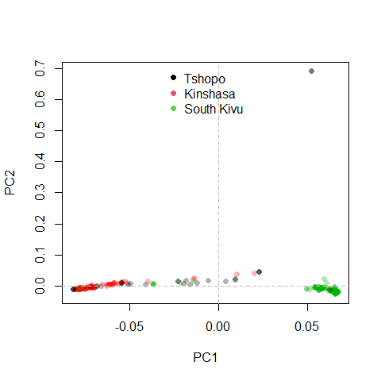

PCA with SNPRelate, GWAS
================
Bernice Waweru
Wed 23, Jun 2021

-   [Using `SNPRelate package`](#using-snprelate-package)

## Using [`SNPRelate package`](http://corearray.sourceforge.net/tutorials/SNPRelate/SNPRelateTutorial.pdf)

The package `SNPRelate` provides functions very useful to genome wide
association studies. We can prune based on linkage disequilibrium,
kinship and also perform pca. We had already pruned our marker based on
LD hence we will not repeat. We can use the `snpgdsPCA` function to run
a pca and plot, based on the regions and compare our results.

``` r
setwd("C:/Users/BWaweru/OneDrive - CGIAR/Documents/Fellows/Goat_diversity_project_fellow/Patrick_Baenyi/RWD/2021_Work_Repo/P-Baenyi/")

# load the genlight data object

load("results/pat_dat_gen_object_248_ind.RData")
pat_dat_rev
```

    ##  /// GENLIGHT OBJECT /////////
    ## 
    ##  // 248 genotypes,  44,093 binary SNPs, size: 9.2 Mb
    ##  42988 (0.39 %) missing data
    ## 
    ##  // Basic content
    ##    @gen: list of 248 SNPbin
    ##    @ploidy: ploidy of each individual  (range: 2-2)
    ## 
    ##  // Optional content
    ##    @ind.names:  248 individual labels
    ##    @loc.names:  44093 locus labels
    ##    @chromosome: factor storing chromosomes of the SNPs
    ##    @position: integer storing positions of the SNPs
    ##    @pop: population of each individual (group size range: 1-1)
    ##    @other: a list containing: sex  phenotype  pat  mat  history  loc.metrics.flags  loc.metrics  verbose

``` r
# load the phenotype data

read.csv("results/pat_pheno_248_indiv.csv", header = T, row.names = 1) -> pheno_dat
str(pheno_dat)
```

    ## 'data.frame':    248 obs. of  22 variables:
    ##  $ sample                 : chr  "WG6694108-DNA_A04_50kin" "WG6694108-DNA_A07_75kin1" "WG6694108-DNA_A11_51kin2" "WG6694108-DNA_B08_31kin2" ...
    ##  $ region                 : chr  "Kinshasa" "Kinshasa" "Kinshasa" "Kinshasa" ...
    ##  $ eye_color              : chr  "black" "black" "black" "black" ...
    ##  $ beard                  : chr  "no" "yes" "yes" "no" ...
    ##  $ pampilles              : chr  "no" "no" "no" "yes" ...
    ##  $ ear_orientation        : chr  "horizontal" "horizontal" "horizontal" "horizontal" ...
    ##  $ hair_shape             : chr  "patchy" "patchy" "patchy" "patchy" ...
    ##  $ hair_light             : chr  "yes" "no" "no" "no" ...
    ##  $ body_weight_kgs        : num  32 25 25.5 27 23.5 27 27.5 33 31 36 ...
    ##  $ number_of_kidding      : int  2 2 1 1 3 1 1 3 1 4 ...
    ##  $ double_kidding         : int  2 1 0 0 2 0 1 1 0 2 ...
    ##  $ triplet_kiding         : int  0 0 0 0 1 0 0 0 0 0 ...
    ##  $ number_of_wearned_kids : int  2 1 0 0 3 0 0 3 0 3 ...
    ##  $ actual_kidding         : int  2 2 1 1 2 1 2 1 1 2 ...
    ##  $ number_of_female_kids  : int  2 1 0 0 0 0 2 1 1 1 ...
    ##  $ number_of_male_kids    : int  0 1 1 1 2 1 0 0 0 1 ...
    ##  $ previous_kidding       : int  2 1 0 0 1 0 0 2 0 2 ...
    ##  $ number_of_female_kids.1: int  2 1 0 0 1 0 0 2 0 2 ...
    ##  $ number_of_male_kids.1  : int  0 0 0 0 0 0 0 0 0 0 ...
    ##  $ first_kidding          : int  0 0 0 0 2 0 0 1 0 1 ...
    ##  $ number_of_female_kids.2: int  0 0 0 0 1 0 0 1 0 1 ...
    ##  $ number_of_male_kids.2  : int  0 0 0 0 1 0 0 0 0 0 ...

We install SNPRelate package and convert our data into compatible format
to use with it.

``` r
#BiocManager::install("SNPRelate", lib = "C:/R/R-4.0.3/library/")
require(SNPRelate)
require(dartR)
```

The function `gl2gds` within the package *dartR* converts a data object
in `genlight` format to that accepted by *SNPRelate*, `gds` format.

``` r
gl2gds(pat_dat_rev, outfile = "pat_gds.gds", outpath = "results/")
```

    ## Starting gl2gds 
    ##   Processing a SNP dataset
    ##   Converting SNP data to gds format
    ##   Writing data to file results//pat_gds.gds 
    ## Structure of gds file
    ## 
    ## The file name: C:\Users\BWaweru\OneDrive - CGIAR\Documents\Fellows\Goat_diversity_project_fellow\Patrick_Baenyi\RWD\2021_Work_Repo\P-Baenyi\results\pat_gds.gds 
    ## The total number of samples: 248 
    ## The total number of SNPs: 44093 
    ## SNP genotypes are stored in SNP-major mode (Sample X SNP).
    ## File: C:\Users\BWaweru\OneDrive - CGIAR\Documents\Fellows\Goat_diversity_project_fellow\Patrick_Baenyi\RWD\2021_Work_Repo\P-Baenyi\results\pat_gds.gds (3.1M)
    ## +    [  ] *
    ## |--+ sample.id   { Str8 248 ZIP_ra(24.7%), 1.5K }
    ## |--+ snp.id   { Str8 44093 ZIP_ra(26.5%), 347.3K }
    ## |--+ snp.position   { Int32 44093 ZIP_ra(92.1%), 158.6K }
    ## |--+ snp.chromosome   { Int32,factor 44093 ZIP_ra(0.16%), 290B } *
    ## |--+ genotype   { Bit2 248x44093, 2.6M } *
    ## |--+ sex   { Int32,factor 248 ZIP_ra(3.02%), 37B } *
    ## |--+ phenotype   { Int32,factor 248 ZIP_ra(3.02%), 37B } *
    ## |--+ pat   { Str8 248 ZIP_ra(5.04%), 32B }
    ## |--+ mat   { Str8 248 ZIP_ra(5.04%), 32B }
    ## |--+ history   [ list ] *
    ## |--+ loc.metrics.flags   [ list ] *
    ## |  |--+ monomorphs   { Int32,logical 1 ZIP_ra(550.0%), 29B } *
    ## |  |--+ AvgPIC   { Int32,logical 1 ZIP_ra(550.0%), 29B } *
    ## |  |--+ OneRatioRef   { Int32,logical 1 ZIP_ra(550.0%), 29B } *
    ## |  |--+ OneRatioSnp   { Int32,logical 1 ZIP_ra(550.0%), 29B } *
    ## |  |--+ PICRef   { Int32,logical 1 ZIP_ra(550.0%), 29B } *
    ## |  |--+ PICSnp   { Int32,logical 1 ZIP_ra(550.0%), 29B } *
    ## |  |--+ CallRate   { Int32,logical 1 ZIP_ra(550.0%), 29B } *
    ## |  |--+ FreqHomRef   { Int32,logical 1 ZIP_ra(550.0%), 29B } *
    ## |  |--+ FreqHomSnp   { Int32,logical 1 ZIP_ra(550.0%), 29B } *
    ## |  |--+ FreqHets   { Int32,logical 1 ZIP_ra(550.0%), 29B } *
    ## |  |--+ maf   { Int32,logical 1 ZIP_ra(550.0%), 29B } *
    ## |  |--+ OneRatio   { Int32,logical 1 ZIP_ra(550.0%), 29B } *
    ## |  \--+ PIC   { Int32,logical 1 ZIP_ra(550.0%), 29B } *
    ## |--+ loc.metrics   [ list ] *
    ## |  |--+ monomorphs   { Int32,logical 1 ZIP_ra(550.0%), 29B } *
    ## |  |--+ AvgPIC   { Int32,logical 44093 ZIP_ra(0.12%), 214B } *
    ## |  |--+ OneRatioRef   { Int32,logical 44093 ZIP_ra(0.12%), 214B } *
    ## |  |--+ OneRatioSnp   { Int32,logical 44093 ZIP_ra(0.12%), 214B } *
    ## |  |--+ PICRef   { Int32,logical 44093 ZIP_ra(0.12%), 214B } *
    ## |  |--+ PICSnp   { Int32,logical 44093 ZIP_ra(0.12%), 214B } *
    ## |  |--+ CallRate   { Int32,logical 44093 ZIP_ra(0.12%), 214B } *
    ## |  |--+ FreqHomRef   { Int32,logical 44093 ZIP_ra(0.12%), 214B } *
    ## |  |--+ FreqHomSnp   { Int32,logical 44093 ZIP_ra(0.12%), 214B } *
    ## |  |--+ FreqHets   { Int32,logical 44093 ZIP_ra(0.12%), 214B } *
    ## |  |--+ maf   { Int32,logical 44093 ZIP_ra(0.12%), 214B } *
    ## |  |--+ OneRatio   { Int32,logical 44093 ZIP_ra(0.12%), 214B } *
    ## |  \--+ PIC   { Int32,logical 44093 ZIP_ra(0.12%), 214B } *
    ## \--+ verbose   { Float64 1 ZIP_ra(275.0%), 29B }
    ##   Closing file results//pat_gds.gds 
    ## Completed: gl2gds

    ## NULL

``` r
#lets load into our session for use

genofile <- snpgdsOpen("results/pat_gds", allow.duplicate = T)

#lets also have the ID's of the SNPs and the individuals stores in a variable

geno_ind_ids <- indNames(pat_dat_rev)
geno_snp_ids <- locNames(pat_dat_rev)
```

Now we have a go at the PCA using *SNPRelate* package function
`snpgdsPCA`

``` r
pca <- snpgdsPCA(genofile, sample.id = geno_ind_ids, snp.id = geno_snp_ids, num.thread = 1)
```

    ## Principal Component Analysis (PCA) on genotypes:
    ## Excluding 15,557 SNPs (non-autosomes or non-selection)
    ## Excluding 0 SNP (monomorphic: TRUE, MAF: NaN, missing rate: NaN)
    ##     # of samples: 248
    ##     # of SNPs: 28,536
    ##     using 1 thread
    ##     # of principal components: 32
    ## PCA:    the sum of all selected genotypes (0,1,2) = 3847716
    ## CPU capabilities: Double-Precision SSE2
    ## Wed Jun 23 16:19:27 2021    (internal increment: 4076)
    ## [..................................................]  0%, ETC: ---        [==================================================] 100%, completed, 1s
    ## Wed Jun 23 16:19:28 2021    Begin (eigenvalues and eigenvectors)
    ## Wed Jun 23 16:19:28 2021    Done.

``` r
# we create a dataframe to store pca results that we can use with ggplot to view results

pca_dat <- data.frame(ind_ids = pca$sample.id, PC1 = pca$eigenvect[,1], PC2 = pca$eigenvect[,2], stringsAsFactors = F)
```

We will assign the information of regions based in the phenotype data we
loaded. First make sure the individual names match in both data sets.

``` r
pheno_dat <- pheno_dat[match(pca$sample.id, pheno_dat$sample),]
```

Assign the colors for the various regions to be used in the plot.

``` r
require(RColorBrewer)

pcaCol <- rep(rgb(0,0,0,.3), length(pca$sample.id))
pcaCol[pheno_dat$region == "Kinshasa"] <- rgb(1,0,0,.3) #red for Kinshasa
pcaCol[pheno_dat$region == "South Kivu"] <- rgb(0,.7,0,.3) # green for South Kivu

# plot

#svg("results/PCA_SNPRelate_1.svg", width = 15, height = 10)
plot(pca_dat$PC1, pca_dat$PC2, xlab = "PC1", ylab = "PC2", col = pcaCol, pch = 16)
abline(h = 0, v = 0, lty = 2, col = "grey")
legend("top", legend = c("Tshopo", "Kinshasa", "South Kivu"), col = 1:3, pch = 16, bty = "n")
```

<!-- -->

``` r
#dev.off()
```

Again **South Kivu** and **Kinshasa** individuals cluster but the
**Tshopo** individuals don’t have clear clustering. We also observe
those few individuals at the top left very far off from the rest.Let’s
see how many they are;

``` r
require(magrittr)
require(dplyr)

pca_dat %>% filter(PC2 >= 0.6)
```

    ##                   ind_ids        PC1       PC2
    ## 1 WG6694110-DNA_D05_9mks2 0.05247729 0.6904182
    ## 2 WG6694110-DNA_G04_9tshp 0.05249118 0.6903798

Only two individuals this time,
