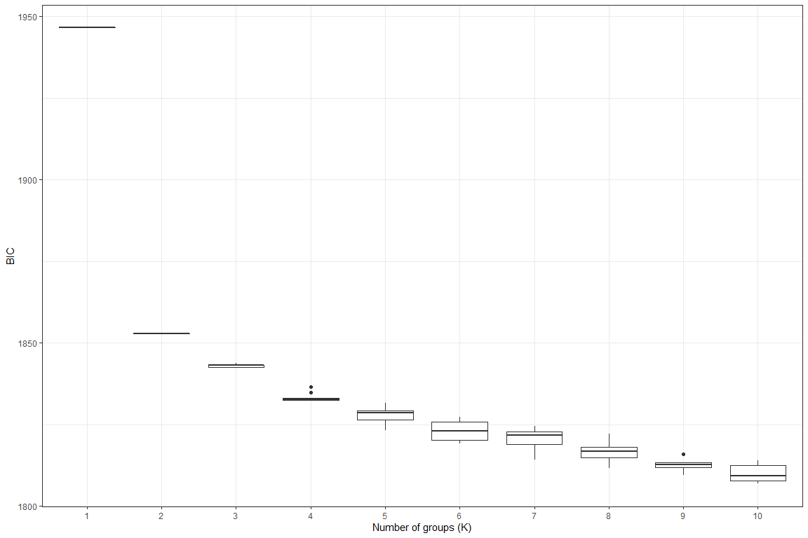
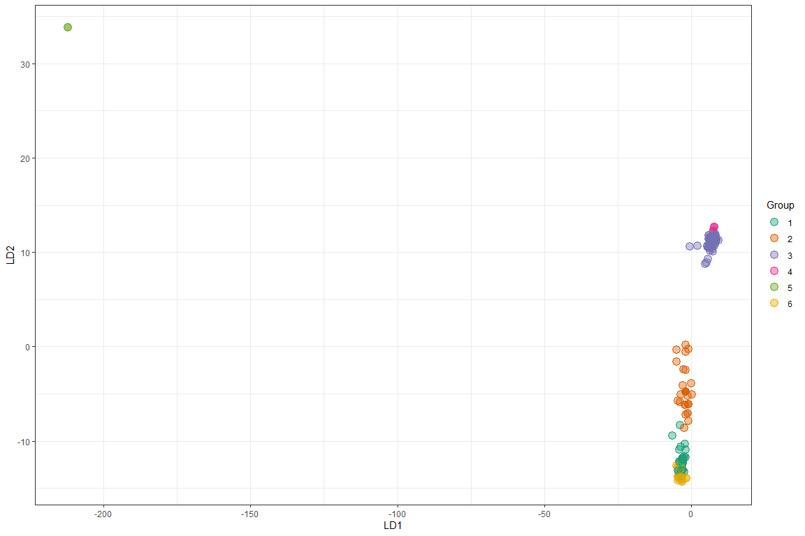
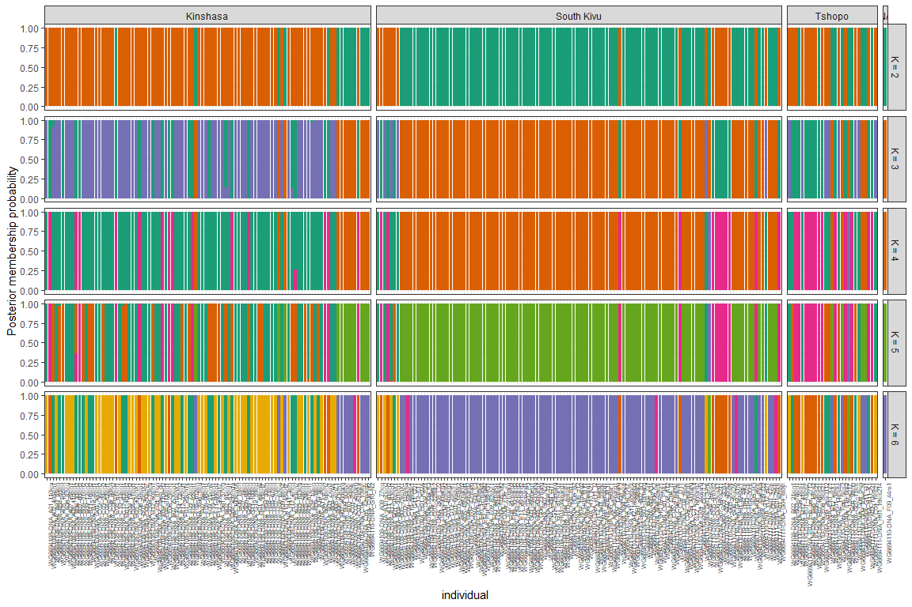

Clustering analysis to test various K values
================
Bernice Waweru
Tue 06, Jul 2021

-   [Objective](#objective)

## Objective

We can test various values of `K` to check value correctly reflects the
number of underlying populations in our data set. We will use the
`genlight` object to test for this and generate a plot to present our
results. THe data has 248 individuals and 44,093 SNPs

``` r
setwd("C:/Users/BWaweru/OneDrive - CGIAR/Documents/Fellows/Goat_diversity_project_fellow/Patrick_Baenyi/RWD/2021_Work_Repo/P-Baenyi/")

# load the genlight data object

load("results/pat_genlight_with_pop.RData")
pat_dat_rev
```

    ##  /// GENLIGHT OBJECT /////////
    ## 
    ##  // 248 genotypes,  44,093 binary SNPs, size: 9.2 Mb
    ##  42988 (0.39 %) missing data
    ## 
    ##  // Basic content
    ##    @gen: list of 248 SNPbin
    ##    @ploidy: ploidy of each individual  (range: 2-2)
    ## 
    ##  // Optional content
    ##    @ind.names:  248 individual labels
    ##    @loc.names:  44093 locus labels
    ##    @chromosome: factor storing chromosomes of the SNPs
    ##    @position: integer storing positions of the SNPs
    ##    @pop: population of each individual (group size range: 27-122)
    ##    @other: a list containing: sex  phenotype  pat  mat  history  loc.metrics.flags  loc.metrics  verbose

We can test for K values with `find.clusters`. We test for values from 1
to 10.

``` r
library(adegenet)

maxK <- 10 # set number of K to test

myMat <- matrix(nrow=10, ncol=maxK) #initialze an empty matric to store the output

colnames(myMat) <- 1:ncol(myMat) # set col names

# use a loop to test for 1 to 10 K values

for(i in 1:nrow(myMat)){
  grp <- find.clusters(pat_dat_rev, n.pca = 40, choose.n.clust = FALSE,  max.n.clust = maxK)
  myMat[i,] <- grp$Kstat
}

save(myMat, file = "results/pat_myMat.RData")
```

Visualize our results;

``` r
load("results/pat_myMat.RData")

library(ggplot2)
library(reshape2)


my_df <- melt(myMat)

colnames(my_df)[1:3] <- c("Group", "K", "BIC")

my_df$K <- as.factor(my_df$K)

head(my_df)
```

    ##   Group K      BIC
    ## 1     1 1 1946.588
    ## 2     2 1 1946.588
    ## 3     3 1 1946.588
    ## 4     4 1 1946.588
    ## 5     5 1 1946.588
    ## 6     6 1 1946.588

``` r
p1 <- ggplot(my_df, aes(x = K, y = BIC))
p1 <- p1 + geom_boxplot()
p1 <- p1 + theme_bw()
p1 <- p1 + xlab("Number of groups (K)")
p1
```

<div class="figure" style="text-align: center">


<p class="caption">
Graph of BIC Values against K values
</p>

</div>

Now we also run the `dapc` function with clusters 2 to 6.

``` r
my_k <- 2:6

grp_l <- vector(mode = "list", length = length(my_k))
dapc_l <- vector(mode = "list", length = length(my_k))

for(i in 1:length(dapc_l)){
  set.seed(9)
  grp_l[[i]] <- find.clusters(pat_dat_rev, n.pca = 40, n.clust = my_k[i])
  dapc_l[[i]] <- dapc(pat_dat_rev, pop = grp_l[[i]]$grp, n.pca = 40, n.da = my_k[i])
#  dapc_l[[i]] <- dapc(gl_rubi, pop = grp_l[[i]]$grp, n.pca = 3, n.da = 2)
}

#save(grp_l, file = "results/pat_grp_1.RData")
#save(dapc_l, file = "results/pat_dapc_1.RData")
```

Now we can use the data to plot. First we do a scatter plot

``` r
load("results/pat_grp_1.RData")
load("results/pat_dapc_1.RData")

my_df <- as.data.frame(dapc_l[[ length(dapc_l) ]]$ind.coord)

my_df$Group <- dapc_l[[ length(dapc_l) ]]$grp

head(my_df)
```

    ##                                 LD1        LD2           LD3        LD4
    ## WG6694108-DNA_A01_110kin  -3.583925 -13.974182 -0.6465966695  3.7411058
    ## WG6694108-DNA_A02_105kin1 -3.574088  -5.070162  0.8751679294 -6.7656097
    ## WG6694108-DNA_A03_55kin   -2.958599 -11.763167  0.0003675409 -3.2233549
    ## WG6694108-DNA_A04_50kin   -3.935868 -13.472378 -0.6901155212  3.7851071
    ## WG6694108-DNA_A05_104kin  -3.366372 -13.098790 -0.3475736074 -0.4240455
    ## WG6694108-DNA_A06_82kin   -4.033375 -12.235178  0.0811439078 -3.9562028
    ##                                  LD5 Group
    ## WG6694108-DNA_A01_110kin   1.2389431     6
    ## WG6694108-DNA_A02_105kin1  0.2223525     2
    ## WG6694108-DNA_A03_55kin   -3.5841836     1
    ## WG6694108-DNA_A04_50kin    1.4890631     6
    ## WG6694108-DNA_A05_104kin  -2.3771342     1
    ## WG6694108-DNA_A06_82kin   -5.9437986     1

``` r
my_pal <- RColorBrewer::brewer.pal(n=8, name = "Dark2")

p2 <- ggplot(my_df, aes(x = LD1, y = LD2, color = Group, fill = Group))
p2 <- p2 + geom_point(size = 4, shape = 21)
p2 <- p2 + theme_bw()
p2 <- p2 + scale_color_manual(values=c(my_pal))
p2 <- p2 + scale_fill_manual(values=c(paste(my_pal, "66", sep = "")))
p2
```

<div class="figure" style="text-align: center">


<p class="caption">
Scatter plot for K value assignment
</p>

</div>

Looks like we might have chosen too many populations, i think we can
keep it to 3 maximum. We also have one very clear outlier. We can choose
to drop that individual from the next run.

Let’s check which individual that is;

``` r
require(dplyr)
```

    ## Loading required package: dplyr

    ## Warning: package 'dplyr' was built under R version 4.0.5

    ## 
    ## Attaching package: 'dplyr'

    ## The following objects are masked from 'package:stats':
    ## 
    ##     filter, lag

    ## The following objects are masked from 'package:base':
    ## 
    ##     intersect, setdiff, setequal, union

``` r
require(magrittr)
```

    ## Loading required package: magrittr

``` r
my_df %>% filter(LD2 > 30) 
```

    ##                               LD1      LD2        LD3       LD4        LD5
    ## WG6694110-DNA_D05_9mks2 -212.0377 33.79609 -0.2230952 0.9545976 -0.4186526
    ## WG6694110-DNA_G04_9tshp -212.0905 33.80390 -0.1843997 0.9763996 -0.4133286
    ##                         Group
    ## WG6694110-DNA_D05_9mks2     5
    ## WG6694110-DNA_G04_9tshp     5

Looks there are actually 2 individuals. When we re-run we will drop this
two and see what changes we have in our plots.

The other way we can visualize the data is to use bar plots of the
posterior probabilities. First we get the data into a long format and
add the population information that we can use to facet.

``` r
my_k <- 2:6

tmp <- as.data.frame(dapc_l[[1]]$posterior)
tmp$K <- my_k[1]
tmp$individual <- rownames(tmp)
tmp <- melt(tmp, id = c("individual", "K"))
names(tmp)[3:4] <- c("Group", "Posterior")
tmp$region <- pat_dat_rev@pop
my_df <- tmp

for(i in 2:length(dapc_l)){
  tmp <- as.data.frame(dapc_l[[i]]$posterior)
  tmp$K <- my_k[i]
  tmp$individual <- rownames(tmp)
  tmp <- melt(tmp, id = c("individual", "K"))
  names(tmp)[3:4] <- c("Group", "Posterior")
  tmp$region <- pat_dat_rev@pop

  my_df <- rbind(my_df, tmp)
}
```

Now we build the plot;

``` r
grp.labs <- paste("K =", my_k)
names(grp.labs) <- my_k

p3 <- ggplot(my_df, aes(x = individual, y = Posterior, fill = Group))
p3 <- p3 + geom_bar(stat = "identity")
p3 <- p3 + facet_grid(K ~ region, scales = "free_x", space = "free", 
                      labeller = labeller(K = grp.labs))
p3 <- p3 + theme_bw()
p3 <- p3 + ylab("Posterior membership probability")
p3 <- p3 + theme(legend.position='none')
#p3 <- p3 + scale_color_brewer(palette="Dark2")
p3 <- p3 + scale_fill_manual(values=c(my_pal))
p3 <- p3 + theme(axis.text.x = element_text(angle = 90, hjust = 1, size = 6))
p3
```

<div class="figure" style="text-align: center">


<p class="caption">
Faceted compoplot of possible underlying populations
</p>

</div>
