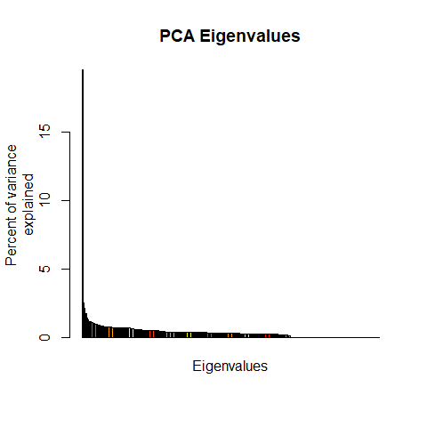
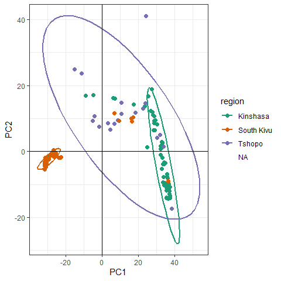
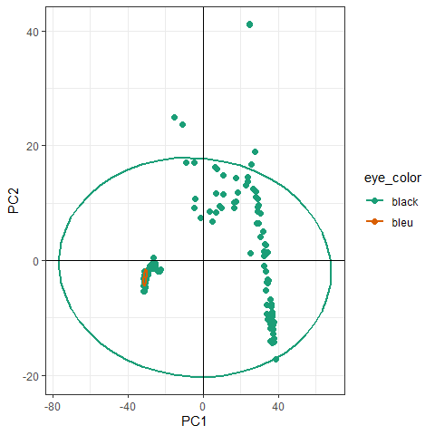
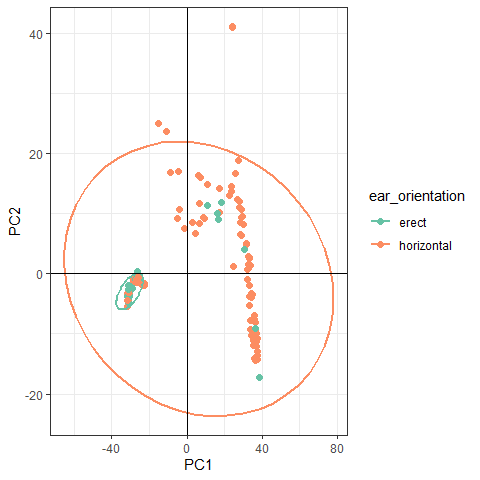
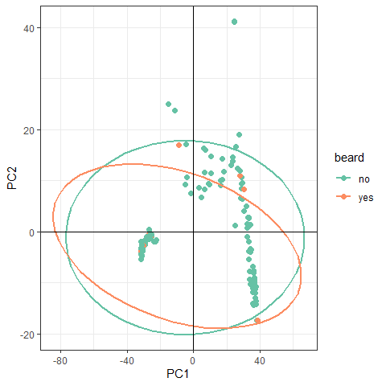
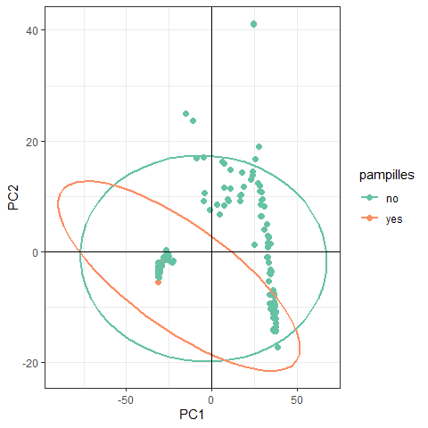
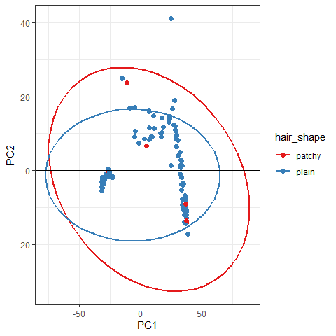
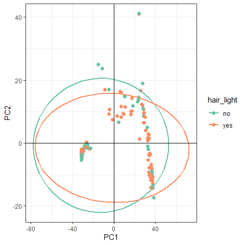
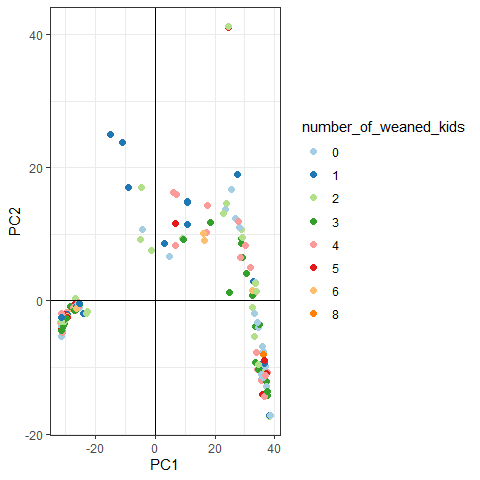

Associating inferred pop structure with phenotype data
================
Bernice Waweru
Sat 05, Jun 2021

-   [Adding relevant phenotype data to the genotype
    data](#adding-relevant-phenotype-data-to-the-genotype-data)
    -   [Principal components analysis](#principal-components-analysis)
-   [Session Information](#session-information)

## Adding relevant phenotype data to the genotype data

We have worked so far with the data without any metadata or phenotype
data. We have quite some comprehensive phenotype data available, so lets
read it into r and add it to the `genlight` object.

``` r
setwd("C:/Users/BWaweru/OneDrive - CGIAR/Documents/Fellows/Goat_diversity_project_fellow/Patrick_Baenyi/RWD/2021_Work_Repo")

# load the genlight data object

load("results/pat_data.RData")
pat_dat
```

    ##  /// GENLIGHT OBJECT /////////
    ## 
    ##  // 259 genotypes,  44,099 binary SNPs, size: 7.3 Mb
    ##  43188 (0.38 %) missing data
    ## 
    ##  // Basic content
    ##    @gen: list of 259 SNPbin
    ##    @ploidy: ploidy of each individual  (range: 2-2)
    ## 
    ##  // Optional content
    ##    @ind.names:  259 individual labels
    ##    @loc.names:  44099 locus labels
    ##    @chromosome: factor storing chromosomes of the SNPs
    ##    @position: integer storing positions of the SNPs
    ##    @pop: population of each individual (group size range: 1-1)
    ##    @other: a list containing: sex  phenotype  pat  mat

We see `@pop` does not have any information.

``` r
pat_pheno <- read.csv("data-raw/patrick_pheno_final.csv", header = T,)
str(pat_pheno)
```

    ## 'data.frame':    258 obs. of  22 variables:
    ##  $ ï..sample              : chr  "WG6694108-DNA_A04_50kin" "WG6694108-DNA_A07_75kin1" "WG6694108-DNA_A11_51kin2" "WG6694108-DNA_B08_31kin2" ...
    ##  $ region                 : chr  "Kinshasa" "Kinshasa" "Kinshasa" "Kinshasa" ...
    ##  $ eye_color              : chr  "black" "black" "black" "black" ...
    ##  $ beard                  : chr  "no" "yes" "yes" "no" ...
    ##  $ pampilles              : chr  "no" "no" "no" "yes" ...
    ##  $ ear_orientation        : chr  "horizontal" "horizontal" "horizontal" "horizontal" ...
    ##  $ hair_shape             : chr  "patchy" "patchy" "patchy" "patchy" ...
    ##  $ hair_light             : chr  "yes" "no" "no" "no" ...
    ##  $ body_weight_kgs        : num  32 25 25.5 27 23.5 27 27.5 33 31 36 ...
    ##  $ number_of_kidding      : int  2 2 1 1 3 1 1 3 1 4 ...
    ##  $ double_kidding         : int  2 1 0 0 2 0 1 1 0 2 ...
    ##  $ triplet_kiding         : int  0 0 0 0 1 0 0 0 0 0 ...
    ##  $ number_of_wearned_kids : int  2 1 0 0 3 0 0 3 0 3 ...
    ##  $ actual_kidding         : int  2 2 1 1 2 1 2 1 1 2 ...
    ##  $ number_of_female_kids  : int  2 1 0 0 0 0 2 1 1 1 ...
    ##  $ number_of_male_kids    : int  0 1 1 1 2 1 0 0 0 1 ...
    ##  $ previous_kidding       : int  2 1 0 0 1 0 0 2 0 2 ...
    ##  $ number_of_female_kids.1: int  2 1 0 0 1 0 0 2 0 2 ...
    ##  $ number_of_male_kids.1  : int  0 0 0 0 0 0 0 0 0 0 ...
    ##  $ first_kidding          : int  0 0 0 0 2 0 0 1 0 1 ...
    ##  $ number_of_female_kids.2: int  0 0 0 0 1 0 0 1 0 1 ...
    ##  $ number_of_male_kids.2  : int  0 0 0 0 1 0 0 0 0 0 ...

``` r
names(pat_pheno)[1:10]
```

    ##  [1] "ï..sample"         "region"            "eye_color"        
    ##  [4] "beard"             "pampilles"         "ear_orientation"  
    ##  [7] "hair_shape"        "hair_light"        "body_weight_kgs"  
    ## [10] "number_of_kidding"

Let’s make the sample ID’s to be the row names for the phenotype data

``` r
#rownames(pat_pheno) <- pat_pheno$sample

# looks like there are duplicate sample IDs in the sample column of the phenotype data, lets correct that

pat_pheno_no_dups <- pat_pheno[!duplicated(pat_pheno$sample),]

# now we set the row names of the phenotype data frame to be the sample IDs

rownames(pat_pheno_no_dups) <- pat_pheno_no_dups$sample # great that works
```

Now let make sure that all the individuals in the genlight object match
those we have in the pheno data.

``` r
indiv_to_keep <- intersect(indNames(pat_dat), rownames(pat_pheno_no_dups)) #there are 248 individuals that match and we need to keep in both the genlight object and the phenotype data,
```

The *indiv\_to\_keep* object has only 248 individual names that match,
11 are not in the dataframe with phenotype data. Both the phenotype
object and the phenotype data need to have matching individual names.

We correct the phenotype data;

``` r
pheno_dat <- pat_pheno_no_dups[rownames(pat_pheno_no_dups) %in% indiv_to_keep,]
```

Next the genotype data. In-order to remove the individuals that are
missing in the `genlight` object, we use the package `dartR`. We first
install it and also its dependencies.

``` r
install.packages("dartR", lib = "C:/R/R-4.0.3/library/")

BiocManager::install("SNPRelate", lib = "C:/R/R-4.0.3/library/")

gl.install.vanilla.dartR()
```

Let’s get the list of individuals that are not present in the phenotype
file

``` r
dif_ind <- setdiff(indNames(pat_dat), pheno_dat$sample)
```

Now use the vector missing individuals to subset the genlight object.

``` r
require(dartR)
pat_dat_rev <- gl.drop.ind(pat_dat, ind.list = dif_ind, mono.rm = TRUE, recalc = FALSE)
```

    ## Starting gl.drop.ind 
    ##   Processing a SNP dataset
    ##   Deleting individuals WG6694108-DNA_D03_13kin25-1 WG6694108-DNA_F02_13kin26-1 WG6694110-DNA_D09_2kisPK_19 WG6694110-DNA_D10_5kis_21 WG6694110-DNA_E03_4kis_2612 WG6694110-DNA_E04_10kis_Z1 WG6694110-DNA_F02_3kis_P WG6694110-DNA_F05_Tsp_2512 WG6694110-DNA_F11_2PK19_2612 WG6694110-DNA_G03_8Tsp_2512 WG6694111-DNA_D02_2kis_2612 
    ##   Deleting monomorphic loc
    ##   Locus metrics not recalculated
    ## Completed: gl.drop.ind

``` r
pat_dat_rev
```

    ##  /// GENLIGHT OBJECT /////////
    ## 
    ##  // 248 genotypes,  44,093 binary SNPs, size: 9.2 Mb
    ##  42988 (0.39 %) missing data
    ## 
    ##  // Basic content
    ##    @gen: list of 248 SNPbin
    ##    @ploidy: ploidy of each individual  (range: 2-2)
    ## 
    ##  // Optional content
    ##    @ind.names:  248 individual labels
    ##    @loc.names:  44093 locus labels
    ##    @chromosome: factor storing chromosomes of the SNPs
    ##    @position: integer storing positions of the SNPs
    ##    @pop: population of each individual (group size range: 1-1)
    ##    @other: a list containing: sex  phenotype  pat  mat  history  loc.metrics.flags  loc.metrics  verbose

The new `genlight` object now has **248** individuals, and *6*
monomorphic loci were removed hence we remain with **44,093** SNPs. Now
we can move on to generate the PCA’s. First we add the phenotype dat of
the regions to the data

``` r
pop(pat_dat_rev) <- pheno_dat$region

pat_dat_rev # now @pop has some information
```

    ##  /// GENLIGHT OBJECT /////////
    ## 
    ##  // 248 genotypes,  44,093 binary SNPs, size: 9.2 Mb
    ##  42988 (0.39 %) missing data
    ## 
    ##  // Basic content
    ##    @gen: list of 248 SNPbin
    ##    @ploidy: ploidy of each individual  (range: 2-2)
    ## 
    ##  // Optional content
    ##    @ind.names:  248 individual labels
    ##    @loc.names:  44093 locus labels
    ##    @chromosome: factor storing chromosomes of the SNPs
    ##    @position: integer storing positions of the SNPs
    ##    @pop: population of each individual (group size range: 27-122)
    ##    @other: a list containing: sex  phenotype  pat  mat  history  loc.metrics.flags  loc.metrics  verbose

### [Principal components analysis](http://grunwaldlab.github.io/Population_Genetics_in_R/gbs_analysis.html)

A principal components analysis (PCA) converts the observed SNP data
into a set of values of linearly uncorrelated variables called principal
components that summarize the variation between samples. We can perform
a PCA on our `genlight` object by using the `glPCA` function from the
`adegenet` package.

``` r
pat_pca <- glPca(pat_dat_rev, nf = 5) # nf indicates the number of principal component we want to keep

#takes quite a while to run, let save it an an R data object

save(pat_pca, file = "results/pat_pca.RData")
```

Let’s plot the eigen values to see which one explain the greatest
variation.

``` r
load("results/pat_pca.RData")

barplot(100*pat_pca$eig/sum(pat_pca$eig), col = heat.colors(50), main="PCA Eigenvalues")
title(ylab="Percent of variance\nexplained", line = 2)
title(xlab="Eigenvalues", line = 1)
```

<!-- -->

Looks like the first pc has the greatest variance, so we can keep 2 to
allow us to plot the pca scatter plot.

We use ggplot2 tp plot the pca scatter plot. First we convert the data
with pca score into a data frame, then add various trait data, to color
the population.

``` r
pat_pca_scores <- as.data.frame(pat_pca$scores)

#we check that the pca score data frame has the same row names and in the same order as those in the phenotype data frame

all(rownames(pat_pca_scores) == rownames(pheno_dat)) #its FASLE, lets rearrange
```

    ## [1] FALSE

``` r
all(rownames(pat_pca_scores) == rownames(pheno_dat)) # now good to go!
```

    ## [1] FALSE

``` r
pheno_dat <- pheno_dat[rownames(pat_pca_scores),]

# we add the various phenotype variable we would like to color by

pat_pca_scores$region <- pheno_dat$region
pat_pca_scores$eye_color <- pheno_dat$eye_color
pat_pca_scores$ear_orientation <- pheno_dat$ear_orientation
pat_pca_scores$beard <- pheno_dat$beard
pat_pca_scores$pampilles <- pheno_dat$pampilles
pat_pca_scores$hair_shape <- pheno_dat$hair_shape
pat_pca_scores$hair_light <- pheno_dat$hair_light
pat_pca_scores$number_of_kidding <- pheno_dat$number_of_kidding
pat_pca_scores$number_of_weaned_kids <- pheno_dat$number_of_wearned_kids
```

Now we use ggplot2 to plot

``` r
require(ggplot2)
require(RColorBrewer)

set.seed(9)

#cols for region
cols <- brewer.pal(n = nPop(pat_dat_rev), name = "Dark2")

p <- ggplot(pat_pca_scores, aes(x=PC1, y=PC2, colour=region)) 
p <- p + geom_point(size=2)
p <- p + stat_ellipse(level = 0.95, size = 1)
p <- p + scale_color_manual(values = cols) 
p <- p + geom_hline(yintercept = 0) 
p <- p + geom_vline(xintercept = 0) 
p <- p + theme_bw()

p
```

<!-- -->

South Kivu is probably the best clustered, followed by Kinshasa, but
there are still some mixed points. Lets try using another trait.

``` r
#cols for eye color
cols <- brewer.pal(n = length(unique(pheno_dat$eye_color)), name = "Dark2")

p <- ggplot(pat_pca_scores, aes(x=PC1, y=PC2, colour=eye_color)) 
p <- p + geom_point(size=2)
p <- p + stat_ellipse(level = 0.95, size = 1)
p <- p + scale_color_manual(values = cols) 
p <- p + geom_hline(yintercept = 0) 
p <- p + geom_vline(xintercept = 0) 
p <- p + theme_bw()

p
```

<!-- -->

Eye color explains no variation within the data set. Next we can try ear
orientation

``` r
#cols for ear orientation
cols <- brewer.pal(n = length(unique(pheno_dat$ear_orientation)), name = "Set2")

p <- ggplot(pat_pca_scores, aes(x=PC1, y=PC2, colour=ear_orientation)) 
p <- p + geom_point(size=2)
p <- p + stat_ellipse(level = 0.95, size = 1)
p <- p + scale_color_manual(values = cols) 
p <- p + geom_hline(yintercept = 0) 
p <- p + geom_vline(xintercept = 0) 
p <- p + theme_bw()

p
```

<!-- -->

Most individuals with erect ear orientation seem to cluster together,
with a few mixed. Next we do beard.

``` r
#cols for beard
cols <- brewer.pal(n = length(unique(pheno_dat$beard)), name = "Set2")

p <- ggplot(pat_pca_scores, aes(x=PC1, y=PC2, colour=beard)) 
p <- p + geom_point(size=2)
p <- p + stat_ellipse(level = 0.95, size = 1)
p <- p + scale_color_manual(values = cols) 
p <- p + geom_hline(yintercept = 0) 
p <- p + geom_vline(xintercept = 0) 
p <- p + theme_bw()

p
```

<!-- -->

No clustering by beard, most individuals do not have beard. Next we do
pampilles

``` r
#cols for pampilles
cols <- brewer.pal(n = length(unique(pheno_dat$pampilles)), name = "Set2")

p <- ggplot(pat_pca_scores, aes(x=PC1, y=PC2, colour=pampilles)) 
p <- p + geom_point(size=2)
p <- p + stat_ellipse(level = 0.95, size = 1)
p <- p + scale_color_manual(values = cols) 
p <- p + geom_hline(yintercept = 0) 
p <- p + geom_vline(xintercept = 0) 
p <- p + theme_bw()

p
```

<!-- -->

Only one individual with pampilles, not useful. What about hair shape?

``` r
#cols for hair shape
cols <- brewer.pal(n = length(unique(pheno_dat$hair_shape)), name = "Set1")

p <- ggplot(pat_pca_scores, aes(x=PC1, y=PC2, colour=hair_shape)) 
p <- p + geom_point(size=2)
p <- p + stat_ellipse(level = 0.95, size = 1)
p <- p + scale_color_manual(values = cols) 
p <- p + geom_hline(yintercept = 0) 
p <- p + geom_vline(xintercept = 0) 
p <- p + theme_bw()

p
```

<!-- -->

No clear clustering either, most individuals have plain hair shape. Next
we try hair light then number of kids.

``` r
#cols for hair light
cols <- brewer.pal(n = length(unique(pheno_dat$hair_light)), name = "Set2")

p <- ggplot(pat_pca_scores, aes(x=PC1, y=PC2, colour=hair_light)) 
p <- p + geom_point(size=2)
p <- p + stat_ellipse(level = 0.95, size = 1)
p <- p + scale_color_manual(values = cols) 
p <- p + geom_hline(yintercept = 0) 
p <- p + geom_vline(xintercept = 0) 
p <- p + theme_bw()

p
```

<!-- -->

Still no clear clustering.

``` r
#cols for number of kidding
cols <- brewer.pal(n = length(unique(pheno_dat$number_of_kidding)), name = "Paired")

pat_pca_scores$number_of_kidding <- as.factor(pat_pca_scores$number_of_kidding)

p <- ggplot(pat_pca_scores, aes(x=PC1, y=PC2, colour=number_of_kidding)) 
p <- p + geom_point(size=2)
#p <- p + stat_ellipse(level = 0.95, size = 1)
p <- p + scale_color_manual(values = cols) 
p <- p + geom_hline(yintercept = 0) 
p <- p + geom_vline(xintercept = 0) 
p <- p + theme_bw()

p
```

<!-- -->

Let also do number of weaned kids

``` r
#cols for number of weaned likds
cols <- brewer.pal(n = length(unique(pheno_dat$number_of_wearned_kids)), name = "Paired")

pat_pca_scores$number_of_weaned_kids <- as.factor(pat_pca_scores$number_of_weaned_kids)

p <- ggplot(pat_pca_scores, aes(x=PC1, y=PC2, colour=number_of_weaned_kids)) 
p <- p + geom_point(size=2)
#p <- p + stat_ellipse(level = 0.95, size = 1)
p <- p + scale_color_manual(values = cols) 
p <- p + geom_hline(yintercept = 0) 
p <- p + geom_vline(xintercept = 0) 
p <- p + theme_bw()

p
```

<!-- -->

Still nothing clear. What is clear however is the very tight cluster of
point at the top right of the plot in every plot we have seen. Could
these be outliers? Will be there be a difference when we do the analysis
without them? To know which individuals these are we can sort the data
frame by PC2, they are all above 40.

``` r
require(magrittr)
require(dplyr)

pat_pca_scores[order(-pat_pca_scores$PC2), ] %>% head(n=10) %>% filter(PC2 >= 40) %>% select(PC2)
```

    ##                                PC2
    ## WG6694110-DNA_D06_2kisX1  41.15586
    ## WG6694108-DNA_E07_Z-Xkin1 41.15312
    ## WG6694109-DNA_B03_Zkin1   41.15110
    ## WG6694108-DNA_D07_ZkinX1  41.15039
    ## WG6694110-DNA_G06_2kis2A  41.13786
    ## WG6694108-DNA_A10_Zkin2   41.11602

There are six individuals with value of PC2 greater than 40,interesting.
Are they outliers?

## Session Information

Details of packages used with the work flow

``` r
devtools::session_info()
```

    ## - Session info ---------------------------------------------------------------
    ##  setting  value                       
    ##  version  R version 4.0.3 (2020-10-10)
    ##  os       Windows 10 x64              
    ##  system   x86_64, mingw32             
    ##  ui       RTerm                       
    ##  language (EN)                        
    ##  collate  English_United States.1252  
    ##  ctype    English_United States.1252  
    ##  tz       Africa/Nairobi              
    ##  date     2021-06-05                  
    ## 
    ## - Packages -------------------------------------------------------------------
    ##  package      * version   date       lib source        
    ##  ade4         * 1.7-16    2020-10-28 [2] CRAN (R 4.0.3)
    ##  adegenet     * 2.1.3     2020-05-10 [2] CRAN (R 4.0.4)
    ##  ape            5.4-1     2020-08-13 [2] CRAN (R 4.0.3)
    ##  assertthat     0.2.1     2019-03-21 [2] CRAN (R 4.0.3)
    ##  boot           1.3-27    2021-02-12 [2] CRAN (R 4.0.5)
    ##  cachem         1.0.4     2021-02-13 [2] CRAN (R 4.0.5)
    ##  calibrate      1.7.7     2020-06-19 [2] CRAN (R 4.0.5)
    ##  callr          3.6.0     2021-03-28 [2] CRAN (R 4.0.5)
    ##  class          7.3-18    2021-01-24 [2] CRAN (R 4.0.5)
    ##  classInt       0.4-3     2020-04-07 [2] CRAN (R 4.0.4)
    ##  cli            2.4.0     2021-04-05 [2] CRAN (R 4.0.5)
    ##  cluster        2.1.1     2021-02-14 [2] CRAN (R 4.0.5)
    ##  coda           0.19-4    2020-09-30 [2] CRAN (R 4.0.4)
    ##  codetools      0.2-18    2020-11-04 [2] CRAN (R 4.0.3)
    ##  colorspace     2.0-0     2020-11-11 [2] CRAN (R 4.0.3)
    ##  combinat       0.0-8     2012-10-29 [2] CRAN (R 4.0.3)
    ##  crayon         1.4.1     2021-02-08 [2] CRAN (R 4.0.5)
    ##  dartR        * 1.9.9.1   2021-05-28 [2] CRAN (R 4.0.5)
    ##  data.table     1.14.0    2021-02-21 [2] CRAN (R 4.0.5)
    ##  DBI            1.1.1     2021-01-15 [2] CRAN (R 4.0.3)
    ##  deldir         0.2-10    2021-02-16 [2] CRAN (R 4.0.4)
    ##  DEoptimR       1.0-9     2021-05-24 [2] CRAN (R 4.0.5)
    ##  desc           1.3.0     2021-03-05 [2] CRAN (R 4.0.5)
    ##  devtools       2.4.1     2021-05-05 [2] CRAN (R 4.0.5)
    ##  digest         0.6.27    2020-10-24 [1] CRAN (R 4.0.3)
    ##  dismo          1.3-3     2020-11-17 [2] CRAN (R 4.0.5)
    ##  doParallel     1.0.16    2020-10-16 [2] CRAN (R 4.0.3)
    ##  dplyr        * 1.0.3     2021-01-15 [2] CRAN (R 4.0.3)
    ##  e1071          1.7-6     2021-03-18 [2] CRAN (R 4.0.4)
    ##  ellipsis       0.3.1     2020-05-15 [2] CRAN (R 4.0.3)
    ##  evaluate       0.14      2019-05-28 [2] CRAN (R 4.0.3)
    ##  expm           0.999-6   2021-01-13 [2] CRAN (R 4.0.4)
    ##  fansi          0.4.2     2021-01-15 [2] CRAN (R 4.0.3)
    ##  farver         2.0.3     2020-01-16 [2] CRAN (R 4.0.3)
    ##  fastmap        1.1.0     2021-01-25 [2] CRAN (R 4.0.5)
    ##  foreach        1.5.1     2020-10-15 [2] CRAN (R 4.0.3)
    ##  fs             1.5.0     2020-07-31 [2] CRAN (R 4.0.3)
    ##  gap            1.2.3-1   2021-04-21 [2] CRAN (R 4.0.5)
    ##  gdata          2.18.0    2017-06-06 [2] CRAN (R 4.0.3)
    ##  gdistance      1.3-6     2020-06-29 [2] CRAN (R 4.0.5)
    ##  gdsfmt         1.26.1    2020-12-22 [2] Bioconductor  
    ##  generics       0.1.0     2020-10-31 [2] CRAN (R 4.0.3)
    ##  genetics       1.3.8.1.3 2021-03-01 [2] CRAN (R 4.0.5)
    ##  GGally         2.1.1     2021-03-08 [2] CRAN (R 4.0.5)
    ##  ggplot2      * 3.3.3     2020-12-30 [2] CRAN (R 4.0.3)
    ##  glue           1.4.2     2020-08-27 [2] CRAN (R 4.0.3)
    ##  gmodels        2.18.1    2018-06-25 [2] CRAN (R 4.0.4)
    ##  gridExtra      2.3       2017-09-09 [2] CRAN (R 4.0.3)
    ##  gtable         0.3.0     2019-03-25 [2] CRAN (R 4.0.3)
    ##  gtools         3.8.2     2020-03-31 [2] CRAN (R 4.0.3)
    ##  hierfstat      0.5-7     2020-07-20 [2] CRAN (R 4.0.5)
    ##  highr          0.9       2021-04-16 [2] CRAN (R 4.0.5)
    ##  hms            1.0.0     2021-01-13 [2] CRAN (R 4.0.3)
    ##  htmltools      0.5.1     2021-01-12 [2] CRAN (R 4.0.3)
    ##  httpuv         1.5.5     2021-01-13 [2] CRAN (R 4.0.3)
    ##  igraph         1.2.6     2020-10-06 [2] CRAN (R 4.0.3)
    ##  iterators      1.0.13    2020-10-15 [2] CRAN (R 4.0.3)
    ##  KernSmooth     2.23-18   2020-10-29 [2] CRAN (R 4.0.3)
    ##  knitr          1.33      2021-04-24 [2] CRAN (R 4.0.5)
    ##  labeling       0.4.2     2020-10-20 [2] CRAN (R 4.0.3)
    ##  later          1.1.0.1   2020-06-05 [2] CRAN (R 4.0.3)
    ##  lattice        0.20-41   2020-04-02 [2] CRAN (R 4.0.3)
    ##  LearnBayes     2.15.1    2018-03-18 [2] CRAN (R 4.0.3)
    ##  lifecycle      1.0.0     2021-02-15 [2] CRAN (R 4.0.5)
    ##  magrittr     * 2.0.1     2020-11-17 [2] CRAN (R 4.0.3)
    ##  MASS           7.3-53.1  2021-02-12 [2] CRAN (R 4.0.5)
    ##  Matrix         1.3-2     2021-01-06 [2] CRAN (R 4.0.3)
    ##  memoise        2.0.0     2021-01-26 [2] CRAN (R 4.0.5)
    ##  mgcv           1.8-34    2021-02-16 [2] CRAN (R 4.0.5)
    ##  mime           0.10      2021-02-13 [2] CRAN (R 4.0.4)
    ##  mmod           1.3.3     2017-04-06 [2] CRAN (R 4.0.5)
    ##  munsell        0.5.0     2018-06-12 [2] CRAN (R 4.0.3)
    ##  mvtnorm        1.1-1     2020-06-09 [2] CRAN (R 4.0.3)
    ##  nlme           3.1-152   2021-02-04 [2] CRAN (R 4.0.5)
    ##  pegas          1.0       2021-04-08 [2] CRAN (R 4.0.5)
    ##  permute        0.9-5     2019-03-12 [2] CRAN (R 4.0.3)
    ##  pillar         1.6.0     2021-04-13 [2] CRAN (R 4.0.5)
    ##  pkgbuild       1.2.0     2020-12-15 [2] CRAN (R 4.0.3)
    ##  pkgconfig      2.0.3     2019-09-22 [2] CRAN (R 4.0.3)
    ##  pkgload        1.2.1     2021-04-06 [2] CRAN (R 4.0.5)
    ##  plyr           1.8.6     2020-03-03 [2] CRAN (R 4.0.3)
    ##  png            0.1-7     2013-12-03 [2] CRAN (R 4.0.3)
    ##  PopGenReport   3.0.4     2019-02-04 [2] CRAN (R 4.0.5)
    ##  prettyunits    1.1.1     2020-01-24 [2] CRAN (R 4.0.3)
    ##  processx       3.5.2     2021-04-30 [2] CRAN (R 4.0.5)
    ##  progress       1.2.2     2019-05-16 [2] CRAN (R 4.0.3)
    ##  promises       1.2.0.1   2021-02-11 [2] CRAN (R 4.0.5)
    ##  proxy          0.4-25    2021-03-05 [2] CRAN (R 4.0.4)
    ##  ps             1.5.0     2020-12-05 [2] CRAN (R 4.0.3)
    ##  purrr          0.3.4     2020-04-17 [2] CRAN (R 4.0.3)
    ##  R.methodsS3    1.8.1     2020-08-26 [2] CRAN (R 4.0.3)
    ##  R.oo           1.24.0    2020-08-26 [2] CRAN (R 4.0.3)
    ##  R.utils        2.10.1    2020-08-26 [2] CRAN (R 4.0.3)
    ##  R6             2.5.0     2020-10-28 [2] CRAN (R 4.0.3)
    ##  raster         3.4-5     2020-11-14 [2] CRAN (R 4.0.4)
    ##  RColorBrewer * 1.1-2     2014-12-07 [2] CRAN (R 4.0.3)
    ##  Rcpp           1.0.6     2021-01-15 [2] CRAN (R 4.0.3)
    ##  remotes        2.3.0     2021-04-01 [2] CRAN (R 4.0.5)
    ##  reshape        0.8.8     2018-10-23 [2] CRAN (R 4.0.3)
    ##  reshape2       1.4.4     2020-04-09 [2] CRAN (R 4.0.3)
    ##  rgdal          1.5-23    2021-02-03 [2] CRAN (R 4.0.5)
    ##  RgoogleMaps    1.4.5.3   2020-02-12 [2] CRAN (R 4.0.5)
    ##  rlang          0.4.10    2020-12-30 [2] CRAN (R 4.0.3)
    ##  rmarkdown      2.8       2021-05-07 [2] CRAN (R 4.0.5)
    ##  robustbase     0.93-8    2021-06-02 [2] CRAN (R 4.0.5)
    ##  rprojroot      2.0.2     2020-11-15 [2] CRAN (R 4.0.3)
    ##  scales         1.1.1     2020-05-11 [2] CRAN (R 4.0.3)
    ##  seqinr         4.2-5     2020-12-17 [2] CRAN (R 4.0.4)
    ##  sessioninfo    1.1.1     2018-11-05 [2] CRAN (R 4.0.3)
    ##  sf             0.9-8     2021-03-17 [2] CRAN (R 4.0.4)
    ##  shiny          1.6.0     2021-01-25 [2] CRAN (R 4.0.5)
    ##  SNPRelate      1.24.0    2020-10-28 [2] Bioconductor  
    ##  sp             1.4-5     2021-01-10 [2] CRAN (R 4.0.3)
    ##  spData         0.3.8     2020-07-03 [2] CRAN (R 4.0.4)
    ##  spdep          1.1-7     2021-04-03 [2] CRAN (R 4.0.5)
    ##  StAMPP         1.6.2     2021-04-26 [2] CRAN (R 4.0.5)
    ##  stringi        1.5.3     2020-09-09 [2] CRAN (R 4.0.3)
    ##  stringr        1.4.0     2019-02-10 [2] CRAN (R 4.0.3)
    ##  testthat       3.0.2     2021-02-14 [2] CRAN (R 4.0.5)
    ##  tibble         3.0.5     2021-01-15 [2] CRAN (R 4.0.3)
    ##  tidyr          1.1.2     2020-08-27 [2] CRAN (R 4.0.3)
    ##  tidyselect     1.1.0     2020-05-11 [2] CRAN (R 4.0.3)
    ##  units          0.7-1     2021-03-16 [2] CRAN (R 4.0.4)
    ##  usethis        2.0.1     2021-02-10 [2] CRAN (R 4.0.5)
    ##  utf8           1.2.1     2021-03-12 [2] CRAN (R 4.0.5)
    ##  vctrs          0.3.6     2020-12-17 [2] CRAN (R 4.0.3)
    ##  vegan          2.5-7     2020-11-28 [2] CRAN (R 4.0.3)
    ##  withr          2.4.1     2021-01-26 [2] CRAN (R 4.0.5)
    ##  xfun           0.23      2021-05-15 [2] CRAN (R 4.0.3)
    ##  xtable         1.8-4     2019-04-21 [2] CRAN (R 4.0.3)
    ##  yaml           2.2.1     2020-02-01 [2] CRAN (R 4.0.3)
    ## 
    ## [1] C:/Users/BWaweru/OneDrive - CGIAR/Documents/R/win-library/4.0
    ## [2] C:/R/R-4.0.3/library
