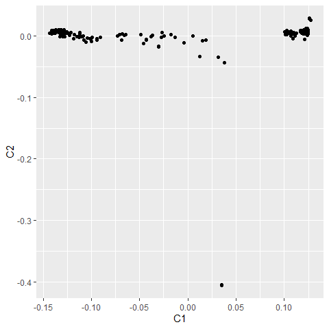
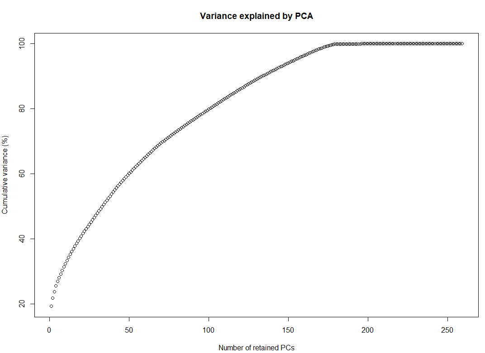
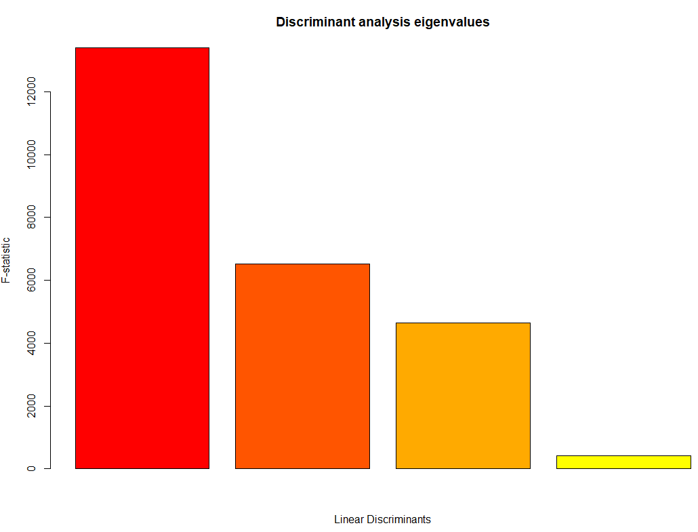
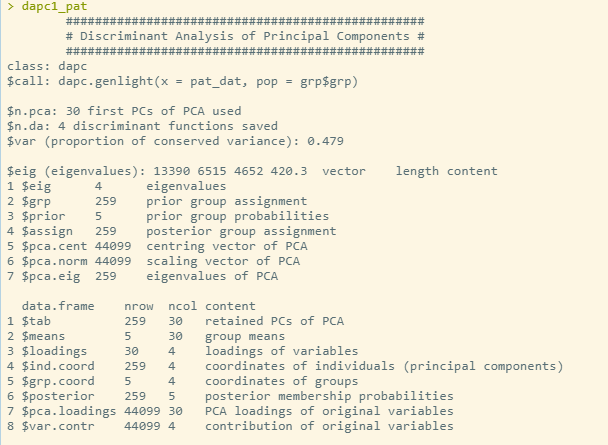
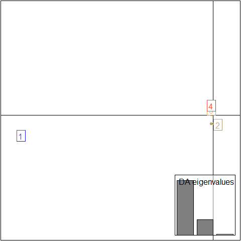
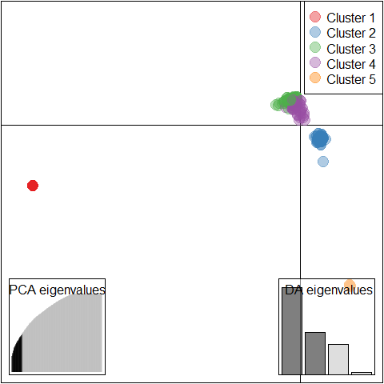
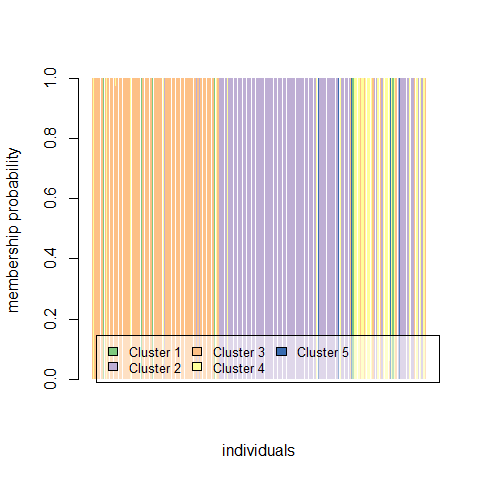

SNPChip\_Data\_Analysis\_with\_Plink\_and\_R
================
Bernice Waweru
Fri 09, Apr 2021

-   [Objective and information on
    data](#objective-and-information-on-data)
-   [Analysis with
    *`Plink, version 1.9 and 2.00-alpha`*](#analysis-with-plink-version-1.9-and-2.00-alpha)
    -   [Summary Statistics](#summary-statistics)
        -   [Allele frequencies](#allele-frequencies)
        -   [Missing rates for individuals and the
            SNPs](#missing-rates-for-individuals-and-the-snps)
        -   [Checking for Hardy-Weinberg equilibrium
            stats](#checking-for-hardy-weinberg-equilibrium-stats)
        -   [Filtering the data](#filtering-the-data)
    -   [Updating Chromosome and Map
        postions](#updating-chromosome-and-map-postions)
    -   [Prunning dataset to samples of
        interest](#prunning-dataset-to-samples-of-interest)
    -   [Prunning for Linkage
        Disequilibrium,](#prunning-for-linkage-disequilibrium)
        -   [Linkage disequilibrium based SNP
            pruning](#linkage-disequilibrium-based-snp-pruning)
    -   [Population Stratification](#population-stratification)
    -   [Analysis in R](#analysis-in-r)
        -   [Anlaysis of data with
            *Adegenet*](#anlaysis-of-data-with-adegenet)
            -   [Using `find.clusters`](#using-find.clusters)
            -   [Describing clusters using
                **DAPC**](#describing-clusters-using-dapc)
    -   [Session Info](#session-info)

# Objective and information on data

To analyze goat diversity with data generated through goat genome
SNP-Chip from Illumina through labogena. The goatiggc\_cons\_60k
SNP-Chip includes 53,347 SNPS typed on the samples.

Data on the hpc found here
`(/home/bngina/Fellows/goat\_diversity/orig\_data/oct\_2019)`

Original datset set file has 648 samples, as calculated from the `.ped`
file `(less -S orig\_data/oct\_2019/Caprin\_60k.ped \| wc -l)`

# Analysis with *`Plink, version 1.9 and 2.00-alpha`*

##### define path variables

File prefix of the `.map` and `.ped` file

`file='/home/bngina/Fellows/goat_diversity/orig_data/oct_2019/Caprin_60k'`

##### dir to store the output files generated during analysis

`out='/home/bngina/Fellows/goat_diversity/plink_out_march_2021'`

We begin by using plink/1.9 to check that the files are intact and to
convert to binary file.

This will check the number of SNPS and samples, and also generate a bed
file for the data, hence we work from within the directory we want to
store our output files

Load plink/1.9 to look at the details of the files and to convert the
file to a more compressed binary format.

    module load plink/1.9

    plink --file ${file} --out Caprin_60K_bed --make-bed

Load plink/2 to continue working with the binary data.

    module unload plink/1.9 

    module load plink/2.00-alpha

## Summary Statistics

**NOTE:** In Plink/2, SNPs reffered to as variants.

#### Allele frequencies

We use the flag `--freq`

    plink2 --bfile Caprin_60K_bed \
     --freq \
     --out allele_freq

The above generates a file with the frequencies and observed counts of
the SNPs typed in the population with the below headers. Below we see
the top 10 `sort -nr -k 5,5 allele_freq.afreq | head` and least 10
`sort -nr -k 5,5 allele_freq.afreq | tail`.

    #CHROM         ID                     REF     ALT   ALT_FREQS   OBS_CT
    0       snp8823-scaffold1317-218604     A       G       0.5     2564
    0       snp8794-scaffold1314-2010392    A       G       0.5     2556
    0       snp56012-scaffold871-208590     A       G       0.5     2544
    0       snp53930-scaffold820-710141     A       G       0.5     1668
    0       snp52500-scaffold782-2500441    A       G       0.5     2556
    0       snp52289-scaffold776-582920     A       G       0.5     2576
    0       snp50923-scaffold739-1458042    G       A       0.5     2556
    0       snp50117-scaffold717-2021905    A       G       0.5     2568
    0       snp49027-scaffold7-2780089      G       A       0.5     2572
    0       snp48682-scaffold691-1951001    A       G       0.5     2568
    0       snp10355-scaffold1370-924726    G       .       0       2580
    0       snp10256-scaffold1368-2065433   .       .       nan     0
    0       snp10205-scaffold1367-51738     .       .       nan     0
    0       snp10187-scaffold1365-698896    .       .       nan     0
    0       snp10136-scaffold1361-91495     .       .       nan     0
    0       snp10135-scaffold1361-44576     .       .       nan     0
    0       snp10134-scaffold1361-15149     .       .       nan     0
    0       snp1009-scaffold1026-942284     A       .       0       2572
    0       snp10058-scaffold1356-3300452   .       .       nan     0
    0       snp10054-scaffold1356-3088259   A       .       0       2592

#### Missing rates for individuals and the SNPs

    plink2 --bfile Caprin_60K_bed \
     --missing \
     --out missing

Generates two files with missing information for the samples and
variants/SNPs.

Sorting the file based on column 3, the count of missing data points, to
check the highest and lowest numbers

    sort -nr -k 3,3 missing.smiss | head -n 50

    #FID    IID                         MISSING_CT  OBS_CT  F_MISS
    259     WG6694110-DNA_F07_11zamb1       20635   53347   0.386807
    284     WG6694110-DNA_H08_11tshpo       20093   53347   0.376647
    631     WG6694114-DNA_G01_HKC32         16065   53347   0.301142
    622     WG6694114-DNA_F01_HKC24         15409   53347   0.288845
    595     WG6694114-DNA_C01_HKC21         15385   53347   0.288395

We see sample 259 has 20,635 (0.387%) missing data points out of 53,347
data points (SNPs).

    sort -nr -k 3,3 missing.smiss | tail -n 50

    #FID    IID                         MISSING_CT  OBS_CT  F_MISS
    494     WG6694113-DNA_B02_BDA_18        1184    53347   0.0221943
    437     WG6694112-DNA_E05_KSA_40        1184    53347   0.0221943
    125     WG6694109-DNA_C05_42marqz       1184    53347   0.0221943
    325     WG6694111-DNA_D01_45m           1183    53347   0.0221756
    362     WG6694111-DNA_G02_HKA_3         1182    53347   0.0221568

Sample 494 has the least number of missing data points 1,184 (0.02%) out
of 53,347 data points (SNPs).

FOr the SNPs typed on the individuals,

Sorting the file based on column 3, count of individuals/samples not
typed for the SNP

    sort -nr -k 3,3 missing.vmiss | head

    #CHROM                      ID      MISSING_CT  OBS_CT  F_MISS
    0       snp987-scaffold1025-3171329     648     648     1
    0       snp9858-scaffold1352-618287     648     648     1
    0       snp9687-scaffold1348-7500       648     648     1
    0       snp9476-scaffold1342-471521     648     648     1
    0       snp946-scaffold1025-1373747     648     648     1
    0       snp9250-scaffold1336-1582602    648     648     1
    0       snp9159-scaffold1334-2238       648     648     1
    0       snp914-scaffold1025-42929       648     648     1
    0       snp8960-scaffold1324-217800     648     648     1
    0       snp8953-scaffold1323-230029     648     648     1

Quite a number of SNPs were not typed in any of the individuals, lets
count this

    sort -nr -k 3,3 missing.vmiss | awk '{ if ($5 ==1) print $0}' |wc -l
    1054 

The opposite, where the SNP was typed on all the individuals/SNPs;


    #CHROM                      ID      MISSING_CT  OBS_CT  F_MISS
    0       snp10241-scaffold1368-1460228   0       648     0
    0       snp10239-scaffold1368-1386829   0       648     0
    0       snp10218-scaffold1368-459665    0       648     0
    0       snp1011-scaffold1027-73794      0       648     0
    0       snp10105-scaffold1358-1529451   0       648     0
    0       snp10098-scaffold1358-1225376   0       648     0
    0       snp10084-scaffold1358-510479    0       648     0
    0       snp10067-scaffold1357-62914     0       648     0
    0       snp10054-scaffold1356-3088259   0       648     0
    0       snp1000-scaffold1026-533890     0       648     0

Counting these;

     sort -nr -k 3,3 missing.vmiss | awk '{ if ($5 ==0) print $0}' |wc -l
    1776

#### Checking for Hardy-Weinberg equilibrium stats

    plink2 --bfile Caprin_60K_bed \
     --hardy \
     --out hardy

Generates a file with the `.hardy` extension. The headers in the file
are explained at the plink manual
[here](https://www.cog-genomics.org/plink/2.0/formats#hardy). Looking at
the first ten lines of this file;

    #CHROM  ID                              A1      AX  HOM_A1_CT HET_A1_CT TWO_AX_CT   O(HET_A1)       E(HET_A1)       P
    0       snp1-scaffold1-2170             A       C       212     248     184         0.385093        0.499055        7.09589e-09
    0       snp1-scaffold708-1421224        A       G       322     215     103         0.335938        0.441454        2.46662e-09
    0       snp10-scaffold1-352655          A       G       620     19      7           0.0294118       0.0497788       1.69894e-08
    0       snp1000-scaffold1026-533890     A       G       621     24      3           0.037037        0.0452246       0.00350414
    0       snp10000-scaffold1356-652219    G       A       508     120     16          0.186335        0.208171        0.0123839
    0       snp10001-scaffold1356-703514    A       G       460     130     49          0.203443        0.293152        1.12546e-12
    0       snp10002-scaffold1356-766996    A       C       335     209     94          0.327586        0.428655        4.42398e-09
    0       snp10003-scaffold1356-808120    G       A       291     218     134         0.339036        0.470191        2.07431e-12
    0       snp10004-scaffold1356-853276    G       A       418     157     70          0.243411        0.354451        5.37954e-14
    0       snp10005-scaffold1356-907019    G       A       380     177     89          0.273994        0.398541        1.35677e-14

#### Filtering the data

After looking at the summary statistics, we can generate a new file with
some filters to exclude, individuals with high values of missing data
points and SNPs/variants not typed in most of the samples. These filters
as below are described
[here](https://zzz.bwh.harvard.edu/plink/thresh.shtml)

    Feature                           As summary statistic      As inclusion criteria
    Missingness per individual          --missing                 --mind N
    Missingness per marker              --missing                 --geno N
    Allele frequency                      --freq                    --maf N
    Hardy-Weinberg equilibrium          --hardy                 --hwe N
    Mendel error rates                  --mendel                  --me N M

We focus on *mind*, *geno*, *maf*.

    plink2 --file ${file} \
     --mind 0.25 \ #any individual with more than 25% missing data will be excluded
     --geno 0.05 \ #any marker with less than 95% genotyping rate will be excluded
     --maf 0.01 \ #any marker with more than 1% minimum allele frequency will be excluded
     --make-bed \
     --out Caprin_60K_bed_fltrd 

The filtered file is generated, we can have a look a the plink log to
see what the result is;

    Start time: Tue Mar  9 13:46:47 2021
    128876 MiB RAM detected; reserving 64438 MiB for main workspace.
    Allocated 3627 MiB successfully, after larger attempt(s) failed.
    Using up to 4 compute threads.
    648 samples (0 females, 0 males, 648 ambiguous; 648 founders) loaded from
    Caprin_60K_bed.fam.
    53347 variants loaded from Caprin_60K_bed.bim.
    Note: No phenotype data present.
    Calculating sample missingness rates... done.
    11 samples removed due to missing genotype data (--mind).
    IDs written to Caprin_60K_bed_fltrd.mindrem.id .
    637 samples (0 females, 0 males, 637 ambiguous; 637 founders) remaining after
    main filters.
    Calculating allele frequencies... done.
    --geno: 2006 variants removed due to missing genotype data.
    2123 variants removed due to allele frequency threshold(s)
    (--maf/--max-maf/--mac/--max-mac).
    49218 variants remaining after main filters.
    Writing Caprin_60K_bed_fltrd.fam ... done.
    Writing Caprin_60K_bed_fltrd.bim ... done.
    Writing Caprin_60K_bed_fltrd.bed ... done.

*11* samples removed due to missing data points

*2,006* markers removed due to low genotyping rates

*2,123* markers removed due to high minor allele frequencies

**637** individuals/samples and **49,218** markers retained and written
to new bed file

## Updating Chromosome and Map postions

All through we have been working with a file in which the SNPs have no
chromosome positions, this needs to be updated for any useful analysis

A more recent version of the goat SNP chip was releases, version 65 with
about 59k markers, we attempt to use information from this to update the
chromosome and map information

From [here](http://www.goatgenome.org/projects.html), the above was
recently update January 22, 2021. We download this manifest,in `.csv`
format with below header lines, extract the map and chromosome
information.

    Illumina     Inc.
    [Heading]   
    Descriptor File Name    Goat_IGGC_65K_v2_15069617X365016_A2.bpm
    Assay Format    Infinium HD Ultra
    Date Manufactured   1/8/2021
    Loci Count  59,727

We open it in excel, remove the header lines and the below lines
describing the probes and colors

We then use `awk` to extract our fields of interest;

1.  The name of the SNP is in field 3,
2.  The chromosome position is in column 10
3.  And map position in column 11

<!-- -->

    awk -F ","  '{ print $2, $10 }' Goat_IGGC_65K_v2_150696172021_chrom_info.txt > jan_2021_chrom_info.txt

    awk -F ","  '{ print $2, $11 }' Goat_IGGC_65K_v2_150696172021_map_info.txt > jan_2021_map_info.txt

Check that both files have same number of lines;

    cat jan_2021_chrom_info.txt | wc -l
    59,727

    cat jan_2021_map_info.txt | wc -l
    59,727

Am curious whether there is a difference between this version and the
previous

> Only differnce is that the unplaced were all placed into one category
> each, X,Y,MT and NW.01

Now we update the map and chromosome values using plink/2;

The file with new SNP information does not need to feature all of the
SNPs in the current dataset: SNPs not in this file will be left
unchanged. If a SNP is listed more than once in the file, an error will
be reported

Also you cannot update more than one attribute at a time for SNPs, we
update the chromosome positions then the map positions.

    module unload plink/2.00-alpha

    module load plink/1.9

    # ===== update chromosome positions

    plink --bfile Caprin_60K_bed_fltrd \
     --update-chr  /home/bngina/Fellows/goat_diversity/Goat_65K_Chip_info_upd_Jan_22_2021/jan_2021_chrom_info.txt \
     --allow-extra-chr \
     --chr-set 29 \
     --make-bed \
     --out Caprin_60K_bed_fltrd_upd_chr
     
    # ===== update map postions
     
    plink --bfile Caprin_60K_bed_fltrd_upd_chr \
     --update-map  /home/bngina/Fellows/goat_diversity/Goat_65K_Chip_info_upd_Jan_22_2021/jan_2021_map_info.txt \
     --allow-extra-chr \
     --chr-set 29 \
     --make-bed \
     --out Caprin_60K_bed_fltrd_upd_chr_map

Both update same number of SNPs, the 10,509 were not present in out data
set hence were skipped

    --update-chr: 49218 values updated, 10509 variant IDs not present.
    --update-map: 49218 values updated, 10509 variant IDs not present.

How do we know that the genotype file was updated accordingly? The final
update map file looks like below with the chromosome and map positions
added;

    1       snp14099-scaffold1560-920888    0       47271   G       A
    1       snp14100-scaffold1560-986550    0       113316  G       A
    1       snp14101-scaffold1560-1032913   0       159328  A       G
    1       snp2819-scaffold1082-727669     0       212193  A       G
    1       snp2817-scaffold1082-658683     0       281100  A       G
    1       snp2816-scaffold1082-615033     0       324817  G       A
    1       snp2815-scaffold1082-557554     0       382409  A       G
    1       snp2814-scaffold1082-524695     0       415331  A       G
    1       snp2813-scaffold1082-483172     0       456935  A       C
    1       snp2812-scaffold1082-438570     0       496137  A       G
    1       snp2811-scaffold1082-402075     0       533477  A       G
    1       snp2810-scaffold1082-348665     0       586692  G       A

Maybe we can re-run the missing rate stats again check how it is?

    module unload plink/1.9 

    module load plink/2.00-alpha

    plink2 --bfile Caprin_60K_bed_fltrd_upd_chr_map \
     --missing \
     --out missing_upd

Checking, highest missing data points per marker is about 4.86%;

     sort -nr -k 3,3 missing_upd.vmiss | head -n 10
    8       snp43640-scaffold585-450758     31      637     0.0486656
    7       snp29929-scaffold3258-20924     31      637     0.0486656
    4       snp23481-scaffold2368-2834      31      637     0.0486656
    3       snp43600-scaffold582-438735     31      637     0.0486656
    2       snp7534-scaffold127-6580464     31      637     0.0486656
    2       snp50966-scaffold739-3280506    31      637     0.0486656
    24      snp13555-scaffold1525-98459     31      637     0.0486656
    23      snp37307-scaffold455-729229     31      637     0.0486656
    23      snp23985-scaffold2438-241842    31      637     0.0486656
    20      snp43205-scaffold575-696164     31      637     0.0486656

For samples, non is above 25% missing data

    sort -nr -k 3,3 missing_upd.smiss | head -n 10
    613     WG6694114-DNA_E01_HKC35 11850   49218   0.240766
    205     WG6694110-DNA_B01_29Bar2        10756   49218   0.218538
    139     WG6694109-DNA_D07_22Bar2        10728   49218   0.217969
    137     WG6694109-DNA_D05_23Bar1        10120   49218   0.205616
    604     WG6694114-DNA_D01_HKC23 8605    49218   0.174834
    515     WG6694113-DNA_C11_BDE25 8417    49218   0.171015
    517     WG6694113-DNA_D01_BDA_11        7663    49218   0.155695
    538     WG6694113-DNA_E10_BBD20 6312    49218   0.128246
    582     WG6694114-DNA_A06_BDB21 5412    49218   0.10996
    483     WG6694113-DNA_A03_BDA_32        5314    49218   0.107969

Both are match the filters we used to clean th data, okay good to go!!

## Prunning dataset to samples of interest

Next want to incorporate the phenotype data, hence we will prune our
data set to continue with only those samples for which we have phenotype
data.

Select the individuals with phenotype data only with below script. We
use a `.txt` document with the a list of individual names we want to
keep.

    plink2 --bfile Caprin_60K_bed_fltrd_upd_chr_map \
     --keep /home/bngina/Fellows/goat_diversity/patr_indv.txt \
     --out bin_patrick_2021 \
     --allow-extra-chr \
     --chr-set 29 \
     --make-bed \
     --threads 4

Results; we had duplicates in our list of IDs, hence we end up with a
dataset with **259** individuals

     Start time: Wed Mar 17 11:04:52 2021
    128876 MiB RAM detected; reserving 64438 MiB for main workspace.
    Allocated 3627 MiB successfully, after larger attempt(s) failed.
    Using up to 4 compute threads.
    637 samples (0 females, 0 males, 637 ambiguous; 637 founders) loaded from
    Caprin_60K_bed_fltrd_upd_chr_map.fam.
    49218 variants loaded from Caprin_60K_bed_fltrd_upd_chr_map.bim.
    Note: No phenotype data present.
    --keep: 259 samples remaining.
    Warning: At least 6 duplicate IDs in --keep file(s).
    259 samples (0 females, 0 males, 259 ambiguous; 259 founders) remaining after
    main filters.
    Writing bin_patrick_2021.fam ... done.
    Writing bin_patrick_2021.bim ... done.
    Writing bin_patrick_2021.bed ... done.

## Prunning for Linkage Disequilibrium,

*Interesting functions to look at LD with Plink*

`plink --file mydata --r2` \# calculate pairwise LD, for each SNP the
correlation between two variables,

By default, several filters on imposed on which pairwise calculations
are calculated and reported.

> To only analyse SNPs that are not more than 10 SNPs apart, for
> example, use the option (default is 10 SNPs) `--ld-window 10`

> To specify a kb window in addition (default 1Mb) `--ld-window-kb 1000`

> And to report only values above a particular value (this only applies
> when the –r2 and not the –r command is used) (default is 0.2)
> `--ld-window-r2 0.2`

The default for `--ld-window-r2` is set at *0.2* to reduce the size of
output files when many comparisons are made: to get all pairs reported,
set `--ld-window-r2` to *0*.

Obtaining a matrix of LD values;

Alternatively, it is possible to add the `--matrix` option, which
creates a matrix of LD values rather than a list: in this case, all SNP
pairs are calculated and reported, even for SNPs on different
chromosomes.

Note To force all SNP-by-SNP cross-chromosome comparisons with the
standard output format (e.g. without –matrix) add the flag
`--inter-chr`instead. This can be combined with `--ld-window-r2`, for
example to list all inter-chromosomal SNPs pairs with very high
R-squared values. Warning: this command could take an excessively long
time to run if applied to large datasets with many SNPs.

### Linkage disequilibrium based SNP pruning

Sometimes it is useful to generate a pruned subset of SNPs that are in
approximate linkage equilibrium with each other. This can be achieved
via two commands: `--indep` which prunes based on the variance inflation
factor (VIF), which recursively removes SNPs within a sliding window;
second,`--indep-pairwise` which is similar, except it is based only on
pairwise *genotypic correlation*.

The second procedure is performed:

`plink --file data --indep-pairwise 50 5 0.5`

The third parameter represents the *r^2* threshold. Note: this
represents the pairwise SNP-SNP metric now, not the multiple correlation
coefficient; also note, this is based on the genotypic correlation,
i.e. it does not involve phasing.

To give a concrete example: the command above that specifies *50 5 0.5*
would;

1.  consider a window of 50 SNPs,
2.  calculate LD between each pair of SNPs in the window,
3.  remove one of a pair of SNPs if the LD is greater than 0.5,
4.  shift the window 5 SNPs forward and repeat the procedure.

To make a new, pruned file, then use something like;

`plink --file data --extract plink.prune.in --make-bed --out pruneddata`

We will use the second procedure, considering the genoptypic correlation

    plink2 --bfile bin_patrick_2021 \
     --indep-pairwise 50 5 0.5 \ # removes one in a pair of SNPs if the LD is greater than 0.5
     --allow-extra-chr \
     --chr-set 29 \
     --out bin_patrick_2021_prnd \
     --threads 5

The log file give information as below;

    Start time: Wed Mar 17 12:25:55 2021
    386874 MiB RAM detected; reserving 193437 MiB for main workspace.
    Using up to 5 compute threads.
    259 samples (0 females, 0 males, 259 ambiguous; 259 founders) loaded from
    bin_patrick_2021.fam.
    49218 variants loaded from bin_patrick_2021.bim.
    Note: No phenotype data present.
    Calculating allele frequencies... done.
    --indep-pairwise (4 compute threads): 5119/49218 variants removed.
    Variant lists written to bin_patrick_2021_prnd.prune.in and
    bin_patrick_2021_prnd.prune.out .
    End time: Wed Mar 17 12:25:55 2021

**5,119** snps removed, we use the `--extract` to generate a binary file
with the snps without LD;

    plink2 --bfile --bfile bin_patrick_2021  \
     --extract bin_patrick_2021_prnd.prune.in \
     --allow-extra-chr \
     --chr-set 29 \
     --out --bfile bin_patrick_2021_prnd \
     --make-bed \
     --threads 5

The log file give information as below;

    Start time: Wed Mar 17 12:49:07 2021
    386874 MiB RAM detected; reserving 193437 MiB for main workspace.
    Using up to 5 compute threads.
    259 samples (0 females, 0 males, 259 ambiguous; 259 founders) loaded from
    bin_patrick_2021.fam.
    49218 variants loaded from bin_patrick_2021.bim.
    Note: No phenotype data present.
    --extract: 44099 variants remaining.
    44099 variants remaining after main filters.
    Writing bin_patrick_2021_prnd.fam ... done.
    Writing bin_patrick_2021_prnd.bim ... done.
    Writing bin_patrick_2021_prnd.bed ... done.
    End time: Wed Mar 17 12:49:08 2021

## Population Stratification

Now move on to perform clustering, to see whether we have any apparent
populations within the data set

We can add a few constraints to cluster the data;

1.  `--K 5` \# To request that the clustering process stops at a certain
    fixed number of clusters, i.e 5
2.  `--ppc 0.05` \# a simple significance test for whether two
    individuals belong to the same random-mating population. To only
    merge clusters that do not contain individuals differing at a
    certain p-value: i.e any pair of individuals who have a significance
    value of less than 0.05 for the test of whether or not the two
    individuals belong to the same population based on the available SNP
    data are not merged.
3.  `--mc 2` \# To set the maximum cluster size to a certain value,
    (this way you can see pairwise comparison p values, but you will
    have too many clusters, i.e Ks)

We start with just the p-value constraint (possible in plink/1.9)


    plink --bfile bin_patrick_2021_prnd \
     --cluster \
     --ppc 0.05 \
     --allow-extra-chr \
     --chr-set 29 \
     --out cluster_ppc_005 \
     --threads 5 

> This results in 76 clusters, with many individuals on being in a
> cluster by themselves, lets reduce the threshold of similarity to
> 0.001

     plink --bfile bin_patrick_2021_prnd \
     --cluster \
     --ppc 0.001 \
     --allow-extra-chr \
     --chr-set 29 \
     --out cluster_ppc_001 \
     --threads 5 

> Not any better, we see 55 clusters. Instead lets try using the
> `--K`constraint instead restricting it to 5 clusters

      plink --bfile bin_patrick_2021_prnd  \
     --cluster \
     --K 5 \
     --allow-extra-chr \
     --chr-set 29 \
     --out cluster_K5 \
     --threads 5 

Because we have forced the data into 5 clusters we obviously get five
clusters, not very useful

Lets cluster the individuals and have a matrix we can plot in R by
adding the `--mds-plot`

*To note:* Obviously, `--mds-cluster` will not give sensible results if
there are too few clusters, or if the clusters are too big.

     plink --bfile bin_patrick_2021_prnd \
     --cluster \
     --mds-plot 5 \
     --allow-extra-chr \
     --chr-set 29 \
     --out bin_patrick_2021_prnd_mds_5 \
     --threads 4

We will use the `bin_patrick_2021_prnd_mds_5.mds` in R to plot the
dimensions.

Additionally, we convert the pruned dataset to `.raw`for reading into R
for further population stratification analysis with various R packages.

    plink  --bfile bin_patrick_2021_prnd \
      --chr-set 29 \
      --recode A \
      
    # ===== we also need the map file so we convert to ordinary format to get it

    plink --bfile bin_patrick_2021_prnd --chr-set 29 --allow-extra-chr --recode --out bin_patrick_2021_prnd_NB

## Analysis in R

``` r
# ===== loading the data from plink on the clustering,
# ===== we simply converted the data into a txt file
mds_march <- read.table("C:/Users/BWaweru/OneDrive - CGIAR/Documents/Fellows/Goat_diversity_project_fellow/Patrick_Baenyi/plink_out/bin_patrick_2021_prnd_mds_5.mds.txt", header = T, sep = "\t")
# ===== checking that the column names are in-order, with 5 dimensions as we specified in the clustering
names(mds_march)
```

    ## [1] "FID" "IID" "SOL" "C1"  "C2"  "C3"  "C4"  "C5"

``` r
# ===== we use ggplot to get a simple scatter plot
require(ggplot2)

# ===== plot the first and second dimensions

mds_plot <- ggplot(mds_march, aes(x=C1, y=C2)) + geom_point()

print(mds_plot)
```

<!-- -->

``` r
# ===== initial plot shows we might have a few clusters, up to 6, with one sample being a clear outlier.

# ===== we add phenotype data to the plot to add more aesthetics to the plot, i.e color, and sample names.
```

### Anlaysis of data with [*Adegenet*](https://cran.r-project.org/web/packages/adegenet/adegenet.pdf)

We install the packages *adegenet* and *pegas* that we will require to
look into population structure. We will make use of the data that we
saved from the plink pipeline.

``` r
#install.packages("adegenet", lib = "C:/R/R-4.0.3/library/")

#install.packages("pegas", lib = "C:/R/R-4.0.3/library/")

require(adegenet)
require(pegas)
setwd("C:/Users/BWaweru/OneDrive - CGIAR/Documents/Fellows/Goat_diversity_project_fellow/Patrick_Baenyi/RWD/2021_Work_Repo")

# ===== load the data and save it as an RData object
#read.PLINK("data-raw/plink.raw", map.file = "data-raw/bin_patrick_2021_prnd_NB.map")
```

Internally most `adegenet` functions will call the tool parallel to try
and maximize the number of core available for its use to run the jobs in
parallel i.e multi-thread.

    Error in mclapply(levels(fac.block), function(lev) x[, which(fac.block ==  : 
      'mc.cores' > 1 is not supported on Windows

Add the arguments `parallel=FALSE` to avoid getting the above error.
Found this solution
[here](https://github.com/thibautjombart/adegenet/issues/126).

``` r
read.PLINK("data-raw/plink.raw", map.file = "data-raw/bin_patrick_2021_prnd_NB.map", parallel = FALSE) -> pat_dat
```

    ## 
    ##  Reading PLINK raw format into a genlight object... 
    ## 
    ## 
    ##  Reading loci information... 
    ## 
    ##  Reading and converting genotypes... 
    ## .
    ##  Building final object... 
    ## 
    ## ...done.

``` r
# ===== save data for easy loading next time

save(pat_dat, file = "results/pat_data.RData") # much lighter, only 2.8Mb, original data is 23.1 Mb + 1.8 Mb
```

Check that the loaded data is okay

``` r
# ==== summary
pat_dat
```

    ##  /// GENLIGHT OBJECT /////////
    ## 
    ##  // 259 genotypes,  44,099 binary SNPs, size: 7.3 Mb
    ##  43188 (0.38 %) missing data
    ## 
    ##  // Basic content
    ##    @gen: list of 259 SNPbin
    ##    @ploidy: ploidy of each individual  (range: 2-2)
    ## 
    ##  // Optional content
    ##    @ind.names:  259 individual labels
    ##    @loc.names:  44099 locus labels
    ##    @chromosome: factor storing chromosomes of the SNPs
    ##    @position: integer storing positions of the SNPs
    ##    @pop: population of each individual (group size range: 1-1)
    ##    @other: a list containing: sex  phenotype  pat  mat

``` r
# ==== individual names

indNames(pat_dat)[1:10]
```

    ##  [1] "WG6694108-DNA_A01_110kin"  "WG6694108-DNA_A02_105kin1"
    ##  [3] "WG6694108-DNA_A03_55kin"   "WG6694108-DNA_A04_50kin"  
    ##  [5] "WG6694108-DNA_A05_104kin"  "WG6694108-DNA_A06_82kin"  
    ##  [7] "WG6694108-DNA_A07_75kin1"  "WG6694108-DNA_A08_110kin1"
    ##  [9] "WG6694108-DNA_A09_77kin"   "WG6694108-DNA_A10_Zkin2"

``` r
# ===== loci names

locNames(pat_dat)[1:10]
```

    ##  [1] "snp14099-scaffold1560-920888_G"  "snp14100-scaffold1560-986550_G" 
    ##  [3] "snp14101-scaffold1560-1032913_A" "snp2819-scaffold1082-727669_A"  
    ##  [5] "snp2817-scaffold1082-658683_A"   "snp2816-scaffold1082-615033_G"  
    ##  [7] "snp2815-scaffold1082-557554_A"   "snp2812-scaffold1082-438570_A"  
    ##  [9] "snp2810-scaffold1082-348665_G"   "snp2809-scaffold1082-312463_A"

#### Using `find.clusters`

This function first transforms the data using PCA, asking the user to
specify the number of retained PCs interactively unless the argument
`n.pca` is provided.

We use `find.clusters` to identify potential clusters within our
dataset, although as of now the true clusters are unknown. We evaluate
*k= 20* clusters, a theoretical value, with `max.n.clust = 40`

``` r
 grp <- find.clusters(pat_dat, max.n.clust = 20) 
# ==== above command takes quite a while and is interactive

# ===== because this take long and requires interactively selecting the number of pcs and clusters to keep, we save the grp objects as an RData file

# ===== we can then load when we need to use it downstream

save(grp, file = "results/grp.RData")
```

The function displays a graph of cumulated variance explained by the
eigenvalues of the PCA.


We selected to keep 200 PCs, this value is probably too high, but as it
is the first trial, we can go lower next time.

It also displays a graph of BIC values for increasing values of k, i,e
the clusters, where selected to keep 5 clusters, as that is where there
seems to be a clear elbow,


Additionally, the output store in `grp` is a list

``` r
load("results/grp.RData")
names(grp)
```

    ## [1] "Kstat" "stat"  "grp"   "size"

Assigned groups are stored under `grp$grp`, as per the 5 clusters we
chose to keep

``` r
grp$grp[1:10]
```

    ##  WG6694108-DNA_A01_110kin WG6694108-DNA_A02_105kin1   WG6694108-DNA_A03_55kin 
    ##                         3                         4                         3 
    ##   WG6694108-DNA_A04_50kin  WG6694108-DNA_A05_104kin   WG6694108-DNA_A06_82kin 
    ##                         3                         3                         3 
    ##  WG6694108-DNA_A07_75kin1 WG6694108-DNA_A08_110kin1   WG6694108-DNA_A09_77kin 
    ##                         3                         3                         3 
    ##   WG6694108-DNA_A10_Zkin2 
    ##                         1 
    ## Levels: 1 2 3 4 5

#### Describing clusters using **DAPC**

[`DAPC`](https://bmcgenomdata.biomedcentral.com/articles/10.1186/1471-2156-11-94)
was pioneered by Jombart and colleagues (Jombart et al., 2010) and can
be used to infer the number of clusters of genetically related
individuals. In this multivariate statistical approach variance in the
sample is partitioned into a between-group and within- group component,
in an effort to maximize discrimination between groups. In DAPC, data is
first transformed using a principal components analysis (PCA) and
subsequently clusters are identified using discriminant analysis (DA).

In *adegenet*, it is implemented with the function `dapc`. We run it on
our data using the inferred groups stores un `grp$grp`

``` r
# ==== load the grp object
dapc1_pat <- dapc(pat_dat, grp$grp)
```

The method displays the same graph of cumulated variance as in
`find.cluster`. However, unlike k-means, DAPC can benefit from not using
too many PCs. The bottom-line is therefore retaining a few PCs without
sacrificing too much information. We see very little information gained
by adding PC’s after around 30, hence we retain 30.



The method also displays a barplot of eigen-values for the discriminant
analysis asking for number of discriminant function to keep, we keep all
4.



The object dapc1\_pat contains a lot of information:



``` r
dapc1_pat

# ===== we also save the object so we can call into memomry whenever we need to use it

save(dapc1_pat, file = "./results/dapc1_pat.RData")
```

Essentially, the slots `ind.coord` and `grp.coord` contain the
coordinates of then individuals and of the groups used in scatter plots.
Basic scatter plots can be obtained using the function `scatterplot`:

``` r
load("./results/dapc1_pat.RData")

scatter(dapc1_pat)
```

<!-- -->

``` r
# ===== a bit customization for a more readable plot
require(RColorBrewer)
myCol <-  brewer.pal(5, "Set1") # choose some colors

scatter(dapc1_pat, scree.da=TRUE,scree.pca = TRUE, bg="white", pch=20, cell=0, cstar=0, col=myCol, solid=.4, cex=3,clab=0, leg=TRUE, txt.leg=paste("Cluster",1:5))
```

<!-- -->

It appears that we have 3 main clusters and two clusters that could
probably be outliers.

We can explore this a bit further with caution. In the manual it states
*caution should be taken when interpreting group memberships of a DAPC
based on too many PCs, as there are risks of over-fitting the
discriminant functions*

We kept 30 PCs and 4 discriminant functions.

Let’s look at a summary of the dapc object

``` r
summary(dapc1_pat)
```

    ## $n.dim
    ## [1] 4
    ## 
    ## $n.pop
    ## [1] 5
    ## 
    ## $assign.prop
    ## [1] 0.996139
    ## 
    ## $assign.per.pop
    ##         1         2         3         4         5 
    ## 1.0000000 1.0000000 1.0000000 0.9714286 1.0000000 
    ## 
    ## $prior.grp.size
    ## 
    ##   1   2   3   4   5 
    ##   6 117  96  35   5 
    ## 
    ## $post.grp.size
    ## 
    ##   1   2   3   4   5 
    ##   6 117  97  34   5

Average assignment proportion, `assign.prop`, is quite high, 0.996.
Looking closely at the assignment values;

``` r
round(dapc1_pat$posterior,3) -> assgn_values

kableExtra::kable(assgn_values, caption = "Proportions of successful assgnemnt of individuals")
```

<table>
<caption>
Proportions of successful assgnemnt of individuals
</caption>
<thead>
<tr>
<th style="text-align:left;">
</th>
<th style="text-align:right;">
1
</th>
<th style="text-align:right;">
2
</th>
<th style="text-align:right;">
3
</th>
<th style="text-align:right;">
4
</th>
<th style="text-align:right;">
5
</th>
</tr>
</thead>
<tbody>
<tr>
<td style="text-align:left;">
WG6694108-DNA\_A01\_110kin
</td>
<td style="text-align:right;">
0
</td>
<td style="text-align:right;">
0
</td>
<td style="text-align:right;">
1.000
</td>
<td style="text-align:right;">
0.000
</td>
<td style="text-align:right;">
0
</td>
</tr>
<tr>
<td style="text-align:left;">
WG6694108-DNA\_A02\_105kin1
</td>
<td style="text-align:right;">
0
</td>
<td style="text-align:right;">
0
</td>
<td style="text-align:right;">
0.000
</td>
<td style="text-align:right;">
1.000
</td>
<td style="text-align:right;">
0
</td>
</tr>
<tr>
<td style="text-align:left;">
WG6694108-DNA\_A03\_55kin
</td>
<td style="text-align:right;">
0
</td>
<td style="text-align:right;">
0
</td>
<td style="text-align:right;">
1.000
</td>
<td style="text-align:right;">
0.000
</td>
<td style="text-align:right;">
0
</td>
</tr>
<tr>
<td style="text-align:left;">
WG6694108-DNA\_A04\_50kin
</td>
<td style="text-align:right;">
0
</td>
<td style="text-align:right;">
0
</td>
<td style="text-align:right;">
1.000
</td>
<td style="text-align:right;">
0.000
</td>
<td style="text-align:right;">
0
</td>
</tr>
<tr>
<td style="text-align:left;">
WG6694108-DNA\_A05\_104kin
</td>
<td style="text-align:right;">
0
</td>
<td style="text-align:right;">
0
</td>
<td style="text-align:right;">
1.000
</td>
<td style="text-align:right;">
0.000
</td>
<td style="text-align:right;">
0
</td>
</tr>
<tr>
<td style="text-align:left;">
WG6694108-DNA\_A06\_82kin
</td>
<td style="text-align:right;">
0
</td>
<td style="text-align:right;">
0
</td>
<td style="text-align:right;">
1.000
</td>
<td style="text-align:right;">
0.000
</td>
<td style="text-align:right;">
0
</td>
</tr>
<tr>
<td style="text-align:left;">
WG6694108-DNA\_A07\_75kin1
</td>
<td style="text-align:right;">
0
</td>
<td style="text-align:right;">
0
</td>
<td style="text-align:right;">
1.000
</td>
<td style="text-align:right;">
0.000
</td>
<td style="text-align:right;">
0
</td>
</tr>
<tr>
<td style="text-align:left;">
WG6694108-DNA\_A08\_110kin1
</td>
<td style="text-align:right;">
0
</td>
<td style="text-align:right;">
0
</td>
<td style="text-align:right;">
1.000
</td>
<td style="text-align:right;">
0.000
</td>
<td style="text-align:right;">
0
</td>
</tr>
<tr>
<td style="text-align:left;">
WG6694108-DNA\_A09\_77kin
</td>
<td style="text-align:right;">
0
</td>
<td style="text-align:right;">
0
</td>
<td style="text-align:right;">
1.000
</td>
<td style="text-align:right;">
0.000
</td>
<td style="text-align:right;">
0
</td>
</tr>
<tr>
<td style="text-align:left;">
WG6694108-DNA\_A10\_Zkin2
</td>
<td style="text-align:right;">
1
</td>
<td style="text-align:right;">
0
</td>
<td style="text-align:right;">
0.000
</td>
<td style="text-align:right;">
0.000
</td>
<td style="text-align:right;">
0
</td>
</tr>
<tr>
<td style="text-align:left;">
WG6694108-DNA\_A11\_51kin2
</td>
<td style="text-align:right;">
0
</td>
<td style="text-align:right;">
0
</td>
<td style="text-align:right;">
1.000
</td>
<td style="text-align:right;">
0.000
</td>
<td style="text-align:right;">
0
</td>
</tr>
<tr>
<td style="text-align:left;">
WG6694108-DNA\_A12\_83kin1
</td>
<td style="text-align:right;">
0
</td>
<td style="text-align:right;">
0
</td>
<td style="text-align:right;">
0.000
</td>
<td style="text-align:right;">
1.000
</td>
<td style="text-align:right;">
0
</td>
</tr>
<tr>
<td style="text-align:left;">
WG6694108-DNA\_B01\_21kinX1
</td>
<td style="text-align:right;">
0
</td>
<td style="text-align:right;">
0
</td>
<td style="text-align:right;">
1.000
</td>
<td style="text-align:right;">
0.000
</td>
<td style="text-align:right;">
0
</td>
</tr>
<tr>
<td style="text-align:left;">
WG6694108-DNA\_B02\_21kin1
</td>
<td style="text-align:right;">
0
</td>
<td style="text-align:right;">
0
</td>
<td style="text-align:right;">
1.000
</td>
<td style="text-align:right;">
0.000
</td>
<td style="text-align:right;">
0
</td>
</tr>
<tr>
<td style="text-align:left;">
WG6694108-DNA\_B03\_78kin1
</td>
<td style="text-align:right;">
0
</td>
<td style="text-align:right;">
0
</td>
<td style="text-align:right;">
1.000
</td>
<td style="text-align:right;">
0.000
</td>
<td style="text-align:right;">
0
</td>
</tr>
<tr>
<td style="text-align:left;">
WG6694108-DNA\_B04\_101kin1
</td>
<td style="text-align:right;">
0
</td>
<td style="text-align:right;">
0
</td>
<td style="text-align:right;">
1.000
</td>
<td style="text-align:right;">
0.000
</td>
<td style="text-align:right;">
0
</td>
</tr>
<tr>
<td style="text-align:left;">
WG6694108-DNA\_B05\_75kinX1
</td>
<td style="text-align:right;">
0
</td>
<td style="text-align:right;">
0
</td>
<td style="text-align:right;">
1.000
</td>
<td style="text-align:right;">
0.000
</td>
<td style="text-align:right;">
0
</td>
</tr>
<tr>
<td style="text-align:left;">
WG6694108-DNA\_B06\_30kin2
</td>
<td style="text-align:right;">
0
</td>
<td style="text-align:right;">
0
</td>
<td style="text-align:right;">
1.000
</td>
<td style="text-align:right;">
0.000
</td>
<td style="text-align:right;">
0
</td>
</tr>
<tr>
<td style="text-align:left;">
WG6694108-DNA\_B07\_80kin2
</td>
<td style="text-align:right;">
0
</td>
<td style="text-align:right;">
0
</td>
<td style="text-align:right;">
0.975
</td>
<td style="text-align:right;">
0.025
</td>
<td style="text-align:right;">
0
</td>
</tr>
<tr>
<td style="text-align:left;">
WG6694108-DNA\_B08\_31kin2
</td>
<td style="text-align:right;">
0
</td>
<td style="text-align:right;">
0
</td>
<td style="text-align:right;">
1.000
</td>
<td style="text-align:right;">
0.000
</td>
<td style="text-align:right;">
0
</td>
</tr>
<tr>
<td style="text-align:left;">
WG6694108-DNA\_B09\_12kin2
</td>
<td style="text-align:right;">
0
</td>
<td style="text-align:right;">
0
</td>
<td style="text-align:right;">
1.000
</td>
<td style="text-align:right;">
0.000
</td>
<td style="text-align:right;">
0
</td>
</tr>
<tr>
<td style="text-align:left;">
WG6694108-DNA\_B11\_16kin2
</td>
<td style="text-align:right;">
0
</td>
<td style="text-align:right;">
0
</td>
<td style="text-align:right;">
1.000
</td>
<td style="text-align:right;">
0.000
</td>
<td style="text-align:right;">
0
</td>
</tr>
<tr>
<td style="text-align:left;">
WG6694108-DNA\_B12\_4kin1
</td>
<td style="text-align:right;">
0
</td>
<td style="text-align:right;">
0
</td>
<td style="text-align:right;">
1.000
</td>
<td style="text-align:right;">
0.000
</td>
<td style="text-align:right;">
0
</td>
</tr>
<tr>
<td style="text-align:left;">
WG6694108-DNA\_C01\_XYkin1
</td>
<td style="text-align:right;">
0
</td>
<td style="text-align:right;">
0
</td>
<td style="text-align:right;">
1.000
</td>
<td style="text-align:right;">
0.000
</td>
<td style="text-align:right;">
0
</td>
</tr>
<tr>
<td style="text-align:left;">
WG6694108-DNA\_C02\_36kin2
</td>
<td style="text-align:right;">
0
</td>
<td style="text-align:right;">
0
</td>
<td style="text-align:right;">
1.000
</td>
<td style="text-align:right;">
0.000
</td>
<td style="text-align:right;">
0
</td>
</tr>
<tr>
<td style="text-align:left;">
WG6694108-DNA\_C03\_29kin2
</td>
<td style="text-align:right;">
0
</td>
<td style="text-align:right;">
0
</td>
<td style="text-align:right;">
1.000
</td>
<td style="text-align:right;">
0.000
</td>
<td style="text-align:right;">
0
</td>
</tr>
<tr>
<td style="text-align:left;">
WG6694108-DNA\_C04\_52kin1
</td>
<td style="text-align:right;">
0
</td>
<td style="text-align:right;">
0
</td>
<td style="text-align:right;">
1.000
</td>
<td style="text-align:right;">
0.000
</td>
<td style="text-align:right;">
0
</td>
</tr>
<tr>
<td style="text-align:left;">
WG6694108-DNA\_C05\_58kin
</td>
<td style="text-align:right;">
0
</td>
<td style="text-align:right;">
0
</td>
<td style="text-align:right;">
1.000
</td>
<td style="text-align:right;">
0.000
</td>
<td style="text-align:right;">
0
</td>
</tr>
<tr>
<td style="text-align:left;">
WG6694108-DNA\_C06\_9kin2
</td>
<td style="text-align:right;">
0
</td>
<td style="text-align:right;">
0
</td>
<td style="text-align:right;">
1.000
</td>
<td style="text-align:right;">
0.000
</td>
<td style="text-align:right;">
0
</td>
</tr>
<tr>
<td style="text-align:left;">
WG6694108-DNA\_C08\_61kin1
</td>
<td style="text-align:right;">
0
</td>
<td style="text-align:right;">
0
</td>
<td style="text-align:right;">
1.000
</td>
<td style="text-align:right;">
0.000
</td>
<td style="text-align:right;">
0
</td>
</tr>
<tr>
<td style="text-align:left;">
WG6694108-DNA\_C10\_33kin1
</td>
<td style="text-align:right;">
0
</td>
<td style="text-align:right;">
0
</td>
<td style="text-align:right;">
0.000
</td>
<td style="text-align:right;">
1.000
</td>
<td style="text-align:right;">
0
</td>
</tr>
<tr>
<td style="text-align:left;">
WG6694108-DNA\_C12\_63kin1
</td>
<td style="text-align:right;">
0
</td>
<td style="text-align:right;">
0
</td>
<td style="text-align:right;">
1.000
</td>
<td style="text-align:right;">
0.000
</td>
<td style="text-align:right;">
0
</td>
</tr>
<tr>
<td style="text-align:left;">
WG6694108-DNA\_D01\_104kin2
</td>
<td style="text-align:right;">
0
</td>
<td style="text-align:right;">
0
</td>
<td style="text-align:right;">
1.000
</td>
<td style="text-align:right;">
0.000
</td>
<td style="text-align:right;">
0
</td>
</tr>
<tr>
<td style="text-align:left;">
WG6694108-DNA\_D02\_19kin2
</td>
<td style="text-align:right;">
0
</td>
<td style="text-align:right;">
0
</td>
<td style="text-align:right;">
1.000
</td>
<td style="text-align:right;">
0.000
</td>
<td style="text-align:right;">
0
</td>
</tr>
<tr>
<td style="text-align:left;">
WG6694108-DNA\_D03\_13kin25-1
</td>
<td style="text-align:right;">
0
</td>
<td style="text-align:right;">
0
</td>
<td style="text-align:right;">
1.000
</td>
<td style="text-align:right;">
0.000
</td>
<td style="text-align:right;">
0
</td>
</tr>
<tr>
<td style="text-align:left;">
WG6694108-DNA\_D04\_41kin1
</td>
<td style="text-align:right;">
0
</td>
<td style="text-align:right;">
0
</td>
<td style="text-align:right;">
1.000
</td>
<td style="text-align:right;">
0.000
</td>
<td style="text-align:right;">
0
</td>
</tr>
<tr>
<td style="text-align:left;">
WG6694108-DNA\_D05\_30kinX1
</td>
<td style="text-align:right;">
0
</td>
<td style="text-align:right;">
0
</td>
<td style="text-align:right;">
1.000
</td>
<td style="text-align:right;">
0.000
</td>
<td style="text-align:right;">
0
</td>
</tr>
<tr>
<td style="text-align:left;">
WG6694108-DNA\_D06\_16kin1
</td>
<td style="text-align:right;">
0
</td>
<td style="text-align:right;">
0
</td>
<td style="text-align:right;">
1.000
</td>
<td style="text-align:right;">
0.000
</td>
<td style="text-align:right;">
0
</td>
</tr>
<tr>
<td style="text-align:left;">
WG6694108-DNA\_D07\_ZkinX1
</td>
<td style="text-align:right;">
1
</td>
<td style="text-align:right;">
0
</td>
<td style="text-align:right;">
0.000
</td>
<td style="text-align:right;">
0.000
</td>
<td style="text-align:right;">
0
</td>
</tr>
<tr>
<td style="text-align:left;">
WG6694108-DNA\_D08\_50kinZ
</td>
<td style="text-align:right;">
0
</td>
<td style="text-align:right;">
0
</td>
<td style="text-align:right;">
1.000
</td>
<td style="text-align:right;">
0.000
</td>
<td style="text-align:right;">
0
</td>
</tr>
<tr>
<td style="text-align:left;">
WG6694108-DNA\_D09\_75kin
</td>
<td style="text-align:right;">
0
</td>
<td style="text-align:right;">
0
</td>
<td style="text-align:right;">
1.000
</td>
<td style="text-align:right;">
0.000
</td>
<td style="text-align:right;">
0
</td>
</tr>
<tr>
<td style="text-align:left;">
WG6694108-DNA\_D12\_50kin1
</td>
<td style="text-align:right;">
0
</td>
<td style="text-align:right;">
0
</td>
<td style="text-align:right;">
1.000
</td>
<td style="text-align:right;">
0.000
</td>
<td style="text-align:right;">
0
</td>
</tr>
<tr>
<td style="text-align:left;">
WG6694108-DNA\_E01\_81kin
</td>
<td style="text-align:right;">
0
</td>
<td style="text-align:right;">
0
</td>
<td style="text-align:right;">
1.000
</td>
<td style="text-align:right;">
0.000
</td>
<td style="text-align:right;">
0
</td>
</tr>
<tr>
<td style="text-align:left;">
WG6694108-DNA\_E02\_28kin\_dil
</td>
<td style="text-align:right;">
0
</td>
<td style="text-align:right;">
0
</td>
<td style="text-align:right;">
1.000
</td>
<td style="text-align:right;">
0.000
</td>
<td style="text-align:right;">
0
</td>
</tr>
<tr>
<td style="text-align:left;">
WG6694108-DNA\_E03\_110kin2
</td>
<td style="text-align:right;">
0
</td>
<td style="text-align:right;">
0
</td>
<td style="text-align:right;">
1.000
</td>
<td style="text-align:right;">
0.000
</td>
<td style="text-align:right;">
0
</td>
</tr>
<tr>
<td style="text-align:left;">
WG6694108-DNA\_E04\_31Xkin1
</td>
<td style="text-align:right;">
0
</td>
<td style="text-align:right;">
0
</td>
<td style="text-align:right;">
1.000
</td>
<td style="text-align:right;">
0.000
</td>
<td style="text-align:right;">
0
</td>
</tr>
<tr>
<td style="text-align:left;">
WG6694108-DNA\_E06\_25kin1
</td>
<td style="text-align:right;">
0
</td>
<td style="text-align:right;">
0
</td>
<td style="text-align:right;">
1.000
</td>
<td style="text-align:right;">
0.000
</td>
<td style="text-align:right;">
0
</td>
</tr>
<tr>
<td style="text-align:left;">
WG6694108-DNA\_E07\_Z-Xkin1
</td>
<td style="text-align:right;">
1
</td>
<td style="text-align:right;">
0
</td>
<td style="text-align:right;">
0.000
</td>
<td style="text-align:right;">
0.000
</td>
<td style="text-align:right;">
0
</td>
</tr>
<tr>
<td style="text-align:left;">
WG6694108-DNA\_E10\_31kinX1
</td>
<td style="text-align:right;">
0
</td>
<td style="text-align:right;">
0
</td>
<td style="text-align:right;">
1.000
</td>
<td style="text-align:right;">
0.000
</td>
<td style="text-align:right;">
0
</td>
</tr>
<tr>
<td style="text-align:left;">
WG6694108-DNA\_E11\_72kin2
</td>
<td style="text-align:right;">
0
</td>
<td style="text-align:right;">
0
</td>
<td style="text-align:right;">
1.000
</td>
<td style="text-align:right;">
0.000
</td>
<td style="text-align:right;">
0
</td>
</tr>
<tr>
<td style="text-align:left;">
WG6694108-DNA\_E12\_37kin1
</td>
<td style="text-align:right;">
0
</td>
<td style="text-align:right;">
0
</td>
<td style="text-align:right;">
1.000
</td>
<td style="text-align:right;">
0.000
</td>
<td style="text-align:right;">
0
</td>
</tr>
<tr>
<td style="text-align:left;">
WG6694108-DNA\_F01\_25kin1x
</td>
<td style="text-align:right;">
0
</td>
<td style="text-align:right;">
0
</td>
<td style="text-align:right;">
1.000
</td>
<td style="text-align:right;">
0.000
</td>
<td style="text-align:right;">
0
</td>
</tr>
<tr>
<td style="text-align:left;">
WG6694108-DNA\_F02\_13kin26-1
</td>
<td style="text-align:right;">
0
</td>
<td style="text-align:right;">
0
</td>
<td style="text-align:right;">
1.000
</td>
<td style="text-align:right;">
0.000
</td>
<td style="text-align:right;">
0
</td>
</tr>
<tr>
<td style="text-align:left;">
WG6694108-DNA\_F03\_72kin1
</td>
<td style="text-align:right;">
0
</td>
<td style="text-align:right;">
0
</td>
<td style="text-align:right;">
1.000
</td>
<td style="text-align:right;">
0.000
</td>
<td style="text-align:right;">
0
</td>
</tr>
<tr>
<td style="text-align:left;">
WG6694108-DNA\_F04\_82kin1
</td>
<td style="text-align:right;">
0
</td>
<td style="text-align:right;">
0
</td>
<td style="text-align:right;">
1.000
</td>
<td style="text-align:right;">
0.000
</td>
<td style="text-align:right;">
0
</td>
</tr>
<tr>
<td style="text-align:left;">
WG6694108-DNA\_F05\_102kin
</td>
<td style="text-align:right;">
0
</td>
<td style="text-align:right;">
0
</td>
<td style="text-align:right;">
0.049
</td>
<td style="text-align:right;">
0.951
</td>
<td style="text-align:right;">
0
</td>
</tr>
<tr>
<td style="text-align:left;">
WG6694108-DNA\_F06\_1kin
</td>
<td style="text-align:right;">
0
</td>
<td style="text-align:right;">
1
</td>
<td style="text-align:right;">
0.000
</td>
<td style="text-align:right;">
0.000
</td>
<td style="text-align:right;">
0
</td>
</tr>
<tr>
<td style="text-align:left;">
WG6694108-DNA\_F07\_46kin1
</td>
<td style="text-align:right;">
0
</td>
<td style="text-align:right;">
0
</td>
<td style="text-align:right;">
1.000
</td>
<td style="text-align:right;">
0.000
</td>
<td style="text-align:right;">
0
</td>
</tr>
<tr>
<td style="text-align:left;">
WG6694108-DNA\_F08\_96kin1
</td>
<td style="text-align:right;">
0
</td>
<td style="text-align:right;">
0
</td>
<td style="text-align:right;">
1.000
</td>
<td style="text-align:right;">
0.000
</td>
<td style="text-align:right;">
0
</td>
</tr>
<tr>
<td style="text-align:left;">
WG6694108-DNA\_F09\_21kinP
</td>
<td style="text-align:right;">
0
</td>
<td style="text-align:right;">
0
</td>
<td style="text-align:right;">
1.000
</td>
<td style="text-align:right;">
0.000
</td>
<td style="text-align:right;">
0
</td>
</tr>
<tr>
<td style="text-align:left;">
WG6694108-DNA\_F10\_81kin1
</td>
<td style="text-align:right;">
0
</td>
<td style="text-align:right;">
0
</td>
<td style="text-align:right;">
1.000
</td>
<td style="text-align:right;">
0.000
</td>
<td style="text-align:right;">
0
</td>
</tr>
<tr>
<td style="text-align:left;">
WG6694108-DNA\_F11\_99kin1
</td>
<td style="text-align:right;">
0
</td>
<td style="text-align:right;">
0
</td>
<td style="text-align:right;">
1.000
</td>
<td style="text-align:right;">
0.000
</td>
<td style="text-align:right;">
0
</td>
</tr>
<tr>
<td style="text-align:left;">
WG6694108-DNA\_F12\_30kin1Z
</td>
<td style="text-align:right;">
0
</td>
<td style="text-align:right;">
0
</td>
<td style="text-align:right;">
1.000
</td>
<td style="text-align:right;">
0.000
</td>
<td style="text-align:right;">
0
</td>
</tr>
<tr>
<td style="text-align:left;">
WG6694108-DNA\_G01\_57kin
</td>
<td style="text-align:right;">
0
</td>
<td style="text-align:right;">
0
</td>
<td style="text-align:right;">
1.000
</td>
<td style="text-align:right;">
0.000
</td>
<td style="text-align:right;">
0
</td>
</tr>
<tr>
<td style="text-align:left;">
WG6694108-DNA\_G02\_51kin1
</td>
<td style="text-align:right;">
0
</td>
<td style="text-align:right;">
0
</td>
<td style="text-align:right;">
1.000
</td>
<td style="text-align:right;">
0.000
</td>
<td style="text-align:right;">
0
</td>
</tr>
<tr>
<td style="text-align:left;">
WG6694108-DNA\_G03\_53kin1
</td>
<td style="text-align:right;">
0
</td>
<td style="text-align:right;">
0
</td>
<td style="text-align:right;">
1.000
</td>
<td style="text-align:right;">
0.000
</td>
<td style="text-align:right;">
0
</td>
</tr>
<tr>
<td style="text-align:left;">
WG6694108-DNA\_G04\_43kin1a
</td>
<td style="text-align:right;">
0
</td>
<td style="text-align:right;">
0
</td>
<td style="text-align:right;">
1.000
</td>
<td style="text-align:right;">
0.000
</td>
<td style="text-align:right;">
0
</td>
</tr>
<tr>
<td style="text-align:left;">
WG6694108-DNA\_G05\_100kin1A
</td>
<td style="text-align:right;">
0
</td>
<td style="text-align:right;">
0
</td>
<td style="text-align:right;">
1.000
</td>
<td style="text-align:right;">
0.000
</td>
<td style="text-align:right;">
0
</td>
</tr>
<tr>
<td style="text-align:left;">
WG6694108-DNA\_G06\_18kin
</td>
<td style="text-align:right;">
0
</td>
<td style="text-align:right;">
0
</td>
<td style="text-align:right;">
1.000
</td>
<td style="text-align:right;">
0.000
</td>
<td style="text-align:right;">
0
</td>
</tr>
<tr>
<td style="text-align:left;">
WG6694108-DNA\_G07\_39kin
</td>
<td style="text-align:right;">
0
</td>
<td style="text-align:right;">
0
</td>
<td style="text-align:right;">
1.000
</td>
<td style="text-align:right;">
0.000
</td>
<td style="text-align:right;">
0
</td>
</tr>
<tr>
<td style="text-align:left;">
WG6694108-DNA\_G08\_98kin
</td>
<td style="text-align:right;">
0
</td>
<td style="text-align:right;">
0
</td>
<td style="text-align:right;">
1.000
</td>
<td style="text-align:right;">
0.000
</td>
<td style="text-align:right;">
0
</td>
</tr>
<tr>
<td style="text-align:left;">
WG6694108-DNA\_G09\_106kin
</td>
<td style="text-align:right;">
0
</td>
<td style="text-align:right;">
0
</td>
<td style="text-align:right;">
1.000
</td>
<td style="text-align:right;">
0.000
</td>
<td style="text-align:right;">
0
</td>
</tr>
<tr>
<td style="text-align:left;">
WG6694108-DNA\_G11\_100kin
</td>
<td style="text-align:right;">
0
</td>
<td style="text-align:right;">
0
</td>
<td style="text-align:right;">
1.000
</td>
<td style="text-align:right;">
0.000
</td>
<td style="text-align:right;">
0
</td>
</tr>
<tr>
<td style="text-align:left;">
WG6694108-DNA\_G12\_59kin
</td>
<td style="text-align:right;">
0
</td>
<td style="text-align:right;">
0
</td>
<td style="text-align:right;">
1.000
</td>
<td style="text-align:right;">
0.000
</td>
<td style="text-align:right;">
0
</td>
</tr>
<tr>
<td style="text-align:left;">
WG6694108-DNA\_H01\_49kinB
</td>
<td style="text-align:right;">
0
</td>
<td style="text-align:right;">
0
</td>
<td style="text-align:right;">
1.000
</td>
<td style="text-align:right;">
0.000
</td>
<td style="text-align:right;">
0
</td>
</tr>
<tr>
<td style="text-align:left;">
WG6694108-DNA\_H02\_30kinZ
</td>
<td style="text-align:right;">
0
</td>
<td style="text-align:right;">
0
</td>
<td style="text-align:right;">
1.000
</td>
<td style="text-align:right;">
0.000
</td>
<td style="text-align:right;">
0
</td>
</tr>
<tr>
<td style="text-align:left;">
WG6694108-DNA\_H03\_30kin
</td>
<td style="text-align:right;">
0
</td>
<td style="text-align:right;">
0
</td>
<td style="text-align:right;">
1.000
</td>
<td style="text-align:right;">
0.000
</td>
<td style="text-align:right;">
0
</td>
</tr>
<tr>
<td style="text-align:left;">
WG6694108-DNA\_H04\_71kin
</td>
<td style="text-align:right;">
0
</td>
<td style="text-align:right;">
0
</td>
<td style="text-align:right;">
1.000
</td>
<td style="text-align:right;">
0.000
</td>
<td style="text-align:right;">
0
</td>
</tr>
<tr>
<td style="text-align:left;">
WG6694108-DNA\_H05\_67kin
</td>
<td style="text-align:right;">
0
</td>
<td style="text-align:right;">
0
</td>
<td style="text-align:right;">
1.000
</td>
<td style="text-align:right;">
0.000
</td>
<td style="text-align:right;">
0
</td>
</tr>
<tr>
<td style="text-align:left;">
WG6694108-DNA\_H07\_70kin
</td>
<td style="text-align:right;">
0
</td>
<td style="text-align:right;">
0
</td>
<td style="text-align:right;">
1.000
</td>
<td style="text-align:right;">
0.000
</td>
<td style="text-align:right;">
0
</td>
</tr>
<tr>
<td style="text-align:left;">
WG6694108-DNA\_H08\_62kin
</td>
<td style="text-align:right;">
0
</td>
<td style="text-align:right;">
0
</td>
<td style="text-align:right;">
1.000
</td>
<td style="text-align:right;">
0.000
</td>
<td style="text-align:right;">
0
</td>
</tr>
<tr>
<td style="text-align:left;">
WG6694108-DNA\_H09\_1kinZ
</td>
<td style="text-align:right;">
0
</td>
<td style="text-align:right;">
1
</td>
<td style="text-align:right;">
0.000
</td>
<td style="text-align:right;">
0.000
</td>
<td style="text-align:right;">
0
</td>
</tr>
<tr>
<td style="text-align:left;">
WG6694108-DNA\_H10\_15kinZ
</td>
<td style="text-align:right;">
0
</td>
<td style="text-align:right;">
0
</td>
<td style="text-align:right;">
1.000
</td>
<td style="text-align:right;">
0.000
</td>
<td style="text-align:right;">
0
</td>
</tr>
<tr>
<td style="text-align:left;">
WG6694108-DNA\_H11\_3kin
</td>
<td style="text-align:right;">
0
</td>
<td style="text-align:right;">
1
</td>
<td style="text-align:right;">
0.000
</td>
<td style="text-align:right;">
0.000
</td>
<td style="text-align:right;">
0
</td>
</tr>
<tr>
<td style="text-align:left;">
WG6694108-DNA\_H12\_47kin
</td>
<td style="text-align:right;">
0
</td>
<td style="text-align:right;">
0
</td>
<td style="text-align:right;">
1.000
</td>
<td style="text-align:right;">
0.000
</td>
<td style="text-align:right;">
0
</td>
</tr>
<tr>
<td style="text-align:left;">
WG6694109-DNA\_A02\_53kin2
</td>
<td style="text-align:right;">
0
</td>
<td style="text-align:right;">
0
</td>
<td style="text-align:right;">
1.000
</td>
<td style="text-align:right;">
0.000
</td>
<td style="text-align:right;">
0
</td>
</tr>
<tr>
<td style="text-align:left;">
WG6694109-DNA\_A03\_103kin
</td>
<td style="text-align:right;">
0
</td>
<td style="text-align:right;">
0
</td>
<td style="text-align:right;">
1.000
</td>
<td style="text-align:right;">
0.000
</td>
<td style="text-align:right;">
0
</td>
</tr>
<tr>
<td style="text-align:left;">
WG6694109-DNA\_A04\_48kin1
</td>
<td style="text-align:right;">
0
</td>
<td style="text-align:right;">
0
</td>
<td style="text-align:right;">
1.000
</td>
<td style="text-align:right;">
0.000
</td>
<td style="text-align:right;">
0
</td>
</tr>
<tr>
<td style="text-align:left;">
WG6694109-DNA\_A05\_29kin1
</td>
<td style="text-align:right;">
0
</td>
<td style="text-align:right;">
0
</td>
<td style="text-align:right;">
1.000
</td>
<td style="text-align:right;">
0.000
</td>
<td style="text-align:right;">
0
</td>
</tr>
<tr>
<td style="text-align:left;">
WG6694109-DNA\_A06\_87kin1
</td>
<td style="text-align:right;">
0
</td>
<td style="text-align:right;">
0
</td>
<td style="text-align:right;">
1.000
</td>
<td style="text-align:right;">
0.000
</td>
<td style="text-align:right;">
0
</td>
</tr>
<tr>
<td style="text-align:left;">
WG6694109-DNA\_A07\_10kin
</td>
<td style="text-align:right;">
0
</td>
<td style="text-align:right;">
0
</td>
<td style="text-align:right;">
1.000
</td>
<td style="text-align:right;">
0.000
</td>
<td style="text-align:right;">
0
</td>
</tr>
<tr>
<td style="text-align:left;">
WG6694109-DNA\_A09\_38kin
</td>
<td style="text-align:right;">
0
</td>
<td style="text-align:right;">
0
</td>
<td style="text-align:right;">
1.000
</td>
<td style="text-align:right;">
0.000
</td>
<td style="text-align:right;">
0
</td>
</tr>
<tr>
<td style="text-align:left;">
WG6694109-DNA\_A10\_9kin
</td>
<td style="text-align:right;">
0
</td>
<td style="text-align:right;">
0
</td>
<td style="text-align:right;">
1.000
</td>
<td style="text-align:right;">
0.000
</td>
<td style="text-align:right;">
0
</td>
</tr>
<tr>
<td style="text-align:left;">
WG6694109-DNA\_A11\_Pkin
</td>
<td style="text-align:right;">
0
</td>
<td style="text-align:right;">
0
</td>
<td style="text-align:right;">
1.000
</td>
<td style="text-align:right;">
0.000
</td>
<td style="text-align:right;">
0
</td>
</tr>
<tr>
<td style="text-align:left;">
WG6694109-DNA\_B02\_61kin2
</td>
<td style="text-align:right;">
0
</td>
<td style="text-align:right;">
0
</td>
<td style="text-align:right;">
1.000
</td>
<td style="text-align:right;">
0.000
</td>
<td style="text-align:right;">
0
</td>
</tr>
<tr>
<td style="text-align:left;">
WG6694109-DNA\_B03\_Zkin1
</td>
<td style="text-align:right;">
1
</td>
<td style="text-align:right;">
0
</td>
<td style="text-align:right;">
0.000
</td>
<td style="text-align:right;">
0.000
</td>
<td style="text-align:right;">
0
</td>
</tr>
<tr>
<td style="text-align:left;">
WG6694109-DNA\_B04\_kinW
</td>
<td style="text-align:right;">
0
</td>
<td style="text-align:right;">
0
</td>
<td style="text-align:right;">
0.000
</td>
<td style="text-align:right;">
1.000
</td>
<td style="text-align:right;">
0
</td>
</tr>
<tr>
<td style="text-align:left;">
WG6694109-DNA\_B05\_kinZ1
</td>
<td style="text-align:right;">
0
</td>
<td style="text-align:right;">
0
</td>
<td style="text-align:right;">
1.000
</td>
<td style="text-align:right;">
0.000
</td>
<td style="text-align:right;">
0
</td>
</tr>
<tr>
<td style="text-align:left;">
WG6694109-DNA\_B06\_23kin1
</td>
<td style="text-align:right;">
0
</td>
<td style="text-align:right;">
0
</td>
<td style="text-align:right;">
1.000
</td>
<td style="text-align:right;">
0.000
</td>
<td style="text-align:right;">
0
</td>
</tr>
<tr>
<td style="text-align:left;">
WG6694109-DNA\_B07\_40marq
</td>
<td style="text-align:right;">
0
</td>
<td style="text-align:right;">
1
</td>
<td style="text-align:right;">
0.000
</td>
<td style="text-align:right;">
0.000
</td>
<td style="text-align:right;">
0
</td>
</tr>
<tr>
<td style="text-align:left;">
WG6694109-DNA\_B09\_60styl
</td>
<td style="text-align:right;">
0
</td>
<td style="text-align:right;">
1
</td>
<td style="text-align:right;">
0.000
</td>
<td style="text-align:right;">
0.000
</td>
<td style="text-align:right;">
0
</td>
</tr>
<tr>
<td style="text-align:left;">
WG6694109-DNA\_B10\_58styl
</td>
<td style="text-align:right;">
0
</td>
<td style="text-align:right;">
1
</td>
<td style="text-align:right;">
0.000
</td>
<td style="text-align:right;">
0.000
</td>
<td style="text-align:right;">
0
</td>
</tr>
<tr>
<td style="text-align:left;">
WG6694109-DNA\_C01\_2mlm
</td>
<td style="text-align:right;">
0
</td>
<td style="text-align:right;">
1
</td>
<td style="text-align:right;">
0.000
</td>
<td style="text-align:right;">
0.000
</td>
<td style="text-align:right;">
0
</td>
</tr>
<tr>
<td style="text-align:left;">
WG6694109-DNA\_C02\_4marq
</td>
<td style="text-align:right;">
0
</td>
<td style="text-align:right;">
1
</td>
<td style="text-align:right;">
0.000
</td>
<td style="text-align:right;">
0.000
</td>
<td style="text-align:right;">
0
</td>
</tr>
<tr>
<td style="text-align:left;">
WG6694109-DNA\_C03\_57stylx
</td>
<td style="text-align:right;">
0
</td>
<td style="text-align:right;">
1
</td>
<td style="text-align:right;">
0.000
</td>
<td style="text-align:right;">
0.000
</td>
<td style="text-align:right;">
0
</td>
</tr>
<tr>
<td style="text-align:left;">
WG6694109-DNA\_C04\_10styl
</td>
<td style="text-align:right;">
0
</td>
<td style="text-align:right;">
0
</td>
<td style="text-align:right;">
0.000
</td>
<td style="text-align:right;">
1.000
</td>
<td style="text-align:right;">
0
</td>
</tr>
<tr>
<td style="text-align:left;">
WG6694109-DNA\_C05\_42marqz
</td>
<td style="text-align:right;">
0
</td>
<td style="text-align:right;">
1
</td>
<td style="text-align:right;">
0.000
</td>
<td style="text-align:right;">
0.000
</td>
<td style="text-align:right;">
0
</td>
</tr>
<tr>
<td style="text-align:left;">
WG6694109-DNA\_C06\_H2
</td>
<td style="text-align:right;">
0
</td>
<td style="text-align:right;">
1
</td>
<td style="text-align:right;">
0.000
</td>
<td style="text-align:right;">
0.000
</td>
<td style="text-align:right;">
0
</td>
</tr>
<tr>
<td style="text-align:left;">
WG6694109-DNA\_C07\_14BHG
</td>
<td style="text-align:right;">
0
</td>
<td style="text-align:right;">
1
</td>
<td style="text-align:right;">
0.000
</td>
<td style="text-align:right;">
0.000
</td>
<td style="text-align:right;">
0
</td>
</tr>
<tr>
<td style="text-align:left;">
WG6694109-DNA\_C09\_59styl2
</td>
<td style="text-align:right;">
0
</td>
<td style="text-align:right;">
1
</td>
<td style="text-align:right;">
0.000
</td>
<td style="text-align:right;">
0.000
</td>
<td style="text-align:right;">
0
</td>
</tr>
<tr>
<td style="text-align:left;">
WG6694109-DNA\_C10\_56styl1
</td>
<td style="text-align:right;">
0
</td>
<td style="text-align:right;">
1
</td>
<td style="text-align:right;">
0.000
</td>
<td style="text-align:right;">
0.000
</td>
<td style="text-align:right;">
0
</td>
</tr>
<tr>
<td style="text-align:left;">
WG6694109-DNA\_C11\_C21
</td>
<td style="text-align:right;">
0
</td>
<td style="text-align:right;">
1
</td>
<td style="text-align:right;">
0.000
</td>
<td style="text-align:right;">
0.000
</td>
<td style="text-align:right;">
0
</td>
</tr>
<tr>
<td style="text-align:left;">
WG6694109-DNA\_C12\_E11
</td>
<td style="text-align:right;">
0
</td>
<td style="text-align:right;">
1
</td>
<td style="text-align:right;">
0.000
</td>
<td style="text-align:right;">
0.000
</td>
<td style="text-align:right;">
0
</td>
</tr>
<tr>
<td style="text-align:left;">
WG6694109-DNA\_D01\_K22A
</td>
<td style="text-align:right;">
0
</td>
<td style="text-align:right;">
1
</td>
<td style="text-align:right;">
0.000
</td>
<td style="text-align:right;">
0.000
</td>
<td style="text-align:right;">
0
</td>
</tr>
<tr>
<td style="text-align:left;">
WG6694109-DNA\_D02\_E21
</td>
<td style="text-align:right;">
0
</td>
<td style="text-align:right;">
1
</td>
<td style="text-align:right;">
0.000
</td>
<td style="text-align:right;">
0.000
</td>
<td style="text-align:right;">
0
</td>
</tr>
<tr>
<td style="text-align:left;">
WG6694109-DNA\_D03\_K3
</td>
<td style="text-align:right;">
0
</td>
<td style="text-align:right;">
1
</td>
<td style="text-align:right;">
0.000
</td>
<td style="text-align:right;">
0.000
</td>
<td style="text-align:right;">
0
</td>
</tr>
<tr>
<td style="text-align:left;">
WG6694109-DNA\_D05\_23Bar1
</td>
<td style="text-align:right;">
0
</td>
<td style="text-align:right;">
1
</td>
<td style="text-align:right;">
0.000
</td>
<td style="text-align:right;">
0.000
</td>
<td style="text-align:right;">
0
</td>
</tr>
<tr>
<td style="text-align:left;">
WG6694109-DNA\_D07\_22Bar2
</td>
<td style="text-align:right;">
0
</td>
<td style="text-align:right;">
1
</td>
<td style="text-align:right;">
0.000
</td>
<td style="text-align:right;">
0.000
</td>
<td style="text-align:right;">
0
</td>
</tr>
<tr>
<td style="text-align:left;">
WG6694109-DNA\_D08\_L22
</td>
<td style="text-align:right;">
0
</td>
<td style="text-align:right;">
1
</td>
<td style="text-align:right;">
0.000
</td>
<td style="text-align:right;">
0.000
</td>
<td style="text-align:right;">
0
</td>
</tr>
<tr>
<td style="text-align:left;">
WG6694109-DNA\_D09\_29marq1
</td>
<td style="text-align:right;">
0
</td>
<td style="text-align:right;">
1
</td>
<td style="text-align:right;">
0.000
</td>
<td style="text-align:right;">
0.000
</td>
<td style="text-align:right;">
0
</td>
</tr>
<tr>
<td style="text-align:left;">
WG6694109-DNA\_D10\_6mlm2
</td>
<td style="text-align:right;">
0
</td>
<td style="text-align:right;">
1
</td>
<td style="text-align:right;">
0.000
</td>
<td style="text-align:right;">
0.000
</td>
<td style="text-align:right;">
0
</td>
</tr>
<tr>
<td style="text-align:left;">
WG6694109-DNA\_D11\_4marq1
</td>
<td style="text-align:right;">
0
</td>
<td style="text-align:right;">
1
</td>
<td style="text-align:right;">
0.000
</td>
<td style="text-align:right;">
0.000
</td>
<td style="text-align:right;">
0
</td>
</tr>
<tr>
<td style="text-align:left;">
WG6694109-DNA\_D12\_2mlm1
</td>
<td style="text-align:right;">
0
</td>
<td style="text-align:right;">
1
</td>
<td style="text-align:right;">
0.000
</td>
<td style="text-align:right;">
0.000
</td>
<td style="text-align:right;">
0
</td>
</tr>
<tr>
<td style="text-align:left;">
WG6694109-DNA\_E01\_66styl1
</td>
<td style="text-align:right;">
0
</td>
<td style="text-align:right;">
1
</td>
<td style="text-align:right;">
0.000
</td>
<td style="text-align:right;">
0.000
</td>
<td style="text-align:right;">
0
</td>
</tr>
<tr>
<td style="text-align:left;">
WG6694109-DNA\_E03\_14Bul2
</td>
<td style="text-align:right;">
0
</td>
<td style="text-align:right;">
1
</td>
<td style="text-align:right;">
0.000
</td>
<td style="text-align:right;">
0.000
</td>
<td style="text-align:right;">
0
</td>
</tr>
<tr>
<td style="text-align:left;">
WG6694109-DNA\_E04\_49marq2
</td>
<td style="text-align:right;">
0
</td>
<td style="text-align:right;">
1
</td>
<td style="text-align:right;">
0.000
</td>
<td style="text-align:right;">
0.000
</td>
<td style="text-align:right;">
0
</td>
</tr>
<tr>
<td style="text-align:left;">
WG6694109-DNA\_E05\_15lweba1
</td>
<td style="text-align:right;">
0
</td>
<td style="text-align:right;">
1
</td>
<td style="text-align:right;">
0.000
</td>
<td style="text-align:right;">
0.000
</td>
<td style="text-align:right;">
0
</td>
</tr>
<tr>
<td style="text-align:left;">
WG6694109-DNA\_E06\_20marq2
</td>
<td style="text-align:right;">
0
</td>
<td style="text-align:right;">
1
</td>
<td style="text-align:right;">
0.000
</td>
<td style="text-align:right;">
0.000
</td>
<td style="text-align:right;">
0
</td>
</tr>
<tr>
<td style="text-align:left;">
WG6694109-DNA\_E07\_42marq
</td>
<td style="text-align:right;">
0
</td>
<td style="text-align:right;">
1
</td>
<td style="text-align:right;">
0.000
</td>
<td style="text-align:right;">
0.000
</td>
<td style="text-align:right;">
0
</td>
</tr>
<tr>
<td style="text-align:left;">
WG6694109-DNA\_E08\_E3
</td>
<td style="text-align:right;">
0
</td>
<td style="text-align:right;">
1
</td>
<td style="text-align:right;">
0.000
</td>
<td style="text-align:right;">
0.000
</td>
<td style="text-align:right;">
0
</td>
</tr>
<tr>
<td style="text-align:left;">
WG6694109-DNA\_E09\_63styl2
</td>
<td style="text-align:right;">
0
</td>
<td style="text-align:right;">
1
</td>
<td style="text-align:right;">
0.000
</td>
<td style="text-align:right;">
0.000
</td>
<td style="text-align:right;">
0
</td>
</tr>
<tr>
<td style="text-align:left;">
WG6694109-DNA\_E10\_17marq1
</td>
<td style="text-align:right;">
0
</td>
<td style="text-align:right;">
1
</td>
<td style="text-align:right;">
0.000
</td>
<td style="text-align:right;">
0.000
</td>
<td style="text-align:right;">
0
</td>
</tr>
<tr>
<td style="text-align:left;">
WG6694109-DNA\_E12\_16marqB2
</td>
<td style="text-align:right;">
0
</td>
<td style="text-align:right;">
1
</td>
<td style="text-align:right;">
0.000
</td>
<td style="text-align:right;">
0.000
</td>
<td style="text-align:right;">
0
</td>
</tr>
<tr>
<td style="text-align:left;">
WG6694109-DNA\_F01\_15BHG1
</td>
<td style="text-align:right;">
0
</td>
<td style="text-align:right;">
1
</td>
<td style="text-align:right;">
0.000
</td>
<td style="text-align:right;">
0.000
</td>
<td style="text-align:right;">
0
</td>
</tr>
<tr>
<td style="text-align:left;">
WG6694109-DNA\_F02\_62styl1
</td>
<td style="text-align:right;">
0
</td>
<td style="text-align:right;">
1
</td>
<td style="text-align:right;">
0.000
</td>
<td style="text-align:right;">
0.000
</td>
<td style="text-align:right;">
0
</td>
</tr>
<tr>
<td style="text-align:left;">
WG6694109-DNA\_F03\_48marq1
</td>
<td style="text-align:right;">
0
</td>
<td style="text-align:right;">
1
</td>
<td style="text-align:right;">
0.000
</td>
<td style="text-align:right;">
0.000
</td>
<td style="text-align:right;">
0
</td>
</tr>
<tr>
<td style="text-align:left;">
WG6694109-DNA\_F04\_50marq1
</td>
<td style="text-align:right;">
0
</td>
<td style="text-align:right;">
1
</td>
<td style="text-align:right;">
0.000
</td>
<td style="text-align:right;">
0.000
</td>
<td style="text-align:right;">
0
</td>
</tr>
<tr>
<td style="text-align:left;">
WG6694109-DNA\_F05\_M2
</td>
<td style="text-align:right;">
0
</td>
<td style="text-align:right;">
1
</td>
<td style="text-align:right;">
0.000
</td>
<td style="text-align:right;">
0.000
</td>
<td style="text-align:right;">
0
</td>
</tr>
<tr>
<td style="text-align:left;">
WG6694109-DNA\_F06\_J1
</td>
<td style="text-align:right;">
0
</td>
<td style="text-align:right;">
1
</td>
<td style="text-align:right;">
0.000
</td>
<td style="text-align:right;">
0.000
</td>
<td style="text-align:right;">
0
</td>
</tr>
<tr>
<td style="text-align:left;">
WG6694109-DNA\_F07\_21marq
</td>
<td style="text-align:right;">
0
</td>
<td style="text-align:right;">
1
</td>
<td style="text-align:right;">
0.000
</td>
<td style="text-align:right;">
0.000
</td>
<td style="text-align:right;">
0
</td>
</tr>
<tr>
<td style="text-align:left;">
WG6694109-DNA\_F08\_31marq2
</td>
<td style="text-align:right;">
0
</td>
<td style="text-align:right;">
1
</td>
<td style="text-align:right;">
0.000
</td>
<td style="text-align:right;">
0.000
</td>
<td style="text-align:right;">
0
</td>
</tr>
<tr>
<td style="text-align:left;">
WG6694109-DNA\_F09\_30marq2
</td>
<td style="text-align:right;">
0
</td>
<td style="text-align:right;">
1
</td>
<td style="text-align:right;">
0.000
</td>
<td style="text-align:right;">
0.000
</td>
<td style="text-align:right;">
0
</td>
</tr>
<tr>
<td style="text-align:left;">
WG6694109-DNA\_F10\_4marq2
</td>
<td style="text-align:right;">
0
</td>
<td style="text-align:right;">
1
</td>
<td style="text-align:right;">
0.000
</td>
<td style="text-align:right;">
0.000
</td>
<td style="text-align:right;">
0
</td>
</tr>
<tr>
<td style="text-align:left;">
WG6694109-DNA\_F11\_26marq2
</td>
<td style="text-align:right;">
0
</td>
<td style="text-align:right;">
1
</td>
<td style="text-align:right;">
0.000
</td>
<td style="text-align:right;">
0.000
</td>
<td style="text-align:right;">
0
</td>
</tr>
<tr>
<td style="text-align:left;">
WG6694109-DNA\_F12\_24marq1
</td>
<td style="text-align:right;">
0
</td>
<td style="text-align:right;">
1
</td>
<td style="text-align:right;">
0.000
</td>
<td style="text-align:right;">
0.000
</td>
<td style="text-align:right;">
0
</td>
</tr>
<tr>
<td style="text-align:left;">
WG6694109-DNA\_G02\_F3
</td>
<td style="text-align:right;">
0
</td>
<td style="text-align:right;">
1
</td>
<td style="text-align:right;">
0.000
</td>
<td style="text-align:right;">
0.000
</td>
<td style="text-align:right;">
0
</td>
</tr>
<tr>
<td style="text-align:left;">
WG6694109-DNA\_G03\_39marq1
</td>
<td style="text-align:right;">
0
</td>
<td style="text-align:right;">
1
</td>
<td style="text-align:right;">
0.000
</td>
<td style="text-align:right;">
0.000
</td>
<td style="text-align:right;">
0
</td>
</tr>
<tr>
<td style="text-align:left;">
WG6694109-DNA\_G04\_45marq
</td>
<td style="text-align:right;">
0
</td>
<td style="text-align:right;">
1
</td>
<td style="text-align:right;">
0.000
</td>
<td style="text-align:right;">
0.000
</td>
<td style="text-align:right;">
0
</td>
</tr>
<tr>
<td style="text-align:left;">
WG6694109-DNA\_G05\_20marq1
</td>
<td style="text-align:right;">
0
</td>
<td style="text-align:right;">
1
</td>
<td style="text-align:right;">
0.000
</td>
<td style="text-align:right;">
0.000
</td>
<td style="text-align:right;">
0
</td>
</tr>
<tr>
<td style="text-align:left;">
WG6694109-DNA\_G06\_23marq
</td>
<td style="text-align:right;">
0
</td>
<td style="text-align:right;">
1
</td>
<td style="text-align:right;">
0.000
</td>
<td style="text-align:right;">
0.000
</td>
<td style="text-align:right;">
0
</td>
</tr>
<tr>
<td style="text-align:left;">
WG6694109-DNA\_G07\_N21
</td>
<td style="text-align:right;">
0
</td>
<td style="text-align:right;">
1
</td>
<td style="text-align:right;">
0.000
</td>
<td style="text-align:right;">
0.000
</td>
<td style="text-align:right;">
0
</td>
</tr>
<tr>
<td style="text-align:left;">
WG6694109-DNA\_G08\_I31
</td>
<td style="text-align:right;">
0
</td>
<td style="text-align:right;">
1
</td>
<td style="text-align:right;">
0.000
</td>
<td style="text-align:right;">
0.000
</td>
<td style="text-align:right;">
0
</td>
</tr>
<tr>
<td style="text-align:left;">
WG6694109-DNA\_G09\_G11
</td>
<td style="text-align:right;">
0
</td>
<td style="text-align:right;">
1
</td>
<td style="text-align:right;">
0.000
</td>
<td style="text-align:right;">
0.000
</td>
<td style="text-align:right;">
0
</td>
</tr>
<tr>
<td style="text-align:left;">
WG6694109-DNA\_G10\_29marq
</td>
<td style="text-align:right;">
0
</td>
<td style="text-align:right;">
1
</td>
<td style="text-align:right;">
0.000
</td>
<td style="text-align:right;">
0.000
</td>
<td style="text-align:right;">
0
</td>
</tr>
<tr>
<td style="text-align:left;">
WG6694109-DNA\_G11\_31marq1
</td>
<td style="text-align:right;">
0
</td>
<td style="text-align:right;">
1
</td>
<td style="text-align:right;">
0.000
</td>
<td style="text-align:right;">
0.000
</td>
<td style="text-align:right;">
0
</td>
</tr>
<tr>
<td style="text-align:left;">
WG6694109-DNA\_H01\_38marq1
</td>
<td style="text-align:right;">
0
</td>
<td style="text-align:right;">
1
</td>
<td style="text-align:right;">
0.000
</td>
<td style="text-align:right;">
0.000
</td>
<td style="text-align:right;">
0
</td>
</tr>
<tr>
<td style="text-align:left;">
WG6694109-DNA\_H02\_7mlm1
</td>
<td style="text-align:right;">
0
</td>
<td style="text-align:right;">
1
</td>
<td style="text-align:right;">
0.000
</td>
<td style="text-align:right;">
0.000
</td>
<td style="text-align:right;">
0
</td>
</tr>
<tr>
<td style="text-align:left;">
WG6694109-DNA\_H03\_8mlm1
</td>
<td style="text-align:right;">
0
</td>
<td style="text-align:right;">
1
</td>
<td style="text-align:right;">
0.000
</td>
<td style="text-align:right;">
0.000
</td>
<td style="text-align:right;">
0
</td>
</tr>
<tr>
<td style="text-align:left;">
WG6694109-DNA\_H04\_B11
</td>
<td style="text-align:right;">
0
</td>
<td style="text-align:right;">
1
</td>
<td style="text-align:right;">
0.000
</td>
<td style="text-align:right;">
0.000
</td>
<td style="text-align:right;">
0
</td>
</tr>
<tr>
<td style="text-align:left;">
WG6694109-DNA\_H05\_B2
</td>
<td style="text-align:right;">
0
</td>
<td style="text-align:right;">
1
</td>
<td style="text-align:right;">
0.000
</td>
<td style="text-align:right;">
0.000
</td>
<td style="text-align:right;">
0
</td>
</tr>
<tr>
<td style="text-align:left;">
WG6694109-DNA\_H06\_J12
</td>
<td style="text-align:right;">
0
</td>
<td style="text-align:right;">
1
</td>
<td style="text-align:right;">
0.000
</td>
<td style="text-align:right;">
0.000
</td>
<td style="text-align:right;">
0
</td>
</tr>
<tr>
<td style="text-align:left;">
WG6694109-DNA\_H07\_1marq2
</td>
<td style="text-align:right;">
0
</td>
<td style="text-align:right;">
1
</td>
<td style="text-align:right;">
0.000
</td>
<td style="text-align:right;">
0.000
</td>
<td style="text-align:right;">
0
</td>
</tr>
<tr>
<td style="text-align:left;">
WG6694109-DNA\_H08\_M11
</td>
<td style="text-align:right;">
0
</td>
<td style="text-align:right;">
1
</td>
<td style="text-align:right;">
0.000
</td>
<td style="text-align:right;">
0.000
</td>
<td style="text-align:right;">
0
</td>
</tr>
<tr>
<td style="text-align:left;">
WG6694109-DNA\_H09\_8marq1
</td>
<td style="text-align:right;">
0
</td>
<td style="text-align:right;">
1
</td>
<td style="text-align:right;">
0.000
</td>
<td style="text-align:right;">
0.000
</td>
<td style="text-align:right;">
0
</td>
</tr>
<tr>
<td style="text-align:left;">
WG6694109-DNA\_H10\_A21
</td>
<td style="text-align:right;">
0
</td>
<td style="text-align:right;">
1
</td>
<td style="text-align:right;">
0.000
</td>
<td style="text-align:right;">
0.000
</td>
<td style="text-align:right;">
0
</td>
</tr>
<tr>
<td style="text-align:left;">
WG6694109-DNA\_H11\_I2
</td>
<td style="text-align:right;">
0
</td>
<td style="text-align:right;">
1
</td>
<td style="text-align:right;">
0.000
</td>
<td style="text-align:right;">
0.000
</td>
<td style="text-align:right;">
0
</td>
</tr>
<tr>
<td style="text-align:left;">
WG6694109-DNA\_H12\_47marq1
</td>
<td style="text-align:right;">
0
</td>
<td style="text-align:right;">
1
</td>
<td style="text-align:right;">
0.000
</td>
<td style="text-align:right;">
0.000
</td>
<td style="text-align:right;">
0
</td>
</tr>
<tr>
<td style="text-align:left;">
WG6694110-DNA\_A01\_55styl
</td>
<td style="text-align:right;">
0
</td>
<td style="text-align:right;">
1
</td>
<td style="text-align:right;">
0.000
</td>
<td style="text-align:right;">
0.000
</td>
<td style="text-align:right;">
0
</td>
</tr>
<tr>
<td style="text-align:left;">
WG6694110-DNA\_A03\_46marq1
</td>
<td style="text-align:right;">
0
</td>
<td style="text-align:right;">
1
</td>
<td style="text-align:right;">
0.000
</td>
<td style="text-align:right;">
0.000
</td>
<td style="text-align:right;">
0
</td>
</tr>
<tr>
<td style="text-align:left;">
WG6694110-DNA\_A04\_M31
</td>
<td style="text-align:right;">
0
</td>
<td style="text-align:right;">
1
</td>
<td style="text-align:right;">
0.000
</td>
<td style="text-align:right;">
0.000
</td>
<td style="text-align:right;">
0
</td>
</tr>
<tr>
<td style="text-align:left;">
WG6694110-DNA\_A05\_26Bar1
</td>
<td style="text-align:right;">
0
</td>
<td style="text-align:right;">
1
</td>
<td style="text-align:right;">
0.000
</td>
<td style="text-align:right;">
0.000
</td>
<td style="text-align:right;">
0
</td>
</tr>
<tr>
<td style="text-align:left;">
WG6694110-DNA\_A06\_40marq1
</td>
<td style="text-align:right;">
0
</td>
<td style="text-align:right;">
1
</td>
<td style="text-align:right;">
0.000
</td>
<td style="text-align:right;">
0.000
</td>
<td style="text-align:right;">
0
</td>
</tr>
<tr>
<td style="text-align:left;">
WG6694110-DNA\_A07\_12marq
</td>
<td style="text-align:right;">
0
</td>
<td style="text-align:right;">
1
</td>
<td style="text-align:right;">
0.000
</td>
<td style="text-align:right;">
0.000
</td>
<td style="text-align:right;">
0
</td>
</tr>
<tr>
<td style="text-align:left;">
WG6694110-DNA\_A08\_F2
</td>
<td style="text-align:right;">
0
</td>
<td style="text-align:right;">
1
</td>
<td style="text-align:right;">
0.000
</td>
<td style="text-align:right;">
0.000
</td>
<td style="text-align:right;">
0
</td>
</tr>
<tr>
<td style="text-align:left;">
WG6694110-DNA\_A09\_8stylz
</td>
<td style="text-align:right;">
0
</td>
<td style="text-align:right;">
0
</td>
<td style="text-align:right;">
0.000
</td>
<td style="text-align:right;">
1.000
</td>
<td style="text-align:right;">
0
</td>
</tr>
<tr>
<td style="text-align:left;">
WG6694110-DNA\_A10\_D1Z
</td>
<td style="text-align:right;">
0
</td>
<td style="text-align:right;">
0
</td>
<td style="text-align:right;">
0.000
</td>
<td style="text-align:right;">
0.000
</td>
<td style="text-align:right;">
1
</td>
</tr>
<tr>
<td style="text-align:left;">
WG6694110-DNA\_A11\_65stylz
</td>
<td style="text-align:right;">
0
</td>
<td style="text-align:right;">
1
</td>
<td style="text-align:right;">
0.000
</td>
<td style="text-align:right;">
0.000
</td>
<td style="text-align:right;">
0
</td>
</tr>
<tr>
<td style="text-align:left;">
WG6694110-DNA\_A12\_18lweba2
</td>
<td style="text-align:right;">
0
</td>
<td style="text-align:right;">
1
</td>
<td style="text-align:right;">
0.000
</td>
<td style="text-align:right;">
0.000
</td>
<td style="text-align:right;">
0
</td>
</tr>
<tr>
<td style="text-align:left;">
WG6694110-DNA\_B01\_29Bar2
</td>
<td style="text-align:right;">
0
</td>
<td style="text-align:right;">
1
</td>
<td style="text-align:right;">
0.000
</td>
<td style="text-align:right;">
0.000
</td>
<td style="text-align:right;">
0
</td>
</tr>
<tr>
<td style="text-align:left;">
WG6694110-DNA\_B02\_B3
</td>
<td style="text-align:right;">
0
</td>
<td style="text-align:right;">
1
</td>
<td style="text-align:right;">
0.000
</td>
<td style="text-align:right;">
0.000
</td>
<td style="text-align:right;">
0
</td>
</tr>
<tr>
<td style="text-align:left;">
WG6694110-DNA\_B03\_18marq
</td>
<td style="text-align:right;">
0
</td>
<td style="text-align:right;">
1
</td>
<td style="text-align:right;">
0.000
</td>
<td style="text-align:right;">
0.000
</td>
<td style="text-align:right;">
0
</td>
</tr>
<tr>
<td style="text-align:left;">
WG6694110-DNA\_B04\_J31
</td>
<td style="text-align:right;">
0
</td>
<td style="text-align:right;">
1
</td>
<td style="text-align:right;">
0.000
</td>
<td style="text-align:right;">
0.000
</td>
<td style="text-align:right;">
0
</td>
</tr>
<tr>
<td style="text-align:left;">
WG6694110-DNA\_B05\_A31
</td>
<td style="text-align:right;">
0
</td>
<td style="text-align:right;">
1
</td>
<td style="text-align:right;">
0.000
</td>
<td style="text-align:right;">
0.000
</td>
<td style="text-align:right;">
0
</td>
</tr>
<tr>
<td style="text-align:left;">
WG6694110-DNA\_B06\_K2
</td>
<td style="text-align:right;">
0
</td>
<td style="text-align:right;">
1
</td>
<td style="text-align:right;">
0.000
</td>
<td style="text-align:right;">
0.000
</td>
<td style="text-align:right;">
0
</td>
</tr>
<tr>
<td style="text-align:left;">
WG6694110-DNA\_B08\_4mlm
</td>
<td style="text-align:right;">
0
</td>
<td style="text-align:right;">
1
</td>
<td style="text-align:right;">
0.000
</td>
<td style="text-align:right;">
0.000
</td>
<td style="text-align:right;">
0
</td>
</tr>
<tr>
<td style="text-align:left;">
WG6694110-DNA\_B10\_67stylz1
</td>
<td style="text-align:right;">
0
</td>
<td style="text-align:right;">
1
</td>
<td style="text-align:right;">
0.000
</td>
<td style="text-align:right;">
0.000
</td>
<td style="text-align:right;">
0
</td>
</tr>
<tr>
<td style="text-align:left;">
WG6694110-DNA\_C01\_F3A1
</td>
<td style="text-align:right;">
0
</td>
<td style="text-align:right;">
1
</td>
<td style="text-align:right;">
0.000
</td>
<td style="text-align:right;">
0.000
</td>
<td style="text-align:right;">
0
</td>
</tr>
<tr>
<td style="text-align:left;">
WG6694110-DNA\_C02\_A12
</td>
<td style="text-align:right;">
0
</td>
<td style="text-align:right;">
1
</td>
<td style="text-align:right;">
0.000
</td>
<td style="text-align:right;">
0.000
</td>
<td style="text-align:right;">
0
</td>
</tr>
<tr>
<td style="text-align:left;">
WG6694110-DNA\_C04\_I1
</td>
<td style="text-align:right;">
0
</td>
<td style="text-align:right;">
1
</td>
<td style="text-align:right;">
0.000
</td>
<td style="text-align:right;">
0.000
</td>
<td style="text-align:right;">
0
</td>
</tr>
<tr>
<td style="text-align:left;">
WG6694110-DNA\_C05\_1marq1
</td>
<td style="text-align:right;">
0
</td>
<td style="text-align:right;">
1
</td>
<td style="text-align:right;">
0.000
</td>
<td style="text-align:right;">
0.000
</td>
<td style="text-align:right;">
0
</td>
</tr>
<tr>
<td style="text-align:left;">
WG6694110-DNA\_C06\_8mlm
</td>
<td style="text-align:right;">
0
</td>
<td style="text-align:right;">
1
</td>
<td style="text-align:right;">
0.000
</td>
<td style="text-align:right;">
0.000
</td>
<td style="text-align:right;">
0
</td>
</tr>
<tr>
<td style="text-align:left;">
WG6694110-DNA\_C07\_D11
</td>
<td style="text-align:right;">
0
</td>
<td style="text-align:right;">
0
</td>
<td style="text-align:right;">
0.000
</td>
<td style="text-align:right;">
0.000
</td>
<td style="text-align:right;">
1
</td>
</tr>
<tr>
<td style="text-align:left;">
WG6694110-DNA\_C08\_8styl
</td>
<td style="text-align:right;">
0
</td>
<td style="text-align:right;">
0
</td>
<td style="text-align:right;">
0.000
</td>
<td style="text-align:right;">
1.000
</td>
<td style="text-align:right;">
0
</td>
</tr>
<tr>
<td style="text-align:left;">
WG6694110-DNA\_C09\_37marq1
</td>
<td style="text-align:right;">
0
</td>
<td style="text-align:right;">
1
</td>
<td style="text-align:right;">
0.000
</td>
<td style="text-align:right;">
0.000
</td>
<td style="text-align:right;">
0
</td>
</tr>
<tr>
<td style="text-align:left;">
WG6694110-DNA\_C10\_30marq
</td>
<td style="text-align:right;">
0
</td>
<td style="text-align:right;">
1
</td>
<td style="text-align:right;">
0.000
</td>
<td style="text-align:right;">
0.000
</td>
<td style="text-align:right;">
0
</td>
</tr>
<tr>
<td style="text-align:left;">
WG6694110-DNA\_C11\_3mlm1
</td>
<td style="text-align:right;">
0
</td>
<td style="text-align:right;">
1
</td>
<td style="text-align:right;">
0.000
</td>
<td style="text-align:right;">
0.000
</td>
<td style="text-align:right;">
0
</td>
</tr>
<tr>
<td style="text-align:left;">
WG6694110-DNA\_C12\_19marq2
</td>
<td style="text-align:right;">
0
</td>
<td style="text-align:right;">
1
</td>
<td style="text-align:right;">
0.000
</td>
<td style="text-align:right;">
0.000
</td>
<td style="text-align:right;">
0
</td>
</tr>
<tr>
<td style="text-align:left;">
WG6694110-DNA\_D01\_24marq
</td>
<td style="text-align:right;">
0
</td>
<td style="text-align:right;">
1
</td>
<td style="text-align:right;">
0.000
</td>
<td style="text-align:right;">
0.000
</td>
<td style="text-align:right;">
0
</td>
</tr>
<tr>
<td style="text-align:left;">
WG6694110-DNA\_D02\_L2
</td>
<td style="text-align:right;">
0
</td>
<td style="text-align:right;">
1
</td>
<td style="text-align:right;">
0.000
</td>
<td style="text-align:right;">
0.000
</td>
<td style="text-align:right;">
0
</td>
</tr>
<tr>
<td style="text-align:left;">
WG6694110-DNA\_D03\_17m
</td>
<td style="text-align:right;">
0
</td>
<td style="text-align:right;">
1
</td>
<td style="text-align:right;">
0.000
</td>
<td style="text-align:right;">
0.000
</td>
<td style="text-align:right;">
0
</td>
</tr>
<tr>
<td style="text-align:left;">
WG6694110-DNA\_D04\_10kis2
</td>
<td style="text-align:right;">
0
</td>
<td style="text-align:right;">
0
</td>
<td style="text-align:right;">
1.000
</td>
<td style="text-align:right;">
0.000
</td>
<td style="text-align:right;">
0
</td>
</tr>
<tr>
<td style="text-align:left;">
WG6694110-DNA\_D05\_9mks2
</td>
<td style="text-align:right;">
0
</td>
<td style="text-align:right;">
0
</td>
<td style="text-align:right;">
0.000
</td>
<td style="text-align:right;">
0.000
</td>
<td style="text-align:right;">
1
</td>
</tr>
<tr>
<td style="text-align:left;">
WG6694110-DNA\_D06\_2kisX1
</td>
<td style="text-align:right;">
1
</td>
<td style="text-align:right;">
0
</td>
<td style="text-align:right;">
0.000
</td>
<td style="text-align:right;">
0.000
</td>
<td style="text-align:right;">
0
</td>
</tr>
<tr>
<td style="text-align:left;">
WG6694110-DNA\_D07\_15kis211
</td>
<td style="text-align:right;">
0
</td>
<td style="text-align:right;">
0
</td>
<td style="text-align:right;">
0.000
</td>
<td style="text-align:right;">
1.000
</td>
<td style="text-align:right;">
0
</td>
</tr>
<tr>
<td style="text-align:left;">
WG6694110-DNA\_D08\_2kis1
</td>
<td style="text-align:right;">
0
</td>
<td style="text-align:right;">
0
</td>
<td style="text-align:right;">
0.000
</td>
<td style="text-align:right;">
1.000
</td>
<td style="text-align:right;">
0
</td>
</tr>
<tr>
<td style="text-align:left;">
WG6694110-DNA\_D09\_2kisPK\_19
</td>
<td style="text-align:right;">
0
</td>
<td style="text-align:right;">
0
</td>
<td style="text-align:right;">
0.000
</td>
<td style="text-align:right;">
1.000
</td>
<td style="text-align:right;">
0
</td>
</tr>
<tr>
<td style="text-align:left;">
WG6694110-DNA\_D10\_5kis\_21
</td>
<td style="text-align:right;">
0
</td>
<td style="text-align:right;">
0
</td>
<td style="text-align:right;">
0.000
</td>
<td style="text-align:right;">
1.000
</td>
<td style="text-align:right;">
0
</td>
</tr>
<tr>
<td style="text-align:left;">
WG6694110-DNA\_D12\_11kis1
</td>
<td style="text-align:right;">
0
</td>
<td style="text-align:right;">
0
</td>
<td style="text-align:right;">
0.000
</td>
<td style="text-align:right;">
1.000
</td>
<td style="text-align:right;">
0
</td>
</tr>
<tr>
<td style="text-align:left;">
WG6694110-DNA\_E01\_10kisZ
</td>
<td style="text-align:right;">
0
</td>
<td style="text-align:right;">
0
</td>
<td style="text-align:right;">
1.000
</td>
<td style="text-align:right;">
0.000
</td>
<td style="text-align:right;">
0
</td>
</tr>
<tr>
<td style="text-align:left;">
WG6694110-DNA\_E02\_1lub\_bel\_2712
</td>
<td style="text-align:right;">
0
</td>
<td style="text-align:right;">
0
</td>
<td style="text-align:right;">
0.000
</td>
<td style="text-align:right;">
1.000
</td>
<td style="text-align:right;">
0
</td>
</tr>
<tr>
<td style="text-align:left;">
WG6694110-DNA\_E03\_4kis\_2612
</td>
<td style="text-align:right;">
0
</td>
<td style="text-align:right;">
0
</td>
<td style="text-align:right;">
0.000
</td>
<td style="text-align:right;">
1.000
</td>
<td style="text-align:right;">
0
</td>
</tr>
<tr>
<td style="text-align:left;">
WG6694110-DNA\_E04\_10kis\_Z1
</td>
<td style="text-align:right;">
0
</td>
<td style="text-align:right;">
0
</td>
<td style="text-align:right;">
1.000
</td>
<td style="text-align:right;">
0.000
</td>
<td style="text-align:right;">
0
</td>
</tr>
<tr>
<td style="text-align:left;">
WG6694110-DNA\_E05\_13kis2
</td>
<td style="text-align:right;">
0
</td>
<td style="text-align:right;">
0
</td>
<td style="text-align:right;">
0.000
</td>
<td style="text-align:right;">
1.000
</td>
<td style="text-align:right;">
0
</td>
</tr>
<tr>
<td style="text-align:left;">
WG6694110-DNA\_E06\_3kis21
</td>
<td style="text-align:right;">
0
</td>
<td style="text-align:right;">
0
</td>
<td style="text-align:right;">
0.000
</td>
<td style="text-align:right;">
1.000
</td>
<td style="text-align:right;">
0
</td>
</tr>
<tr>
<td style="text-align:left;">
WG6694110-DNA\_E07\_16kis21
</td>
<td style="text-align:right;">
0
</td>
<td style="text-align:right;">
0
</td>
<td style="text-align:right;">
0.000
</td>
<td style="text-align:right;">
1.000
</td>
<td style="text-align:right;">
0
</td>
</tr>
<tr>
<td style="text-align:left;">
WG6694110-DNA\_E08\_8kis21
</td>
<td style="text-align:right;">
0
</td>
<td style="text-align:right;">
0
</td>
<td style="text-align:right;">
0.000
</td>
<td style="text-align:right;">
1.000
</td>
<td style="text-align:right;">
0
</td>
</tr>
<tr>
<td style="text-align:left;">
WG6694110-DNA\_E09\_3kis3112
</td>
<td style="text-align:right;">
0
</td>
<td style="text-align:right;">
0
</td>
<td style="text-align:right;">
0.000
</td>
<td style="text-align:right;">
1.000
</td>
<td style="text-align:right;">
0
</td>
</tr>
<tr>
<td style="text-align:left;">
WG6694110-DNA\_E10\_XY1
</td>
<td style="text-align:right;">
0
</td>
<td style="text-align:right;">
0
</td>
<td style="text-align:right;">
1.000
</td>
<td style="text-align:right;">
0.000
</td>
<td style="text-align:right;">
0
</td>
</tr>
<tr>
<td style="text-align:left;">
WG6694110-DNA\_E12\_kisX1
</td>
<td style="text-align:right;">
0
</td>
<td style="text-align:right;">
0
</td>
<td style="text-align:right;">
1.000
</td>
<td style="text-align:right;">
0.000
</td>
<td style="text-align:right;">
0
</td>
</tr>
<tr>
<td style="text-align:left;">
WG6694110-DNA\_F01\_34m1
</td>
<td style="text-align:right;">
0
</td>
<td style="text-align:right;">
1
</td>
<td style="text-align:right;">
0.000
</td>
<td style="text-align:right;">
0.000
</td>
<td style="text-align:right;">
0
</td>
</tr>
<tr>
<td style="text-align:left;">
WG6694110-DNA\_F02\_3kis\_P
</td>
<td style="text-align:right;">
0
</td>
<td style="text-align:right;">
1
</td>
<td style="text-align:right;">
0.000
</td>
<td style="text-align:right;">
0.000
</td>
<td style="text-align:right;">
0
</td>
</tr>
<tr>
<td style="text-align:left;">
WG6694110-DNA\_F04\_11kis44
</td>
<td style="text-align:right;">
0
</td>
<td style="text-align:right;">
0
</td>
<td style="text-align:right;">
0.000
</td>
<td style="text-align:right;">
1.000
</td>
<td style="text-align:right;">
0
</td>
</tr>
<tr>
<td style="text-align:left;">
WG6694110-DNA\_F05\_Tsp\_2512
</td>
<td style="text-align:right;">
0
</td>
<td style="text-align:right;">
0
</td>
<td style="text-align:right;">
0.000
</td>
<td style="text-align:right;">
1.000
</td>
<td style="text-align:right;">
0
</td>
</tr>
<tr>
<td style="text-align:left;">
WG6694110-DNA\_F06\_5kis2
</td>
<td style="text-align:right;">
0
</td>
<td style="text-align:right;">
0
</td>
<td style="text-align:right;">
1.000
</td>
<td style="text-align:right;">
0.000
</td>
<td style="text-align:right;">
0
</td>
</tr>
<tr>
<td style="text-align:left;">
WG6694110-DNA\_F09\_44m1
</td>
<td style="text-align:right;">
0
</td>
<td style="text-align:right;">
1
</td>
<td style="text-align:right;">
0.000
</td>
<td style="text-align:right;">
0.000
</td>
<td style="text-align:right;">
0
</td>
</tr>
<tr>
<td style="text-align:left;">
WG6694110-DNA\_F10\_6m2
</td>
<td style="text-align:right;">
0
</td>
<td style="text-align:right;">
1
</td>
<td style="text-align:right;">
0.000
</td>
<td style="text-align:right;">
0.000
</td>
<td style="text-align:right;">
0
</td>
</tr>
<tr>
<td style="text-align:left;">
WG6694110-DNA\_F11\_2PK19\_2612
</td>
<td style="text-align:right;">
0
</td>
<td style="text-align:right;">
0
</td>
<td style="text-align:right;">
0.000
</td>
<td style="text-align:right;">
1.000
</td>
<td style="text-align:right;">
0
</td>
</tr>
<tr>
<td style="text-align:left;">
WG6694110-DNA\_F12\_12kis21Z
</td>
<td style="text-align:right;">
0
</td>
<td style="text-align:right;">
0
</td>
<td style="text-align:right;">
0.000
</td>
<td style="text-align:right;">
1.000
</td>
<td style="text-align:right;">
0
</td>
</tr>
<tr>
<td style="text-align:left;">
WG6694110-DNA\_G01\_2LB1
</td>
<td style="text-align:right;">
0
</td>
<td style="text-align:right;">
0
</td>
<td style="text-align:right;">
0.000
</td>
<td style="text-align:right;">
1.000
</td>
<td style="text-align:right;">
0
</td>
</tr>
<tr>
<td style="text-align:left;">
WG6694110-DNA\_G02\_35m2
</td>
<td style="text-align:right;">
0
</td>
<td style="text-align:right;">
0
</td>
<td style="text-align:right;">
0.000
</td>
<td style="text-align:right;">
1.000
</td>
<td style="text-align:right;">
0
</td>
</tr>
<tr>
<td style="text-align:left;">
WG6694110-DNA\_G03\_8Tsp\_2512
</td>
<td style="text-align:right;">
0
</td>
<td style="text-align:right;">
0
</td>
<td style="text-align:right;">
0.059
</td>
<td style="text-align:right;">
0.941
</td>
<td style="text-align:right;">
0
</td>
</tr>
<tr>
<td style="text-align:left;">
WG6694110-DNA\_G04\_9tshp
</td>
<td style="text-align:right;">
0
</td>
<td style="text-align:right;">
0
</td>
<td style="text-align:right;">
0.000
</td>
<td style="text-align:right;">
0.000
</td>
<td style="text-align:right;">
1
</td>
</tr>
<tr>
<td style="text-align:left;">
WG6694110-DNA\_G05\_2kisN
</td>
<td style="text-align:right;">
0
</td>
<td style="text-align:right;">
0
</td>
<td style="text-align:right;">
0.000
</td>
<td style="text-align:right;">
1.000
</td>
<td style="text-align:right;">
0
</td>
</tr>
<tr>
<td style="text-align:left;">
WG6694110-DNA\_G06\_2kis2A
</td>
<td style="text-align:right;">
1
</td>
<td style="text-align:right;">
0
</td>
<td style="text-align:right;">
0.000
</td>
<td style="text-align:right;">
0.000
</td>
<td style="text-align:right;">
0
</td>
</tr>
<tr>
<td style="text-align:left;">
WG6694110-DNA\_G07\_11kis
</td>
<td style="text-align:right;">
0
</td>
<td style="text-align:right;">
0
</td>
<td style="text-align:right;">
0.000
</td>
<td style="text-align:right;">
1.000
</td>
<td style="text-align:right;">
0
</td>
</tr>
<tr>
<td style="text-align:left;">
WG6694110-DNA\_G08\_5kin
</td>
<td style="text-align:right;">
0
</td>
<td style="text-align:right;">
0
</td>
<td style="text-align:right;">
1.000
</td>
<td style="text-align:right;">
0.000
</td>
<td style="text-align:right;">
0
</td>
</tr>
<tr>
<td style="text-align:left;">
WG6694110-DNA\_G09\_10kis\_N
</td>
<td style="text-align:right;">
0
</td>
<td style="text-align:right;">
0
</td>
<td style="text-align:right;">
1.000
</td>
<td style="text-align:right;">
0.000
</td>
<td style="text-align:right;">
0
</td>
</tr>
<tr>
<td style="text-align:left;">
WG6694110-DNA\_G10\_N2
</td>
<td style="text-align:right;">
0
</td>
<td style="text-align:right;">
1
</td>
<td style="text-align:right;">
0.000
</td>
<td style="text-align:right;">
0.000
</td>
<td style="text-align:right;">
0
</td>
</tr>
<tr>
<td style="text-align:left;">
WG6694110-DNA\_G11\_D1
</td>
<td style="text-align:right;">
0
</td>
<td style="text-align:right;">
0
</td>
<td style="text-align:right;">
0.000
</td>
<td style="text-align:right;">
0.000
</td>
<td style="text-align:right;">
1
</td>
</tr>
<tr>
<td style="text-align:left;">
WG6694110-DNA\_G12\_41m
</td>
<td style="text-align:right;">
0
</td>
<td style="text-align:right;">
1
</td>
<td style="text-align:right;">
0.000
</td>
<td style="text-align:right;">
0.000
</td>
<td style="text-align:right;">
0
</td>
</tr>
<tr>
<td style="text-align:left;">
WG6694110-DNA\_H01\_67styl1
</td>
<td style="text-align:right;">
0
</td>
<td style="text-align:right;">
1
</td>
<td style="text-align:right;">
0.000
</td>
<td style="text-align:right;">
0.000
</td>
<td style="text-align:right;">
0
</td>
</tr>
<tr>
<td style="text-align:left;">
WG6694110-DNA\_H02\_49m
</td>
<td style="text-align:right;">
0
</td>
<td style="text-align:right;">
1
</td>
<td style="text-align:right;">
0.000
</td>
<td style="text-align:right;">
0.000
</td>
<td style="text-align:right;">
0
</td>
</tr>
<tr>
<td style="text-align:left;">
WG6694110-DNA\_H03\_27m
</td>
<td style="text-align:right;">
0
</td>
<td style="text-align:right;">
1
</td>
<td style="text-align:right;">
0.000
</td>
<td style="text-align:right;">
0.000
</td>
<td style="text-align:right;">
0
</td>
</tr>
<tr>
<td style="text-align:left;">
WG6694110-DNA\_H04\_30m
</td>
<td style="text-align:right;">
0
</td>
<td style="text-align:right;">
1
</td>
<td style="text-align:right;">
0.000
</td>
<td style="text-align:right;">
0.000
</td>
<td style="text-align:right;">
0
</td>
</tr>
<tr>
<td style="text-align:left;">
WG6694110-DNA\_H05\_H3
</td>
<td style="text-align:right;">
0
</td>
<td style="text-align:right;">
1
</td>
<td style="text-align:right;">
0.000
</td>
<td style="text-align:right;">
0.000
</td>
<td style="text-align:right;">
0
</td>
</tr>
<tr>
<td style="text-align:left;">
WG6694110-DNA\_H06\_26m
</td>
<td style="text-align:right;">
0
</td>
<td style="text-align:right;">
1
</td>
<td style="text-align:right;">
0.000
</td>
<td style="text-align:right;">
0.000
</td>
<td style="text-align:right;">
0
</td>
</tr>
<tr>
<td style="text-align:left;">
WG6694110-DNA\_H07\_4lukusa
</td>
<td style="text-align:right;">
0
</td>
<td style="text-align:right;">
0
</td>
<td style="text-align:right;">
0.000
</td>
<td style="text-align:right;">
1.000
</td>
<td style="text-align:right;">
0
</td>
</tr>
<tr>
<td style="text-align:left;">
WG6694110-DNA\_H09\_D2
</td>
<td style="text-align:right;">
0
</td>
<td style="text-align:right;">
1
</td>
<td style="text-align:right;">
0.000
</td>
<td style="text-align:right;">
0.000
</td>
<td style="text-align:right;">
0
</td>
</tr>
<tr>
<td style="text-align:left;">
WG6694110-DNA\_H11\_K1
</td>
<td style="text-align:right;">
0
</td>
<td style="text-align:right;">
1
</td>
<td style="text-align:right;">
0.000
</td>
<td style="text-align:right;">
0.000
</td>
<td style="text-align:right;">
0
</td>
</tr>
<tr>
<td style="text-align:left;">
WG6694110-DNA\_H12\_B21
</td>
<td style="text-align:right;">
0
</td>
<td style="text-align:right;">
1
</td>
<td style="text-align:right;">
0.000
</td>
<td style="text-align:right;">
0.000
</td>
<td style="text-align:right;">
0
</td>
</tr>
<tr>
<td style="text-align:left;">
WG6694111-DNA\_A01\_47m
</td>
<td style="text-align:right;">
0
</td>
<td style="text-align:right;">
0
</td>
<td style="text-align:right;">
1.000
</td>
<td style="text-align:right;">
0.000
</td>
<td style="text-align:right;">
0
</td>
</tr>
<tr>
<td style="text-align:left;">
WG6694111-DNA\_A02\_10kis21
</td>
<td style="text-align:right;">
0
</td>
<td style="text-align:right;">
0
</td>
<td style="text-align:right;">
0.000
</td>
<td style="text-align:right;">
1.000
</td>
<td style="text-align:right;">
0
</td>
</tr>
<tr>
<td style="text-align:left;">
WG6694111-DNA\_C01\_1kis21
</td>
<td style="text-align:right;">
0
</td>
<td style="text-align:right;">
0
</td>
<td style="text-align:right;">
0.000
</td>
<td style="text-align:right;">
1.000
</td>
<td style="text-align:right;">
0
</td>
</tr>
<tr>
<td style="text-align:left;">
WG6694111-DNA\_D01\_45m
</td>
<td style="text-align:right;">
0
</td>
<td style="text-align:right;">
1
</td>
<td style="text-align:right;">
0.000
</td>
<td style="text-align:right;">
0.000
</td>
<td style="text-align:right;">
0
</td>
</tr>
<tr>
<td style="text-align:left;">
WG6694111-DNA\_D02\_2kis\_2612
</td>
<td style="text-align:right;">
0
</td>
<td style="text-align:right;">
0
</td>
<td style="text-align:right;">
0.000
</td>
<td style="text-align:right;">
1.000
</td>
<td style="text-align:right;">
0
</td>
</tr>
<tr>
<td style="text-align:left;">
WG6694111-DNA\_E01\_28m
</td>
<td style="text-align:right;">
0
</td>
<td style="text-align:right;">
1
</td>
<td style="text-align:right;">
0.000
</td>
<td style="text-align:right;">
0.000
</td>
<td style="text-align:right;">
0
</td>
</tr>
<tr>
<td style="text-align:left;">
WG6694111-DNA\_F01\_67styl
</td>
<td style="text-align:right;">
0
</td>
<td style="text-align:right;">
1
</td>
<td style="text-align:right;">
0.000
</td>
<td style="text-align:right;">
0.000
</td>
<td style="text-align:right;">
0
</td>
</tr>
<tr>
<td style="text-align:left;">
WG6694111-DNA\_G01\_6styl
</td>
<td style="text-align:right;">
0
</td>
<td style="text-align:right;">
0
</td>
<td style="text-align:right;">
0.000
</td>
<td style="text-align:right;">
1.000
</td>
<td style="text-align:right;">
0
</td>
</tr>
<tr>
<td style="text-align:left;">
WG6694111-DNA\_H01\_10kis214
</td>
<td style="text-align:right;">
0
</td>
<td style="text-align:right;">
0
</td>
<td style="text-align:right;">
1.000
</td>
<td style="text-align:right;">
0.000
</td>
<td style="text-align:right;">
0
</td>
</tr>
</tbody>
</table>

The prior group assignments (from find.clusters) and the post group
assignments (from dapc) don’t differ much, only at group 3 and 4 by one
individual.

The slot `assign.per.pop` indicates the proportions of successful
reassignment (based on the discriminant functions) of individuals to
their original clusters. Large values indicate clear-cut clusters, while
low values suggest admixed groups.

This information can also be visualized using `assignplot`

``` r
assignplot(dapc1_pat)
```

<!-- -->

Heat colors represent membership probabilities (red=1, white=0); blue
crosses represent the prior cluster provided to DAPC. Here DAPC
classification is consistent with the original clusters (blue crosses
are on red rectangles).

This information can also be plotted in the more common STRUCTURE-like
way using `compoplot`

``` r
require(RColorBrewer)

myCol <-  brewer.pal(5, "Accent") # choose some colors
compoplot(dapc1_pat, posi="bottomright", txt.leg=paste("Cluster", 1:5), lab="", xlab="individuals", col=myCol)
```

<!-- -->

We also need to arrange the individuals by cluster to have a better
looking plot. \#\#\#\# Checking the stabilty of group memberships

We need to check if our assignments to the groups is correct. As said
before it is important to be careful of the number of PCs and
discriminant functions we keep in the initial analysis. Hence we check
that with a few steps.

Then after we can try and see of the the assignments would match with
the trait to assign population from the metadata we have for the dat.

## Session Info

Details of packages used with the work flow

``` r
devtools::session_info()
```

    ## - Session info ---------------------------------------------------------------
    ##  setting  value                       
    ##  version  R version 4.0.3 (2020-10-10)
    ##  os       Windows 10 x64              
    ##  system   x86_64, mingw32             
    ##  ui       RTerm                       
    ##  language (EN)                        
    ##  collate  English_United States.1252  
    ##  ctype    English_United States.1252  
    ##  tz       Africa/Nairobi              
    ##  date     2021-04-09                  
    ## 
    ## - Packages -------------------------------------------------------------------
    ##  package      * version date       lib source        
    ##  ade4         * 1.7-16  2020-10-28 [2] CRAN (R 4.0.3)
    ##  adegenet     * 2.1.3   2020-05-10 [2] CRAN (R 4.0.4)
    ##  ape          * 5.4-1   2020-08-13 [2] CRAN (R 4.0.3)
    ##  assertthat     0.2.1   2019-03-21 [2] CRAN (R 4.0.3)
    ##  boot           1.3-25  2020-04-26 [2] CRAN (R 4.0.3)
    ##  callr          3.5.1   2020-10-13 [2] CRAN (R 4.0.3)
    ##  class          7.3-17  2020-04-26 [2] CRAN (R 4.0.3)
    ##  classInt       0.4-3   2020-04-07 [2] CRAN (R 4.0.4)
    ##  cli            2.2.0   2020-11-20 [2] CRAN (R 4.0.3)
    ##  cluster        2.1.0   2019-06-19 [2] CRAN (R 4.0.3)
    ##  coda           0.19-4  2020-09-30 [2] CRAN (R 4.0.4)
    ##  codetools      0.2-18  2020-11-04 [2] CRAN (R 4.0.3)
    ##  colorspace     2.0-0   2020-11-11 [2] CRAN (R 4.0.3)
    ##  crayon         1.3.4   2017-09-16 [2] CRAN (R 4.0.3)
    ##  DBI            1.1.1   2021-01-15 [2] CRAN (R 4.0.3)
    ##  deldir         0.2-10  2021-02-16 [2] CRAN (R 4.0.4)
    ##  desc           1.2.0   2018-05-01 [2] CRAN (R 4.0.3)
    ##  devtools       2.3.2   2020-09-18 [2] CRAN (R 4.0.3)
    ##  digest         0.6.27  2020-10-24 [1] CRAN (R 4.0.3)
    ##  dplyr          1.0.3   2021-01-15 [2] CRAN (R 4.0.3)
    ##  e1071          1.7-6   2021-03-18 [2] CRAN (R 4.0.4)
    ##  ellipsis       0.3.1   2020-05-15 [2] CRAN (R 4.0.3)
    ##  evaluate       0.14    2019-05-28 [2] CRAN (R 4.0.3)
    ##  expm           0.999-6 2021-01-13 [2] CRAN (R 4.0.4)
    ##  fansi          0.4.2   2021-01-15 [2] CRAN (R 4.0.3)
    ##  farver         2.0.3   2020-01-16 [2] CRAN (R 4.0.3)
    ##  fastmap        1.0.1   2019-10-08 [2] CRAN (R 4.0.3)
    ##  fs             1.5.0   2020-07-31 [2] CRAN (R 4.0.3)
    ##  gdata          2.18.0  2017-06-06 [2] CRAN (R 4.0.3)
    ##  generics       0.1.0   2020-10-31 [2] CRAN (R 4.0.3)
    ##  ggplot2      * 3.3.3   2020-12-30 [2] CRAN (R 4.0.3)
    ##  glue           1.4.2   2020-08-27 [2] CRAN (R 4.0.3)
    ##  gmodels        2.18.1  2018-06-25 [2] CRAN (R 4.0.4)
    ##  gtable         0.3.0   2019-03-25 [2] CRAN (R 4.0.3)
    ##  gtools         3.8.2   2020-03-31 [2] CRAN (R 4.0.3)
    ##  highr          0.8     2019-03-20 [2] CRAN (R 4.0.3)
    ##  hms            1.0.0   2021-01-13 [2] CRAN (R 4.0.3)
    ##  htmltools      0.5.1   2021-01-12 [2] CRAN (R 4.0.3)
    ##  httpuv         1.5.5   2021-01-13 [2] CRAN (R 4.0.3)
    ##  httr           1.4.2   2020-07-20 [2] CRAN (R 4.0.3)
    ##  igraph         1.2.6   2020-10-06 [2] CRAN (R 4.0.3)
    ##  kableExtra     1.3.1   2020-10-22 [2] CRAN (R 4.0.3)
    ##  KernSmooth     2.23-18 2020-10-29 [2] CRAN (R 4.0.3)
    ##  knitr          1.30    2020-09-22 [2] CRAN (R 4.0.3)
    ##  labeling       0.4.2   2020-10-20 [2] CRAN (R 4.0.3)
    ##  later          1.1.0.1 2020-06-05 [2] CRAN (R 4.0.3)
    ##  lattice        0.20-41 2020-04-02 [2] CRAN (R 4.0.3)
    ##  LearnBayes     2.15.1  2018-03-18 [2] CRAN (R 4.0.3)
    ##  lifecycle      0.2.0   2020-03-06 [2] CRAN (R 4.0.3)
    ##  magrittr       2.0.1   2020-11-17 [2] CRAN (R 4.0.3)
    ##  MASS           7.3-53  2020-09-09 [2] CRAN (R 4.0.3)
    ##  Matrix         1.3-2   2021-01-06 [2] CRAN (R 4.0.3)
    ##  memoise        1.1.0   2017-04-21 [2] CRAN (R 4.0.3)
    ##  mgcv           1.8-33  2020-08-27 [2] CRAN (R 4.0.3)
    ##  mime           0.9     2020-02-04 [2] CRAN (R 4.0.3)
    ##  munsell        0.5.0   2018-06-12 [2] CRAN (R 4.0.3)
    ##  nlme           3.1-151 2020-12-10 [2] CRAN (R 4.0.3)
    ##  pegas        * 0.14    2020-09-16 [2] CRAN (R 4.0.4)
    ##  permute        0.9-5   2019-03-12 [2] CRAN (R 4.0.3)
    ##  pillar         1.4.7   2020-11-20 [2] CRAN (R 4.0.3)
    ##  pkgbuild       1.2.0   2020-12-15 [2] CRAN (R 4.0.3)
    ##  pkgconfig      2.0.3   2019-09-22 [2] CRAN (R 4.0.3)
    ##  pkgload        1.1.0   2020-05-29 [2] CRAN (R 4.0.3)
    ##  plyr           1.8.6   2020-03-03 [2] CRAN (R 4.0.3)
    ##  prettyunits    1.1.1   2020-01-24 [2] CRAN (R 4.0.3)
    ##  processx       3.4.5   2020-11-30 [2] CRAN (R 4.0.3)
    ##  progress       1.2.2   2019-05-16 [2] CRAN (R 4.0.3)
    ##  promises       1.1.1   2020-06-09 [2] CRAN (R 4.0.3)
    ##  proxy          0.4-25  2021-03-05 [2] CRAN (R 4.0.4)
    ##  ps             1.5.0   2020-12-05 [2] CRAN (R 4.0.3)
    ##  purrr          0.3.4   2020-04-17 [2] CRAN (R 4.0.3)
    ##  R6             2.5.0   2020-10-28 [2] CRAN (R 4.0.3)
    ##  raster         3.4-5   2020-11-14 [2] CRAN (R 4.0.4)
    ##  RColorBrewer * 1.1-2   2014-12-07 [2] CRAN (R 4.0.3)
    ##  Rcpp           1.0.6   2021-01-15 [2] CRAN (R 4.0.3)
    ##  remotes        2.2.0   2020-07-21 [2] CRAN (R 4.0.3)
    ##  reshape2       1.4.4   2020-04-09 [2] CRAN (R 4.0.3)
    ##  rlang          0.4.10  2020-12-30 [2] CRAN (R 4.0.3)
    ##  rmarkdown      2.6     2020-12-14 [2] CRAN (R 4.0.3)
    ##  rprojroot      2.0.2   2020-11-15 [2] CRAN (R 4.0.3)
    ##  rstudioapi     0.13    2020-11-12 [2] CRAN (R 4.0.3)
    ##  rvest          0.3.6   2020-07-25 [2] CRAN (R 4.0.3)
    ##  scales         1.1.1   2020-05-11 [2] CRAN (R 4.0.3)
    ##  seqinr         4.2-5   2020-12-17 [2] CRAN (R 4.0.4)
    ##  sessioninfo    1.1.1   2018-11-05 [2] CRAN (R 4.0.3)
    ##  sf             0.9-8   2021-03-17 [2] CRAN (R 4.0.4)
    ##  shiny          1.5.0   2020-06-23 [2] CRAN (R 4.0.3)
    ##  sp             1.4-5   2021-01-10 [2] CRAN (R 4.0.3)
    ##  spData         0.3.8   2020-07-03 [2] CRAN (R 4.0.4)
    ##  spdep          1.1-7   2021-04-03 [2] CRAN (R 4.0.5)
    ##  stringi        1.5.3   2020-09-09 [2] CRAN (R 4.0.3)
    ##  stringr        1.4.0   2019-02-10 [2] CRAN (R 4.0.3)
    ##  testthat       3.0.1   2020-12-17 [2] CRAN (R 4.0.3)
    ##  tibble         3.0.5   2021-01-15 [2] CRAN (R 4.0.3)
    ##  tidyselect     1.1.0   2020-05-11 [2] CRAN (R 4.0.3)
    ##  units          0.7-1   2021-03-16 [2] CRAN (R 4.0.4)
    ##  usethis        2.0.0   2020-12-10 [2] CRAN (R 4.0.3)
    ##  vctrs          0.3.6   2020-12-17 [2] CRAN (R 4.0.3)
    ##  vegan          2.5-7   2020-11-28 [2] CRAN (R 4.0.3)
    ##  viridisLite    0.3.0   2018-02-01 [2] CRAN (R 4.0.3)
    ##  webshot        0.5.2   2019-11-22 [2] CRAN (R 4.0.3)
    ##  withr          2.4.0   2021-01-16 [2] CRAN (R 4.0.3)
    ##  xfun           0.20    2021-01-06 [2] CRAN (R 4.0.3)
    ##  xml2           1.3.2   2020-04-23 [2] CRAN (R 4.0.3)
    ##  xtable         1.8-4   2019-04-21 [2] CRAN (R 4.0.3)
    ##  yaml           2.2.1   2020-02-01 [2] CRAN (R 4.0.3)
    ## 
    ## [1] C:/Users/BWaweru/OneDrive - CGIAR/Documents/R/win-library/4.0
    ## [2] C:/R/R-4.0.3/library
